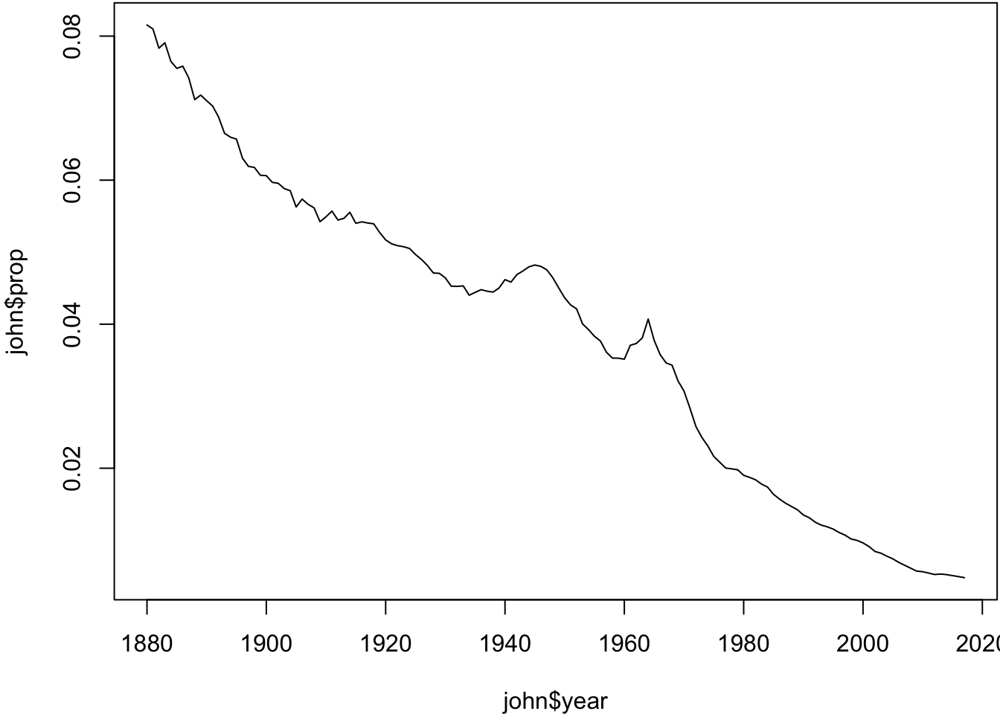
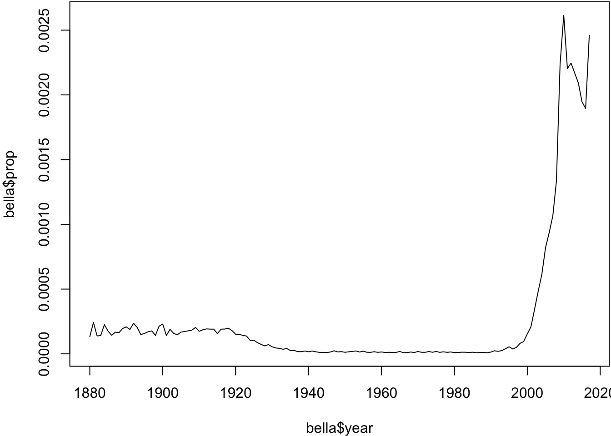
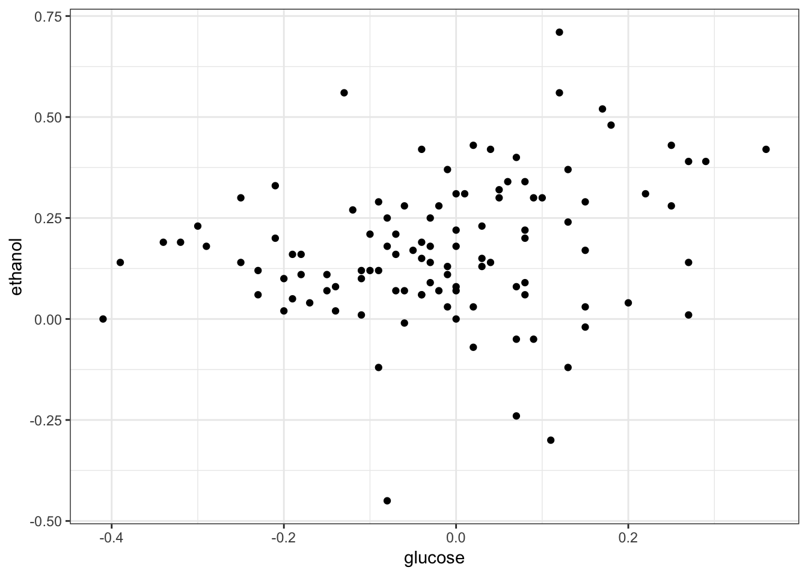

# (PART) Data Wrangling {-}


# Data Wrangling {#data-wrangling-chapter}

## Definition

Data wrangling is loosely defined as the process of manually converting or mapping data from one "raw" form into another format that allows for more convenient consumption of the data with the help of semi-automated tools.

It typically follows a set of general steps which begin with extracting the data in a raw form from the data source, "wrangling" the raw data using algorithms (e.g. sorting) or parsing the data into predefined data structures, and finally depositing the resulting content into a data sink for storage and future use.

<https://en.wikipedia.org/wiki/Data_wrangling>

## Workflow

These steps are typically taken in a data science project.

1. **Import**
2. **Tidy**
3. **Transform** $\leftrightarrow$ Visualize $\leftrightarrow$ Model (*iterate*)
4. Communicate

The bold terms are part of data wrangling.

## Wrangling Challenges

Some of the challenges encountered in data wrangling are:

- Importing files
- Organizing data sets
- Transforming data
- Combining data sets
- Dealing with various data types (e.g., dates)
- Identifying errors

# Tidy Data

## Motivation

"Happy families are all alike; every unhappy family is unhappy in its own way."  -- Leo Tolstoy

"Tidy datasets are all alike, but every messy dataset is messy in its own way."  -- Hadley Wickham

From *R for Data Science*.

## Definition

> Tidy datasets are easy to manipulate, model and visualize, and have a specific structure: each variable is a column, each observation is a row, and each type of observational unit is a table.

From Wickham (2014), "Tidy Data", *Journal of Statistical Software*


> A dataset is a collection of values, usually either numbers (if quantitative) or strings (if qualitative). Values are organized in two ways. Every value belongs to a variable and an observation. A variable contains all values that measure the same underlying attribute (like height, temperature, duration) across units. An observation contains all values measured on the same unit (like a person, or a day, or a race) across attributes.

From: Wickham H (2014), "Tidy Data", *Journal of Statistical Software*

## Example: Titanic Data

According to the `Titanic` data from the `datasets` package: 367 males survived, 1364 males perished, 344 females survived, and 126 females perished.

How should we organize these data?

### Intuitive Format

\ | Survived | Perished
---- | ---- | ----
**Male** | 367 | 1364
**Female** | 344 | 126

### Tidy Format

fate | sex | number
---- | ---- | ----
perished | male | 1364
perished | female | 126
survived | male | 367
survived | female | 344

## Rules of Thumb

1. Something is a value if it represents different forms of a common object and it changes throughout the data set. 
2. Something is a value if the data can be arranged so that it appears across rows within a column and this makes sense.  

For example, `fate` and `sex` do not satisfy these criteria in the `Titanic` data, but `perished`/`survived` and `female`/`male` do.

# Tidyverse

## Idea

When the data are in tidy format, one can design functions around this format to consistently and intuitively perform data wrangling and analysis operations.  The packages containing these are called the "tidyverse."

Note:  The idea of tidy data was first proposed by Hadley Wickham and he created several of the core packages, so this used to be called (semi-seriously) the "hadleyverse."

## Packages

> The tidyverse is a set of packages that work in harmony because they share common data representations and API design. The `tidyverse` package is designed to make it easy to install and load core packages from the tidyverse in a single command.

https://blog.rstudio.org/2016/09/15/tidyverse-1-0-0/

## Primary Packages

- `dplyr`: data manipulation
- `ggplot2`: data visualization
- `purrr`: functional programming
- `readr`: data import
- `tibble`: modernization of data frames
- `tidyr`: data tidying

Loading `tidyverse`:


```r
> library(tidyverse)
```

## Tidying Data

### `tidyr` Package

This package provides a variety of functions that allow one to tidy data.

Importantly, it solves two common ways that data come as untidy.

1. `gather()`:  Gathers a variable distributed across two or more columns into a single column.
2. `spread()`:  Spreads a column containing two or more variables into one column per variable.

### Untidy Titanic Data

This does not satisfy the definition of tidy data because a variable's observations are distributed as column names.


```r
> df <- tibble(sex=c("male", "female"), 
+              survived=c(367, 344),
+              perished=c(1364, 126))
> df
# A tibble: 2 x 3
  sex    survived perished
  <chr>     <dbl>    <dbl>
1 male        367     1364
2 female      344      126
```

### `gather()`

We apply the `gather()` function to make a column containing the `survived` and `perished` observations.


```r
> df <- gather(df, survived, perished, 
+                key="fate", value="number")
> df
# A tibble: 4 x 3
  sex    fate     number
  <chr>  <chr>     <dbl>
1 male   survived    367
2 female survived    344
3 male   perished   1364
4 female perished    126
```

### `spread()`

This example is here to show that `spread()` does the opposite operation as `gather()`.  It isn't used appropriately here because we revert the data back to untidy format.


```r
> spread(df, key=fate, value=number)
# A tibble: 2 x 3
  sex    perished survived
  <chr>     <dbl>    <dbl>
1 female      126      344
2 male       1364      367
```

### Tidy with `spread()` 

Median cost of home and median income per city are two variables included in a single column.  This means we need to use `spread()`.


```r
> df
# A tibble: 4 x 3
  city    median_value dollars
  <chr>   <chr>          <dbl>
1 Boston  home          527300
2 Boston  income         71738
3 Raleigh home          215700
4 Raleigh income         65778
```


```r
> spread(df, key=median_value, value=dollars)
# A tibble: 2 x 3
  city      home income
  <chr>    <dbl>  <dbl>
1 Boston  527300  71738
2 Raleigh 215700  65778
```


## Reshaping Data

### Wide vs. Long Format

Tidy data are in "wide format" in that they have a column for each variable and there is one observed unit per row.

However, sometimes it's useful to transform to "long format."  The simplest long format data have two columns.  The first column contains the variable names and the second colum contains the values for the variables.  There are "wider" long format data that have additional columns that identify connections between observations.

Wide format data is useful for some analyses and long format for others.

### `reshape2` Package

The `reshape2` package has three important functions:  `melt`, `dcast`, and `acast`.  It allows one to move between wide and long tidy data formats.


```r
> library("reshape2")
> library("datasets")
> data(airquality, package="datasets")
> names(airquality)
[1] "Ozone"   "Solar.R" "Wind"    "Temp"    "Month"   "Day"    
> dim(airquality)
[1] 153   6
> airquality <- as_tibble(airquality)
```

### Air Quality Data Set


```r
> head(airquality)
# A tibble: 6 x 6
  Ozone Solar.R  Wind  Temp Month   Day
  <int>   <int> <dbl> <int> <int> <int>
1    41     190   7.4    67     5     1
2    36     118   8      72     5     2
3    12     149  12.6    74     5     3
4    18     313  11.5    62     5     4
5    NA      NA  14.3    56     5     5
6    28      NA  14.9    66     5     6
```


```r
> tail(airquality)
# A tibble: 6 x 6
  Ozone Solar.R  Wind  Temp Month   Day
  <int>   <int> <dbl> <int> <int> <int>
1    14      20  16.6    63     9    25
2    30     193   6.9    70     9    26
3    NA     145  13.2    77     9    27
4    14     191  14.3    75     9    28
5    18     131   8      76     9    29
6    20     223  11.5    68     9    30
```

### Melt

Melting can be thought of as melting a piece of solid metal (wide data), so it drips into long format.


```r
> aql <- melt(airquality)
No id variables; using all as measure variables
> head(aql)
  variable value
1    Ozone    41
2    Ozone    36
3    Ozone    12
4    Ozone    18
5    Ozone    NA
6    Ozone    28
```


```r
> tail(aql)
    variable value
913      Day    25
914      Day    26
915      Day    27
916      Day    28
917      Day    29
918      Day    30
```

### Guided Melt

In the previous example, we lose the fact that a set of measurements occurred on a particular day and month, so we can do a guided melt to keep this information.


```r
> aql <- melt(airquality, id.vars = c("Month", "Day"))
> head(aql)
  Month Day variable value
1     5   1    Ozone    41
2     5   2    Ozone    36
3     5   3    Ozone    12
4     5   4    Ozone    18
5     5   5    Ozone    NA
6     5   6    Ozone    28
```


```r
> tail(aql)
    Month Day variable value
607     9  25     Temp    63
608     9  26     Temp    70
609     9  27     Temp    77
610     9  28     Temp    75
611     9  29     Temp    76
612     9  30     Temp    68
```

### Casting

Casting allows us to go from long format to wide format data.  It can be visualized as pouring molten metal (long format) into a cast to create a solid piece of metal (wide format).

Casting is more difficult because choices have to be made to determine how the wide format will be organized.  It often takes some thought and experimentation for new users. 

Let's do an example with `dcast`, which is casting for data frames.

### `dcast()`


```r
> aqw <- dcast(aql, Month + Day ~ variable)
> head(aqw)
  Month Day Ozone Solar.R Wind Temp
1     5   1    41     190  7.4   67
2     5   2    36     118  8.0   72
3     5   3    12     149 12.6   74
4     5   4    18     313 11.5   62
5     5   5    NA      NA 14.3   56
6     5   6    28      NA 14.9   66
```


```r
> tail(aqw)
    Month Day Ozone Solar.R Wind Temp
148     9  25    14      20 16.6   63
149     9  26    30     193  6.9   70
150     9  27    NA     145 13.2   77
151     9  28    14     191 14.3   75
152     9  29    18     131  8.0   76
153     9  30    20     223 11.5   68
```


# Transforming Data

## `dplyr` Package

`dplyr` is a package with the following description:

> A fast, consistent tool for working with data frame like objects, both in memory and out of memory.

This package offers a "grammar" for manipulating data frames.  

Everything that `dplyr` does can also be done using basic R commands -- however, it tends to be much faster and easier to use `dplyr`.

## Grammar of `dplyr`

Verbs:

- `filter`: extract a subset of rows from a data frame based on logical conditions
- `arrange`: reorder rows of a data frame
- `rename`: rename variables in a data frame
- `select`: return a subset of the columns of a data frame, using a flexible notation


- `mutate`: add new variables/columns or transform existing variables
- `distinct`: returns only the unique values in a table
- `summarize`: generate summary statistics of different variables in the data frame, possibly within strata
- `group_by`: breaks down a dataset into specified groups of rows

Partially based on *R Programming for Data Science* 

## Example: Baby Names


```r
> library("dplyr", verbose=FALSE)
> library("babynames")
> ls()
character(0)
> babynames <- as_tibble(babynames::babynames)
> ls()
[1] "babynames"
```

The `babynames` Object


```r
> class(babynames)
[1] "tbl_df"     "tbl"        "data.frame"
> dim(babynames)
[1] 1924665       5
```


```r
> babynames
# A tibble: 1,924,665 x 5
    year sex   name          n   prop
   <dbl> <chr> <chr>     <int>  <dbl>
 1  1880 F     Mary       7065 0.0724
 2  1880 F     Anna       2604 0.0267
 3  1880 F     Emma       2003 0.0205
 4  1880 F     Elizabeth  1939 0.0199
 5  1880 F     Minnie     1746 0.0179
 6  1880 F     Margaret   1578 0.0162
 7  1880 F     Ida        1472 0.0151
 8  1880 F     Alice      1414 0.0145
 9  1880 F     Bertha     1320 0.0135
10  1880 F     Sarah      1288 0.0132
# … with 1,924,655 more rows
```

Peek at the Data


```r
> set.seed(201)
> sample_n(babynames, 10) 
# A tibble: 10 x 5
    year sex   name          n       prop
   <dbl> <chr> <chr>     <int>      <dbl>
 1  1994 F     Avigayil     10 0.00000513
 2  1934 M     Durand        5 0.00000471
 3  1970 F     Starlette     8 0.00000437
 4  1906 M     Joy           7 0.0000486 
 5  1995 F     Markela       7 0.00000364
 6  1929 F     Forrest      17 0.0000147 
 7  1909 F     Levada        8 0.0000217 
 8  1970 M     Drew        405 0.000213  
 9  1922 F     Myrtle     3649 0.00292   
10  1958 F     Tayna         9 0.00000436
> ## try also sample_frac(babynames, 6e-6)
```

## `%>%` Operator

Originally from R package `magrittr`.  Provides a mechanism for chaining commands with a forward-pipe operator, `%>%`.


```r
> x <- 1:10
> 
> x %>% log(base=10) %>% sum
[1] 6.559763
> 
> sum(log(x,base=10))
[1] 6.559763
```


```r
> babynames %>% sample_n(5)
# A tibble: 5 x 5
   year sex   name           n       prop
  <dbl> <chr> <chr>      <int>      <dbl>
1  1982 F     Jewell        51 0.0000281 
2  1999 F     Precious     687 0.000353  
3  1993 M     Albin         14 0.00000678
4  1982 F     Georgeanna    14 0.00000772
5  1987 F     Danyale       29 0.0000155 
```

## `filter()`


```r
> filter(babynames, year==1880, sex=="F")
# A tibble: 942 x 5
    year sex   name          n   prop
   <dbl> <chr> <chr>     <int>  <dbl>
 1  1880 F     Mary       7065 0.0724
 2  1880 F     Anna       2604 0.0267
 3  1880 F     Emma       2003 0.0205
 4  1880 F     Elizabeth  1939 0.0199
 5  1880 F     Minnie     1746 0.0179
 6  1880 F     Margaret   1578 0.0162
 7  1880 F     Ida        1472 0.0151
 8  1880 F     Alice      1414 0.0145
 9  1880 F     Bertha     1320 0.0135
10  1880 F     Sarah      1288 0.0132
# … with 932 more rows
> ## same as filter(babynames, year==1880 & sex=="F")
```


```r
> filter(babynames, year==1880, sex=="F", n > 5000)
# A tibble: 1 x 5
   year sex   name      n   prop
  <dbl> <chr> <chr> <int>  <dbl>
1  1880 F     Mary   7065 0.0724
```

## `arrange()`


```r
> arrange(babynames, name, year, sex)
# A tibble: 1,924,665 x 5
    year sex   name      n       prop
   <dbl> <chr> <chr> <int>      <dbl>
 1  2007 M     Aaban     5 0.00000226
 2  2009 M     Aaban     6 0.00000283
 3  2010 M     Aaban     9 0.00000439
 4  2011 M     Aaban    11 0.00000542
 5  2012 M     Aaban    11 0.00000543
 6  2013 M     Aaban    14 0.00000694
 7  2014 M     Aaban    16 0.00000783
 8  2015 M     Aaban    15 0.00000736
 9  2016 M     Aaban     9 0.00000446
10  2017 M     Aaban    11 0.0000056 
# … with 1,924,655 more rows
```


```r
> arrange(babynames, desc(name), desc(year), sex)
# A tibble: 1,924,665 x 5
    year sex   name          n       prop
   <dbl> <chr> <chr>     <int>      <dbl>
 1  2010 M     Zzyzx         5 0.00000244
 2  2014 M     Zyyon         6 0.00000293
 3  2010 F     Zyyanna       6 0.00000306
 4  2015 M     Zyvon         7 0.00000343
 5  2009 M     Zyvion        5 0.00000236
 6  2017 F     Zyva          9 0.0000048 
 7  2016 F     Zyva          8 0.00000415
 8  2015 M     Zyus          5 0.00000245
 9  2010 M     Zytavious     6 0.00000292
10  2009 M     Zytavious     7 0.0000033 
# … with 1,924,655 more rows
```

## `rename()`


```r
> rename(babynames, number=n)
# A tibble: 1,924,665 x 5
    year sex   name      number   prop
   <dbl> <chr> <chr>      <int>  <dbl>
 1  1880 F     Mary        7065 0.0724
 2  1880 F     Anna        2604 0.0267
 3  1880 F     Emma        2003 0.0205
 4  1880 F     Elizabeth   1939 0.0199
 5  1880 F     Minnie      1746 0.0179
 6  1880 F     Margaret    1578 0.0162
 7  1880 F     Ida         1472 0.0151
 8  1880 F     Alice       1414 0.0145
 9  1880 F     Bertha      1320 0.0135
10  1880 F     Sarah       1288 0.0132
# … with 1,924,655 more rows
```

## `select()`


```r
> select(babynames, sex, name, n)
# A tibble: 1,924,665 x 3
   sex   name          n
   <chr> <chr>     <int>
 1 F     Mary       7065
 2 F     Anna       2604
 3 F     Emma       2003
 4 F     Elizabeth  1939
 5 F     Minnie     1746
 6 F     Margaret   1578
 7 F     Ida        1472
 8 F     Alice      1414
 9 F     Bertha     1320
10 F     Sarah      1288
# … with 1,924,655 more rows
> ## same as select(babynames, sex:n)
```

Renaming with `select()`:


```r
> select(babynames, sex, name, number=n)
# A tibble: 1,924,665 x 3
   sex   name      number
   <chr> <chr>      <int>
 1 F     Mary        7065
 2 F     Anna        2604
 3 F     Emma        2003
 4 F     Elizabeth   1939
 5 F     Minnie      1746
 6 F     Margaret    1578
 7 F     Ida         1472
 8 F     Alice       1414
 9 F     Bertha      1320
10 F     Sarah       1288
# … with 1,924,655 more rows
```

## `mutate()`


```r
> mutate(babynames, total_by_year=round(n/prop))
# A tibble: 1,924,665 x 6
    year sex   name          n   prop total_by_year
   <dbl> <chr> <chr>     <int>  <dbl>         <dbl>
 1  1880 F     Mary       7065 0.0724         97605
 2  1880 F     Anna       2604 0.0267         97605
 3  1880 F     Emma       2003 0.0205         97605
 4  1880 F     Elizabeth  1939 0.0199         97605
 5  1880 F     Minnie     1746 0.0179         97605
 6  1880 F     Margaret   1578 0.0162         97605
 7  1880 F     Ida        1472 0.0151         97605
 8  1880 F     Alice      1414 0.0145         97605
 9  1880 F     Bertha     1320 0.0135         97605
10  1880 F     Sarah      1288 0.0132         97605
# … with 1,924,655 more rows
> ## see also transmutate
```

## Babynames: Numver of Individuals by Year and Sex

Let's put a few things together now adding the function `distinct()`...


```r
> babynames %>% mutate(total_by_year=round(n/prop)) %>% 
+   select(sex, year, total_by_year) %>% distinct()
# A tibble: 36,099 x 3
   sex    year total_by_year
   <chr> <dbl>         <dbl>
 1 F      1880         97605
 2 F      1880         97604
 3 F      1880         97606
 4 F      1880         97603
 5 F      1880         97607
 6 F      1880         97602
 7 F      1880         97609
 8 F      1880         97599
 9 M      1880        118400
10 M      1880        118399
# … with 36,089 more rows
```

### `summarize()`


```r
> summarize(babynames, mean_n = mean(n), median_n = median(n), 
+           number_sex = n_distinct(sex), 
+           distinct_names = n_distinct(name))
# A tibble: 1 x 4
  mean_n median_n number_sex distinct_names
   <dbl>    <int>      <int>          <int>
1   181.       12          2          97310
```

### `group_by()`


```r
> babynames %>% group_by(year, sex)
# A tibble: 1,924,665 x 5
# Groups:   year, sex [276]
    year sex   name          n   prop
   <dbl> <chr> <chr>     <int>  <dbl>
 1  1880 F     Mary       7065 0.0724
 2  1880 F     Anna       2604 0.0267
 3  1880 F     Emma       2003 0.0205
 4  1880 F     Elizabeth  1939 0.0199
 5  1880 F     Minnie     1746 0.0179
 6  1880 F     Margaret   1578 0.0162
 7  1880 F     Ida        1472 0.0151
 8  1880 F     Alice      1414 0.0145
 9  1880 F     Bertha     1320 0.0135
10  1880 F     Sarah      1288 0.0132
# … with 1,924,655 more rows
```

### No. Individuals by Year and Sex


```r
> babynames %>% group_by(year, sex) %>% 
+   summarize(total_by_year=sum(n))
# A tibble: 276 x 3
# Groups:   year [?]
    year sex   total_by_year
   <dbl> <chr>         <int>
 1  1880 F             90993
 2  1880 M            110491
 3  1881 F             91953
 4  1881 M            100743
 5  1882 F            107847
 6  1882 M            113686
 7  1883 F            112319
 8  1883 M            104627
 9  1884 F            129020
10  1884 M            114442
# … with 266 more rows
```

Compare to earlier slide. Why the difference?

### How Many Distinct Names?


```r
> babynames %>% group_by(sex) %>% 
+   summarize(mean_n = mean(n), 
+             distinct_names_sex = n_distinct(name))
# A tibble: 2 x 3
  sex   mean_n distinct_names_sex
  <chr>  <dbl>              <int>
1 F       151.              67046
2 M       223.              40927
```


### Most Popular Names


```r
> top_names <- babynames %>% group_by(year, sex) %>% 
+   summarize(top_name = name[which.max(n)])
> 
> head(top_names)
# A tibble: 6 x 3
# Groups:   year [3]
   year sex   top_name
  <dbl> <chr> <chr>   
1  1880 F     Mary    
2  1880 M     John    
3  1881 F     Mary    
4  1881 M     John    
5  1882 F     Mary    
6  1882 M     John    
```


### Most Popular Names

#### Recent Years


```r
> tail(top_names, n=10)
# A tibble: 10 x 3
# Groups:   year [5]
    year sex   top_name
   <dbl> <chr> <chr>   
 1  2013 F     Sophia  
 2  2013 M     Noah    
 3  2014 F     Emma    
 4  2014 M     Noah    
 5  2015 F     Emma    
 6  2015 M     Noah    
 7  2016 F     Emma    
 8  2016 M     Noah    
 9  2017 F     Emma    
10  2017 M     Liam    
```

### Most Popular Female Names 

#### 1990s


```r
> top_names %>% filter(year >= 1990 & year < 2000, sex=="F")
# A tibble: 10 x 3
# Groups:   year [10]
    year sex   top_name
   <dbl> <chr> <chr>   
 1  1990 F     Jessica 
 2  1991 F     Ashley  
 3  1992 F     Ashley  
 4  1993 F     Jessica 
 5  1994 F     Jessica 
 6  1995 F     Jessica 
 7  1996 F     Emily   
 8  1997 F     Emily   
 9  1998 F     Emily   
10  1999 F     Emily   
```

### Most Popular Male Names 

#### 1990s


```r
> top_names %>% filter(year >= 1990 & year < 2000, sex=="M")
# A tibble: 10 x 3
# Groups:   year [10]
    year sex   top_name
   <dbl> <chr> <chr>   
 1  1990 M     Michael 
 2  1991 M     Michael 
 3  1992 M     Michael 
 4  1993 M     Michael 
 5  1994 M     Michael 
 6  1995 M     Michael 
 7  1996 M     Michael 
 8  1997 M     Michael 
 9  1998 M     Michael 
10  1999 M     Jacob   
```


```r
> ## Analyzing the name 'John'
> john <- babynames %>% filter(sex=="M", name=="John")
> plot(john$year, john$prop, type="l")
```




```r
> ## Analyzing the name 'Bella'
> bella <- babynames %>% filter(sex=="F", name=="Bella") 
> plot(bella$year, bella$prop, type="l")
```



### Additional Examples

You should study additional tutorials of `dplyr` that utilize other data sets:

- Read the `dplyr` [introductory vignette](https://cran.rstudio.com/web/packages/dplyr/vignettes/introduction.html)
- Read the examples given in the *R for Data Science* assigned reading

### Additional `dplyr` Features

- We've only scratched the surface -- many interesting demos of `dplyr` can be found online
- `dplyr` can work with other data frame backends such as SQL databases
- There is an SQL interface for relational databases via the `DBI` package
- `dplyr` can be integrated with the `data.table` package for large fast tables
- There is a [healthy rivalry](http://stackoverflow.com/questions/21435339/data-table-vs-dplyr-can-one-do-something-well-the-other-cant-or-does-poorly) between `dplyr` and [`data.table`](https://cran.r-project.org/web/packages/data.table/index.html)


# Relational Data

## Multiple Data Sets

In many data analyses you will have multiple tables of related data that must be combined in order to carry out your analysis.

The `dplyr` package includes a number of tools to facilitate this.

## Toy Example

Here are two data frames that are related through a common variable called `key`.


```r
> x <- tibble(key = c(1, 2, 3), x_val = c("x1", "x2", "x3"))
> y <- tibble(key = c(1, 2, 4), y_val = c("y1", "y2", "y4"))
```

```r
> x
# A tibble: 3 x 2
    key x_val
  <dbl> <chr>
1     1 x1   
2     2 x2   
3     3 x3   
> y
# A tibble: 3 x 2
    key y_val
  <dbl> <chr>
1     1 y1   
2     2 y2   
3     4 y4   
```

## Verbs

To work with relational data you need verbs that work with pairs of tables. There are three families of verbs designed to work with relational data.

- *Mutating joins* add new variables to one data frame from matching observations in another.
- *Filtering joins* filter observations from one data frame based on whether or not they match an observation in the other table.
- *Set operations* treat observations as if they were set elements.

From *R for Data Science*


## `inner_join()`

An inner-join matches pairs of observations when their keys are equal.


```r
> inner_join(x, y, key="key")
Joining, by = "key"
# A tibble: 2 x 3
    key x_val y_val
  <dbl> <chr> <chr>
1     1 x1    y1   
2     2 x2    y2   
```


## `left_join()`

A left-join keeps all observations in the first argument, `x`.


```r
> left_join(x, y, key="key")
Joining, by = "key"
# A tibble: 3 x 3
    key x_val y_val
  <dbl> <chr> <chr>
1     1 x1    y1   
2     2 x2    y2   
3     3 x3    <NA> 
```


```r
> x %>% left_join(y, key="key")
Joining, by = "key"
# A tibble: 3 x 3
    key x_val y_val
  <dbl> <chr> <chr>
1     1 x1    y1   
2     2 x2    y2   
3     3 x3    <NA> 
```

## `right_join()`

A right-join keeps all observations in the second argument, `y`.


```r
> right_join(x, y)
Joining, by = "key"
# A tibble: 3 x 3
    key x_val y_val
  <dbl> <chr> <chr>
1     1 x1    y1   
2     2 x2    y2   
3     4 <NA>  y4   
```

## `full_join()`

A full-join keeps all observations in either argument, `x` or `y`.


```r
> full_join(x, y, key="key")
Joining, by = "key"
# A tibble: 4 x 3
    key x_val y_val
  <dbl> <chr> <chr>
1     1 x1    y1   
2     2 x2    y2   
3     3 x3    <NA> 
4     4 <NA>  y4   
```

## `anti_join()`

An anti-join removes all observations in the first argument, `x`, that appear in the second argument, `y`.


```r
> anti_join(x, y, key="key")
Joining, by = "key"
# A tibble: 1 x 2
    key x_val
  <dbl> <chr>
1     3 x3   
```

## `semi_join()`

A semi-join keeps all observations in the first argument, `x`, that have a match in the second argument, `y`.


```r
> semi_join(x, y, key="key")
Joining, by = "key"
# A tibble: 2 x 2
    key x_val
  <dbl> <chr>
1     1 x1   
2     2 x2   
```

## Repeated Key Values

When one of the two data frames has repeated `key` values, the observations are repeated in the other data frame.


```r
> y2
# A tibble: 4 x 2
    key y_val
  <dbl> <chr>
1     1 y1   
2     2 y2a  
3     2 y2b  
4     4 y4   
```


```r
> x %>% left_join(y2, key="key")
Joining, by = "key"
# A tibble: 4 x 3
    key x_val y_val
  <dbl> <chr> <chr>
1     1 x1    y1   
2     2 x2    y2a  
3     2 x2    y2b  
4     3 x3    <NA> 
```

## Set Operations

One can perform traditional set operations on the rows of data frames. 

- `intersect(x, y)`: return only observations in both `x` and `y`
- `union(x, y)`: return unique observations in `x` and `y`
- `setdiff(x, y)`: return observations in `x`, but not in `y`

From *R for Data Science*

### Example `setdiff()`


```r
> df1
# A tibble: 2 x 2
      x     y
  <dbl> <dbl>
1     1     1
2     2     1
> df2
# A tibble: 2 x 2
      x     y
  <dbl> <dbl>
1     1     1
2     1     2
> setdiff(df1, df2)
# A tibble: 1 x 2
      x     y
  <dbl> <dbl>
1     2     1
```

# Getting Data In and Out of R 

## `.RData` Files

R objects can be saved to binary `.RData` files and loaded with the `save` (or `save.image`) and `load` functions, respectively.

This is the easiest way to get data into R.

## `readr` Package

There are a number of R packages that provide more sophisticated tools for getting data in and out of R, especially as data sets have become larger and larger.

One of those packages is `readr` for text files.  It reads and writes data quickly, provides a useful status bar for large files, and does a good job at determining data types.

`readr` is organized similarly to the base R functions.  For example, there are functions `read_table`, `read_csv`, `write_tsv`, and `write_csv`.  

See also `fread` and `fwrite` from the `data.table` package.

## Scraping from the Web 


There are several packages that facilitate "scraping" data from the web, including `rvest` demonstrated here.


```r
> library("rvest")
> schedule <- read_html("http://jdstorey.github.io/asdscourse/schedule/")
> first_table <- html_table(schedule)[[1]]
> names(first_table) <- c("week", "topics", "reading")
> first_table[2,"week"]
> first_table[2,"topics"] %>% strsplit(split="  ")
> first_table[2,"reading"] %>% strsplit(split="  ")
> grep("R4DS", first_table$reading) # which rows (weeks) have R4DS
```

The `rvest` documentation recommends [SelectorGadget](http://selectorgadget.com), which is "a javascript bookmarklet that allows you to interactively figure out what css selector you need to extract desired components from a page."


```r
> usg_url <- "https://princetonusg.com/senate/"
> usg <- read_html(usg_url)
> officers <- html_nodes(usg, ".team-member-name") %>% 
+             html_text
> head(officers, n=20)
```

## APIs

API stands for "application programming interface" which is [a set of routines, protocols, and tools for building software and applications](https://en.wikipedia.org/wiki/Application_programming_interface).

A specific website may provide an API for scraping data from that website.

There are R packages that provide an interface  with specific APIs, such as the [`twitteR`](https://cran.r-project.org/web/packages/twitteR/index.html) package.


# Case Study in Data Wrangling

## Yeast Genomics

[Smith and Kruglyak (2008)](http://journals.plos.org/plosbiology/article?id=10.1371/journal.pbio.0060083) is a study that measured 2820 genotypes in 109 yeast F1 segregants from a cross between parental lines BY and RM.

They also measured gene expression on 4482 genes in each of these segregants when growing in two different Carbon sources, glucose and ethanol. 

### Load Data

The data was distributed as a collection of matrices in R.


```r
> rm(list=ls())
> load("./data/smith_kruglyak.RData")
> ls()
[1] "exp.e"      "exp.g"      "exp.pos"    "marker"     "marker.pos"
> eapply(env=.GlobalEnv, dim)
$exp.e
[1] 4482  109

$exp.g
[1] 4482  109

$marker
[1] 2820  109

$exp.pos
[1] 4482    3

$marker.pos
[1] 2820    2
```

### Gene Expression Matrices


```r
> exp.g %>% cbind(rownames(exp.g), .) %>% as_tibble() %>% 
+   print()
Warning: `as_tibble.matrix()` requires a matrix with column names or a `.name_repair` argument. Using compatibility `.name_repair`.
This warning is displayed once per session.
# A tibble: 4,482 x 110
   V1    X100g.20_4_c.gl… X101g.21_1_d.gl… X102g.21_2_d.gl…
   <chr> <chr>            <chr>            <chr>           
 1 YJR1… 0.22             0.18             0.05            
 2 YPL2… -0.29            -0.2             -0.19           
 3 YDR5… 0.72             0.04             0.26            
 4 YDR2… 0.23             0.31             0.12            
 5 YHR0… 0.4              -0.04            0.36            
 6 YFR0… -0.36            0.35             -0.26           
 7 YPL1… 0.23             -0.21            -0.25           
 8 YDR0… -0.09            0.57             0.24            
 9 YLR3… -0.23            0.13             -0.17           
10 YCR0… -0.25            -0.98            -0.3            
# … with 4,472 more rows, and 106 more variables:
#   X103g.21_3_d.glucose <chr>, X104g.21_4_d.glucose <chr>,
#   X105g.21_5_c.glucose <chr>, X106g.22_2_d.glucose <chr>,
#   X107g.22_3_b.glucose <chr>, X109g.22_5_d.glucose <chr>,
#   X10g.2_5_d.glucose <chr>, X110g.23_3_d.glucose <chr>,
#   X111g.23_5_d.glucose <chr>, X112g.24_1_d.glucose <chr>,
#   X113g.25_1_d.glucose <chr>, X114g.25_3_d.glucose <chr>,
#   X115g.25_4_d.glucose <chr>, X116g.26_1_d.glucose <chr>,
#   X117g.26_2_d.glucose <chr>, X11g.2_6_d.glucose <chr>,
#   X12g.2_7_a.glucose <chr>, X13g.3_1_d.glucose <chr>,
#   X15g.3_3_d.glucose <chr>, X16g.3_4_d.glucose <chr>,
#   X17g.3_5_d.glucose <chr>, X18g.4_1_c.glucose <chr>,
#   X1g.1_1_d.glucose <chr>, X20g.4_3_d.glucose <chr>,
#   X21g.4_4_d.glucose <chr>, X22g.5_1_d.glucose <chr>,
#   X23g.5_2_d.glucose <chr>, X24g.5_3_d.glucose <chr>,
#   X25g.5_4_d.glucose <chr>, X26g.5_5_d.glucose <chr>,
#   X27g.6_1_d.glucose <chr>, X28g.6_2_b.glucose <chr>,
#   X29g.6_3_c.glucose <chr>, X30g.6_4_d.glucose <chr>,
#   X31g.6_5_d.glucose <chr>, X32g.6_6_d.glucose <chr>,
#   X33g.6_7_d.glucose <chr>, X34g.7_1_d.glucose <chr>,
#   X35g.7_2_c.glucose <chr>, X36g.7_3_d.glucose <chr>,
#   X37g.7_4_c.glucose <chr>, X38g.7_5_d.glucose <chr>,
#   X39g.7_6_c.glucose <chr>, X3g.1_3_d.glucose <chr>,
#   X40g.7_7_c.glucose <chr>, X41g.7_8_d.glucose <chr>,
#   X42g.8_1_a.glucose <chr>, X43g.8_2_d.glucose <chr>,
#   X44g.8_3_a.glucose <chr>, X45g.8_4_c.glucose <chr>,
#   X46g.8_5_b.glucose <chr>, X47g.8_6_c.glucose <chr>,
#   X48g.8_7_b.glucose <chr>, X49g.9_1_d.glucose <chr>,
#   X4g.1_4_d.glucose <chr>, X50g.9_2_d.glucose <chr>,
#   X51g.9_3_d.glucose <chr>, X52g.9_4_d.glucose <chr>,
#   X53g.9_5_d.glucose <chr>, X54g.9_6_d.glucose <chr>,
#   X55g.9_7_d.glucose <chr>, X56g.10_1_c.glucose <chr>,
#   X57g.10_2_d.glucose <chr>, X58g.10_3_c.glucose <chr>,
#   X59g.10_4_d.glucose <chr>, X5g.1_5_c.glucose <chr>,
#   X60g.11_1_a.glucose <chr>, X61g.11_2_d.glucose <chr>,
#   X62g.11_3_b.glucose <chr>, X63g.12_1_d.glucose <chr>,
#   X64g.12_2_b.glucose <chr>, X65g.13_1_a.glucose <chr>,
#   X66g.13_2_c.glucose <chr>, X67g.13_3_b.glucose <chr>,
#   X68g.13_4_a.glucose <chr>, X69g.13_5_c.glucose <chr>,
#   X70g.14_1_b.glucose <chr>, X71g.14_2_c.glucose <chr>,
#   X73g.14_4_a.glucose <chr>, X74g.14_5_b.glucose <chr>,
#   X75g.14_6_d.glucose <chr>, X76g.14_7_c.glucose <chr>,
#   X77g.15_2_d.glucose <chr>, X78g.15_3_b.glucose <chr>,
#   X79g.15_4_d.glucose <chr>, X7g.2_2_d.glucose <chr>,
#   X80g.15_5_b.glucose <chr>, X82g.16_1_d.glucose <chr>,
#   X83g.17_1_a.glucose <chr>, X84g.17_2_d.glucose <chr>,
#   X85g.17_4_a.glucose <chr>, X86g.17_5_b.glucose <chr>,
#   X87g.18_1_d.glucose <chr>, X88g.18_2_d.glucose <chr>,
#   X89g.18_3_d.glucose <chr>, X8g.2_3_d.glucose <chr>,
#   X90g.18_4_c.glucose <chr>, X92g.19_1_c.glucose <chr>,
#   X93g.19_2_c.glucose <chr>, X94g.19_3_c.glucose <chr>, …
```

### Gene Position Matrix


```r
> exp.pos %>% cbind(rownames(exp.pos), .) %>% as_tibble() %>% 
+   print()
# A tibble: 4,482 x 4
   V1      Chromsome Start_coord End_coord
   <chr>   <chr>     <chr>       <chr>    
 1 YJR107W 10        627333      628319   
 2 YPL270W 16        30482       32803    
 3 YDR518W 4         1478600     1480153  
 4 YDR233C 4         930353      929466   
 5 YHR098C 8         301937      299148   
 6 YFR029W 6         210925      212961   
 7 YPL198W 16        173151      174701   
 8 YDR001C 4         452472      450217   
 9 YLR394W 12        907950      909398   
10 YCR079W 3         252842      254170   
# … with 4,472 more rows
```

### Row Names

The gene names are contained in the row names.


```r
> head(rownames(exp.g))
[1] "YJR107W" "YPL270W" "YDR518W" "YDR233C" "YHR098C" "YFR029W"
> head(rownames(exp.e))
[1] "YJR107W" "YPL270W" "YDR518W" "YDR233C" "YHR098C" "YFR029W"
> head(rownames(exp.pos))
[1] "YJR107W" "YPL270W" "YDR518W" "YDR233C" "YHR098C" "YFR029W"
> all.equal(rownames(exp.g), rownames(exp.e))
[1] TRUE
> all.equal(rownames(exp.g), rownames(exp.pos))
[1] TRUE
```

### Unify Column Names

The segregants are column names, and they are inconsistent across matrices.


```r
> head(colnames(exp.g))
[1] "X100g.20_4_c.glucose" "X101g.21_1_d.glucose" "X102g.21_2_d.glucose"
[4] "X103g.21_3_d.glucose" "X104g.21_4_d.glucose" "X105g.21_5_c.glucose"
> head(colnames(marker))
[1] "20_4_c" "21_1_d" "21_2_d" "21_3_d" "21_4_d" "21_5_c"
>      
> ##fix column names with gsub
> colnames(exp.g) %<>% strsplit(split=".", fixed=TRUE) %>%
+   lapply(function(x) {x[2]})
> colnames(exp.e) %<>% strsplit(split=".", fixed=TRUE) %>%
+   lapply(function(x) {x[2]})
> head(colnames(exp.g))
[1] "20_4_c" "21_1_d" "21_2_d" "21_3_d" "21_4_d" "21_5_c"
```

### Gene Positions

Let's first pull out rownames of `exp.pos` and make them a column in the data frame.


```r
> gene_pos <- exp.pos %>% as_tibble() %>%
+   mutate(gene = rownames(exp.pos)) %>%
+   dplyr::select(gene, chr = Chromsome, start = Start_coord, 
+                 end = End_coord)
> print(gene_pos, n=7)
# A tibble: 4,482 x 4
  gene      chr   start     end
  <chr>   <int>   <int>   <int>
1 YJR107W    10  627333  628319
2 YPL270W    16   30482   32803
3 YDR518W     4 1478600 1480153
4 YDR233C     4  930353  929466
5 YHR098C     8  301937  299148
6 YFR029W     6  210925  212961
7 YPL198W    16  173151  174701
# … with 4,475 more rows
```

### Tidy Each Expression Matrix

We `melt` the expression matrices and bind them together into one big tidy data frame.


```r
> exp_g <- melt(exp.g) %>% as_tibble() %>% 
+   dplyr::select(gene = Var1, segregant = Var2, 
+                 expression = value) %>%
+   mutate(condition = "glucose")
> exp_e <- melt(exp.e) %>% as_tibble() %>% 
+   dplyr::select(gene = Var1, segregant = Var2, 
+                 expression = value) %>%
+   mutate(condition = "ethanol")
> print(exp_e, n=4)
# A tibble: 488,538 x 4
  gene    segregant expression condition
  <fct>   <fct>          <dbl> <chr>    
1 YJR107W 20_4_c          0.06 ethanol  
2 YPL270W 20_4_c         -0.13 ethanol  
3 YDR518W 20_4_c         -0.94 ethanol  
4 YDR233C 20_4_c          0.04 ethanol  
# … with 4.885e+05 more rows
```

### Combine Into Single Data Frame

Combine gene expression data from two conditions into a single data frame.


```r
> exp_all <- bind_rows(exp_g, exp_e)
> sample_n(exp_all, size=10)
# A tibble: 10 x 4
   gene    segregant expression condition
   <fct>   <fct>          <dbl> <chr>    
 1 YBL087C 21_4_d         -0.72 ethanol  
 2 YDR524C 21_2_d         -0.17 glucose  
 3 YGR067C 9_1_d          -3.92 glucose  
 4 YHR207C 26_1_d         -0.43 ethanol  
 5 YDR329C 20_2_d         -0.06 glucose  
 6 YGL121C 8_7_b           1    ethanol  
 7 YJR044C 3_3_d          -0.12 ethanol  
 8 YIL088C 2_7_a           0.1  ethanol  
 9 YML127W 5_1_d          -0.08 ethanol  
10 YMR304W 6_1_d           0.2  ethanol  
```

### Join Gene Positions

Now we want to join the gene positions with the expression data.


```r
> exp_all <- exp_all %>%
+   mutate(gene = as.character(gene), 
+          segregant = as.character(segregant))
> sk_tidy <- exp_all %>%
+   left_join(gene_pos, by = "gene")
> sample_n(sk_tidy, size=7)
# A tibble: 7 x 7
  gene    segregant expression condition   chr  start    end
  <chr>   <chr>          <dbl> <chr>     <int>  <int>  <int>
1 YGL189C 1_3_d          -0.26 ethanol       7 148594 148235
2 YBR257W 13_2_c          0.02 ethanol       2 728880 729719
3 YER098W 21_1_d          0.46 ethanol       5 355462 357726
4 YCR035C 9_1_d           0.07 glucose       3 193014 191830
5 YBR097W 17_5_b         -0.03 glucose       2 436945 441309
6 YBR235W 8_4_c          -0.18 ethanol       2 686896 690258
7 YJL094C 14_6_d          0    glucose      10 254437 251816
```

### Apply `dplyr` Functions

Now that we have the data made tidy in the data frame `sk_tidy`, let's apply some `dplyr` operations...


Does each gene have the same number of observations?


```r
> sk_tidy %>% group_by(gene) %>% 
+   summarize(value = n()) %>%
+   summary()
     gene               value      
 Length:4478        Min.   :218.0  
 Class :character   1st Qu.:218.0  
 Mode  :character   Median :218.0  
                    Mean   :218.6  
                    3rd Qu.:218.0  
                    Max.   :872.0  
```

No, so let's see which genes have more than one set of observations.


```r
> sk_tidy %>% group_by(gene) %>% 
+   summarize(value = n()) %>%
+   filter(value > median(value))
# A tibble: 4 x 2
  gene      value
  <chr>     <int>
1 YFR024C-A   872
2 YJL012C     872
3 YKL198C     872
4 YPR089W     872
```


Let's remove replicated measurements for these genes.


```r
> sk_tidy %<>% distinct(gene, segregant, condition, 
+                       .keep_all = TRUE)
> 
> sk_tidy %>% group_by(gene) %>% 
+   summarize(value = n()) %>%
+   summary()
     gene               value    
 Length:4478        Min.   :218  
 Class :character   1st Qu.:218  
 Mode  :character   Median :218  
                    Mean   :218  
                    3rd Qu.:218  
                    Max.   :218  
```

As an exercise, think about how you would use `dplyr` to replace the replicated gene expression values with a single averaged expression value for these genes.


Get the mean and standard deviation expression per chromosome.


```r
> sk_tidy %>%
+   group_by(chr) %>%
+   summarize(mean = mean(expression), sd=sd(expression))
# A tibble: 16 x 3
     chr    mean    sd
   <int>   <dbl> <dbl>
 1     1 -0.0762 0.826
 2     2 -0.0447 0.632
 3     3 -0.0230 0.682
 4     4 -0.0233 0.537
 5     5 -0.0579 0.610
 6     6 -0.0772 0.660
 7     7 -0.0441 0.617
 8     8 -0.0474 0.638
 9     9 -0.0430 0.614
10    10 -0.0299 0.570
11    11 -0.0396 0.613
12    12 -0.0515 0.643
13    13 -0.0265 0.584
14    14 -0.0294 0.642
15    15 -0.0130 0.554
16    16 -0.0368 0.604
```


Get the mean and standard deviation expression per chromosome in each condition.


```r
> sk_tidy %>%
+   group_by(chr, condition) %>%
+   summarize(mean = mean(expression), sd=sd(expression))
# A tibble: 32 x 4
# Groups:   chr [?]
     chr condition      mean    sd
   <int> <chr>         <dbl> <dbl>
 1     1 ethanol    0.0260   0.480
 2     1 glucose   -0.178    1.05 
 3     2 ethanol    0.0132   0.479
 4     2 glucose   -0.103    0.750
 5     3 ethanol    0.000164 0.536
 6     3 glucose   -0.0461   0.800
 7     4 ethanol    0.00187  0.482
 8     4 glucose   -0.0484   0.586
 9     5 ethanol   -0.0297   0.479
10     5 glucose   -0.0862   0.716
# … with 22 more rows
```


Count the number of genes per chromosome.


```r
> sk_tidy %>%
+   filter(condition == "glucose", segregant == "20_4_c") %>%
+   group_by(chr) %>% 
+   summarize(num.genes = n())
# A tibble: 16 x 2
     chr num.genes
   <int>     <int>
 1     1        60
 2     2       298
 3     3       125
 4     4       629
 5     5       207
 6     6        79
 7     7       395
 8     8       209
 9     9       152
10    10       256
11    11       241
12    12       387
13    13       367
14    14       319
15    15       388
16    16       366
```


Filter for the first gene on every chromosome.


```r
> sk_tidy %>%
+   filter(condition == "glucose", segregant == "20_4_c") %>%
+   group_by(chr) %>%
+   filter(start == min(start))
# A tibble: 16 x 7
# Groups:   chr [16]
   gene    segregant expression condition   chr start   end
   <chr>   <chr>          <dbl> <chr>     <int> <int> <int>
 1 YHL040C 20_4_c        -2.79  glucose       8 20968 19085
 2 YNL334C 20_4_c        -0.9   glucose      14 12876 12208
 3 YOL157C 20_4_c        -1.06  glucose      15 24293 22524
 4 YKL222C 20_4_c         0.09  glucose      11  5621  3504
 5 YIL168W 20_4_c        -1.14  glucose       9 29032 29415
 6 YJL213W 20_4_c         0.84  glucose      10 32163 33158
 7 YPL272C 20_4_c        -0.18  glucose      16 28164 26611
 8 YLL063C 20_4_c        -0.66  glucose      12 16072 14648
 9 YFL048C 20_4_c        -0.09  glucose       6 40180 38843
10 YML132W 20_4_c        -0.21  glucose      13  7244  8383
11 YGL261C 20_4_c        -0.14  glucose       7  6652  6290
12 YBL107C 20_4_c         0.290 glucose       2 10551  9961
13 YDL248W 20_4_c        -0.68  glucose       4  1802  2953
14 YEL073C 20_4_c        -0.02  glucose       5  7553  7230
15 YAL062W 20_4_c        -5.64  glucose       1 31568 32941
16 YCL068C 20_4_c         0.47  glucose       3 12285 11503
```
  

To plot expression in glucose versus ethanol we first need to use `dcast()`.


```r
> sk_tidy %>% dcast(gene + segregant ~ condition, 
+                   value.var = "expression") %>%
+   as_tibble()
# A tibble: 488,102 x 4
   gene    segregant ethanol glucose
   <chr>   <chr>       <dbl>   <dbl>
 1 YAL002W 1_1_d        0.37   -0.01
 2 YAL002W 1_3_d        0.23    0.03
 3 YAL002W 1_4_d        0.08    0.07
 4 YAL002W 1_5_c       -0.12    0.13
 5 YAL002W 10_1_c       0.12   -0.1 
 6 YAL002W 10_2_d       0.1    -0.2 
 7 YAL002W 10_3_c       0.07   -0.15
 8 YAL002W 10_4_d       0.06   -0.04
 9 YAL002W 11_1_a       0.07   -0.07
10 YAL002W 11_2_d       0.3     0.1 
# … with 488,092 more rows
```


```r
> sk_tidy %>% dcast(gene + segregant ~ condition, 
+                   value.var = "expression") %>%
+   filter(gene == "YAL002W") %>%
+   ggplot(aes(x = glucose, y = ethanol)) +
+   geom_point() +  theme_bw() +
+   theme(legend.position = "none")
```


