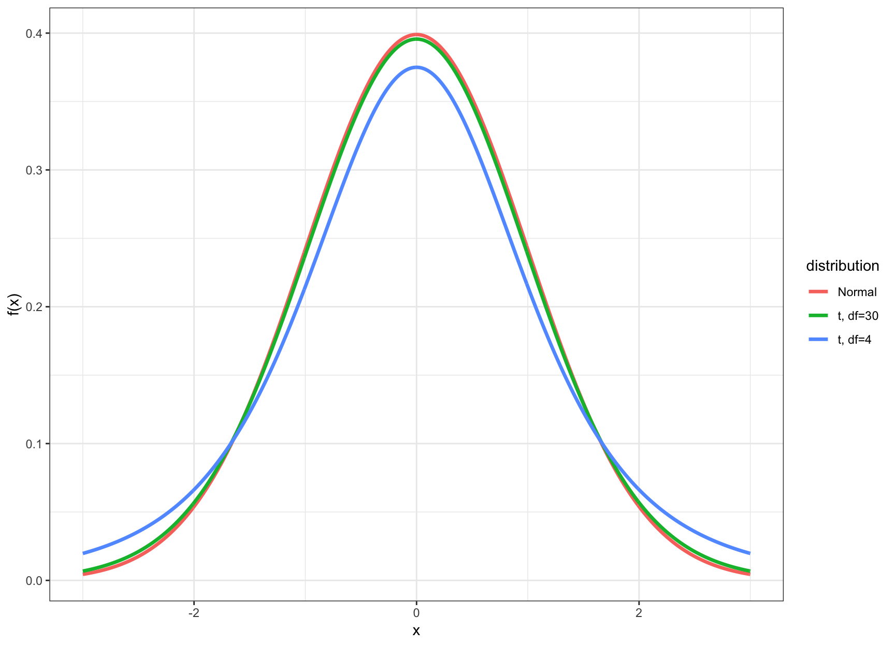

\providecommand{\E}{\operatorname{E}}
\providecommand{\V}{\operatorname{Var}}
\providecommand{\Cov}{\operatorname{Cov}}
\providecommand{\se}{\operatorname{se}}
\providecommand{\logit}{\operatorname{logit}}
\providecommand{\iid}{\; \stackrel{\text{iid}}{\sim}\;}
\providecommand{\asim}{\; \stackrel{.}{\sim}\;}
\providecommand{\xs}{x_1, x_2, \ldots, x_n}
\providecommand{\Xs}{X_1, X_2, \ldots, X_n}
\providecommand{\bB}{\boldsymbol{B}}
\providecommand{\bb}{\boldsymbol{\beta}}
\providecommand{\bx}{\boldsymbol{x}}
\providecommand{\bX}{\boldsymbol{X}}
\providecommand{\by}{\boldsymbol{y}}
\providecommand{\bY}{\boldsymbol{Y}}
\providecommand{\bz}{\boldsymbol{z}}
\providecommand{\bZ}{\boldsymbol{Z}}
\providecommand{\be}{\boldsymbol{e}}
\providecommand{\bE}{\boldsymbol{E}}
\providecommand{\bs}{\boldsymbol{s}}
\providecommand{\bS}{\boldsymbol{S}}
\providecommand{\bP}{\boldsymbol{P}}
\providecommand{\bI}{\boldsymbol{I}}
\providecommand{\bD}{\boldsymbol{D}}
\providecommand{\bd}{\boldsymbol{d}}
\providecommand{\bW}{\boldsymbol{W}}
\providecommand{\bw}{\boldsymbol{w}}
\providecommand{\bM}{\boldsymbol{M}}
\providecommand{\bPhi}{\boldsymbol{\Phi}}
\providecommand{\bphi}{\boldsymbol{\phi}}
\providecommand{\bN}{\boldsymbol{N}}
\providecommand{\bR}{\boldsymbol{R}}
\providecommand{\bu}{\boldsymbol{u}}
\providecommand{\bU}{\boldsymbol{U}}
\providecommand{\bv}{\boldsymbol{v}}
\providecommand{\bV}{\boldsymbol{V}}
\providecommand{\bO}{\boldsymbol{0}}
\providecommand{\bOmega}{\boldsymbol{\Omega}}
\providecommand{\bLambda}{\boldsymbol{\Lambda}}
\providecommand{\bSig}{\boldsymbol{\Sigma}}
\providecommand{\bSigma}{\boldsymbol{\Sigma}}
\providecommand{\bt}{\boldsymbol{\theta}}
\providecommand{\bT}{\boldsymbol{\Theta}}
\providecommand{\bpi}{\boldsymbol{\pi}}
\providecommand{\argmax}{\text{argmax}}
\providecommand{\KL}{\text{KL}}
\providecommand{\fdr}{{\rm FDR}}
\providecommand{\pfdr}{{\rm pFDR}}
\providecommand{\mfdr}{{\rm mFDR}}
\providecommand{\bh}{\hat}
\providecommand{\dd}{\lambda}
\providecommand{\q}{\operatorname{q}}


# (PART) Frequentist Inference {-}

# Statistical Inference

## Data Collection as a Probability

- Suppose data are collected in such a way that it is randomly observed according to a probability distribution
- If that probability distribution can be parameterized, then it is possible that the *parameters describe key characteristics of the population of interest*
- **Statistical inference** reverse engineers this process to estimate the unknown values of the parameters and express a measure of uncertainty about these estimates

## Example: Simple Random Sample

Individuals are uniformly and independently randomly sampled from a population.

The measurements taken on these individuals are then modeled as random variables, specifically random realizations from the complete population of values.

Simple random samples form the basis of modern surveys.

## Example: Randomized Controlled Trial

Individuals under study are randomly assigned to one of two or more available treatments.

This induces randomization directly into the study and breaks the relationship between the treatments and other variables that may be influencing the response of interest.

This is the gold standard study design in clinical trials to assess the evidence that a new drug works on a given disease.

## Parameters and Statistics

- A **parameter** is a number that describes a population
    - A parameter is often a fixed number
    - We usually do not know its value  
- A **statistic** is a number calculated from a sample of data
- A statistic is used to estimate a parameter

## Sampling Distribution

The **sampling distribution** of a statistic is the probability disribution of the statistic under repeated realizations of the data from the assumed data generating probability distribution.

*The sampling distribution is how we connect an observed statistic to the population.*

## Central Dogma of Inference


## Example: Fair Coin?

Suppose I claim that a specific coin is fair, i.e., that it lands on heads or tails with equal probability. 

I flip it 20 times and it lands on heads 16 times.

1. My data is $x=16$ heads out of $n=20$ flips.
2. My data generation model is $X \sim \mbox{Binomial}(20, p)$.
3. I form the statistic $\hat{p} = 16/20$ as an estimate of $p$.


Let's simulate 10,000 times what my estimate would look like if $p=0.5$ and I repeated the 20 coin flips over and over.  


```r
> x <- replicate(n=1e4, expr=rbinom(1, size=20, prob=0.5))
> sim_p_hat <- x/20
> my_p_hat <- 16/20
```

What can I do with this information?


# Inference Goals and Strategies

## Basic Idea

Data are collected in such a way that there exists a reasonable probability model for this process that involves parameters informative about the population.  

Common Goals:

1. Form point estimates the parameters
2. Quantify uncertainty on the estimates
3. Test hypotheses on the parameters

## Normal Example

Suppose a simple random sample of $n$ data points is collected so that the following model of the data is reasonable: $X_1, X_2, \ldots, X_n$ are iid Normal($\mu$, $\sigma^2$).

The goal is to do inference on $\mu$, the population mean.

For simplicity, assume that $\sigma^2$ is known (e.g., $\sigma^2 = 1$).

## Point Estimate of $\mu$

There are a number of ways to form an estimate of $\mu$, but one that has several justifications is the sample mean:

$$\hat{\mu} = \overline{x} = \frac{1}{n}\sum_{i=1}^n x_i,$$

where $x_1, x_2, \ldots, x_n$ are the observed data points.

## Sampling Distribution of $\hat{\mu}$

If we were to repeat this study over and over, how would $\hat{\mu}$ behave?

$$\hat{\mu} = \overline{X} = \frac{1}{n}\sum_{i=1}^n X_i$$

$$\overline{X} \sim \mbox{Normal}(\mu, \sigma^2/n)$$

How do we use this to quantify uncertainty and test hypotheses?

## Pivotal Statistic

One *very useful* strategy is to work backwards from a pivotal statistic, which is a statistic that does not depend on any unknown paramaters.

Example:

$$\frac{\overline{X} - \mu}{\sigma/\sqrt{n}} \sim \mbox{Normal}(0,1)$$

Note that in general for a rv $Y$ it is the case that $(Y - \operatorname{E}[Y])/\sqrt{\operatorname{Var}(Y)}$ has population mean 0 and variance 1.

# Confidence Intervals

## Goal

Once we have a point estimate of a parameter, we would like a measure of its uncertainty.

Given that we are working within a probabilistic framework, the natural language of uncertainty is through probability statements.

We interpret this measure of uncertainty in terms of hypothetical repetitions of the sampling scheme we used to collect the original data set.

## Formulation

Confidence intervals take the form

$$(\hat{\mu} - C_{\ell}, \hat{\mu} + C_{u})$$

where

$${\rm Pr}(\mu - C_{\ell} \leq \hat{\mu} \leq \mu + C_{u})$$

forms the "level" or coverage probability of the interval.

## Interpretation

If we repeat the study many times, then the CI $(\hat{\mu} - C_{\ell}, \hat{\mu} + C_{u})$ will contain the true value $\mu$ with a long run frequency equal to ${\rm Pr}(\mu - C_{\ell} \leq \hat{\mu} \leq \mu + C_{u})$.

A CI calculated on an observed data set is *not* intepreted as: "There is probability ${\rm Pr}(\mu - C_{\ell} \leq \hat{\mu} \leq \mu + C_{u})$ that $\mu$ is in our calculated $(\hat{\mu} - C_{\ell}, \hat{\mu} + C_{u})$."  Why not?

## A Normal CI

If $Z \sim$ Normal(0,1), then ${\rm Pr}(-1.96 \leq Z \leq 1.96) = 0.95.$

\begin{eqnarray}
0.95 & = & {\rm Pr} \left(-1.96 \leq \frac{\hat{\mu} - \mu}{\sigma/\sqrt{n}} \leq 1.96 \right) \\
\ & = & {\rm Pr} \left(-1.96 \frac{\sigma}{\sqrt{n}} \leq \hat{\mu} - \mu \leq 1.96\frac{\sigma}{\sqrt{n}} \right) \\
\ & = & {\rm Pr} \left(\mu-1.96\frac{\sigma}{\sqrt{n}} \leq \hat{\mu} \leq \mu+1.96\frac{\sigma}{\sqrt{n}} \right)
\end{eqnarray}

Therefore, $\left(\hat{\mu} - 1.96\frac{\sigma}{\sqrt{n}}, \hat{\mu} + 1.96\frac{\sigma}{\sqrt{n}}\right)$ forms a 95% confidence interval of $\mu$.

## A Simulation


```r
> mu <- 5
> n <- 20
> x <- replicate(10000, rnorm(n=n, mean=mu)) # 10000 studies
> m <- apply(x, 2, mean) # the estimate for each study
> ci <- cbind(m - 1.96/sqrt(n), m + 1.96/sqrt(n))
> head(ci)
         [,1]     [,2]
[1,] 4.797848 5.674386
[2,] 4.599996 5.476534
[3,] 4.472930 5.349468
[4,] 4.778946 5.655485
[5,] 4.778710 5.655248
[6,] 4.425023 5.301561
```


```r
> cover <- (mu > ci[,1]) & (mu < ci[,2])
> mean(cover)
[1] 0.9512
```

## Normal$(0,1)$ Percentiles

Above we constructed a 95% CI.  How do we construct (1-$\alpha$)-level CIs?

Let $z_{\alpha}$ be the $\alpha$ percentile of the Normal(0,1) distribution.

If $Z \sim$ Normal(0,1), then 

\begin{eqnarray*}
1-\alpha & = & {\rm Pr}(z_{\alpha/2} \leq Z \leq z_{1-\alpha/2}) \\
\ & = & {\rm Pr}(-|z_{\alpha/2}| \leq Z \leq |z_{\alpha/2}|)
\end{eqnarray*}

## Commonly Used Percentiles


```r
> # alpha/2 upper and lower percentiles for alpha=0.05
> qnorm(0.025)
[1] -1.959964
> qnorm(0.975)
[1] 1.959964
```


```r
> # alpha/2 upper and lower percentiles for alpha=0.10
> qnorm(0.05)
[1] -1.644854
> qnorm(0.95)
[1] 1.644854
```

## $(1-\alpha)$-Level CIs

If $Z \sim$ Normal(0,1), then ${\rm Pr}(-|z_{\alpha/2}| \leq Z \leq |z_{\alpha/2}|) = 1-\alpha.$

Repeating the steps from the 95% CI case, we get the following is a $(1-\alpha)$-Level CI for $\mu$:

$$\left(\hat{\mu} - |z_{\alpha/2}| \frac{\sigma}{\sqrt{n}}, \hat{\mu} + |z_{\alpha/2}| \frac{\sigma}{\sqrt{n}}\right)$$

## One-Sided CIs

The CIs we have considered so far are "two-sided".  Sometimes we are also interested in "one-sided" CIs. 

If $Z \sim$ Normal(0,1), then $1-\alpha = {\rm Pr}(Z \geq -|z_{\alpha}|)$ and $1-\alpha = {\rm Pr}(Z \leq |z_{\alpha}|).$  We can use this fact along with the earlier derivations to show that the following are valid CIs:

$$(1-\alpha)\mbox{-level upper: } \left(-\infty, \hat{\mu} + |z_{\alpha}| \frac{\sigma}{\sqrt{n}}\right)$$

$$(1-\alpha)\mbox{-level lower: } \left(\hat{\mu} - |z_{\alpha}| \frac{\sigma}{\sqrt{n}}, \infty\right)$$

# Hypothesis Tests

## Example: HT on Fairness of a Coin

Suppose I claim that a specific coin is fair, i.e., that it lands on heads or tails with equal probability.  

I flip it 20 times and it lands on heads 16 times.

1. My data is $x=16$ heads out of $n=20$ flips.
2. My data generation model is $X \sim \mbox{Binomial}(20, p)$.
3. I form the statistic $\hat{p} = 16/20$ as an estimate of $p$.

More formally, I want to **test the hypothesis**:  $H_0: p=0.5$ vs. $H_1: p \not=0.5$ under the model $X \sim \mbox{Binomial}(20, p)$ based on the **test statistic** $\hat{p} = X/n$.


Let's simulate 10,000 times what my estimate would look like if $p=0.5$ and I repeated the 20 coin flips over and over.  


```r
> x <- replicate(n=1e4, expr=rbinom(1, size=20, prob=0.5))
> sim_p_hat <- x/20
> my_p_hat <- 16/20
```

The vector `sim_p_hat` contains 10,000 draws from the **null distribution**, i.e., the distribution of my test statstic $\hat{p} = X/n$ when $H_0: p=0.5$ is true.


The deviation of the test statistic from the null hypothesis can be measured by $|\hat{p} - 0.5|$.  

Let's compare our observed deviation $|16/20 - 0.5|$ to the 10,000 simulated null data sets.  Specifically, let's calculate the frequency by which these 10,000 cases are **as or more extreme** than the observed test statistic.


```r
> sum(abs(sim_p_hat-0.5) >= abs(my_p_hat-0.5))/1e4
[1] 0.0055
```

This quantity is called the **p-value** of the hypothesis test.

## A Caveat

This example is a simplification of a more general framework for testing statistical hypotheses.

Given the intuition provided by the example, let's now formalize these ideas.

## Definition

- A **hypothesis test** or **significance test** is a formal procedure for comparing observed data with a hypothesis whose truth we want to assess
- The results of a test are expressed in terms of a probability that measures how well the data and the hypothesis agree
- The **null hypothesis** ($H_0$) is the statement being tested, typically the status quo
- The **alternative hypothesis** ($H_1$) is the complement of the null, and it is often the "interesting" state

## Return to Normal Example

Let's return to our Normal example in order to demonstrate the framework.

Suppose a simple random sample of $n$ data points is collected so that the following model of the data is reasonable: $X_1, X_2, \ldots, X_n$ are iid Normal($\mu$, $\sigma^2$).

The goal is to do test a hypothesis on $\mu$, the population mean.

For simplicity, assume that $\sigma^2$ is known (e.g., $\sigma^2 = 1$).

## HTs on Parameter Values

Hypothesis tests are usually formulated in terms of values of parameters.  For example:

$$H_0: \mu = 5$$

$$H_1: \mu \not= 5$$

Note that the choice of 5 here is arbitrary, for illustrative purposes only.  In a typical real world problem, the values that define the hypotheses will be clear from the context.

## Two-Sided vs. One-Sided HT

Hypothesis tests can be two-sided or one-sided:

$$H_0: \mu = 5 \mbox{ vs. } H_1: \mu \not= 5 \mbox{ (two-sided)}$$

$$H_0: \mu \leq 5 \mbox{ vs. } H_1: \mu > 5 \mbox{ (one-sided)}$$

$$H_0: \mu \geq 5 \mbox{ vs. } H_1: \mu < 5 \mbox{ (one-sided)}$$

## Test Statistic

A **test statistic** is designed to *quantify the evidence against the null hypothesis in favor of the alternative*.  They are usually defined (and justified using math theory) so that the larger the test statistic is, the more evidence there is.

For the Normal example and the two-sided hypothesis $(H_0: \mu = 5 \mbox{ vs. } H_1: \mu \not= 5)$, here is our test statistic:

$$
|z| = \frac{\left|\overline{x} - 5\right|}{\sigma/\sqrt{n}}
$$

What would the test statistic be for the one-sided hypothesis tests?

## Null Distribution (Two-Sided)

The **null distribution** is the sampling distribution of the test statistic when $H_0$ is true.

We saw earlier that $\frac{\overline{X} - \mu}{\sigma/\sqrt{n}} \sim \mbox{Normal}(0,1).$

When $H_0$ is true, then $\mu=5$. So when $H_0$ is true it follows that

$$Z = \frac{\overline{X} - 5}{\sigma/\sqrt{n}} \sim \mbox{Normal}(0,1)$$

and then probabiliy calculations on $|Z|$ are straightforward.  Note that $Z$ is pivotal when $H_0$ is true!

## Null Distribution (One-Sided)

When performing a one-sided hypothesis test, such as $H_0: \mu \leq 5 \mbox{ vs. } H_1: \mu > 5$, the null distribution is typically calculated under the "least favorable" value, which is the boundary value.  

In this example it would be $\mu=5$ and we would again utilize the null distribution
$$Z = \frac{\overline{X} - 5}{\sigma/\sqrt{n}} \sim \mbox{Normal}(0,1).$$

## P-values

The **p-value** is defined to be the probability that a test statistic from the null distribution is *as or more extreme than the observed statistic*.  In our Normal example on the two-sided hypothesis test, the p-value is

$${\rm Pr}(|Z^*| \geq |z|)$$

where $Z^* \sim \mbox{Normal}(0,1)$ and $|z|$ is the value of the test statistic calculated on the data (so it is a fixed number once we observe the data).

## Calling a Test "Significant"

A hypothesis test is called **statistically significant** --- meaning we reject $H_0$ in favor of $H_1$ --- if its p-value is sufficiently small. 

Commonly used cut-offs are 0.01 or 0.05, although these are not always appropriate and they are historical artifacts.

Applying a specific p-value cut-off to determine significance determines an error rate, which we define next.

## Types of Errors

There are two types of errors that can be committed when performing a hypothesis test.

1. A **Type I error** or **false positive** is when a hypothesis test is called signficant and the null hypothesis is actually true.
2. A **Type II error** or **false negative** is when a hypothesis test is not called signficant and the alternative hypothesis is actually true.

## Error Rates

- The **Type I error rate** or **false positive rate** is the probability of this type of error given that $H_0$ is true.
- If a hypothesis test is called significant when p-value $\leq \alpha$ then it has a Type I error rate equal to $\alpha$.
- The **Type II error rate** or **false negative rate** is the probability of this type of error given that $H_1$ is true.
- The **power** of a hypothesis test is $1 -$ Type II error rate.

Hypothesis tests are usually derived with a goal to control the Type I error rate while maximizing the power.

# Maximum Likelihood Estimation

## The Normal Example

We formulated both confidence intervals and hypothesis tests under the following idealized scenario:

> Suppose a simple random sample of $n$ data points is collected so that the following model of the data is reasonable: $X_1, X_2, \ldots, X_n$ are iid Normal($\mu$, $\sigma^2$).
> The goal is to do inference on $\mu$, the population mean.
> For simplicity, assume that $\sigma^2$ is known (e.g., $\sigma^2 = 1$).

There is a good reason why we did this.

## MLE $\rightarrow$ Normal Pivotal Statistics

The random variable distributions we introduced last week have maximum likelihood estimators (MLEs) that can be standardized to yield a pivotal statistic with a Normal(0,1) distribution based on MLE theory.  

For example, if $X \sim \mbox{Binomial}(n,p)$ then $\hat{p}=X/n$ is the MLE. For large $n$ it approximately holds that
$$
\frac{\hat{p} - p}{\sqrt{\frac{\hat{p}(1-\hat{p})}{n}}} \sim \mbox{Normal}(0,1).
$$

## Likelihood Function

Suppose that we observe $x_1, x_2, \ldots, x_n$ according to the model $X_1, X_2, \ldots, X_n \sim F_{\theta}$. 
The joint pdf is $f(\boldsymbol{x} ; \theta)$.  We view the pdf as being a function of $\boldsymbol{x}$ for a fixed $\theta$.

The **likelihood function** is obtained by reversing the arguments and viewing this as a function of $\theta$ for a fixed, observed $\boldsymbol{x}$:

$$L(\theta ; \boldsymbol{x}) = f(\boldsymbol{x} ; \theta).$$ 

## Log-Likelihood Function

The log-likelihood function is

$$ \ell(\theta ; \boldsymbol{x}) = \log L(\theta ; \boldsymbol{x}).$$

When the data are iid, we have

$$ \ell(\theta ; \boldsymbol{x}) = \log \prod_{i=1}^n f(x_i ; \theta) = \sum_{i=1}^n \log f(x_i ; \theta).$$

## Calculating MLEs

The **maximum likelihood estimate** is the value of $\theta$ that maximizes $L(\theta ; \boldsymbol{x})$ for an observe data set $\boldsymbol{x}$.

\begin{align*}
\hat{\theta}_{{\rm MLE}} & = \operatorname{argmax}_{\theta} L(\theta ; \boldsymbol{x}) \\
 & = \operatorname{argmax}_{\theta} \ell (\theta ; \boldsymbol{x}) \\
 & = \operatorname{argmax}_{\theta} L (\theta ; T(\boldsymbol{x}))
\end{align*}

where the last equality holds for sufficient statistics $T(\boldsymbol{x})$.

The MLE can usually be calculated analytically or numerically.

## Properties

When "certain regularity assumptions" are true, the following properties hold for MLEs.

- Consistent
- Equivariant
- Asymptotically Normal
- Asymptotically Efficient (or Optimal)
- Approximate Bayes Estimator

## Assumptions and Notation

We will assume that $X_1, X_2, \ldots, X_n \stackrel{{\rm iid}}{\sim} F_{\theta}$  and let $\hat{\theta}_n$ be the MLE of $\theta$ based on the $n$ observations.  

The only exception is for the Binomial distribution where we will assume that $X \sim \mbox{Binomial}(n, p)$, which is the sum of $n$ iid $\mbox{Bernoulli}(p)$ rv's.

We will assume that the "certain regularity assumptions" are true in the following results.

## Consistency

An estimator is consistent if it converges in probability to the true parameter value.  MLEs are consistent so that as $n \rightarrow \infty$,

$$\hat{\theta}_n \stackrel{P}{\rightarrow} \theta,$$ 

where $\theta$ is the true value.

## Equivariance

\ 

If $\hat{\theta}_n$ is the MLE of $\theta$, then $g\left(\hat{\theta}_n\right)$ is the MLE of $g(\theta)$.

\ 

Example:  For the Normal$(\mu, \sigma^2)$ the MLE of $\mu$ is $\overline{X}$.  Therefore, the MLE of $e^\mu$ is $e^{\overline{X}}$.

## Fisher Information

The **Fisher Information** of $X_1, X_2, \ldots, X_n \stackrel{{\rm iid}}{\sim} F_{\theta}$ is:

\ 

\begin{align*}
I_n(\theta) & = \operatorname{Var}\left( \frac{d}{d\theta} \log f(\boldsymbol{X}; \theta) \right)
= \sum_{i=1}^n \operatorname{Var}\left( \frac{d}{d\theta} \log f(X_i; \theta) \right) \\
& = - \operatorname{E}\left( \frac{d^2}{d\theta^2} \log f(\boldsymbol{X}; \theta) \right) 
= - \sum_{i=1}^n \operatorname{E}\left( \frac{d^2}{d\theta^2} \log f(X_i; \theta) \right)
\end{align*}

## Standard Error

In general, the **standard error** of the standard deviation of sampling distribution of an estimate or statistic.

For MLEs, the standard error is $\sqrt{\V\left(\hat{\theta}_n\right)}$. It has the approximation

$$\operatorname{se}\left(\hat{\theta}_n\right) \approx \frac{1}{\sqrt{I_n(\theta)}}$$
and the standard error estimate is

$$\hat{\operatorname{se}}\left(\hat{\theta}_n\right) = \frac{1}{\sqrt{I_n\left(\hat{\theta}_n\right)}}.$$


## Asymptotic Normal

MLEs converge in distribution to the Normal distribution.  Specifically, as $n \rightarrow \infty$,

$$\frac{\hat{\theta}_n - \theta}{\se\left(\hat{\theta}_n\right)} \stackrel{D}{\longrightarrow} \mbox{Normal}(0,1)$$
and

$$\frac{\hat{\theta}_n - \theta}{\hat{\se}\left(\hat{\theta}_n\right)} \stackrel{D}{\longrightarrow} \mbox{Normal}(0,1).$$

## Asymptotic Pivotal Statistic

By the previous result, we now have an approximate (asymptotic) pivotal statistic:

$$Z = \frac{\hat{\theta}_n - \theta}{\hat{\se}\left(\hat{\theta}_n\right)} \stackrel{D}{\longrightarrow} \mbox{Normal}(0,1).$$

This allows us to construct approximate confidence intervals and hypothesis test as in the idealized $\mbox{Normal}(\mu, \sigma^2)$ (with $\sigma^2$ known) scenario from the previous sections.

## Wald Test

Consider the hypothesis test, $H_0: \theta=\theta_0$ vs $H_1: \theta \not= \theta_0$.  We form test statistic

$$z = \frac{\hat{\theta}_n - \theta_0}{\hat{\se}\left(\hat{\theta}_n\right)},$$

which has approximate p-value

$$\mbox{p-value} = {\rm Pr}(|Z^*| \geq |z|),$$

where $Z^*$ is a Normal$(0,1)$ random variable.

## Confidence Intervals

Using this MLE theory, we can form approximate $(1-\alpha)$ level confidence intervals as follows.

Two-sided:
$$\left(\hat{\theta}_n - |z_{\alpha/2}| \hat{\se}\left(\hat{\theta}_n\right), \hat{\theta}_n + |z_{\alpha/2}| \hat{\se}\left(\hat{\theta}_n\right)\right)$$

Upper:
$$\left(-\infty, \hat{\theta}_n + |z_{\alpha}| \hat{\se}\left(\hat{\theta}_n\right)\right)$$

Lower:
$$\left(\hat{\theta}_n - |z_{\alpha}| \hat{\se}\left(\hat{\theta}_n\right), \infty\right)$$

## Optimality

The MLE is such that

$$ \sqrt{n} \left( \hat{\theta}_n - \theta \right) \stackrel{D}{\longrightarrow} \mbox{Normal}(0, \tau^2)$$

for some $\tau^2$.  Suppose that $\tilde{\theta}_n$ is any other estimate so that 

$$ \sqrt{n} \left( \tilde{\theta}_n - \theta \right) \stackrel{D}{\longrightarrow} \mbox{Normal}(0, \gamma^2).$$

It follows that 

$$\frac{\tau^2}{\gamma^2} \leq 1.$$  

## Delta Method

Suppose that $g()$ is a differentiable function and $g'(\theta) \not= 0$.  Note that for some $t$ in a neighborhood of $\theta$, a first-order Taylor expansion tells us that $g(t) \approx g'(\theta) (t - \theta)$.  From this we know that 

$$\V\left(g(\hat{\theta}_n) \right) \approx g'(\theta)^2 \V(\hat{\theta}_n)$$

The delta method shows that $\hat{\se}\left(g(\hat{\theta}_n)\right) = |g'(\hat{\theta}_n)| \hat{\se}\left(\hat{\theta}_n\right)$ and

$$\frac{g(\hat{\theta}_n) - g(\theta)}{|g'(\hat{\theta}_n)| \hat{\se}\left(\hat{\theta}_n\right)} \stackrel{D}{\longrightarrow} \mbox{Normal}(0,1).$$


## Delta Method Example

Suppose $X \sim \mbox{Binomial}(n,p)$ which has MLE, $\hat{p} = X/n$.  By the equivariance property, the MLE of the per-trial variance $p(1-p)$ is $\hat{p}(1-\hat{p})$.  It can be calculated that $\hat{\se}(\hat{p}) = \sqrt{\hat{p}(1-\hat{p})/n}$.

Let $g(p) = p(1-p)$. Then $g'(p) = 1-2p$.  By the delta method,

$$\hat{\se}\left( \hat{p}(1-\hat{p}) \right) = \left| (1-2\hat{p}) \right| \sqrt{\frac{\hat{p}(1-\hat{p})}{n}}.$$

## Multiparameter Fisher Info Matrix

Suppose that $X_1, X_2, \ldots, X_n \stackrel{{\rm iid}}{\sim} F_{\boldsymbol{\theta}}$ where $\boldsymbol{\theta} = (\theta_1, \theta_2, \ldots, \theta_d)^T$ has MLE $\hat{\boldsymbol{\theta}}_n$.

The Fisher Information Matrix $I_n(\boldsymbol{\theta})$ is the $d \times d$ matrix with $(i, j)$ entry

$$ -\sum_{k=1}^n \operatorname{E}\left( \frac{\partial^2}{\partial\theta_i \partial\theta_j} \log f(X_k; \boldsymbol{\theta}) \right).$$


## Multiparameter Asymptotic MVN

Under appropriate regularity conditions, as $n \rightarrow \infty$,

\  

$$
\left( \hat{\boldsymbol{\theta}}_n - \boldsymbol{\theta} \right) \stackrel{D}{\longrightarrow} \mbox{MVN}_d \left( \boldsymbol{0}, I_n(\boldsymbol{\theta})^{-1} \right) \mbox{ and }
$$

\  

$$
\left( \hat{\boldsymbol{\theta}}_n - \boldsymbol{\theta} \right)^T I_n(\hat{\boldsymbol{\theta}}_n) \left( \hat{\boldsymbol{\theta}}_n - \boldsymbol{\theta} \right) \stackrel{D}{\longrightarrow} \mbox{MVN}_d \left( \boldsymbol{0}, \boldsymbol{I} \right).
$$

# MLE Examples: One Sample

## Exponential Family Distributions

Suppose $X_1, X_2, \ldots, X_n$ are iid from some EFD.  Then,

$$
\frac{\partial}{\partial \eta_k} \ell(\boldsymbol{\eta} ; \boldsymbol{x}) = \sum_{i=1}^n T_k(x_i) - n \frac{\partial}{\partial \eta_k} A(\boldsymbol{\eta})
$$
Setting the second equation to 0, it follows that the MLE of $\eta_k$ is the solution to 

$$
\frac{1}{n} \sum_{i=1}^n T_k(x_i) = \frac{\partial}{\partial \eta_k} A(\boldsymbol{\eta}).
$$

where note that $\frac{\partial}{\partial \eta_k} A(\boldsymbol{\eta}) = \E[T_k(X)]$.

## Summary of MLE Statistics

In all of these scenarios, $Z$ converges in distribution to Normal$(0,1)$ for large $n$.

| Distribution |  MLE  |  Std Err  |  $Z$ Statistic  |
| ------------ | :---------: | :-------: | :-------------: |
| Binomial$(n,p)$ | $\hat{p} = X/n$ | $\sqrt{\frac{\hat{p}(1-\hat{p})}{n}}$ | $\frac{\hat{p} - p}{\sqrt{\frac{\hat{p}(1-\hat{p})}{n}}}$ |
| Normal$(\mu, \sigma^2)$ | $\hat{\mu} = \overline{X}$ | $\frac{\hat{\sigma}}{\sqrt{n}}$ | $\frac{\hat{\mu} - \mu}{\hat{\sigma}/\sqrt{n}}$ |
| Poisson$(\lambda)$ | $\hat{\lambda} = \overline{X}$ | $\sqrt{\frac{\hat{\lambda}}{n}}$ | $\frac{\hat{\lambda} - \lambda}{\sqrt{\hat{\lambda}/n}}$ |


## Notes

- For the Normal and Poisson distributions, our model is $X_1, X_2, \ldots, X_n$ iid from each respective distribution
- For the Binomial distribution, our model is $X \sim \mbox{Binomial}(n, p)$   
- In the Normal model, $\hat{\sigma} = \sqrt{\frac{\sum_{i=1}^n (X_i - \overline{X})^2}{n}}$ is the MLE of $\sigma$
- The above formulas were given in terms of the random variable probability models; on observed data the same formulas are used except we observed data lower case letters, e.g., replace $\overline{X}$ with $\overline{x}$

## Binomial

Approximate $(1-\alpha)$-level two-sided CI:

$$\left(\hat{p} - |z_{\alpha/2}| \sqrt{\frac{\hat{p}(1-\hat{p})}{n}}, \hat{p} + |z_{\alpha/2}| \sqrt{\frac{\hat{p}(1-\hat{p})}{n}} \right)$$

Hypothesis test, $H_0: p=p_0$ vs $H_1: p \not= p_0$:

$$z = \frac{\hat{p} - p_0}{\sqrt{\frac{\hat{p}(1-\hat{p})}{n}}} \mbox{ and } \mbox{p-value} = {\rm Pr}(|Z^*| \geq |z|)$$

where $Z^*$ is a Normal$(0,1)$ random variable.

## Normal

Approximate $(1-\alpha)$-level two-sided CI:

$$\left(\hat{\mu} - |z_{\alpha/2}| \frac{\hat{\sigma}}{\sqrt{n}}, \hat{\mu} + |z_{\alpha/2}| \frac{\hat{\sigma}}{\sqrt{n}} \right)$$

Hypothesis test, $H_0: \mu=\mu_0$ vs $H_1: \mu \not= \mu_0$:

$$z = \frac{\hat{\mu} - \mu_0}{\hat{\sigma}/\sqrt{n}} \mbox{ and } \mbox{p-value} = {\rm Pr}(|Z^*| \geq |z|)$$

where $Z^*$ is a Normal$(0,1)$ random variable.

## Poisson

Approximate $(1-\alpha)$-level two-sided CI:

$$\left(\hat{\lambda} - |z_{\alpha/2}| \sqrt{\frac{\hat{\lambda}}{n}}, \hat{\lambda} + |z_{\alpha/2}| \sqrt{\frac{\hat{\lambda}}{n}} \right)$$

Hypothesis test, $H_0: \lambda=\lambda_0$ vs $H_1: \lambda \not= \lambda_0$:

$$z = \frac{\hat{\lambda} - \lambda_0}{\sqrt{\frac{\hat{\lambda}}{n}}} \mbox{ and } \mbox{p-value} = {\rm Pr}(|Z^*| \geq |z|)$$

where $Z^*$ is a Normal$(0,1)$ random variable.

## One-Sided CIs and HTs

The one-sided versions of these approximate confidence intervals and hypothesis tests work analogously.

The procedures shown for the $\mbox{Normal}(\mu, \sigma^2)$ case with known $\sigma^2$ from last week are utilzied with the appropriate subsitutions as in the above examples. 

# MLE Examples: Two-Samples

## Comparing Two Populations

So far we have concentrated on analyzing $n$ observations from a single population.

However, suppose that we want to do inference to compare two populations?

The framework we have described so far is easily extended to accommodate this.

## Two RVs

If $X$ and $Y$ are independent rv's then:

$${\rm E}[X - Y] = {\rm E}[X] - {\rm E}[Y]$$

$${\rm Var}(X-Y) =  {\rm Var}(X) + {\rm Var}(Y)$$

## Two Sample Means

Let $X_1, X_2, \ldots, X_{n_1}$ be iid rv's with population mean $\mu_1$ and population variance $\sigma^2_1$.

Let $Y_1, Y_2, \ldots, Y_{n_2}$ be iid rv's with population mean $\mu_2$ and population variance $\sigma^2_2$.

Assume that the two sets of rv's are independent.  Then when the CLT applies to each set of rv's, as $\min(n_1, n_2) \rightarrow \infty$, it follows that

$$  \frac{\overline{X} - \overline{Y} - (\mu_1 - \mu_2)}{\sqrt{\frac{\sigma^2_1}{n_1} + \frac{\sigma^2_2}{n_2}}} \stackrel{D}{\longrightarrow} \mbox{Normal}(0,1)$$

## Two MLEs

Suppose $X_1, X_2, \ldots, X_n \stackrel{{\rm iid}}{\sim} F_{\theta}$ and $Y_1, Y_2, \ldots, Y_m \stackrel{{\rm iid}}{\sim} F_{\gamma}$ with MLEs $\hat{\theta}_n$ and $\hat{\gamma}_m$, respectively.  Then as $\min(n, m) \rightarrow \infty$, 

$$\frac{\hat{\theta}_n - \hat{\gamma}_m - (\theta - \gamma)}{\sqrt{\hat{\se}(\hat{\theta}_n)^2 + \hat{\se}(\hat{\gamma}_m)^2}} \stackrel{D}{\longrightarrow} \mbox{Normal}(0,1).$$


## Poisson

Let $X_1, X_2, \ldots, X_{n_1}$ be iid $\mbox{Poisson}(\lambda_1)$ and $Y_1, Y_2, \ldots, Y_{n_2}$ be iid $\mbox{Poisson}(\lambda_2)$.

We have $\hat{\lambda}_1 = \overline{X}$ and $\hat{\lambda}_2 = \overline{Y}$.  As $\min(n_1, n_2) \rightarrow \infty$,

$$ 
\frac{\hat{\lambda}_1 - \hat{\lambda}_2 - (\lambda_1 - \lambda_2)}{\sqrt{\frac{\hat{\lambda}_1}{n_1} + \frac{\hat{\lambda}_2}{n_2}}} \stackrel{D}{\longrightarrow} \mbox{Normal}(0,1).
$$

## Normal (Unequal Variances)

Let $X_1, X_2, \ldots, X_{n_1}$ be iid $\mbox{Normal}(\mu_1, \sigma^2_1)$ and $Y_1, Y_2, \ldots, Y_{n_2}$ be iid $\mbox{Normal}(\mu_2, \sigma^2_2)$.

We have $\hat{\mu}_1 = \overline{X}$ and $\hat{\mu}_2 = \overline{Y}$.  As $\min(n_1, n_2) \rightarrow \infty$,

$$ 
\frac{\hat{\mu}_1 - \hat{\mu}_2 - (\mu_1 - \mu_2)}{\sqrt{\frac{\hat{\sigma}^2_1}{n_1} + \frac{\hat{\sigma}^2_2}{n_2}}} \stackrel{D}{\longrightarrow} \mbox{Normal}(0,1).
$$

## Normal (Equal Variances)

Let $X_1, X_2, \ldots, X_{n_1}$ be iid $\mbox{Normal}(\mu_1, \sigma^2)$ and $Y_1, Y_2, \ldots, Y_{n_2}$ be iid $\mbox{Normal}(\mu_2, \sigma^2)$.

We have $\hat{\mu}_1 = \overline{X}$ and $\hat{\mu}_2 = \overline{Y}$.  As $\min(n_1, n_2) \rightarrow \infty$,

$$ 
\frac{\hat{\mu}_1 - \hat{\mu}_2 - (\mu_1 - \mu_2)}{\sqrt{\frac{\hat{\sigma}^2}{n_1} + \frac{\hat{\sigma}^2}{n_2}}} \stackrel{D}{\longrightarrow} \mbox{Normal}(0,1)
$$

where

$$
\hat{\sigma}^2 = \frac{\sum_{i=1}^{n_1}(X_i - \overline{X})^2 + \sum_{i=1}^{n_2}(Y_i - \overline{Y})^2}{n_1 + n_2}
$$

## Binomial

Let $X \sim \mbox{Binomial}(n_1, p_1)$ and $Y \sim \mbox{Binomial}(n_2, p_2)$.

We have $\hat{p}_1 = X/n_1$ and $\hat{p}_2 = Y/n_2$.  As $\min(n_1, n_2) \rightarrow \infty$,

$$ 
\frac{\hat{p}_1 - \hat{p}_2 - (p_1 - p_2)}{\sqrt{\frac{\hat{p}_1(1-\hat{p}_1)}{n_1} + \frac{\hat{p}_2(1-\hat{p}_2)}{n_2}}} \stackrel{D}{\longrightarrow} \mbox{Normal}(0,1).
$$

## Example: Binomial CI

A 95% CI for the difference $p_1 - p_2$ can be obtained by unfolding the above pivotal statistic:

$$\left((\hat{p}_1 - \hat{p}_2) - 1.96 \sqrt{\frac{\hat{p}_1(1-\hat{p}_1)}{n_1} + \frac{\hat{p}_2(1-\hat{p}_2)}{n_2}} \right.,$$

$$\left. (\hat{p}_1 - \hat{p}_2) + 1.96 \sqrt{\frac{\hat{p}_1(1-\hat{p}_1)}{n_1} + \frac{\hat{p}_2(1-\hat{p}_2)}{n_2}} \right)$$

## Example: Binomial HT

Suppose we wish to test $H_0: p_1 = p_2$ vs $H_1: p_1 \not= p_2$.

First form the $z$-statistic:

$$ 
z = \frac{\hat{p}_1 - \hat{p}_2 }{\sqrt{\frac{\hat{p}_1(1-\hat{p}_1)}{n_1} + \frac{\hat{p}_2(1-\hat{p}_2)}{n_2}}}.
$$

Now, calculate the p-value:

$$
{\rm Pr}(|Z^*| \geq |z|)
$$

where $Z^*$ is a Normal(0,1) random variable.

# The *t* Distribution


## Normal, Unknown Variance

Suppose a sample of $n$ data points is modeled by $X_1, X_2, \ldots, X_n \stackrel{{\rm iid}}{\sim} \mbox{Normal}(\mu, \sigma^2)$ where $\sigma^2$ is *unknown*. Recall that $S = \sqrt{\frac{\sum_{i=1}^n (X_i - \overline{X})^2}{n-1}}$ is the sample standard deviation.

The statistic
$$\frac{\overline{X} - \mu}{S/\sqrt{n}}$$

has a $t_{n-1}$ distribution, a *t*-distribution with $n-1$ degrees of freedom.

## Aside: Chi-Square Distribution

Suppose $Z_1, Z_2, \ldots, Z_v \stackrel{{\rm iid}}{\sim} \mbox{Normal}(0, 1)$.  Then $Z_1^2 + Z_2^2 + \cdots + Z_v^2$ has a $\chi^2_v$ distribution, where $v$ is the degrees of freedom.

This $\chi^2_v$ rv has a [pdf](https://en.wikipedia.org/wiki/Chi-squared_distribution#Probability_density_function), expected value equal to $v$, and variance equal to $2v$.  

Also, 

$$\frac{(n-1) S^2}{\sigma^2} \sim \chi^2_{n-1}.$$

## Theoretical Basis of the *t*

Suppose that $Z \sim \mbox{Normal}(0,1)$, $X \sim \chi^2_v$, and $Z$ and $X$ are independent.  Then $\frac{Z}{\sqrt{X/v}}$ has a $t_v$ distribution.

Since $\frac{\overline{X} - \mu}{\sigma/\sqrt{n}} \sim \mbox{Normal}(0,1)$ and $\overline{X}$ and $S^2$ are independent (shown later), it follows that the following has a $t_{n-1}$ distribution:

$$\frac{\overline{X} - \mu}{S/\sqrt{n}}.$$

## When Is *t* Utilized?

- The *t* distribution and its corresponding CI's and HT's are utilized when the data are Normal (or approximately Normal) and $n$ is small  
- Small typically means that $n < 30$  
- In this case the inference based on the *t* distribution will be more accurate 
- When $n \geq 30$, there is very little difference between using $t$-statistics and $z$-statistics

## *t* vs Normal



## *t* Percentiles

We calculated percentiles of the Normal(0,1) distribution (e.g., $z_\alpha$).  We can do the analogous calculation with the *t* distribution.

Let $t_\alpha$ be the $\alpha$ percentile of the *t* distribution. Examples:


```r
> qt(0.025, df=4) # alpha = 0.025
[1] -2.776445
> qt(0.05, df=4)
[1] -2.131847
> qt(0.95, df=4)
[1] 2.131847
> qt(0.975, df=4)
[1] 2.776445
```

## Confidence Intervals

Here is a $(1-\alpha)$-level CI for $\mu$ using this distribution:

$$
\left(\hat{\mu} - |t_{\alpha/2}| \frac{s}{\sqrt{n}}, \hat{\mu} + |t_{\alpha/2}| \frac{s}{\sqrt{n}} \right), 
$$

where as before $\hat{\mu} = \overline{x}$. This produces a wider CI than the $z$ statistic analogue.

## Hypothesis Tests

Suppose we want to test $H_0: \mu = \mu_0$ vs $H_1: \mu \not= \mu_0$ where $\mu_0$ is a known, given number.

The *t*-statistic is

$$
t = \frac{\hat{\mu} - \mu_0}{\frac{s}{\sqrt{n}}}
$$

with p-value

$$
{\rm Pr}(|T^*| \geq |t|)
$$

where $T^* \sim t_{n-1}$.

## Two-Sample *t*-Distribution

Let $X_1, X_2, \ldots, X_{n_1} \stackrel{{\rm iid}}{\sim} \mbox{Normal}(\mu_1, \sigma^2_1)$ and $Y_1, Y_2, \ldots, Y_{n_2} \stackrel{{\rm iid}}{\sim} \mbox{Normal}(\mu_2, \sigma^2_2)$ have unequal variances.

We have $\hat{\mu}_1 = \overline{X}$ and $\hat{\mu}_2 = \overline{Y}$.  The unequal variance two-sample t-statistic is
$$ 
t = \frac{\hat{\mu}_1 - \hat{\mu}_2 - (\mu_1 - \mu_2)}{\sqrt{\frac{S^2_1}{n_1} + \frac{S^2_2}{n_2}}}.
$$

## Two-Sample *t*-Distribution

Let $X_1, X_2, \ldots, X_{n_1} \stackrel{{\rm iid}}{\sim} \mbox{Normal}(\mu_1, \sigma^2)$ and $Y_1, Y_2, \ldots, Y_{n_2} \stackrel{{\rm iid}}{\sim} \mbox{Normal}(\mu_2, \sigma^2)$ have equal variance.

We have $\hat{\mu}_1 = \overline{X}$ and $\hat{\mu}_2 = \overline{Y}$.  The equal variance two-sample t-statistic is

$$ 
t = \frac{\hat{\mu}_1 - \hat{\mu}_2 - (\mu_1 - \mu_2)}{\sqrt{\frac{S^2}{n_1} + \frac{S^2}{n_2}}}.
$$

where

$$
S^2 = \frac{\sum_{i=1}^{n_1}(X_i - \overline{X})^2 + \sum_{i=1}^{n_2}(Y_i - \overline{Y})^2}{n_1 + n_2 - 2}.
$$

## Two-Sample *t*-Distributions

When the two populations have equal variances, the pivotal *t*-statistic follows a $t_{n_1 + n_2 -2}$ distribution.

When there are unequal variances, the pivotal *t*-statistic follows a *t* distribution where the degrees of freedom comes from an approximation using the Welch–Satterthwaite equation (which R calculates).

# Inference in R

## `BSDA` Package


```r
> install.packages("BSDA")
```


```r
> library(BSDA)
> str(z.test)
function (x, y = NULL, alternative = "two.sided", mu = 0, sigma.x = NULL, 
    sigma.y = NULL, conf.level = 0.95)  
```

## Example: Poisson

Apply `z.test()`:


```r
> set.seed(210)
```


```r
> n <- 40
> lam <- 14
> x <- rpois(n=n, lambda=lam)
> lam.hat <- mean(x)
> stddev <- sqrt(lam.hat)
> z.test(x=x, sigma.x=stddev, mu=lam)

	One-sample z-Test

data:  x
z = 0.41885, p-value = 0.6753
alternative hypothesis: true mean is not equal to 14
95 percent confidence interval:
 13.08016 15.41984
sample estimates:
mean of x 
    14.25 
```

## Direct Calculations

Confidence interval:


```r
> lam.hat <- mean(x)
> lam.hat
[1] 14.25
> stderr <- sqrt(lam.hat)/sqrt(n)
> lam.hat - abs(qnorm(0.025)) * stderr # lower bound
[1] 13.08016
> lam.hat + abs(qnorm(0.025)) * stderr # upper bound
[1] 15.41984
```

Hypothesis test:


```r
> z <- (lam.hat - lam)/stderr
> z # test statistic
[1] 0.4188539
> 2 * pnorm(-abs(z)) # two-sided p-value
[1] 0.6753229
```

## Commonly Used Functions

R has the following functions for doing inference on some of the distributions we have considered.

- Normal: `t.test()`
- Binomial: `binomial.test()` or `prop.test()`
- Poisson: `poisson.test()`

These perform one-sample and two-sample hypothesis testing and confidence interval construction for both the one-sided and two-sided cases.

## About These Functions

- We covered a convenient, unified MLE framework that allows us to better understand how confidence intervals and hypothesis testing are performed

- However, this framework requires large sample sizes and is not necessarily the best method to apply in all circumstances


- The above R functions are versatile functions for analyzing Normal, Binomial, and Poisson distributed data (or approximations thereof) that use much broader theory and methods than we have covered

- However, the arguments these functions take and the ouput of the functions are in line with the framework that we have covered

## Normal Data: "Davis" Data Set


```r
> library("car")
> data("Davis")
```


```r
> htwt <- tbl_df(Davis)
> htwt
# A tibble: 200 x 5
   sex   weight height repwt repht
   <fct>  <int>  <int> <int> <int>
 1 M         77    182    77   180
 2 F         58    161    51   159
 3 F         53    161    54   158
 4 M         68    177    70   175
 5 F         59    157    59   155
 6 M         76    170    76   165
 7 M         76    167    77   165
 8 M         69    186    73   180
 9 M         71    178    71   175
10 M         65    171    64   170
# … with 190 more rows
```

## Height vs Weight


```r
> ggplot(htwt) + 
+ geom_point(aes(x=height, y=weight, color=sex), size=2, alpha=0.5) +
+ scale_colour_manual(values=c("red", "blue"))
```


## An Error?


```r
> which(htwt$height < 100)
[1] 12
> htwt[12,]
# A tibble: 1 x 5
  sex   weight height repwt repht
  <fct>  <int>  <int> <int> <int>
1 F        166     57    56   163
```

```r
> htwt[12,c(2,3)] <- htwt[12,c(3,2)]
```

## Updated Height vs Weight


```r
> ggplot(htwt) + 
+   geom_point(aes(x=height, y=weight, color=sex), size=2, alpha=0.5) +
+   scale_color_manual(values=c("red", "blue"))
```


## Density Plots of Height


```r
> ggplot(htwt) + 
+   geom_density(aes(x=height, color=sex), size=1.5) + 
+   scale_color_manual(values=c("red", "blue"))
```


## Density Plots of Weight


```r
> ggplot(htwt) + 
+   geom_density(aes(x=weight, color=sex), size=1.5) + 
+   scale_color_manual(values=c("red", "blue"))
```


## `t.test()` Function

From the help file...

```
Usage

t.test(x, ...)

## Default S3 method:
t.test(x, y = NULL,
       alternative = c("two.sided", "less", "greater"),
       mu = 0, paired = FALSE, var.equal = FALSE,
       conf.level = 0.95, ...)

## S3 method for class 'formula'
t.test(formula, data, subset, na.action, ...)
```

## Two-Sided Test of Male Height


```r
> m_ht <- htwt %>% filter(sex=="M") %>% select(height)
> testresult <- t.test(x = m_ht$height, mu=177)
```


```r
> class(testresult)
[1] "htest"
> is.list(testresult)
[1] TRUE
```

## Output of `t.test()`


```r
> names(testresult)
[1] "statistic"   "parameter"   "p.value"     "conf.int"    "estimate"   
[6] "null.value"  "alternative" "method"      "data.name"  
> testresult

	One Sample t-test

data:  m_ht$height
t = 1.473, df = 87, p-value = 0.1443
alternative hypothesis: true mean is not equal to 177
95 percent confidence interval:
 176.6467 179.3760
sample estimates:
mean of x 
 178.0114 
```

## Tidying the Output


```r
> library(broom)
> tidy(testresult)
# A tibble: 1 x 8
  estimate statistic p.value parameter conf.low conf.high method
     <dbl>     <dbl>   <dbl>     <dbl>    <dbl>     <dbl> <chr> 
1     178.      1.47   0.144        87     177.      179. One S…
# … with 1 more variable: alternative <chr>
```

## Two-Sided Test of Female Height


```r
> f_ht <- htwt %>% filter(sex=="F") %>% select(height)
> t.test(x = f_ht$height, mu = 164)

	One Sample t-test

data:  f_ht$height
t = 1.3358, df = 111, p-value = 0.1844
alternative hypothesis: true mean is not equal to 164
95 percent confidence interval:
 163.6547 165.7739
sample estimates:
mean of x 
 164.7143 
```

## Difference of Two Means


```r
> t.test(x = m_ht$height, y = f_ht$height)

	Welch Two Sample t-test

data:  m_ht$height and f_ht$height
t = 15.28, df = 174.29, p-value < 2.2e-16
alternative hypothesis: true difference in means is not equal to 0
95 percent confidence interval:
 11.57949 15.01467
sample estimates:
mean of x mean of y 
 178.0114  164.7143 
```

## Test with Equal Variances


```r
> htwt %>% group_by(sex) %>% summarize(sd(height))
# A tibble: 2 x 2
  sex   `sd(height)`
  <fct>        <dbl>
1 F             5.66
2 M             6.44
> t.test(x = m_ht$height, y = f_ht$height, var.equal = TRUE)

	Two Sample t-test

data:  m_ht$height and f_ht$height
t = 15.519, df = 198, p-value < 2.2e-16
alternative hypothesis: true difference in means is not equal to 0
95 percent confidence interval:
 11.60735 14.98680
sample estimates:
mean of x mean of y 
 178.0114  164.7143 
```

## Paired Sample Test (v. 1)

First take the difference between the paired observations. Then apply the one-sample t-test.


```r
> htwt <- htwt %>% mutate(diffwt = (weight - repwt), 
+                         diffht = (height - repht))
> t.test(x = htwt$diffwt) %>% tidy()
# A tibble: 1 x 8
  estimate statistic p.value parameter conf.low conf.high method
     <dbl>     <dbl>   <dbl>     <dbl>    <dbl>     <dbl> <chr> 
1  0.00546    0.0319   0.975       182   -0.332     0.343 One S…
# … with 1 more variable: alternative <chr>
> t.test(x = htwt$diffht) %>% tidy()
# A tibble: 1 x 8
  estimate statistic  p.value parameter conf.low conf.high method
     <dbl>     <dbl>    <dbl>     <dbl>    <dbl>     <dbl> <chr> 
1     2.08      13.5 2.64e-29       182     1.77      2.38 One S…
# … with 1 more variable: alternative <chr>
```

## Paired Sample Test (v. 2)

Enter each sample into the `t.test()` function, but use the `paired=TRUE` argument. This is operationally equivalent to the previous version.


```r
> t.test(x=htwt$weight, y=htwt$repwt, paired=TRUE) %>% tidy()
# A tibble: 1 x 8
  estimate statistic p.value parameter conf.low conf.high method
     <dbl>     <dbl>   <dbl>     <dbl>    <dbl>     <dbl> <chr> 
1  0.00546    0.0319   0.975       182   -0.332     0.343 Paire…
# … with 1 more variable: alternative <chr>
> t.test(x=htwt$height, y=htwt$repht, paired=TRUE) %>% tidy()
# A tibble: 1 x 8
  estimate statistic  p.value parameter conf.low conf.high method
     <dbl>     <dbl>    <dbl>     <dbl>    <dbl>     <dbl> <chr> 
1     2.08      13.5 2.64e-29       182     1.77      2.38 Paire…
# … with 1 more variable: alternative <chr>
> htwt %>% select(height, repht) %>% na.omit() %>% 
+   summarize(mean(height), mean(repht))
# A tibble: 1 x 2
  `mean(height)` `mean(repht)`
           <dbl>         <dbl>
1           171.          168.
```

## The Coin Flip Example

I flip it 20 times and it lands on heads 16 times.

1. My data is $x=16$ heads out of $n=20$ flips.
2. My data generation model is $X \sim \mbox{Binomial}(20, p)$.
3. I form the statistic $\hat{p} = 16/20$ as an estimate of $p$.

Let's do hypothesis testing and confidence interval construction on these data.

## `binom.test()`


```r
> str(binom.test)
function (x, n, p = 0.5, alternative = c("two.sided", "less", "greater"), 
    conf.level = 0.95)  
> binom.test(x=16, n=20, p = 0.5)

	Exact binomial test

data:  16 and 20
number of successes = 16, number of trials = 20, p-value = 0.01182
alternative hypothesis: true probability of success is not equal to 0.5
95 percent confidence interval:
 0.563386 0.942666
sample estimates:
probability of success 
                   0.8 
```

## `alternative = "greater"`

Tests $H_0: p \leq 0.5$ vs. $H_1: p > 0.5$.


```r
> binom.test(x=16, n=20, p = 0.5, alternative="greater")

	Exact binomial test

data:  16 and 20
number of successes = 16, number of trials = 20, p-value =
0.005909
alternative hypothesis: true probability of success is greater than 0.5
95 percent confidence interval:
 0.5989719 1.0000000
sample estimates:
probability of success 
                   0.8 
```

## `alternative = "less"`

Tests $H_0: p \geq 0.5$ vs. $H_1: p < 0.5$.


```r
> binom.test(x=16, n=20, p = 0.5, alternative="less")

	Exact binomial test

data:  16 and 20
number of successes = 16, number of trials = 20, p-value = 0.9987
alternative hypothesis: true probability of success is less than 0.5
95 percent confidence interval:
 0.0000000 0.9286461
sample estimates:
probability of success 
                   0.8 
```

## `prop.test()`

This is a "large $n$" inference method that is very similar to our $z$-statistic approach.


```r
> str(prop.test)
function (x, n, p = NULL, alternative = c("two.sided", "less", "greater"), 
    conf.level = 0.95, correct = TRUE)  
> prop.test(x=16, n=20, p=0.5)

	1-sample proportions test with continuity correction

data:  16 out of 20, null probability 0.5
X-squared = 6.05, df = 1, p-value = 0.01391
alternative hypothesis: true p is not equal to 0.5
95 percent confidence interval:
 0.5573138 0.9338938
sample estimates:
  p 
0.8 
```

## An Observation


```r
> p <- binom.test(x=16, n=20, p = 0.5)$p.value
> binom.test(x=16, n=20, p = 0.5, conf.level=(1-p))

	Exact binomial test

data:  16 and 20
number of successes = 16, number of trials = 20, p-value = 0.01182
alternative hypothesis: true probability of success is not equal to 0.5
98.81821 percent confidence interval:
 0.5000000 0.9625097
sample estimates:
probability of success 
                   0.8 
```

Exercise: Figure out what happened here.

## Wording of Surveys

The way a question is phrased can influence a person's response. For example, Pew Research Center conducted a survey with the following question:

"As you may know, by 2014 nearly all Americans will be required to have health insurance. [People who do not buy insurance will pay a penalty] while [People who cannot afford it will receive financial help from the government]. Do you approve or disapprove of this policy?"

For each randomly sampled respondent, the statements in brackets were randomized: either they were kept in the order given above, or the two statements were reversed. 

Credit: This example comes from [*Open Intro Statistics*](https://www.openintro.org/stat/textbook.php), Exercise 6.10.

## The Data

The following table shows the results of this experiment. 

2nd Statement | Sample Size | Approve Law | Disapprove Law | Other
------------- | ----------- | ----------- | -------------- | -----
"people who cannot afford it will receive financial help from the government" | 771 | 47 | 49 | 3
"people who do not buy it will pay a penalty" | 732 | 34 | 63 | 3

## Inference on the Difference

Create and interpret a 90% confidence interval of the difference in approval. Also perform a hyppthesis test that the approval rates are equal.


```r
> x <- round(c(0.47*771, 0.34*732))
> n <- round(c(771*0.97, 732*0.97))
> prop.test(x=x, n=n, conf.level=0.90)

	2-sample test for equality of proportions with continuity
	correction

data:  x out of n
X-squared = 26.023, df = 1, p-value = 3.374e-07
alternative hypothesis: two.sided
90 percent confidence interval:
 0.08979649 0.17670950
sample estimates:
   prop 1    prop 2 
0.4839572 0.3507042 
```

## 90% Confidence Interval

Let's use MLE theory to construct of a two-sided 90% CI.


```r
> p1.hat <- 0.47
> n1 <- 771
> p2.hat <- 0.34
> n2 <- 732
> stderr <- sqrt(p1.hat*(1-p1.hat)/n1 + p2.hat*(1-p2.hat)/n2)
> 
> # the 90% CI
> (p1.hat - p2.hat) + c(-1,1)*abs(qnorm(0.05))*stderr
[1] 0.08872616 0.17127384
```

## Poisson Data: `poisson.test()`


```r
> str(poisson.test)
function (x, T = 1, r = 1, alternative = c("two.sided", "less", "greater"), 
    conf.level = 0.95)  
```

From the help:
```
Arguments

x	 number of events. A vector of length one or two.

T	 time base for event count. A vector of length one or two.

r	 hypothesized rate or rate ratio

alternative  indicates the alternative hypothesis and must be one of 
"two.sided", "greater" or "less". You can specify just the initial letter.

conf.level  confidence level for the returned confidence interval.
```

## Example: RNA-Seq

RNA-Seq gene expression was measured for p53 lung tissue in 12 healthy individuals and 14 individuals with lung cancer.

The counts were given as follows.

Healthy: 82 64 66 88 65 81 85 87 60 79 80 72

Cancer: 59 50 60 60 78 69 70 67 72 66 66 68 54 62

It is hypothesized that p53 expression is higher in healthy individuals.  Test this hypothesis, and form a 99% CI.

## $H_1: \lambda_1 \not= \lambda_2$


```r
> healthy <- c(82, 64, 66, 88, 65, 81, 85, 87, 60, 79, 80, 72)
> cancer <- c(59, 50, 60, 60, 78, 69, 70, 67, 72, 66, 66, 68, 
+             54, 62)
```


```r
> poisson.test(x=c(sum(healthy), sum(cancer)), T=c(12,14), 
+              conf.level=0.99)

	Comparison of Poisson rates

data:  c(sum(healthy), sum(cancer)) time base: c(12, 14)
count1 = 909, expected count1 = 835.38, p-value = 0.0005739
alternative hypothesis: true rate ratio is not equal to 1
99 percent confidence interval:
 1.041626 1.330051
sample estimates:
rate ratio 
  1.177026 
```

## $H_1: \lambda_1 < \lambda_2$


```r
> poisson.test(x=c(sum(healthy), sum(cancer)), T=c(12,14), 
+              alternative="less", conf.level=0.99)

	Comparison of Poisson rates

data:  c(sum(healthy), sum(cancer)) time base: c(12, 14)
count1 = 909, expected count1 = 835.38, p-value = 0.9998
alternative hypothesis: true rate ratio is less than 1
99 percent confidence interval:
 0.000000 1.314529
sample estimates:
rate ratio 
  1.177026 
```

## $H_1: \lambda_1 > \lambda_2$


```r
> poisson.test(x=c(sum(healthy), sum(cancer)), T=c(12,14), 
+              alternative="greater", conf.level=0.99)

	Comparison of Poisson rates

data:  c(sum(healthy), sum(cancer)) time base: c(12, 14)
count1 = 909, expected count1 = 835.38, p-value = 0.0002881
alternative hypothesis: true rate ratio is greater than 1
99 percent confidence interval:
 1.053921      Inf
sample estimates:
rate ratio 
  1.177026 
```

## Question

Which analysis is the more informative and scientifically correct one, and why?

# Likelihood Ratio Tests

## General Set-up

Most hypothesis testing procedures can be formulated so that a test statistic, $S(\boldsymbol{x})$ is applied to the data $\boldsymbol{x} = (x_1, x_2, \ldots, x_n)^T$ so that:

1. $S(\boldsymbol{x}) \geq 0$
2. The larger $S(\boldsymbol{x})$ is, the more significant the test is (i.e., the more evidence against the null in favor of the alternative)
3. The p-value is $p(\boldsymbol{x}) = \Pr(S(\boldsymbol{X^*}) \geq S(\boldsymbol{x}))$ where $S(\boldsymbol{X^*})$ is distributed according to the null distribution

## Significance Regions

A level $\alpha$ test is a signficance rule (i.e., a rule for calling a test statistically significant) that results in a false positive rate (i.e., Type I error rate) of $\alpha$.  Under our set-up, significance regions take the form:

$$\Gamma_\alpha = \left\{\boldsymbol{x}: S(\boldsymbol{x}) \geq c_{1-\alpha} \right\},$$

where $c_{1-\alpha}$ is the $(1-\alpha)$ percentile of $S(\boldsymbol{X}^*)$ so that $\Pr(S(\boldsymbol{X}^*) \geq c_{1-\alpha}) = \alpha$. We restrict $0 < \alpha < 1$.

Note that if $\alpha' \leq \alpha$ then $\Gamma_{\alpha'} \subseteq \Gamma_\alpha$.

## P-values

A p-value can be defined in terms of significance regions:

$$p(\boldsymbol{x}) = \min \left\{\alpha: \boldsymbol{x} \in \Gamma_\alpha \right\}$$

## Example: Wald Test

Consider the hypothesis test, $H_0: \theta=\theta_0$ vs $H_1: \theta \not= \theta_0$.  Let $\hat{\theta}_n(\boldsymbol{x})$ be the MLE of $\theta$.  We have

$$S(\boldsymbol{x}) = \frac{\left| \hat{\theta}_n(\boldsymbol{x}) - \theta_0 \right|}{\hat{\se}\left(\hat{\theta}_n(\boldsymbol{x})\right)},$$

$$\Gamma_\alpha = \left\{\boldsymbol{x}: S(\boldsymbol{x}) \geq |z_{\alpha/2}| \right\},$$

where $z_{\alpha/2}$ is the $\alpha/2$ percentile of the Normal$(0,1)$ distribution.

## Neyman-Pearson Lemma

Suppose we are testing $H_0: \theta = \theta_0$ vs $H_1: \theta = \theta_1$ where in practice $\theta_0$ and $\theta_1$ are known, fixed quantities.  The most powerful test has statistic and significance regions:

$$
S(\boldsymbol{x}) = \frac{f(\boldsymbol{x}; \theta_1)}{f(\boldsymbol{x}; \theta_0)}
= \frac{L(\theta_1; \boldsymbol{x})}{L(\theta_0; \boldsymbol{x})}
$$

$$\Gamma_\alpha = \left\{\boldsymbol{x}: S(\boldsymbol{x}) \geq c_{1-\alpha} \right\},$$

where $c_{1-\alpha}$ is the $(1-\alpha)$ percentile of $S(\boldsymbol{X}^*)$ so that $\operatorname{Pr}_{\theta_0}(S(\boldsymbol{X}^*) \geq c_{1-\alpha}) = \alpha$.

## Simple vs. Composite Hypotheses

A simple hypothesis is defined in terms of a single value, e.g., 

- $H_0: \mu=0$
- $H_0: p = p_0$ where $p_0$ is a placehold for a known, fixed number in practice
- $H_1: \lambda=5$

A composite hypothesis is defined by multiple values, e.g., 

- $H_0: \mu \leq 0$ vs $H_1: \mu > 0$
- $H_0: p_1 = p_2$, where $p_1$ and $p_2$ are two unknown parameters corresponding to two populations
- $H_1: \mu \not= 0$

## General Hypothesis Tests

Let $X_1, X_2, \ldots, X_n \stackrel{{\rm iid}}{\sim} F_\theta$ where $\theta \in \Theta$.  Let $\Theta_0, \Theta_1 \subseteq \Theta$ so that $\Theta_0 \cap \Theta_1 = \varnothing$ and $\Theta_0 \cup \Theta_1 = \Theta$.  The hypothesis test is:

$H_0: \theta \in \Theta_0$ vs $H_1: \theta \in \Theta_1$

If $\Theta_0$ or $\Theta_1$ contain more than one value then the corresponding hypothesis is composite.

## Composite $H_0$

The significance regions indexed by their level $\alpha$ are determined so that:

$$\Gamma_\alpha = \left\{\boldsymbol{x}: S(\boldsymbol{x}) \geq c_{1-\alpha} \right\},$$

where $c_{1-\alpha}$ is such that $$\max_{\theta \in \Theta_0} \Pr(S(\boldsymbol{X^*}) \geq c_{1-\alpha}) = \alpha.$$

In this case,

\begin{align*}
p(\boldsymbol{x}) & = \min \left\{\alpha: \boldsymbol{x} \in \Gamma_\alpha \right\} \\
 & = \max_{\theta \in \Theta_0} \operatorname{Pr}_\theta (S(\boldsymbol{X}^*) \geq S(\boldsymbol{x}))
\end{align*}


## Generalized LRT

Let $X_1, X_2, \ldots, X_n \stackrel{{\rm iid}}{\sim} F_\theta$ where $\theta \in \Theta$ and we are testing $H_0: \theta \in \Theta_0$ vs $H_1: \theta \in \Theta_1$.  

The generalized LRT utilizes test statistic and significance regions:

$$\lambda(\boldsymbol{x}) = \frac{\max_{\theta \in \Theta} L(\theta; \boldsymbol{x})}{\max_{\theta \in \Theta_0} L(\theta; \boldsymbol{x})}
= \frac{L\left(\hat{\theta}; \boldsymbol{x}\right)}{L\left(\hat{\theta}_0; \boldsymbol{x}\right)}
$$

$$\Gamma_\alpha = \left\{\boldsymbol{x}: \lambda(\boldsymbol{x}) \geq c_{1-\alpha} \right\}$$

## Null Distribution of Gen. LRT

The null distribution of $\lambda(\boldsymbol{x})$ under "certain regularity assumptions" can be shown to be such that, as $n \rightarrow \infty$,

$$ 2 \log \lambda(\boldsymbol{x}) \stackrel{D}{\longrightarrow} \chi^2_v $$

where $v = \operatorname{dim}(\Theta) - \operatorname{dim}(\Theta_0)$.

The significance regions can be more easily written as $\Gamma_\alpha = \left\{\boldsymbol{x}: 2 \log \lambda(\boldsymbol{x}) \geq c_{1-\alpha} \right\}$ where $c_{1-\alpha}$ is the $1-\alpha$ percentile of the $\chi^2_v$ distribution. 

## Example: Poisson

Let $X_1, X_2, \ldots, X_n \stackrel{{\rm iid}}{\sim} \mbox{Poisson}(\theta)$ where $\theta > 0$ and we are testing $H_0: \theta = \theta_0$ vs $H_1: \theta \not= \theta_0$.  The unconstrained MLE is $\hat{\theta} = \overline{x}$.  The generalized LRT statistic

$$
2 \log \lambda(\boldsymbol{x}) 
= 2 \log \frac{e^{-n \hat{\theta}} \hat{\theta}^{\sum x_i} }{e^{-n \theta_0} \theta_0^{\sum x_i} }
= 2 n \left[ (\theta_0 - \hat{\theta}) - \hat{\theta} \log(\theta_0 / \hat{\theta}) \right]
$$

which has an asymptotic $\chi^2_1$ null distribution.

## Example: Normal

Let $X_1, X_2, \ldots, X_n \stackrel{{\rm iid}}{\sim} \mbox{Normal}(\mu, \sigma^2)$ and we are testing $H_0: \mu = \mu_0$ vs $H_1: \mu \not= \mu_0$.  The generalized LRT can be applied for multidimensional parameter spaces $\boldsymbol{\Theta}$ as well.  The statistic, which has asymptotic null distribution $\chi^2_1$, is 

$$
2 \log \lambda(\boldsymbol{x}) 
= 2 \log \left( \frac{\hat{\sigma}^2_0}{\hat{\sigma}^2} \right)^{n/2}
$$

where

$$
\hat{\sigma}^2_0 = \frac{\sum_{i=1}^n (x_i - \mu_0)^2}{n}, \quad \hat{\sigma}^2 = \frac{\sum_{i=1}^n (x_i - \overline{x})^2}{n}.
$$
