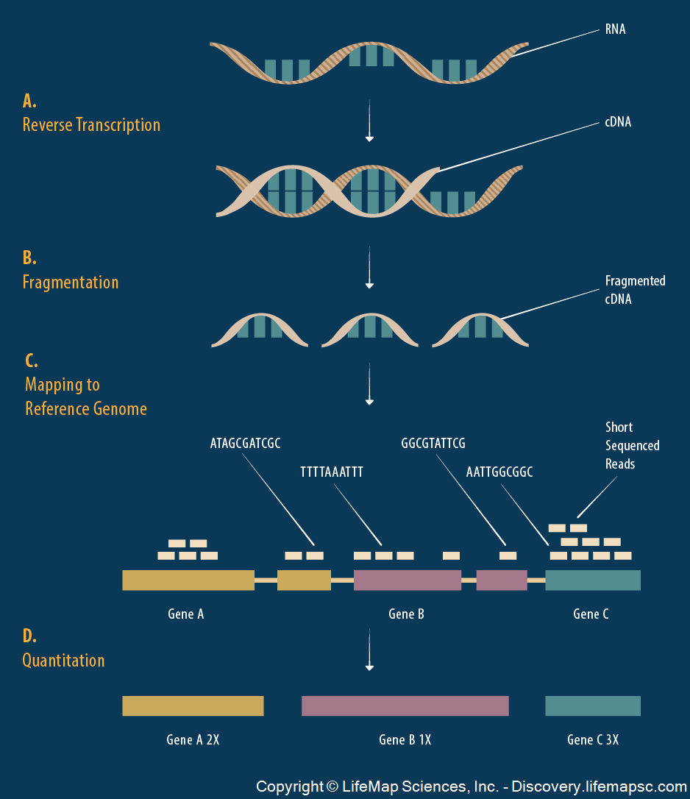
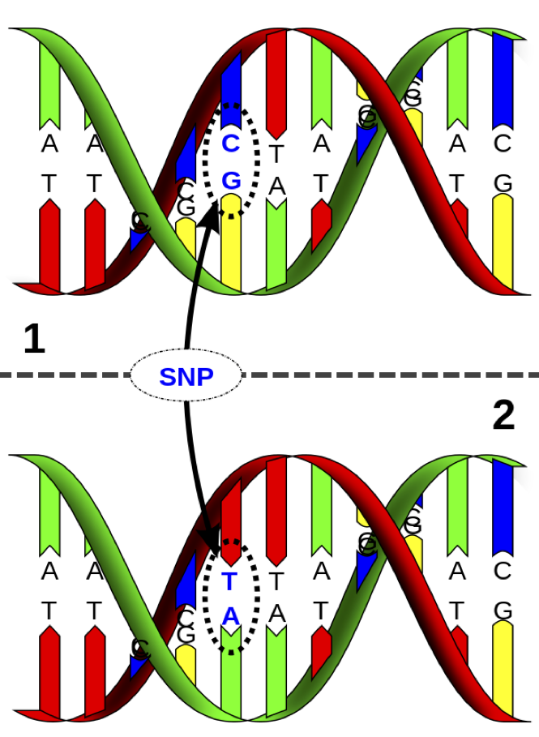
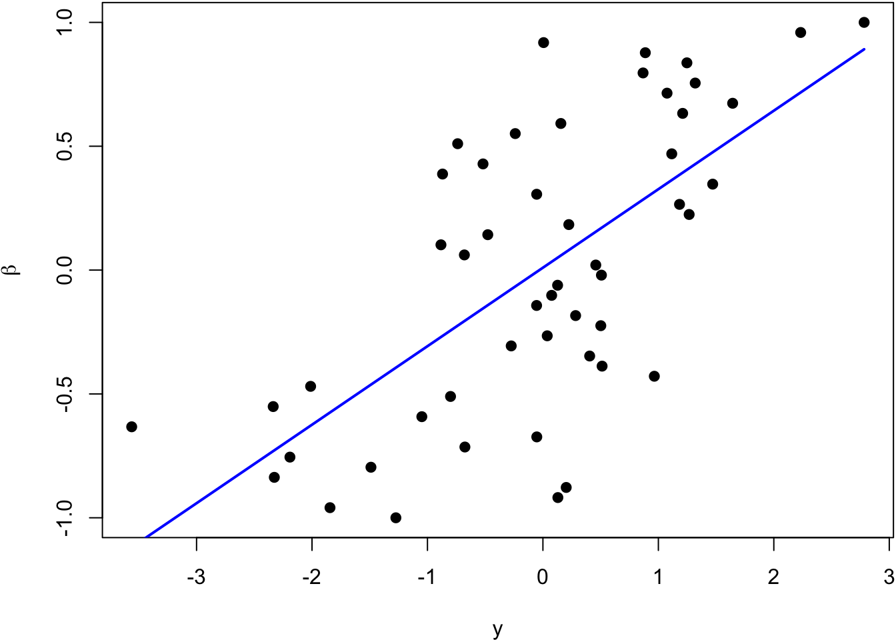
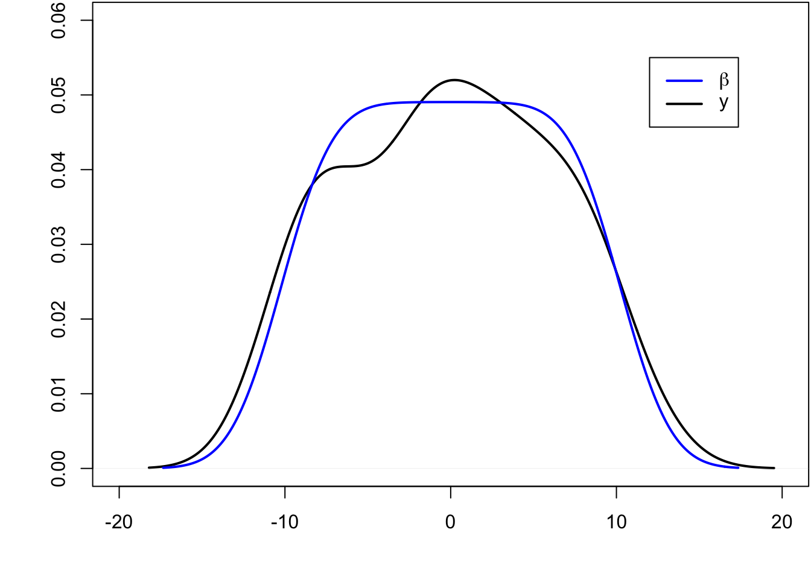
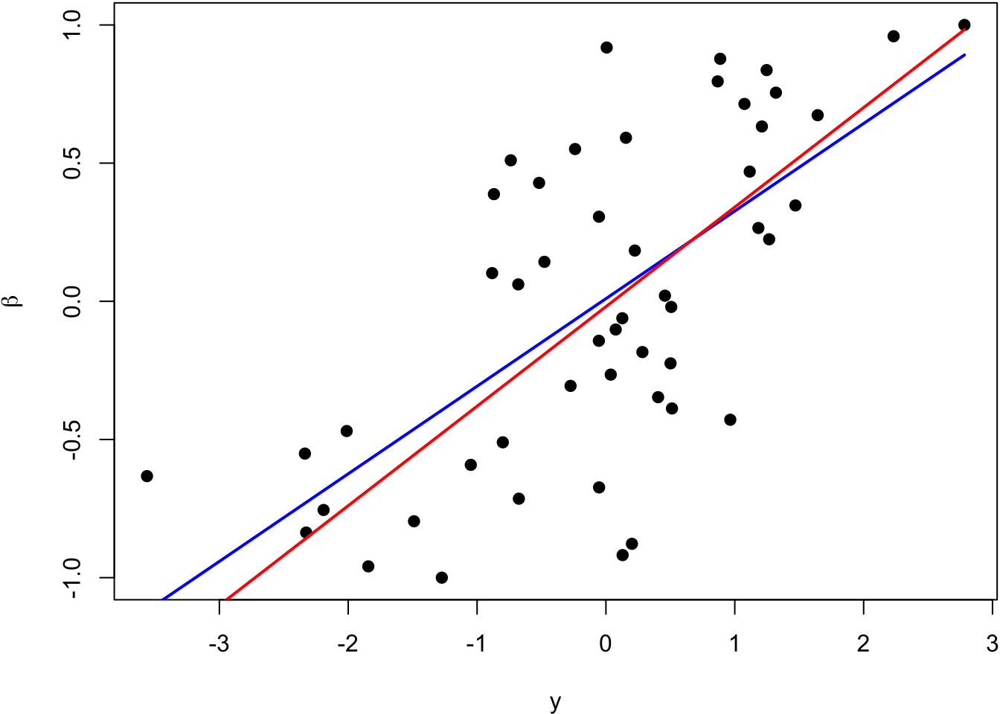
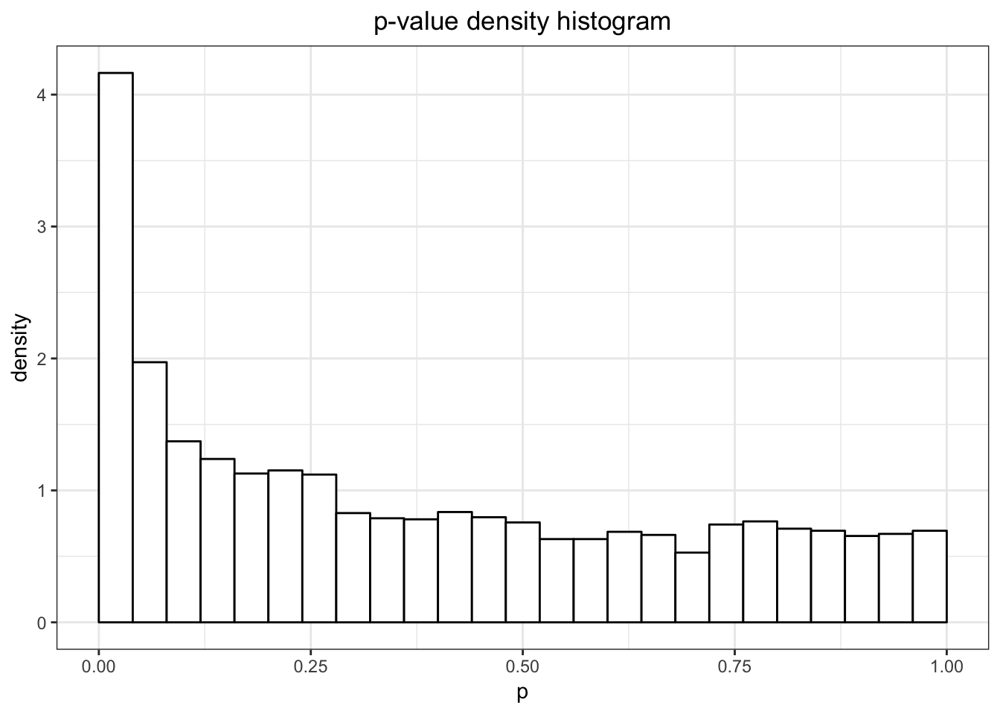
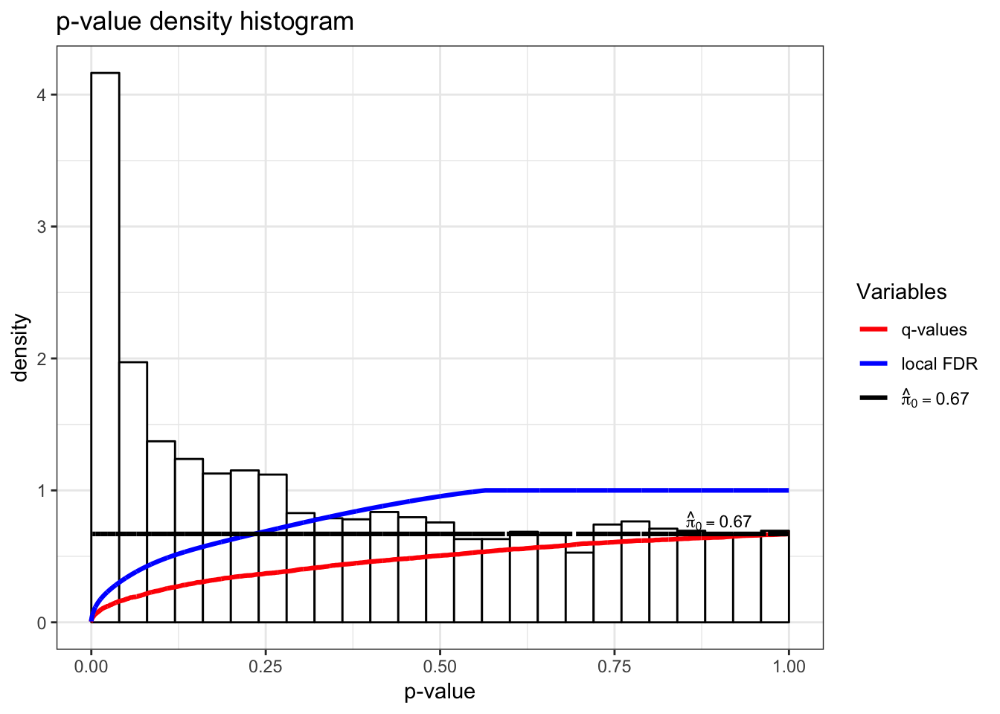
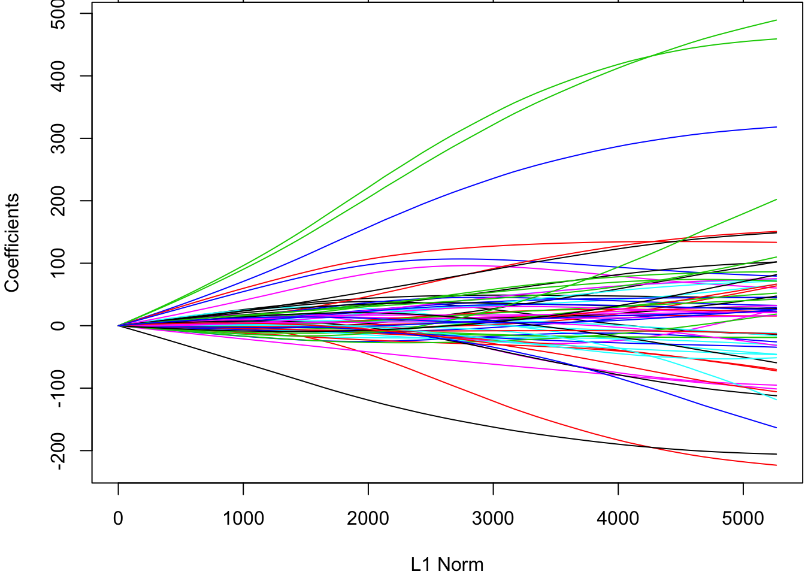
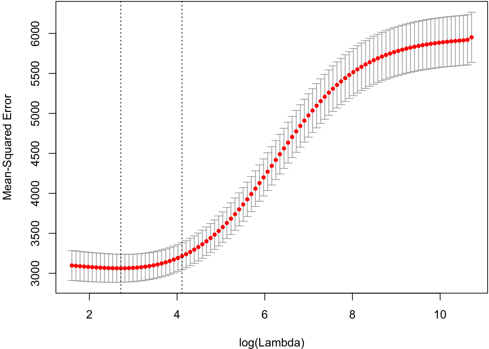

\providecommand{\E}{\operatorname{E}}
\providecommand{\V}{\operatorname{Var}}
\providecommand{\Cov}{\operatorname{Cov}}
\providecommand{\se}{\operatorname{se}}
\providecommand{\logit}{\operatorname{logit}}
\providecommand{\iid}{\; \stackrel{\text{iid}}{\sim}\;}
\providecommand{\asim}{\; \stackrel{.}{\sim}\;}
\providecommand{\xs}{x_1, x_2, \ldots, x_n}
\providecommand{\Xs}{X_1, X_2, \ldots, X_n}
\providecommand{\bB}{\boldsymbol{B}}
\providecommand{\bb}{\boldsymbol{\beta}}
\providecommand{\bx}{\boldsymbol{x}}
\providecommand{\bX}{\boldsymbol{X}}
\providecommand{\by}{\boldsymbol{y}}
\providecommand{\bY}{\boldsymbol{Y}}
\providecommand{\bz}{\boldsymbol{z}}
\providecommand{\bZ}{\boldsymbol{Z}}
\providecommand{\be}{\boldsymbol{e}}
\providecommand{\bE}{\boldsymbol{E}}
\providecommand{\bs}{\boldsymbol{s}}
\providecommand{\bS}{\boldsymbol{S}}
\providecommand{\bP}{\boldsymbol{P}}
\providecommand{\bI}{\boldsymbol{I}}
\providecommand{\bD}{\boldsymbol{D}}
\providecommand{\bd}{\boldsymbol{d}}
\providecommand{\bW}{\boldsymbol{W}}
\providecommand{\bw}{\boldsymbol{w}}
\providecommand{\bM}{\boldsymbol{M}}
\providecommand{\bPhi}{\boldsymbol{\Phi}}
\providecommand{\bphi}{\boldsymbol{\phi}}
\providecommand{\bN}{\boldsymbol{N}}
\providecommand{\bR}{\boldsymbol{R}}
\providecommand{\bu}{\boldsymbol{u}}
\providecommand{\bU}{\boldsymbol{U}}
\providecommand{\bv}{\boldsymbol{v}}
\providecommand{\bV}{\boldsymbol{V}}
\providecommand{\bO}{\boldsymbol{0}}
\providecommand{\bOmega}{\boldsymbol{\Omega}}
\providecommand{\bLambda}{\boldsymbol{\Lambda}}
\providecommand{\bSig}{\boldsymbol{\Sigma}}
\providecommand{\bSigma}{\boldsymbol{\Sigma}}
\providecommand{\bt}{\boldsymbol{\theta}}
\providecommand{\bT}{\boldsymbol{\Theta}}
\providecommand{\bpi}{\boldsymbol{\pi}}
\providecommand{\argmax}{\text{argmax}}
\providecommand{\KL}{\text{KL}}
\providecommand{\fdr}{{\rm FDR}}
\providecommand{\pfdr}{{\rm pFDR}}
\providecommand{\mfdr}{{\rm mFDR}}
\providecommand{\bh}{\hat}
\providecommand{\dd}{\lambda}
\providecommand{\q}{\operatorname{q}}


# (PART) High-Dimensional Inference {-}

# High-Dimensional Data and Inference

## Definition

**High-dimesional inference** is the scenario where we perform inference simultaneously on "many" paramaters.

"Many" can be as few as three parameters (which is where things start to get interesting), but in modern applications this is typically on the order of thousands to billions of paramaters.

**High-dimesional data** is a data set where the number of variables measured is many.


**Large same size** data is a data set where few variables are measured, but many observations are measured.

**Big data** is a data set where there are so many data points that it cannot be managed straightforwardly in memory, but must rather be stored and accessed elsewhere.  Big data can be high-dimensional, large sample size, or both.

We will abbreviate high-dimensional with **HD**.

## Examples

In all of these examples, many measurements are taken and the goal is often to perform inference on many paramaters simultaneously.

- Spatial epidemiology
- Environmental monitoring
- Internet user behavior
- Genomic profiling
- Neuroscience imaging
- Financial time series

## HD Gene Expression Data




It's possible to measure the level of gene expression -- how much mRNA is being transcribed -- from thousands of cell simultaneously in a single biological sample.


Typically, gene expression is measured over varying biological conditions, and the goal is to perform inference on the relationship between expression and the varying conditions.

This results in thousands of simultaneous inferences.

The typical sizes of these data sets are 1000 to 50,000 genes and 10 to 1000 observations.

The gene expression values are typically modeled as approximately Normal or overdispersed Poisson.

There is usually shared signal among the genes, and there are often unobserved latent variables.


$$
\begin{array}{rc}
& \bY_{m \times n} \\
& \text{observations} \\
\text{genes} &
\begin{bmatrix}
    y_{11} & y_{12} & \cdots & y_{1n} \\
    y_{21} & y_{22} & \cdots & y_{2n} \\
     & & & \\
    \vdots & \vdots & \ddots & \vdots \\
     & & & \\
    y_{m1} & y_{m2} & \cdots & y_{mn}
\end{bmatrix} \\
& \\
& \bX_{d \times n} \ \text{study design} \\
& 
\begin{bmatrix}
    x_{11} & x_{12} & \cdots & x_{1n} \\
    \vdots & \vdots & \ddots & \vdots \\
    x_{d1} & x_{d2} & \cdots & x_{dn}
\end{bmatrix}
\end{array}
$$


\  

The $\bY$ matrix contains gene expression measurements for $m$ genes (rows) by $n$ observations (columns).  The values $y_{ij}$ are either in $\mathbb{R}$ or $\mathbb{Z}^{+} = \{0, 1, 2, \ldots \}$.

The $\bX$ matrix contains the study design of $d$ explanatory variables (rows) by the $n$ observations (columns).

Note that $m \gg n \gg d$.


## Many Responses Model

Gene expression is an example of what I call the **many responses model**.

We're interested in performing simultaneous inference on $d$ paramaters for each of $m$ models such as:

$$
\begin{aligned}
& \bY_{1} = \bb_1 \bX  + \bE_1 \\
& \bY_{2} = \bb_2 \bX  + \bE_2 \\
& \vdots \\
& \bY_{m} = \bb_m \bX  + \bE_m \\
\end{aligned}
$$

---- 

For example, $\bY_{1} = \bb_1 \bX + \bE_1$ is vector notation of (in terms of observations $j$): 

$$
\left\{ Y_{1j} = \beta_{11} X_{1j} + \beta_{12} X_{2j}  + \cdots + \beta_{1d} X_{dj}  + E_{1j} \right\}_{j=1}^n
$$

We have made two changes from last week:

1.  We have transposed $\bX$ and $\bb$.
2.  We have changed the number of explanatory variables from $p$ to $d$.


Let $\bB_{m \times d}$ be the matrix of parameters $(\beta_{ik})$ relating the $m$ response variables to the $d$ explanatory variables. The full HD model is

$$
\begin{array}{cccccc}
\bY_{m \times n}  & = & \bB_{m \times d} & \bX_{d \times n} & + & \bE_{m \times n} \\
\begin{bmatrix}
 & & \\
 & & \\
 & & \\
 Y_{i1} & \cdots & Y_{in}\\
 & & \\
 & & \\
 & & \\
\end{bmatrix} & 
= & 
\begin{bmatrix}
 & \\
 & \\
 & \\
 \beta_{i1} & \beta_{id} \\
 & \\
 & \\
 & \\
\end{bmatrix} & 
\begin{bmatrix}
X_{11} & \cdots & X_{1n} \\
X_{d1} & \cdots & X_{dn} \\
\end{bmatrix} & 
+ & 
\begin{bmatrix}
 & & \\
 & & \\
 & & \\
 E_{i1} & \cdots & E_{in} \\
 & & \\
 & & \\
 & & \\
\end{bmatrix} 
\end{array}
$$


Note that if we make OLS assumptions, then we can calculate:

$$
\hat{\bB}^{\text{OLS}} = \bY \bX^T (\bX \bX^T)^{-1}
$$

$$
\hat{\bY} = \hat{\bB} \bX = \bY \bX^T (\bX \bX^T)^{-1} \bX
$$

so here the projection matrix is $\bP = \bX^T (\bX \bX^T)^{-1} \bX$ and acts from the RHS, $\hat{\bY} = \bY \bP$. 

We will see this week and next that $\hat{\bB}^{\text{OLS}}$ has nontrivial drawbacks. Thefore, we will be exploring other ways of estimating $\bB$.


We of course aren't limited to OLS models.  We could consider the many response GLM:

$$
g\left(\E\left[ \left. \bY_{m \times n} \right| \bX \right]\right) = \bB_{m \times d} \bX_{d \times n}
$$

and we could even replace $\bB_{m \times d} \bX_{d \times n}$ with $d$ smoothers for each of the $m$ response variable.

## HD SNP Data



It is possible to measure single nucleotide polymorphisms at millions of locations across the genome.

The base (A, C, G, or T) is measured from one of the strands.

For example, on the figure to the left, the individual is heterozygous CT at this SNP location.


$$
\begin{array}{rc}
& \bX_{m \times n} \\
& \text{individuals} \\
\text{SNPs} &
\begin{bmatrix}
    x_{11} & x_{12} & \cdots & x_{1n} \\
    x_{21} & x_{22} & \cdots & x_{2n} \\
     & & & \\
    \vdots & \vdots & \ddots & \vdots \\
     & & & \\
    x_{m1} & x_{m2} & \cdots & x_{mn}
\end{bmatrix} \\
& \\
& \by_{1 \times n} \ \text{trait} \\
& 
\begin{bmatrix}
    y_{11} & y_{12} & \cdots & y_{1n} 
\end{bmatrix}
\end{array}
$$

The $\bX$ matrix contains SNP genotypes for $m$ SNPs (rows) by $n$ individuals (columns).  The values $x_{ij} \in \{0, 1, 2\}$ are conversions of genotypes (e.g., CC, CT, TT) to counts of one of the alleles.

The $\by$ vector contains the trait values of the $n$ individuals.

Note that $m \gg n$.

## Many Regressors Model

The SNP-trait model is an example of what I call the **many regressors model**.  A single model is fit of a response variable on many regressors (i.e., explanatory variables) simultaneously.  

This involves simultaneously inferring $m$ paramaters $\bb = (\beta_1, \beta_2, \ldots, \beta_m)$ in models such as:

$$
\bY = \alpha \boldsymbol{1} + \bb \bX + \bE
$$

which is an  $n$-vector with component $j$ being:

$$
Y_j = \alpha + \sum_{i=1}^m \beta_i X_{ij} + E_{j}
$$


As with the many responses model, we do not need to limit the model to the OLS type where the response variable is approximately Normal distributed.  Instead we can consider more general models such as

$$
g\left(\E\left[ \left. \bY \right| \bX \right]\right) = \alpha \boldsymbol{1} + \bb \bX
$$

for some link function $g(\cdot)$.

## Goals

In both types of models we are interested in:

- Forming point estimates
- Testing statistical hypothesis
- Calculating posterior distributions
- Leveraging the HD data to increase our power and accuracy

Sometimes we are also interested in confidence intervals in high dimensions, but this is less common.

## Challenges

Here are several of the new challenges we face when analyzing high-dimensional data:

- Standard estimation methods may be suboptimal in high dimensions
- New measures of significance are needed
- There may be dependence and latent variables among the high-dimensional variables
- The fact that $m \gg n$ poses challenges, especially in the many regressors model

HD data provide new challenges, but they also provide opportunities to model variation in the data in ways not possible for low-dimensional data.

# Many Responses Model

# Shrinkage and Empirical Bayes

## Estimating Several Means

Let's start with the simplest *many responses model* where there is only an interncept and only one observation per variable.  This means that $n=1$ and $d=1$ where $\bX = 1$.

This model can be written as $Y_i \sim \mbox{Normal}(\beta_i, 1)$ for the $i=1, 2, \ldots, m$ response variables.  Suppose also that $Y_1, Y_2, \ldots, Y_m$ are jointly independent.

Let's assume that $\beta_1, \beta_2, \ldots, \beta_m$ are *fixed, nonrandom parameters*.

## Usual MLE

The usual estimates of $\beta_i$ are to set

$$
\hat{\beta}_i^{\text{MLE}} = \bY_i.
$$

This is also the OLS solution.

## Loss Function

Suppose we are interested in the simultaneous loss function

$$
L(\bb, \hat{\bb}) = \sum_{i=1} (\beta_i - \hat{\beta}_i)^2
$$

with risk $R(\bb, \hat{\bb}) = \E[L(\bb, \hat{\bb})]$.

## Stein's Paradox

Consider the following **James-Stein estimator**:

$$
\hat{\beta}_i^{\text{JS}} = \left(1 - \frac{m-2}{\sum_{k=1}^m Y_k^2} \right) Y_i.
$$

In a shocking result called **Stein's paradox**, it was shown that when $m \geq 3$ then

$$
R\left(\bb, \hat{\bb}^{\text{JS}}\right) < R\left(\bb, \hat{\bb}^{\text{MLE}}\right).
$$

This means that the usual MLE is dominated by this JS estimator for any, even nonrandom, configuration of $\beta_1, \beta_2, \ldots, \beta_m$!  


What is going on?

Let's first take a *linear regression* point of view to better understand this paradox.

Then we will return to the *empirical Bayes* example from earlier.


```r
> beta <- seq(-1, 1, length.out=50)
> y <- beta + rnorm(length(beta))
```


The blue line is the least squares regression line.


```r
> beta <- seq(-10, 10, length.out=50)
> y <- beta + rnorm(length(beta))
```




The blue line is the least squares regression line.




## Inverse Regression Approach

While $Y_i = \beta_i + E_i$ where $E_i \sim \mbox{Normal}(0,1)$, it is also the case that $\beta_i = Y_i - E_i$ where $-E_i \sim \mbox{Normal}(0,1)$.

Even though we're assuming the $\beta_i$ are fixed, suppose we imagine for the moment that the $\beta_i$ are random and take a least squares appraoch.  We will try to estimate the linear model

$$
\E[\beta_i | Y_i] = a + b Y_i.
$$


Why would we do this?  The loss function is 

$$
\sum_{i=1}^m (\beta_i - \hat{\beta}_i)^2
$$

so it makes sense to estimate $\beta_i$ by setting $\hat{\beta}_i$ to a regression line.


The least squares solution tells us to set

$$
\begin{aligned}
\hat{\beta}_i & = \hat{a} + \hat{b} Y_i \\
& = (\bar{\beta} - \hat{b} \bar{Y}) + \hat{b} Y_i \\
& = \bar{\beta} + \hat{b} (Y_i - \bar{Y})
\end{aligned}
$$

where 

$$
\hat{b} = \frac{\sum_{i=1}^m (Y_i - \bar{Y})(\beta_i - \bar{\beta})}{\sum_{i=1}^m (Y_i - \bar{Y})^2}.
$$


We can estimate $\bar{\beta}$ with $\bar{Y}$ since $\E[\bar{\beta}] = \E[\bar{Y}]$.

We also need to find an estimate of $\sum_{i=1}^m (Y_i - \bar{Y})(\beta_i - \bar{\beta})$.  Note that

$$
\beta_i - \bar{\beta} = Y_i - \bar{Y} - (E_i + \bar{E}) 
$$

so that 

$$
\begin{aligned}
\sum_{i=1}^m (Y_i - \bar{Y})(\beta_i - \bar{\beta}) = & \sum_{i=1}^m (Y_i - \bar{Y})(Y_i - \bar{Y}) \\
& + \sum_{i=1}^m (Y_i - \bar{Y})(E_i - \bar{E})
\end{aligned}
$$


Since $Y_i = \beta_i + E_i$ it follows that 

$$
\E\left[\sum_{i=1}^m (Y_i - \bar{Y})(E_i - \bar{E})\right] = \E\left[\sum_{i=1}^m (E_i - \bar{E})(E_i - \bar{E})\right] = m-1.
$$

Therefore,

$$
\E\left[\sum_{i=1}^m (Y_i - \bar{Y})(\beta_i - \bar{\beta})\right] = \E\left[\sum_{i=1}^m (Y_i - \bar{Y})^2 - (m-1)\right].
$$


This yields

$$
\hat{b} = \frac{\sum_{i=1}^m (Y_i - \bar{Y})^2 - (m-1)}{\sum_{i=1}^m (Y_i - \bar{Y})^2} = 1 - \frac{m-1}{\sum_{i=1}^m (Y_i - \bar{Y})^2}
$$

and

$$
\hat{\beta}_i^{\text{IR}} = \bar{Y} + \left(1 - \frac{m-1}{\sum_{i=1}^m (Y_i - \bar{Y})^2}\right) (Y_i - \bar{Y})
$$


If instead we had started with the no intercept model

$$
\E[\beta_i | Y_i] = b Y_i.
$$

we would have ended up with

$$
\hat{\beta}_i^{\text{IR}} = \left(1 - \frac{m-1}{\sum_{i=1}^m (Y_i - \bar{Y})^2}\right) Y_i
$$

In either case, it can be shown that 

$$
R\left(\bb, \hat{\bb}^{\text{IR}}\right) < R\left(\bb, \hat{\bb}^{\text{MLE}}\right).
$$


The blue line is the least squares regression line of $\beta_i$ on $Y_i$, and the red line is $\hat{\beta}_i^{\text{IR}}$.


## Empirical Bayes Estimate

Suppose that $Y_i | \beta_i \sim \mbox{Normal}(\beta_i, 1)$ where these rv's are jointly independent.  Also suppose that $\beta_i \iid \mbox{Normal}(a, b^2)$. Taking the empirical Bayes approach, we get:

$$
f(y_i ; a, b) = \int f(y_i | \beta_i) f(\beta_i; a, b) d\beta_i \sim \mbox{Normal}(a, 1+b^2).
$$

$$
\implies \hat{a} = \overline{Y}, \ 1+\hat{b}^2 =  \frac{\sum_{k=1}^m (Y_k - \overline{Y})^2}{n}
$$


$$
\begin{aligned}
\E[\beta_i | Y_i] & = \frac{1}{1+b^2}a + \frac{b^2}{1+b^2}Y_i \implies \\
 & \\
\hat{\beta}_i^{\text{EB}} & = \hat{\E}[\beta_i | Y_i] = \frac{1}{1+\hat{b}^2}\hat{a} + \frac{\hat{b}^2}{1+\hat{b}^2}Y_i \\
 & = \frac{m}{\sum_{k=1}^m (Y_k - \overline{Y})^2} \overline{Y} + \left(1-\frac{m}{\sum_{k=1}^m (Y_k - \overline{Y})^2}\right) Y_i
\end{aligned}
$$


As with $\hat{\bb}^{\text{JS}}$ and $\hat{\bb}^{\text{IR}}$, we have

$$
R\left(\bb, \hat{\bb}^{\text{EB}}\right) < R\left(\bb, \hat{\bb}^{\text{MLE}}\right).
$$


## EB for a Many Responses Model

Consider the *many responses model* where $\bY_{i} | \bX \sim \mbox{MVN}_n(\bb_i \bX, \sigma^2 \bI)$ where the vectors $\bY_{i} | \bX$ are jointly independent ($i=1, 2, \ldots, m$).  Here we've made the simplifying assumption that the variance $\sigma^2$ is equal across all responses, but this would not be generally true.

The OLS (and MLE) solution is

$$
\hat{\bB}= \bY \bX^T (\bX \bX^T)^{-1}.
$$


Suppose we extend this so that $\bY_{i} | \bX, \bb_i \sim \mbox{MVN}_n(\bb_i \bX, \sigma^2 \bI)$ and $\bb_i \iid \mbox{MVN}_d(\bu, \bV)$.

Since $\hat{\bb}_i | \bb_i \sim \mbox{MVN}_d(\bb_i, \sigma^2(\bX \bX^T)^{-1})$, it follows that marginally

$$
\hat{\bb}_i \iid \mbox{MVN}_d(\bu, \sigma^2(\bX \bX^T)^{-1} + \bV).
$$


Therefore,

$$
\hat{\bu} = \frac{\sum_{i=1}^m \hat{\bb}_i}{m}
$$

$$
\hat{\bV} = \hat{\Cov}\left(\hat{\bb}\right) - \hat{\sigma}^2(\bX \bX^T)^{-1}
$$

where $\hat{\Cov}\left(\hat{\bb}\right)$ is the $d \times d$ sample covariance (or MLE covariance) of the $\hat{\bb}_i$ estimates.  

Also, $\hat{\sigma}^2$ is obtained by averaging the estimate over all $m$ regressions.


We then do inference based on the prior distribution $\bb_i \iid \mbox{MVN}_d(\hat{\bu}, \hat{\bV})$. The posterior distribution of $\bb_i | \bY, \bX$ is MVN with mean

$$
\left(\frac{1}{\hat{\sigma}^2}(\bX \bX^T) + \hat{\bV}^{-1}\right)^{-1} \left(\frac{1}{\hat{\sigma}^2}(\bX \bX^T) \hat{\bb}_i + \hat{\bV}^{-1} \hat{\bu} \right)
$$

and covariance

$$
\left(\frac{1}{\hat{\sigma}^2}(\bX \bX^T) + \hat{\bV}^{-1}\right)^{-1}.
$$

# Multiple Testing

## Motivating Example


Hedenfalk et al. (2001) *NEJM* measured gene expression in three different breast cancer tumor types.  In your homework, you have analyzed these data and have specifically compared BRCA1 mutation positive tumors to BRCA2 mutation positive tumors.

The `qvalue` package has the p-values when testing for a difference in population means between these two groups (called "differential expression").  There are 3170 genes tested, resulting in 3170 p-values.

Note that this analysis is a version of the many responses model.


```r
> library(qvalue)
> data(hedenfalk); df <- data.frame(p=hedenfalk$p)
> ggplot(df, aes(x = p)) +
+          ggtitle("p-value density histogram") +
+          geom_histogram(aes_string(y = '..density..'), colour = "black",
+                         fill = "white", binwidth = 0.04, center=0.02)
```



## Challenges

- Traditional p-value thresholds such as 0.01 or 0.05 may result in too many false positives.  For example, in the above example, a 0.05 threshold could result in 158 false positives.
- A careful balance of true positives and false positives must be achieved in a manner that is scientifically interpretable.
- There is information in the joint distribution of the p-values that can be leveraged.
- Dependent p-values may make this type of analysis especially difficult (next week's topic).


```r
> qobj <- qvalue(hedenfalk$p)
> hist(qobj)
```



## Outcomes

Possible outcomes from $m$ hypothesis tests based on applying a significance threshold $0 < t \leq 1$ to their corresponding p-values.

\ | Not Significant | Significant | Total
--- | --- | --- | ---
Null True | $U$ | $V$ | $m_0$
Alternative True | $T$ | $S$ | $m_1$
Total | $W$ | $R$ | $m$ 


## Error Rates

Suppose we are testing $m$ hypotheses based on p-values $p_1, p_2, \ldots, p_m$.

**Multiple hypothesis testing** is the process of deciding which of these p-values should be called statistically significant.

This requires formulating and estimating a compound **error rate** that quantifies the quality of the decision.


## Bonferroni Correction

The **family-wise error rate** is the probability of *any* false positive occurring among all tests called significant.  The **Bonferroni correction** is a result that shows that utilizing a p-value threshold of $\alpha/m$ results in FWER $\leq \alpha$.  Specifically,

$$
\begin{aligned}
\text{FWER} & \leq \Pr(\cup \{P_i \leq \alpha/m\}) \\
 & \leq \sum_{i=1}^m \Pr(P_i \leq \alpha/m) = \sum_{i=1}^m \alpha/m = \alpha
\end{aligned}
$$

where the above probability calculations are done under the assumption that all $H_0$ are true.

## False Discovery Rate

The **false discovery rate** (FDR) measures the proportion of Type I errors --- or "false discoveries" --- among all hypothesis tests called statistically significant.  It is defined as

$$
\fdr = \E \left[ \frac{V}{R \vee 1} \right] = \E \left[ \left.
\frac{V}{R} \right| R>0 \right] \Pr(R>0).
$$

This is less conservative than the FWER and it offers a clearer balance between true positives and false positives.


There are two other false discovery rate definitions, where the main difference is in how the $R=0$ event is handled.  These quantities are called the **positive false discovery rate** (pFDR) and the **marginal false discovery rate** (mFDR), defined as follows:

$$
\pfdr = \E \left[ \left. \frac{V}{R} \right| R>0 \right],
$$

$$
\mfdr = \frac{\E \left[ V \right]}{\E \left[ R \right]}.
$$

Note that $\pfdr = \mfdr = 1$ whenever all null hypotheses are true, whereas FDR can always be made arbitrarily small because of the extra term $\Pr(R > 0)$.  

## Point Estimate

Let $\fdr(t)$ denote the FDR when calling null hypotheses significant whenever $p_i \leq t$, for $i = 1, 2, \ldots, m$. For $0 < t \leq 1$, we define the following random variables:

$$
\begin{aligned}
V(t) & =  \#\{\mbox{true null } p_i: p_i \leq t \} \\
R(t) & = \#\{p_i: p_i \leq t\}
\end{aligned}
$$
In terms of these, we have

$$
\fdr(t) = \E \left[ \frac{V(t)}{R(t) \vee 1} \right].
$$


For fixed $t$, the following defines a family of conservatively biased point estimates of $\fdr(t)$:

$$
\hat{\fdr}(t) = \frac{\hat{m}_0(\lambda) \cdot t}{[R(t) \vee 1]}.
$$

The term $\hat{m}_0(\dd)$ is an estimate of $m_0$, the number of true null hypotheses. This estimate depends on the tuning parameter $\dd$, and it is defined as

$$
\hat{m}_0(\dd) = \frac{m - R(\dd)}{(1-\dd)}.
$$


Sometimes instead of $m_0$, the quantity 

$$
\pi_0 = \frac{m_0}{m}
$$ 

is estimated, where simply 

$$
\hat{\pi}_0(\dd) = \frac{\hat{m}_0(\dd)}{m} = \frac{m - R(\dd)}{m(1-\dd)}.
$$


It can be shown that $\E[\hat{m}_0(\dd)] \geq m_0$ when the p-values corresponding to the true null hypotheses are Uniform(0,1) distributed (or stochastically greater). 

There is an inherent bias/variance trade-off in the choice of $\dd$. In most cases, when $\dd$ gets smaller, the bias of $\hat{m}_0(\dd)$ gets larger, but the variance gets smaller. 

Therefore, $\dd$ can be chosen to try to balance this trade-off.

## Adaptive Threshold

If we desire a FDR level of $\alpha$, it is tempting to use the p-value threshold 

$$
t^*_\alpha = \max \left\{ t:  \hat{\fdr}(t) \leq \alpha \right\}
$$

which identifies the largest estimated FDR less than or equal to $\alpha$.

## Conservative Properties

When the p-value corresponding to true null hypothesis are distributed iid Uniform(0,1), then we have the following two conservative properties.

$$
\begin{aligned}
& \E \left[ \hat{\fdr}(t) \right] \geq \fdr(t) \\
& \E \left[ \hat{\fdr}(t^*_\alpha) \right] \leq \alpha
\end{aligned}
$$


## Q-Values

In single hypothesis testing, it is common to report the p-value as a measure of significance.  The **q-value** is the FDR based measure of significance that can be calculated simultaneously for multiple hypothesis tests.

The p-value is constructed so that a threshold of $\alpha$ results in a Type I error rate $\leq \alpha$.  Likewise, the q-value is constructed so that a threshold of $\alpha$ results in a FDR $\leq \alpha$.


Initially it seems that the q-value should capture the FDR incurred when the significance threshold is set at the p-value itself, $\fdr(p_i)$.  However, unlike Type I error rates, the FDR is not necessarily strictly increasing with an increasing significance threshold. 

To accommodate this property, the q-value is defined to be the minimum FDR (or pFDR) at which the test is called significant: 

$$
\q{\rm\mbox{-}value}(p_i) = \min_{t \geq p_i} \fdr(t)
$$

or

$$
\q{\rm\mbox{-}value}(p_i) = \min_{t \geq p_i} \pfdr(t).
$$


To estimate this in practice, a simple plug-in estimate is formed, for example:

$$
\hat{\q}{\rm\mbox{-}value}(p_i) = \min_{t \geq p_i} \hat{\fdr}(t).
$$

Various theoretical properties have been shown for these estimates under certain conditions, notably that the estimated q-values of the entire set of tests are simultaneously conservative as the number of hypothesis tests grows large.


```r
> plot(qobj)
```


## Bayesian Mixture Model

Let's return to the [Bayesian classification](https://jdstorey.github.io/asdslectures/week06.html#/classification) set up from earlier.  Suppose that 

- $H_i =$ 0 or 1 according to whether the $i$th null hypothesis is true or not
- $H_i \iid \mbox{Bernoulli}(1-\pi_0)$ so that $\Pr(H_i=0)=\pi_0$ and $\Pr(H_i=1)=1-\pi_0$
- $P_i | H_i \iid (1-H_i) \cdot F_0 + H_i \cdot F_1$, where $F_0$ is the null distribution and $F_1$ is the alternative distribution 

## Bayesian-Frequentist Connection

Under these assumptions, it has been shown that

$$
\begin{aligned}
\pfdr(t) & = \E \left[ \left. \frac{V(t)}{R(t)} \right| R(t) > 0 \right] \\
\ & = \Pr(H_i = 0 | P_i \leq t)
\end{aligned}
$$

where $\Pr(H_i = 0 | P_i \leq t)$ is the same for each $i$ because of the iid assumptions.


Under these modeling assumptions, it follows that 

$$
\mbox{q-value}(p_i) = \min_{t \geq p_i} \Pr(H_i = 0 | P_i \leq t)
$$ 

which is a Bayesian analogue of the p-value --- or rather a "Bayesian posterior Type I error rate".

## Local FDR

In this scenario, it also follows that 

$$
\pfdr(t) = \int \Pr(H_i = 0 | P_i = p_i) dF(p_i | p_i \leq t)
$$ 

where $F = \pi_0 F_0 + (1-\pi_0) F_1$. 

This connects the pFDR to the **posterior error probability** 

$$\Pr(H_i = 0 | P_i = p_i)$$ 

making this latter quantity sometimes interpreted as a **local false discovery rate**.


```r
> hist(qobj)
```




# Many Regressors Model

# Ridge Regression

## Motivation

**Ridge regression** is a technique for shrinking the coefficients towards zero in linear models.

It also deals with collinearity among explanatory variables.  **Collinearity** is the presence of strong correlation among two or more explanatory variables.

## Optimization Goal

Under the OLS model assumptions, ridge regression fits model by minimizing the following:

$$
\sum_{j=1}^n \left(y_j - \sum_{i=1}^m \beta_{i} x_{ij}\right)^2 + \lambda \sum_{k=1}^m \beta_k^2.
$$

Recall the $\ell_2$ norm: $\sum_{k=1}^m \beta_k^2 = \| \bb \|^2_2$.  Sometimes ridge regression is called $\ell_2$ penalized regression.

As with natural cubic splines, the paramater $\lambda$ is a tuning paramater that controls how much shrinkage occurs.  

## Solution

The ridge regression solution is

$$
\hat{\bb}^{\text{Ridge}} = \by \bX^T \left(\bX\bX^T + \lambda \bI\right)^{-1}.
$$

\  

As $\lambda \rightarrow 0$, the $\hat{\bb}^{\text{Ridge}} \rightarrow \hat{\bb}^{\text{OLS}}$.

As $\lambda \rightarrow \infty$, the $\hat{\bb}^{\text{Ridge}} \rightarrow \bO$.

## Preprocessing

Implicitly...

We mean center $\by$.

We also mean center and standard deviation scale each explanatory variable.  Why?

## Shrinkage

When $\bX\bX^T = \bI$, then 

$$
\hat{\beta}^{\text{Ridge}}_{j} = \frac{\hat{\beta}^{\text{OLS}}_{j}}{1+\lambda}. 
$$

This shows how ridge regression acts as a technique for shrinking regression coefficients towards zero.  It also shows that when $\hat{\beta}^{\text{OLS}}_{j} \not= 0$, then for all finite $\lambda$, $\hat{\beta}^{\text{Ridge}}_{j} \not= 0$.

## Example


```r
> set.seed(508)
> x1 <- rnorm(20)
> x2 <- x1 + rnorm(20, sd=0.1)
> y <- 1 + x1 + x2 + rnorm(20)
> tidy(lm(y~x1+x2))
# A tibble: 3 x 5
  term        estimate std.error statistic  p.value
  <chr>          <dbl>     <dbl>     <dbl>    <dbl>
1 (Intercept)    0.965     0.204     4.74  0.000191
2 x1             0.493     2.81      0.175 0.863   
3 x2             1.26      2.89      0.436 0.668   
> lm.ridge(y~x1+x2, lambda=1) # from MASS package
                 x1        x2 
0.9486116 0.8252948 0.8751979 
```

## Existence of Solution

When $m > n$ or when there is high collinearity, then $(\bX\bX^T)^{-1}$ will not exist.  

However, for $\lambda > 0$, it is always the case that $\left(\bX\bX^T + \lambda \bI\right)^{-1}$ exists.

Therefore, one can always compute a unique $\hat{\bb}^{\text{Ridge}}$ for each $\lambda > 0$.

## Effective Degrees of Freedom

Similarly to natural cubic splines, we can calculate an effective degrees of freedom by noting that:

$$
\hat{\by} = \by \bX^T \left(\bX\bX^T + \lambda \bI\right)^{-1} \bX
$$

The effective degrees of freedom is then the trace of the linear operator:

$$
\operatorname{tr} \left(\bX^T \left(\bX\bX^T + \lambda \bI\right)^{-1} \bX\right)
$$

## Bias and Covariance

Under the OLS model assumptions,

$$
\Cov\left(\hat{\bb}^{\text{Ridge}}\right) = \sigma^2 \left(\bX\bX^T + \lambda \bI\right)^{-1} \bX\bX^T \left(\bX\bX^T + \lambda \bI\right)^{-1}
$$

and

$$
\text{bias} = \E\left[\hat{\bb}^{\text{Ridge}}\right] - \bb = - \lambda \bb \left(\bX\bX^T + \lambda \bI\right)^{-1}.
$$

## Ridge vs OLS

When the OLS model is true, there exists a $\lambda > 0$ such that the MSE of the ridge estimate is lower than than of the OLS estimate:

$$
\E\left[ \| \bb - \hat{\bb}^{\text{Ridge}} \|^2_2 \right] < \E\left[ \| \bb - \hat{\bb}^{\text{OLS}} \|^2_2 \right].
$$

This says that by sacrificing some bias in the ridge estimator, we can obtain a smaller overall MSE, which is bias$^2$ + variance.

## Bayesian Interpretation

The ridge regression solution is equivalent to maximizing

$$
-\frac{1}{2\sigma^2}\sum_{j=1}^n \left(y_j - \sum_{i=1}^m \beta_{i} x_{ij}\right)^2 - \frac{\lambda}{2\sigma^2} \sum_{k=1}^m \beta_k^2
$$

which means it can be interpreted as the MAP solution with a Normal prior on the $\beta_i$ values.

## Example: Diabetes Data


```r
> library(lars)
> data(diabetes)
> x <- diabetes$x2 %>% unclass() %>% as.data.frame()
> y <- diabetes$y
> dim(x)
[1] 442  64
> length(y)
[1] 442
> df <- cbind(x,y)
> names(df)
 [1] "age"     "sex"     "bmi"     "map"     "tc"      "ldl"     "hdl"    
 [8] "tch"     "ltg"     "glu"     "age^2"   "bmi^2"   "map^2"   "tc^2"   
[15] "ldl^2"   "hdl^2"   "tch^2"   "ltg^2"   "glu^2"   "age:sex" "age:bmi"
[22] "age:map" "age:tc"  "age:ldl" "age:hdl" "age:tch" "age:ltg" "age:glu"
[29] "sex:bmi" "sex:map" "sex:tc"  "sex:ldl" "sex:hdl" "sex:tch" "sex:ltg"
[36] "sex:glu" "bmi:map" "bmi:tc"  "bmi:ldl" "bmi:hdl" "bmi:tch" "bmi:ltg"
[43] "bmi:glu" "map:tc"  "map:ldl" "map:hdl" "map:tch" "map:ltg" "map:glu"
[50] "tc:ldl"  "tc:hdl"  "tc:tch"  "tc:ltg"  "tc:glu"  "ldl:hdl" "ldl:tch"
[57] "ldl:ltg" "ldl:glu" "hdl:tch" "hdl:ltg" "hdl:glu" "tch:ltg" "tch:glu"
[64] "ltg:glu" "y"      
```


The `glmnet()` function will perform ridge regression when we set `alpha=0`.


```r
> library(glmnetUtils)
> ridgefit <- glmnetUtils::glmnet(y ~ ., data=df, alpha=0)
> plot(ridgefit)
```


Cross-validation to tune the shrinkage parameter.


```r
> cvridgefit <- glmnetUtils::cv.glmnet(y ~ ., data=df, alpha=0)
> plot(cvridgefit)
```


## GLMs

The `glmnet` library (and the `glmnetUtils` wrapper library) allow one to perform ridge regression on generalized linear models.  

A penalized maximum likelihood estimate is calculated based on 

$$
-\lambda \sum_{i=1}^m \beta_i^2
$$

added to the log-likelihood.

# Lasso Regression

## Motivation

One drawback of the ridge regression approach is that coefficients will be small, but they will be nonzero.

An alternative appraoch is the **lasso**, which stands for "Least Absolute Shrinkage and Selection Operator".

This performs a similar optimization as ridge, but with an $\ell_1$ penalty instead.  This changes the geometry of the problem so that coefficients may be zero.

## Optimization Goal

Starting with the OLS model assumptions again, we wish to find $\bb$ that minimizes

$$
\sum_{j=1}^n \left(y_j - \sum_{i=1}^m \beta_{i} x_{ij}\right)^2 + \lambda \sum_{k=1}^m |\beta_k|.
$$

Note that $\sum_{k=1}^m |\beta_k| = \| \bb \|_1$, which is the $\ell_1$ vector norm.

As before, the paramater $\lambda$ is a tuning paramater that controls how much shrinkage and selection occurs.


## Solution

There is no closed form solution to this optimization problem, so it must be solved numerically.  

Originally, a *quadratic programming* solution was proposed with has $O(n 2^m)$ operations.

Then a *least angle regression* solution reduced the solution to $O(nm^2)$ operations.

Modern *coordinate descent* methods have further reduced this to $O(nm)$ operations.

## Preprocessing

Implicitly...

We mean center $\by$.

We also mean center and standard deviation scale each explanatory variable.  Why?


Let's return to the `diabetes` data set.  To do lasso regression, we set `alpha=1`.


```r
> lassofit <- glmnetUtils::glmnet(y ~ ., data=df, alpha=1)
> plot(lassofit)
```




Cross-validation to tune the shrinkage parameter.


```r
> cvlassofit <- glmnetUtils::cv.glmnet(y ~ ., data=df, alpha=1)
> plot(cvlassofit)
```



## Bayesian Interpretation

The ridge regression solution is equivalent to maximizing

$$
-\frac{1}{2\sigma^2}\sum_{j=1}^n \left(y_j - \sum_{i=1}^m \beta_{i} x_{ij}\right)^2 - \frac{\lambda}{2\sigma^2} \sum_{k=1}^m |\beta_k|
$$

which means it can be interpreted as the MAP solution with a Exponential prior on the $\beta_i$ values.

## Inference

Inference on the lasso model fit is difficult.  However, there has been recent progress.

One idea proposes a conditional covariance statistic, but this requires all explanatory variables to be uncorrelated.

Another idea called the *knockoff filter* controls the false discovery rate and allows for correlation among explanatory variables.

Both of these ideas have some restrictive assumptions and require the number of observations to exceed the number of explanatory variables, $n > m$.

## GLMs

The `glmnet` library (and the `glmnetUtils` wrapper library) allow one to perform lasso regression on generalized linear models.  

A penalized maximum likelihood estimate is calculated based on 

$$
-\lambda \sum_{i=1}^m |\beta_i|
$$

added to the log-likelihood.
