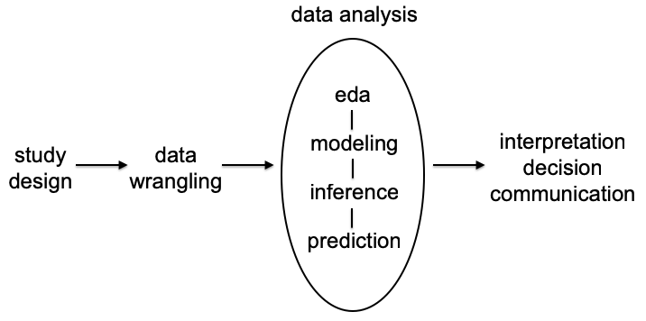

# (PART) Introduction {-}

# Statistics, Machine Learning, and Data Science {#stat_ml_ds}

## Statistics

**Statistics** is the study of the collection, analysis, interpretation, presentation, and organization of data.

<https://en.wikipedia.org/wiki/Statistics>

## Applied Statistics

**Applied Statistics** is concerned with the practical considerations and implementations needed to carry out a statistical analysis.

## Machine Learning

**Machine learning** explores the study and construction of algorithms that can learn from and make predictions on data. Machine learning is closely related to and often overlaps with computational statistics; a discipline which also focuses in prediction-making through the use of computers. 

<https://en.wikipedia.org/wiki/Machine_learning>

## Data Science

**Data Science** is an interdisciplinary field about processes and systems to extract knowledge or insights from data in various forms, either structured or unstructured, which is a continuation of some of the data analysis fields such as statistics, data mining, and predictive analytics.

<https://en.wikipedia.org/wiki/Data_science>

*So what is Data Science?*

- *Data Science* is a very new term

- No well-accepted definition

- Statistics, machine learning, and data science are all essentially about extracting knowledge or value from data

- DS deals with data in the following ways: collecting, storing, managing, wrangling, exploration, learning, discovery, communication, products

## Some History

### John Tukey

John Tukey pioneered a field called "exploratory data analysis" (EDA)

From [The Future of Data Analysis](https://projecteuclid.org/euclid.aoms/1177704711) (1962) *Annals of Mathematical Statistics* ...

> For a long time I have thought I was a statistician, interested in inferences from the particular to the general. But as I have watched mathematical statistics evolve, I have had cause to wonder and to doubt.

> All in all, I have come to feel that my central interest is in data analysis, which I take to include, among other things: procedures for analyzing data, techniques for interpreting the results of such procedures, ways of planning the gathering of data to make its analysis easier, more precise or more accurate, and all the machinery and results of (mathematical) statistics which apply to analyzing data.

> Data analysis is a larger and more varied field than inference, or incisive procedures, or allocation.

### Jeff Wu

> In November 1997, C.F. Jeff Wu gave the inaugural lecture entitled "Statistics = Data Science?". In this lecture, he characterized statistical work as a trilogy of data collection, data modeling and analysis, and decision making. In his conclusion, he initiated the modern, non-computer science, usage of the term "data science" and advocated that statistics be renamed data science and statisticians data scientists.

<https://en.wikipedia.org/wiki/Data_science>

### William Cleveland

 - In 2001, William Cleveland introduced data science as an independent discipline, extending the field of statistics to incorporate "advances in computing with data" in his article [Data Science: An Action Plan for Expanding the Technical Areas of the Field of Statistics](http://onlinelibrary.wiley.com/doi/10.1111/j.1751-5823.2001.tb00477.x/abstract) in  *International Statistical Review*

- Cleveland establishes six technical areas which he believed to encompass the field of data science

<https://en.wikipedia.org/wiki/Data_science>

## Statistics $\rightarrow$ Data Science

Cleveland's six area to extend statistics to data science:

1. multidisciplinary investigations
2. models and methods for data
3. computing with data
4. pedagogy
5. tool evaluation
6. theory

## Industry

Individuals working in industry began to call themselves "data scientists" several years after statisticians had introduced the field.

- "In 2008, DJ Patil and Jeff Hammerbacher used the term 'data scientist' to define their jobs at LinkedIn and Facebook, respectively." <https://en.wikipedia.org/wiki/Data_science>

- The term "data scientist" is now often used to describe positions in industry that primarily involve data, whether it is statistics, machine learning, data curation, or other data-centric activities

# Components of Applied Statistics and Data Science {#challenges}

Let's first cosnider the central challenges of applied statistics, shown in the following schematic I'll call the "central dogma of applied statistics", shown in Figure \@ref(fig:central-dogma-statistics)

(\#fig:central-dogma-statistics)Central Dogma of Statistics

 
## Study Design

An applied statistics project is usually preceded by a scientific question that involves the collection and analysis of data.  The design of the data should involve careful application of statistical principles to design which data are to be collected and how the data will be measured.  The study design should also be driven by the questions that will be answered and the type of applied statistical analysis techniques will be employed.

Study design is an area that is almost solely studied by statisticians and it is one of the core strengths of the field of statistics.  We will be considering study design throughout this book.

## Data Wrangling {#data-wrangling-introduction-chapter}

Data wrangling is a new terms that refers to the process of converitng raw data, which is often very messy, into data that can be readily analyzed.  The importance of this activity has grown substantially in recent years as data sets have becoem larger and more comoplex. Data wrangling 

## Data Analysis

### Exploratory Data Analysis

### Modeling

### Inference

### Prediciton

## Communication

# Data Sets Used in this Book

