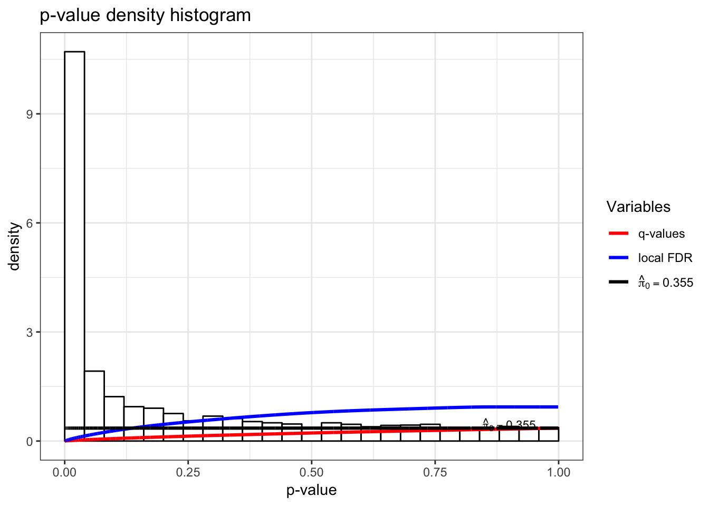
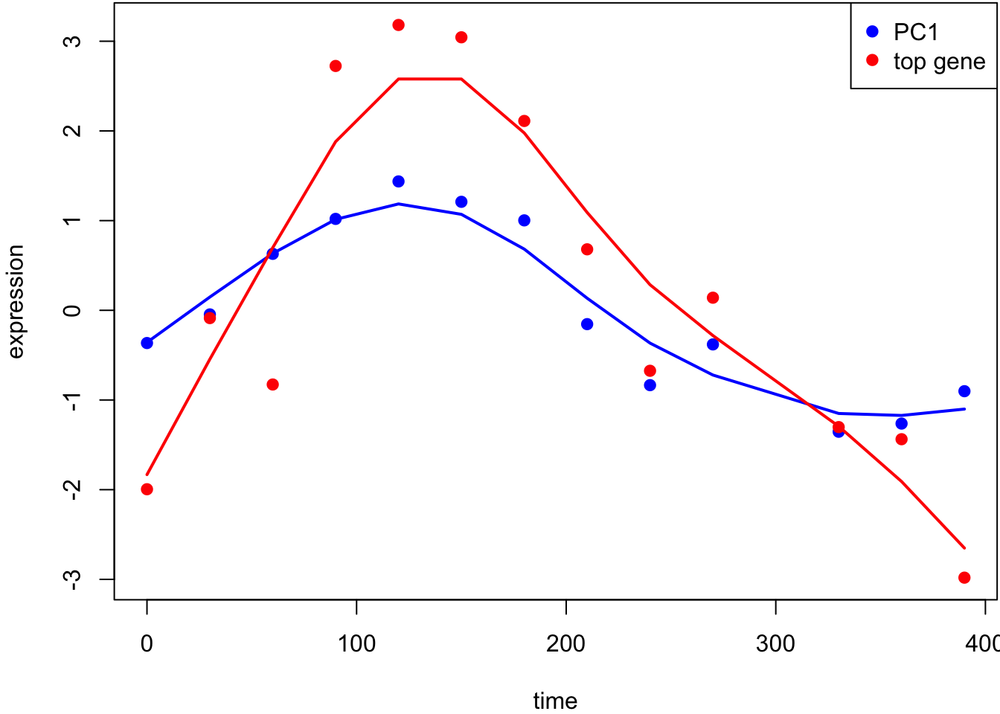
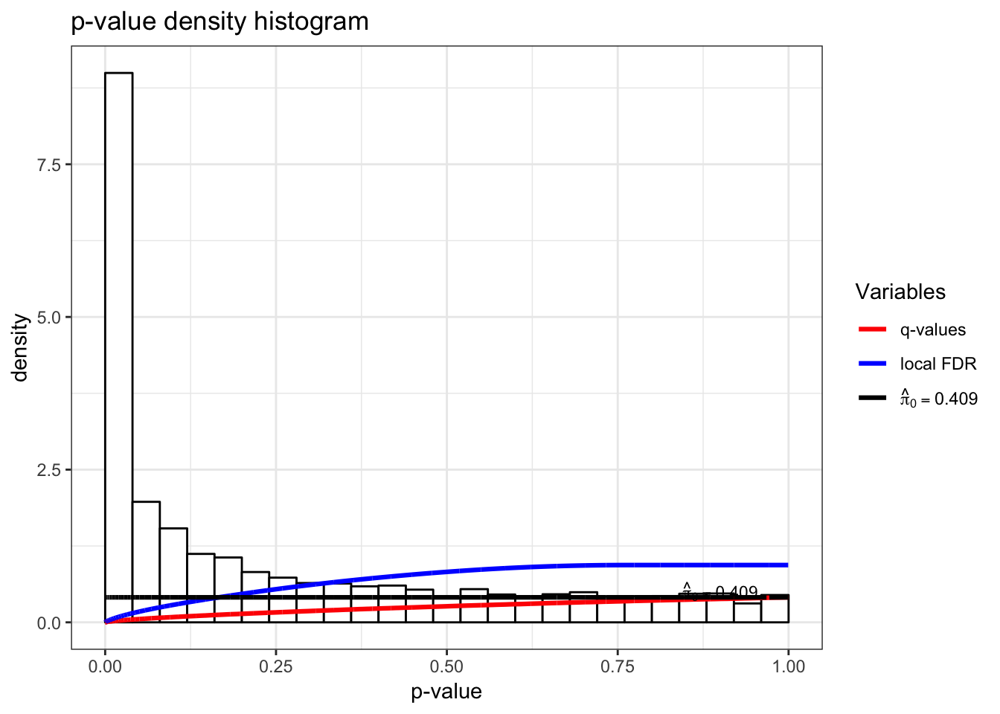
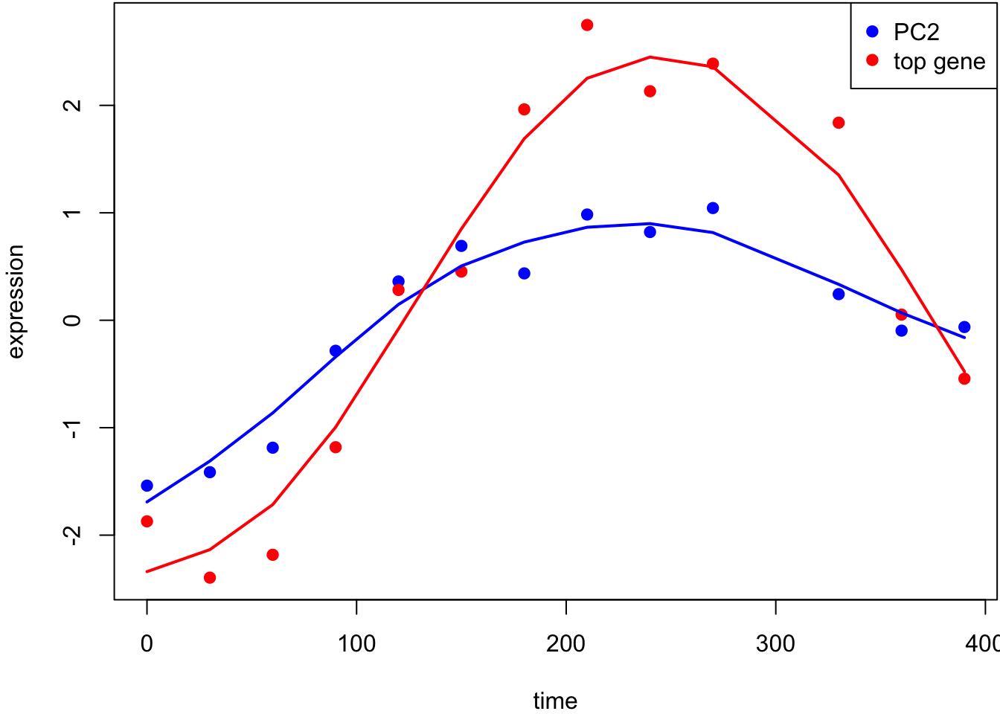
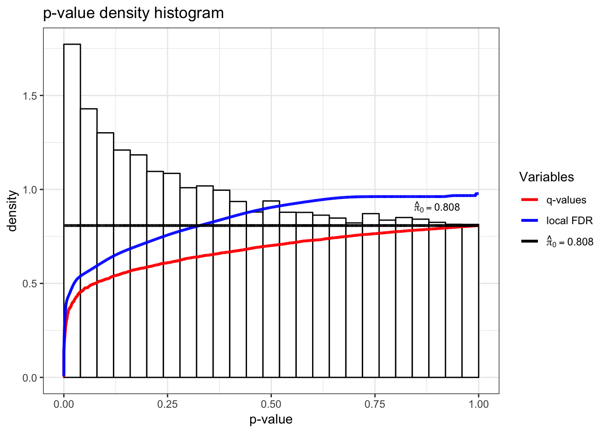
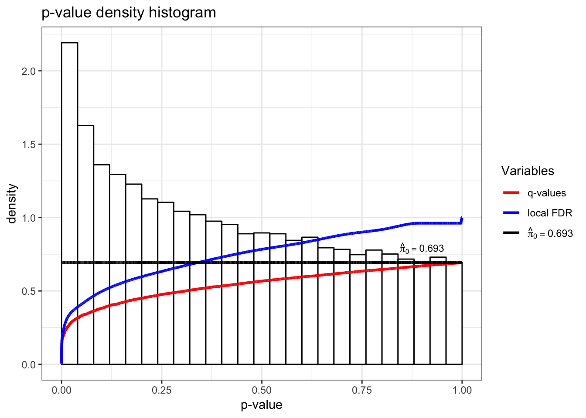
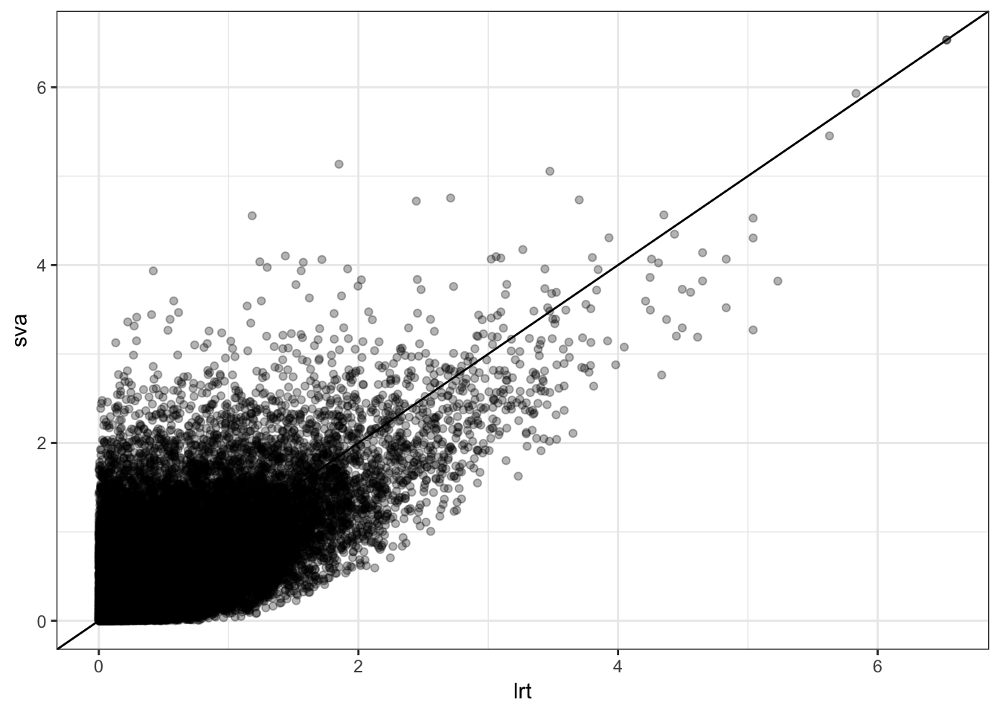

\providecommand{\E}{\operatorname{E}}
\providecommand{\V}{\operatorname{Var}}
\providecommand{\Cov}{\operatorname{Cov}}
\providecommand{\se}{\operatorname{se}}
\providecommand{\logit}{\operatorname{logit}}
\providecommand{\iid}{\; \stackrel{\text{iid}}{\sim}\;}
\providecommand{\asim}{\; \stackrel{.}{\sim}\;}
\providecommand{\xs}{x_1, x_2, \ldots, x_n}
\providecommand{\Xs}{X_1, X_2, \ldots, X_n}
\providecommand{\bB}{\boldsymbol{B}}
\providecommand{\bb}{\boldsymbol{\beta}}
\providecommand{\bx}{\boldsymbol{x}}
\providecommand{\bX}{\boldsymbol{X}}
\providecommand{\by}{\boldsymbol{y}}
\providecommand{\bY}{\boldsymbol{Y}}
\providecommand{\bz}{\boldsymbol{z}}
\providecommand{\bZ}{\boldsymbol{Z}}
\providecommand{\be}{\boldsymbol{e}}
\providecommand{\bE}{\boldsymbol{E}}
\providecommand{\bs}{\boldsymbol{s}}
\providecommand{\bS}{\boldsymbol{S}}
\providecommand{\bP}{\boldsymbol{P}}
\providecommand{\bI}{\boldsymbol{I}}
\providecommand{\bD}{\boldsymbol{D}}
\providecommand{\bd}{\boldsymbol{d}}
\providecommand{\bW}{\boldsymbol{W}}
\providecommand{\bw}{\boldsymbol{w}}
\providecommand{\bM}{\boldsymbol{M}}
\providecommand{\bPhi}{\boldsymbol{\Phi}}
\providecommand{\bphi}{\boldsymbol{\phi}}
\providecommand{\bN}{\boldsymbol{N}}
\providecommand{\bR}{\boldsymbol{R}}
\providecommand{\bu}{\boldsymbol{u}}
\providecommand{\bU}{\boldsymbol{U}}
\providecommand{\bv}{\boldsymbol{v}}
\providecommand{\bV}{\boldsymbol{V}}
\providecommand{\bO}{\boldsymbol{0}}
\providecommand{\bOmega}{\boldsymbol{\Omega}}
\providecommand{\bLambda}{\boldsymbol{\Lambda}}
\providecommand{\bSig}{\boldsymbol{\Sigma}}
\providecommand{\bSigma}{\boldsymbol{\Sigma}}
\providecommand{\bt}{\boldsymbol{\theta}}
\providecommand{\bT}{\boldsymbol{\Theta}}
\providecommand{\bpi}{\boldsymbol{\pi}}
\providecommand{\argmax}{\text{argmax}}
\providecommand{\KL}{\text{KL}}
\providecommand{\fdr}{{\rm FDR}}
\providecommand{\pfdr}{{\rm pFDR}}
\providecommand{\mfdr}{{\rm mFDR}}
\providecommand{\bh}{\hat}
\providecommand{\dd}{\lambda}
\providecommand{\q}{\operatorname{q}}


# (PART) Latent Variable Models  {-}

# HD Latent Variable Models

## Definition

Latent variables (or hidden variables) are random variables that are present in the underlying probabilistic model of the data, but they are unobserved.

In high-dimensional data, there may be latent variables present that affect many variables simultaneously.

These are latent variables that induce **systematic variation**.  A topic of much interest is how to estimate these and incorporate them into further HD inference procedures.

## Model

Suppose we have observed data $\bY_{m \times n}$ of $m$ variables with $n$ observations each.  Suppose there are $r$ latent variables contained in the $r$ rows of $\bZ_{r \times n}$ where

$$
\E\left[\bY_{m \times n} \left. \right| \bZ_{r \times n} \right] = \bPhi_{m \times r} \bZ_{r \times n}.
$$

Let's also assume that $m \gg n > r$.  The latent variables $\bZ$ induce systematic variation in variable $\by_i$ parameterized by $\bphi_i$ for $i = 1, 2, \ldots, m$.

## Estimation

There exist methods for estimating the row space of $\bZ$ with probability 1 as $m \rightarrow \infty$ for a fixed $n$ in two scenarios.

[Leek (2011)](http://onlinelibrary.wiley.com/doi/10.1111/j.1541-0420.2010.01455.x/abstract) shows how to do this when $\by_i | \bZ \sim \text{MVN}(\bphi_i \bZ, \sigma^2_i \bI)$, and the $\by_i | \bZ$ are jointly independent.   

[Chen and Storey (2015)](https://arxiv.org/abs/1510.03497) show how to do this when the $\by_i | \bZ$ are distributed according to a single parameter exponential family distribution with mean $\bphi_i \bZ$, and the $\by_i | \bZ$ are jointly independent.

# Jackstraw

Suppose we have a reasonable method for estimating $\bZ$ in the model

$$
\E\left[\bY \left. \right| \bZ \right] = \bPhi \bZ.
$$

The **jackstraw** method allows us to perform hypothesis tests of the form

$$
H_0: \bphi_i = \bO \mbox{ vs } H_1: \bphi_i \not= \bO.
$$

We can also perform this hypothesis test on any subset of the columns of $\bPhi$.

This is a challening problem because we have to "double dip" in the data $\bY$, first to estimate $\bZ$, and second to perform significance tests on $\bPhi$.

## Procedure

The first step is to form estimate $\hat{\bZ}$ and then test statistic $t_i$ that performs the hypothesis test for each $\bphi_i$  from $\by_i$ and $\hat{\bZ}$ ($i=1, \ldots, m$).  Assume that the larger $t_i$ is, the more evidence there is against the null hypothesis in favor of the alternative.

Next we randomly select $s$ rows of $\bY$ and permute them to create data set $\bY^{0}$.  Let this set of $s$ variables be indexed by $\mathcal{S}$.  This breaks the relationship between $\by_i$ and $\bZ$, thereby inducing a true $H_0$, for each $i \in \mathcal{S}$.


We estimate $\hat{\bZ}^{0}$ from $\bY^{0}$ and again obtain test statistics $t_i^{0}$.  Specifically, the test statistics $t_i^{0}$ for $i \in \mathcal{S}$ are saved as draws from the null distribution.

We repeat permutation procedure $B$ times, and then utilize all saved $sB$ permutation null statistics to calculate empirical p-values:

$$
p_i = \frac{1}{sB} \sum_{b=1}^B \sum_{k \in \mathcal{S}_b} 1\left(t_i \geq  t_k^{0b} \right).
$$

## Example: Yeast Cell Cycle

Recall the yeast cell cycle data from earlier.  We will test which genes have expression significantly associated with PC1 and PC2 since these both capture cell cycle regulation.


```r
> load("./data/spellman.RData")
> time
 [1]   0  30  60  90 120 150 180 210 240 270 330 360 390
> dim(gene_expression)
[1] 5981   13
> dat <- t(scale(t(gene_expression), center=TRUE, scale=FALSE))
```


Test for associations between PC1 and each gene, conditioning on PC1 and PC2 being relevant sources of systematic variation.


```r
> jsobj <- jackstraw_pca(dat, r1=1, r=2, B=500, s=50, verbose=FALSE)
> jsobj$p.value %>% qvalue() %>% hist()
```




This is the most significant gene plotted with PC1.




Test for associations between PC2 and each gene, conditioning on PC1 and PC2 being relevant sources of systematic variation.


```r
> jsobj <- jackstraw_pca(dat, r1=2, r=2, B=500, s=50, verbose=FALSE)
> jsobj$p.value %>% qvalue() %>% hist()
```




This is the most significant gene plotted with PC2.



# Surrogate Variable Analysis

The **surrogate variable analysis** (SVA) model combines the many responses model with the latent variable model introduced above:

$$
\bY_{m \times n} = \bB_{m \times d} \bX_{d \times n} + \bPhi_{m \times r} \bZ_{r \times n} + \bE_{m \times n}
$$

where $m \gg n > d + r$.

Here, only $\bY$ and $\bX$ are observed, so we must combine many regressors model fitting techniques with latent variable estimation.

The variables $\bZ$ are called **surrogate variables** for what would be a complete model of all systematic variation.

## Procedure

The main challenge is that the row spaces of $\bX$ and $\bZ$ may overlap.  Even when $\bX$ is the result of a randomized experiment, there will be a high probability that the row spaces of $\bX$ and $\bZ$ have some overlap.

Therefore, one cannot simply estimate $\bZ$ by applying a latent variable esitmation method on the residuals $\bY - \hat{\bB} \bX$ or on the observed response data $\bY$.  In the former case, we will only estimate $\bZ$ in the space orthogonal to $\hat{\bB} \bX$.  In the latter case, the estimate of $\bZ$ may modify the signal we can estimate in $\bB \bX$.


A [recent method](http://dx.doi.org/10.1080/01621459.2011.645777), takes an EM approach to esitmating $\bZ$ in the model 

$$
\bY_{m \times n} = \bB_{m \times d} \bX_{d \times n} + \bPhi_{m \times r} \bZ_{r \times n} + \bE_{m \times n}.
$$

It is shown to be necessary to penalize the likelihood in the estimation of $\bB$ --- i.e., form shrinkage estimates of $\bB$ --- in order to properly balance the row spaces of $\bX$ and $\bZ$.


The regularized EM algorithm, called **cross-dimensonal inference** (CDI) iterates between

1. Estimate $\bZ$ from $\bY - \hat{\bB}^{\text{Reg}} \bX$
2. Estimate $\bB$ from $\bY - \hat{\bPhi} \hat{\bZ}$

where $\hat{\bB}^{\text{Reg}}$ is a regularized or shrunken estimate of $\bB$.

It can be shown that when the regularization can be represented by a prior distribution on $\bB$ then this algorithm achieves the MAP.


## Example: Kidney Expr by Age

In [Storey et al. (2005)](http://www.pnas.org/content/102/36/12837.full), we considered a study where kidney samples were obtained on individuals across a range of ages.  The goal was to identify genes with expression associated with age.


```r
> library(edge)
> library(splines)
> load("./data/kidney.RData")
> age <- kidcov$age
> sex <- kidcov$sex
> dim(kidexpr)
[1] 34061    72
> cov <- data.frame(sex = sex, age = age)
> null_model <- ~sex
> full_model <- ~sex + ns(age, df = 3)
```


```r
> de_obj <- build_models(data = kidexpr, cov = cov, 
+                        null.model = null_model, 
+                        full.model = full_model)
> de_lrt <- lrt(de_obj, nullDistn = "bootstrap", bs.its = 100, verbose=FALSE)
> qobj1 <- qvalueObj(de_lrt)
> hist(qobj1)
```




Now that we have completed a standard generalized LRT, let's estimate $\bZ$ (the surrogate variables) using the `sva` package as accessed via the `edge` package.


```r
> dim(nullMatrix(de_obj))
[1] 72  2
> de_sva <- apply_sva(de_obj, n.sv=4, method="irw", B=10)
Number of significant surrogate variables is:  4 
Iteration (out of 10 ):1  2  3  4  5  6  7  8  9  10  
> dim(nullMatrix(de_sva))
[1] 72  6
> de_svalrt <- lrt(de_sva, nullDistn = "bootstrap", bs.its = 100, verbose=FALSE)
```


```r
> qobj2 <- qvalueObj(de_svalrt)
> hist(qobj2)
```




```r
> summary(qobj1)

Call:
qvalue(p = pval)

pi0:	0.8059662	

Cumulative number of significant calls:

          <1e-04 <0.001 <0.01 <0.025 <0.05 <0.1    <1
p-value       28    175   879   1802  3064 5431 34061
q-value        0      0     2      4    16   30 34061
local FDR      0      0     2      2     8   21 34061
```


```r
> summary(qobj2)

Call:
qvalue(p = pval)

pi0:	0.6708454	

Cumulative number of significant calls:

          <1e-04 <0.001 <0.01 <0.025 <0.05 <0.1    <1
p-value       26    151  1022   2081  3635 6279 34061
q-value        0      0     0      3     4   47 34061
local FDR      0      0     0      1     3   28 34049
```


P-values from two analyses are fairly different.


```r
> data.frame(lrt=-log10(qobj1$pval), sva=-log10(qobj2$pval)) %>% 
+   ggplot() + geom_point(aes(x=lrt, y=sva), alpha=0.3) + geom_abline()
```


