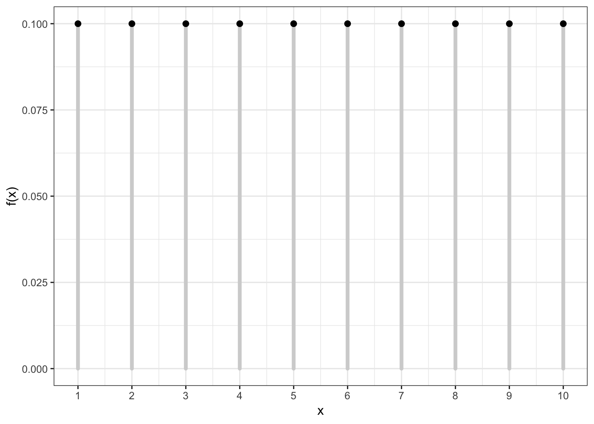

\providecommand{\E}{\operatorname{E}}
\providecommand{\V}{\operatorname{Var}}
\providecommand{\Cov}{\operatorname{Cov}}
\providecommand{\se}{\operatorname{se}}
\providecommand{\logit}{\operatorname{logit}}
\providecommand{\iid}{\; \stackrel{\text{iid}}{\sim}\;}
\providecommand{\asim}{\; \stackrel{.}{\sim}\;}
\providecommand{\xs}{x_1, x_2, \ldots, x_n}
\providecommand{\Xs}{X_1, X_2, \ldots, X_n}
\providecommand{\bB}{\boldsymbol{B}}
\providecommand{\bb}{\boldsymbol{\beta}}
\providecommand{\bx}{\boldsymbol{x}}
\providecommand{\bX}{\boldsymbol{X}}
\providecommand{\by}{\boldsymbol{y}}
\providecommand{\bY}{\boldsymbol{Y}}
\providecommand{\bz}{\boldsymbol{z}}
\providecommand{\bZ}{\boldsymbol{Z}}
\providecommand{\be}{\boldsymbol{e}}
\providecommand{\bE}{\boldsymbol{E}}
\providecommand{\bs}{\boldsymbol{s}}
\providecommand{\bS}{\boldsymbol{S}}
\providecommand{\bP}{\boldsymbol{P}}
\providecommand{\bI}{\boldsymbol{I}}
\providecommand{\bD}{\boldsymbol{D}}
\providecommand{\bd}{\boldsymbol{d}}
\providecommand{\bW}{\boldsymbol{W}}
\providecommand{\bw}{\boldsymbol{w}}
\providecommand{\bM}{\boldsymbol{M}}
\providecommand{\bPhi}{\boldsymbol{\Phi}}
\providecommand{\bphi}{\boldsymbol{\phi}}
\providecommand{\bN}{\boldsymbol{N}}
\providecommand{\bR}{\boldsymbol{R}}
\providecommand{\bu}{\boldsymbol{u}}
\providecommand{\bU}{\boldsymbol{U}}
\providecommand{\bv}{\boldsymbol{v}}
\providecommand{\bV}{\boldsymbol{V}}
\providecommand{\bO}{\boldsymbol{0}}
\providecommand{\bOmega}{\boldsymbol{\Omega}}
\providecommand{\bLambda}{\boldsymbol{\Lambda}}
\providecommand{\bSig}{\boldsymbol{\Sigma}}
\providecommand{\bSigma}{\boldsymbol{\Sigma}}
\providecommand{\bt}{\boldsymbol{\theta}}
\providecommand{\bT}{\boldsymbol{\Theta}}
\providecommand{\bpi}{\boldsymbol{\pi}}
\providecommand{\argmax}{\text{argmax}}
\providecommand{\KL}{\text{KL}}
\providecommand{\fdr}{{\rm FDR}}
\providecommand{\pfdr}{{\rm pFDR}}
\providecommand{\mfdr}{{\rm mFDR}}
\providecommand{\bh}{\hat}
\providecommand{\dd}{\lambda}
\providecommand{\q}{\operatorname{q}}


# (PART) Probability {-}


# Probability and Statistics

Probabilistic modeling and/or statistical inference are required when the goals include:

1.  Characterizing randomness or "noise" in the data
2.  Quantifying uncertainty in models we build or decisions we make from the data
3.  Predicting future observations or decisions in the face of uncertainty

## Central Dogma of Inference

<div class="figure" style="text-align: center">

<p class="caption">(\#fig:central-dogma-inference-1)Central Dogma of Statistical Inference</p>
</div>


## Data Analysis Without Probability

It is possible to do data analysis without probability and formal statistical inference:  

- Descriptive statistics can be reported without utilizing probability and statistical inference
- Exploratory data analysis and visualization tend to not involve probability or formal statistical inference
- Important problems in machine learning do not involve probability or statistical inference.

# Probability Theory

## Sample Space

- The **sample space** $\Omega$ is the set of all **outcomes**
- We are interested in calculating probabilities on relevant subsets of this space, called **events**: $A \subseteq \Omega$
- Examples ---
    - Two coin flips: $\Omega =$ {HH, HT, TH, TT}
    - SNP genotypes: $\Omega =$ {AA, AT, TT}
    - Amazon product rating: $\Omega =$ {1 star, 2 stars, ..., 5 stars}
    - Political survey: $\Omega =$ {agree, disagree}
 
## Measure Theoretic Probabilty

$$(\Omega, \mathcal{F}, \Pr)$$

- $\Omega$ is the sample space
- $\mathcal{F}$ is the $\sigma$-algebra of events where probability can be measured 
- $\Pr$ is the probability measure

## Mathematical Probability

A proper mathematical formulation of a probability measure should include the following properties:

1. The probability of any even $A$ is such that $0 \leq \Pr(A) \leq 1$
2. If $\Omega$ is the sample space then $\Pr(\Omega)=1$
3. Let $A^c$ be all outcomes from $\Omega$ that are not in $A$ (called the *complement*); then $\Pr(A) + \Pr(A^c) = 1$
4. For any $n$ events such that $A_i \cap A_j = \varnothing$ for all $i \not= j$, then $\Pr\left( \cup_{i=1}^n A_i \right) = \sum_{i=1}^n \Pr(A_i)$, where $\varnothing$ is the empty set

## Union of Two Events

The probability of two events are calculated by the following general relationship:

$$\Pr(A \cup B) = \Pr(A) + \Pr(B) - \Pr(A \cap B)$$

where we note that $\Pr(A \cap B)$ gets counted twice in $\Pr(A) + \Pr(B)$.

## Conditional Probability

An important calclation in probability and statistics is the conditional probability.  We can consider the probability of an event $A$, conditional on the fact that we are restricted to be within event $B$.  This is defined as:

$$\Pr(A | B) = \frac{\Pr(A \cap B)}{\Pr(B)}$$

## Independence

Two events $A$ and $B$ by definition independent when:

- $\Pr(A | B) = \Pr(A)$
- $\Pr(B | A) = \Pr(B)$
- $\Pr(A \cap B) = \Pr(A) \Pr(B)$

All three of these are equivalent.

## Bayes Theorem

A common approach in statistics is to obtain a conditional probability of two events through the opposite conditional probability and their marginal probability. This is called Bayes Theorem:

$$\Pr(B | A) = \frac{\Pr(A | B)\Pr(B)}{\Pr(A)}$$

This forms the basis of *Bayesian Inference* but has more general use in carrying out probability calculations.

## Law of Total Probability

For events $A_1, \ldots, A_n$ such that $A_i \cap A_j = \varnothing$ for all $i \not= j$ and $\cup_{i=1}^n A_i = \Omega$, it follows that for any event $B$:

$$\Pr(B) = \sum_{i=1}^n \Pr(B | A_i) \Pr(A_i).$$

# Random Variables

## Definition

A random variable $X$ is a function from $\Omega$ to the real numbers:

$$X: \Omega \rightarrow \mathbb{R}$$

For any outcome in $\Omega$, the function $X(\omega)$ produces a real value.

We will write the range of $X$ as

$$\mathcal{R} = \{X(\omega): \omega \in \Omega\}$$

where $\mathcal{R} \subseteq \mathbb{R}$.

## Distributon of RV

We define the probability distribution of a random variable through its **probability mass function** (pmf) for discrete rv's or its **probability density function** (pdf) for continuous rv's.  

We can also define the distribution through its **cumulative distribution function** (cdf).  The pmf/pdf determines the cdf, and vice versa.

## Discrete Random Variables

A discrete rv $X$ takes on a discrete set of values such as $\{1, 2, \ldots, n\}$ or $\{0, 1, 2, 3, \ldots \}$. 

Its distribution is characterized by its pmf 
$$f(x) = \Pr(X = x)$$ 
for $x \in \{X(\omega): \omega \in \Omega \}$ and $f(x) = 0$ otherwise.

Its cdf is 
$$F(y) = \Pr(X \leq y) = \sum_{x \leq y} \Pr(X = x)$$
for $y \in \mathbb{R}$.

## Example: Discrete PMF


## Example: Discrete CDF


## Probabilities of Events Via Discrete CDF

Examples: 

| Probability | CDF   | PMF   |
| :---------- | :---- | :---- |
| $\Pr(X \leq b)$ | $F(b)$ | $\sum_{x \leq b} f(x)$ |
| $\Pr(X \geq a)$ | $1-F(a-1)$ | $\sum_{x \geq a} f(x)$ |
| $\Pr(X > a)$ | $1-F(a)$ | $\sum_{x > a} f(x)$ |
| $\Pr(a \leq X \leq b)$ | $F(b) - F(a-1)$ | $\sum_{a \leq x \leq b} f(x)$ |
| $\Pr(a < X \leq b)$ | $F(b) - F(a)$ | $\sum_{a < x \leq b} f(x)$ |


## Continuous Random Variables

A continuous rv $X$ takes on a continuous set of values such as $[0, \infty)$ or $\mathbb{R} = (-\infty, \infty)$.

The probability that $X$ takes on any specific value is 0; but the probability it lies within an interval can be non-zero.  Its pdf $f(x)$ therefore gives an infinitesimal, local, relative probability.

Its cdf is
$$F(y) = \Pr(X \leq y) = \int_{-\infty}^y f(x) dx$$
for $y \in \mathbb{R}$.

## Example: Continuous PDF


## Example: Continuous CDF


## Probabilities of Events Via Continuous CDF

Examples: 

| Probability | CDF   | PDF   |
| :---------- | :---- | :---- |
| $\Pr(X \leq b)$ | $F(b)$ | $\int_{-\infty}^{b} f(x) dx$ |
| $\Pr(X \geq a)$ | $1-F(a)$ | $\int_{a}^{\infty} f(x) dx$ |
| $\Pr(X > a)$ | $1-F(a)$ | $\int_{a}^{\infty} f(x) dx$ |
| $\Pr(a \leq X \leq b)$ | $F(b) - F(a)$ | $\int_{a}^{b} f(x) dx$ |
| $\Pr(a < X \leq b)$ | $F(b) - F(a)$ | $\int_{a}^{b} f(x) dx$ |

## Example: Continuous RV Event


## Note on PMFs and PDFs

PMFs and PDFs are defined as $f(x)=0$ outside of the range of $X$, $\mathcal{R} = \{X(\omega): \omega \in \Omega\}$. That is: 

Also, they sum or integrate to 1:

$$\sum_{x \in \mathcal{R}} f(x) = 1$$

$$\int_{x \in \mathcal{R}} f(x) dx = 1$$

Using measure theory, we can consider both types of rv's in one framework, and we would write:
$$\int_{-\infty}^{\infty} dF(x) = 1$$

## Note on CDFs

Properties of all cdf's, regardless of continuous or discrete underlying rv:

- They are right continuous with left limits
- $\lim_{x \rightarrow \infty} F(x) = 1$
- $\lim_{x \rightarrow -\infty} F(x) = 0$
- The right derivative of $F(x)$ equals $f(x)$

## Sample Vs Population Statistics

We earlier discussed measures of center and spread for a set of data, such as the mean and the variance.  

Analogous measures exist for probability distributions.  

These are distinguished by calling those on data "sample" measures (e.g., sample mean) and those on probability distributions "population" measures (e.g., population mean).  

## Expected Value

The **expected value**, also called the "population mean", is a measure of center for a rv.  It is calculated in a fashion analogous to the sample mean:

\begin{align*}
& \operatorname{E}[X] = \sum_{x \in \mathcal{R}} x \  f(x) & \mbox{(discrete)} \\
& \operatorname{E}[X] = \int_{-\infty}^{\infty} x \  f(x) \  dx & \mbox{(continuous)} \\
& \operatorname{E}[X] = \int_{-\infty}^{\infty} x \  dF(x) & \mbox{(general)}
\end{align*}

## Variance

The **variance**, also called the "population variance", is a measure of spread for a rv.  It is calculated in a fashion analogous to the sample variance:

$$\V(X) = \E \left[\left(X-\E[X]\right)^2\right] = \E[X^2] - E[X]^2$$
$${\rm SD}(X) = \sqrt{\V(X)}$$

$$\V(X) = \sum_{x \in \mathcal{R}} \left(x-\E[X]\right)^2 \ f(x) \ \ \ \ \mbox{(discrete)}$$

$$\V(X) = \int_{-\infty}^{\infty} \left(x-\E[X]\right)^2 \ f(x) \  dx \ \ \ \ \mbox{(continuous)}$$

## Covariance

The **covariance**, also called the "population covariance", measures how two rv's covary.  It is calculated in a fashion analogous to the sample covariance:

$$\Cov(X, Y) = \operatorname{E} \left[ (X - \operatorname{E}[X]) (Y - \operatorname{E}[Y]) \right]$$

Note that $\Cov(X, X) = \V(X)$.

## Correlation

The population **correlation** is calculated analogously to the sample correlation:

$$\operatorname{Cor}(X, Y) = \frac{\Cov(X, Y)}{\operatorname{SD}(X)\operatorname{SD}(Y)}$$

## Moment Generating Functions

The **moment generating function** (mgf) of a rv is defined to be

$$m(t) = \operatorname{E}\left[e^{tX}\right]$$

whenever this expecation exists.

Under certain conditions, the **moments** of a rv can then be obtained by:

$$\operatorname{E} \left[ X^k \right] = \frac{d^k}{dt^k}m(0).$$

## Random Variables in R

The pmf/pdf, cdf, quantile function, and random number generator for many important random variables are built into R.  They all follow the form, where `<name>` is replaced with the name used in R for each specific distribution:

- `d<name>`: pmf or pdf
- `p<name>`: cdf
- `q<name>`: quantile function or inverse cdf
- `r<name>`: random number generator

To see a list of random variables, type `?Distributions` in R. 

# Discrete RVs

## Uniform (Discrete)

This simple rv distribution assigns equal probabilities to a finite set of values:

$$X \sim \mbox{Uniform}\{1, 2, \ldots, n\}$$

$$\mathcal{R} = \{1, 2, \ldots, n\}$$

$$f(x; n) = 1/n \mbox{ for } x \in \mathcal{R}$$

$$\E[X] = \frac{n+1}{2}, \ \V(X) = \frac{n^2-1}{12}$$

## Uniform (Discrete) PMF




## Uniform (Discrete) in R

There is no family of functions built into R for this distribution since it is so simple.  However, it is possible to generate random values via the `sample` function:


```r
> n <- 20L
> sample(x=1:n, size=10, replace=TRUE)
 [1]  8 19  4  1 18 15 18 18  2  7
> 
> x <- sample(x=1:n, size=1e6, replace=TRUE)
> mean(x) - (n+1)/2
[1] 0.006991
> var(x) - (n^2-1)/12
[1] 0.0208284
```

## Bernoulli

A single success/failure event, such as heads/tails when flipping a coin or survival/death.

$$X \sim \mbox{Bernoulli}(p)$$

$$\mathcal{R} = \{0, 1\}$$

$$f(x; p) = p^x (1-p)^{1-x} \mbox{ for } x \in \mathcal{R}$$

$$\E[X] = p, \ \V(X) = p(1-p)$$

## Binomial

An extension of the Bernoulli distribution to simultaneously considering $n$ independent success/failure trials and counting the number of successes.

$$X \sim \mbox{Binomial}(n, p)$$

$$\mathcal{R} = \{0, 1, 2, \ldots, n\}$$

$$f(x; p) = {n \choose x} p^x (1-p)^{n-x} \mbox{ for } x \in \mathcal{R}$$

$$\E[X] = np, \ \V(X) = np(1-p)$$

Note that ${n \choose x} = \frac{n!}{x! (n-x)!}$ is the number of unique ways to choose $x$ items from $n$ without respect to order.

## Binomial PMF


## Binomial in R


```r
> str(dbinom)
function (x, size, prob, log = FALSE)  
```


```r
> str(pbinom)
function (q, size, prob, lower.tail = TRUE, log.p = FALSE)  
```


```r
> str(qbinom)
function (p, size, prob, lower.tail = TRUE, log.p = FALSE)  
```


```r
> str(rbinom)
function (n, size, prob)  
```

## Poisson

Models the number of occurrences of something within a defined time/space period, where the occurrences are independent. Examples: the number of lightning strikes on campus in a given year; the number of emails received on a given day.

$$X \sim \mbox{Poisson}(\lambda)$$

$$\mathcal{R} = \{0, 1, 2, 3, \ldots \}$$

$$f(x; \lambda) = \frac{\lambda^x e^{-\lambda}}{x!} \mbox{ for } x \in \mathcal{R}$$

$$\E[X] = \lambda, \ \V(X) = \lambda$$

## Poisson PMF


## Poisson in R


```r
> str(dpois)
function (x, lambda, log = FALSE)  
```


```r
> str(ppois)
function (q, lambda, lower.tail = TRUE, log.p = FALSE)  
```


```r
> str(qpois)
function (p, lambda, lower.tail = TRUE, log.p = FALSE)  
```


```r
> str(rpois)
function (n, lambda)  
```

# Continuous RVs

## Uniform (Continuous)

Models the scenario where all values in the unit interval [0,1] are equally likely.

$$X \sim \mbox{Uniform}(0,1)$$

$$\mathcal{R} = [0,1]$$

$$f(x) = 1 \mbox{ for } x \in \mathcal{R}$$

$$F(y) = y \mbox{ for } y \in \mathcal{R}$$

$$\E[X] = 1/2, \ \V(X) = 1/12$$

## Uniform (Continuous) PDF


## Uniform (Continuous) in R


```r
> str(dunif)
function (x, min = 0, max = 1, log = FALSE)  
```


```r
> str(punif)
function (q, min = 0, max = 1, lower.tail = TRUE, log.p = FALSE)  
```


```r
> str(qunif)
function (p, min = 0, max = 1, lower.tail = TRUE, log.p = FALSE)  
```


```r
> str(runif)
function (n, min = 0, max = 1)  
```

## Exponential

Models a time to failure and has a "memoryless property".  

$$X \sim \mbox{Exponential}(\lambda)$$

$$\mathcal{R} = [0, \infty)$$

$$f(x; \lambda) = \lambda e^{-\lambda x} \mbox{ for } x \in \mathcal{R}$$

$$F(y; \lambda) = 1 - e^{-\lambda y} \mbox{ for } y \in \mathcal{R}$$

$$\E[X] = \frac{1}{\lambda}, \ \V(X) = \frac{1}{\lambda^2}$$

## Exponential PDF


## Exponential in R


```r
> str(dexp)
function (x, rate = 1, log = FALSE)  
```


```r
> str(pexp)
function (q, rate = 1, lower.tail = TRUE, log.p = FALSE)  
```


```r
> str(qexp)
function (p, rate = 1, lower.tail = TRUE, log.p = FALSE)  
```


```r
> str(rexp)
function (n, rate = 1)  
```

## Beta

Yields values in $(0,1)$, so often used to generate random probabilities, such as the $p$ in Bernoulli$(p)$.

$$X \sim \mbox{Beta}(\alpha,\beta) \mbox{ where } \alpha, \beta > 0$$

$$\mathcal{R} = (0,1)$$

$$f(x; \alpha, \beta) = \frac{\Gamma(\alpha + \beta)}{\Gamma(\alpha) \Gamma(\beta)}x^{\alpha-1}(1-x)^{\beta - 1} \mbox{ for } x \in \mathcal{R}$$

where $\Gamma(z) = \int_{0}^{\infty} x^{z-1} e^{-x} dx$.

$$\E[X] = \frac{\alpha}{\alpha + 
\beta}, \ \V(X) = \frac{\alpha \beta}{(\alpha + \beta)^2 (\alpha + \beta + 1)}$$

## Beta PDF


## Beta in R


```r
> str(dbeta) #shape1=alpha, shape2=beta
function (x, shape1, shape2, ncp = 0, log = FALSE)  
```


```r
> str(pbeta)
function (q, shape1, shape2, ncp = 0, lower.tail = TRUE, log.p = FALSE)  
```


```r
> str(qbeta)
function (p, shape1, shape2, ncp = 0, lower.tail = TRUE, log.p = FALSE)  
```


```r
> str(rbeta)
function (n, shape1, shape2, ncp = 0)  
```


## Normal

Due to the Central Limit Theorem (covered later), this "bell curve" distribution is often observed in properly normalized real data.

$$X \sim \mbox{Normal}(\mu, \sigma^2)$$

$$\mathcal{R} = (-\infty, \infty)$$

$$f(x; \mu, \sigma^2) = \frac{1}{\sqrt{2 \pi \sigma^2}} e^{-\frac{(x-\mu)^2}{2 \sigma^2}} \mbox{ for } x \in \mathcal{R}$$

$$\E[X] = \mu, \ \V(X) = \sigma^2$$

## Normal PDF


## Normal in R


```r
> str(dnorm) #notice it requires the STANDARD DEVIATION, not the variance
function (x, mean = 0, sd = 1, log = FALSE)  
```


```r
> str(pnorm)
function (q, mean = 0, sd = 1, lower.tail = TRUE, log.p = FALSE)  
```


```r
> str(qnorm)
function (p, mean = 0, sd = 1, lower.tail = TRUE, log.p = FALSE)  
```


```r
> str(rnorm)
function (n, mean = 0, sd = 1)  
```

# Sums of Random Variables

## Linear Transformation of a RV

Suppose that $X$ is a random variable and that $a$ and $b$ are constants.  Then:

$$\E\left[a + bX \right] = a + b \E[X]$$

$$\V\left(a + bX \right) = b^2 \V(X)$$


## Sums of Independent RVs

If $X_1, X_2, \ldots, X_n$ are independent random variables, then:

$$\E\left[ \sum_{i=1}^n X_i \right] = \sum_{i=1}^n \E[X_i]$$

$$\V\left( \sum_{i=1}^n X_i \right) = \sum_{i=1}^n \V(X_i)$$

## Sums of Dependent RVs

If $X_1, X_2, \ldots, X_n$ are independent random variables, then:

$$\E\left[ \sum_{i=1}^n X_i \right] = \sum_{i=1}^n \E[X_i]$$

$$\V\left( \sum_{i=1}^n X_i \right) = \sum_{i=1}^n \V(X_i) + \sum_{i \not= j} \Cov(X_i, X_j)$$

## Means of Random Variables

Suppose $X_1, X_2, \ldots, X_n$ are independent and identically distributed (iid) random variables. Let $\overline{X}_n = \frac{1}{n} \sum_{i=1}^n X_i$ be their sample mean.  Then:

$$\E\left[\overline{X}_n \right] = \E[X_i]$$

$$\V\left(\overline{X}_n \right) = \frac{1}{n}\V(X_i)$$

# Convergence of Random Variables

## Sequence of RVs

Let $Z_1, Z_2, \ldots$ be an infinite sequence of rv's.  

An important example is

$$Z_n = \overline{X}_n = \frac{\sum_{i=1}^n X_i}{n}.$$

It is useful to be able to determine a limiting value or distribution of $\{Z_i\}$.

## Convergence in Distribution

$\{Z_i\}$ converges in distribution to $Z$, written

$$Z_n \stackrel{D}{\longrightarrow} Z$$ 

if

$$F_{Z_n}(y) = \Pr(Z_n \leq y) \rightarrow \Pr(Z \leq y) = F_{Z}(y)$$

as $n \rightarrow \infty$ for all $y \in \mathbb{R}$.

## Convergence in Probability

$\{Z_i\}$ converges in probability to $Z$, written

$$Z_n \stackrel{P}{\longrightarrow} Z$$ 

if

$$\Pr(|Z_n - Z| \leq \epsilon) \rightarrow 1$$

as $n \rightarrow \infty$ for all $\epsilon > 0$.

Note that it may also be the case that $Z_n \stackrel{P}{\longrightarrow} \theta$ for a fixed, nonrandom value $\theta$.

## Almost Sure Convergence

$\{Z_i\}$ converges almost surely (or "with probability 1") to $Z$, written

$$Z_n \stackrel{a.s.}{\longrightarrow} Z$$ 

if

$$\Pr\left(\{\omega: |Z_n(\omega) - Z(\omega)| \stackrel{n \rightarrow \infty}{\longrightarrow} 0 \}\right) = 1.$$

Note that it may also be the case that $Z_n \stackrel{a.s.}{\longrightarrow} \theta$ for a fixed, nonrandom value $\theta$.

## Strong Law of Large Numbers

Suppose $X_1, X_2, \ldots, X_n$ are iid rv's with population mean $\E[X_i] = \mu$ where $\E[|X_i|] < \infty$. Then

$$\overline{X}_n \stackrel{a.s.}{\longrightarrow} \mu.$$


## Central Limit Theorem

Suppose $X_1, X_2, \ldots, X_n$ are iid rv's with population mean $\E[X_i] = \mu$ and variance $\V(X_i) = \sigma^2$.  Then as $n \rightarrow \infty$,

$$\sqrt{n}(\overline{X}_n - \mu)  \stackrel{D}{\longrightarrow} \mbox{Normal}(0, \sigma^2)$$

$$\frac{\overline{X}_n - \mu}{\sigma/\sqrt{n}}  \stackrel{D}{\longrightarrow} \mbox{Normal}(0, 1)$$


## Example: Calculations

Let $X_1, X_2, \ldots, X_{40}$ be iid Poisson($\lambda$) with $\lambda=6$.

We will form $\sqrt{40}(\overline{X} - 6)$ over 10,000 realizations and compare their distribution to a Normal(0, 6) distribution.


```r
> x <- replicate(n=1e4, expr=rpois(n=40, lambda=6), 
+                simplify="matrix")
> x_bar <- apply(x, 2, mean)
> clt <- sqrt(40)*(x_bar - 6)
> 
> df <- data.frame(clt=clt, x = seq(-18,18,length.out=1e4), 
+                  y = dnorm(seq(-18,18,length.out=1e4), 
+                            sd=sqrt(6)))
```

## Example: Plot


```r
> ggplot(data=df) +
+   geom_histogram(aes(x=clt, y=..density..), color="blue", 
+                  fill="lightgray", binwidth=0.75) +
+   geom_line(aes(x=x, y=y), size=1.5)
```


# Joint Distributions

## Bivariate Random Variables

For a pair of rv's $X$ and $Y$ defined on the same probability space, we can define their joint pmf or pdf.  For the discrete case,

\begin{align*}
f(x, y) & = \Pr(\{\omega: X(\omega) = x\} \cap \{\omega: Y(\omega) = y\}) \\
\ & = \Pr(X=x, Y=y).
\end{align*}

The joint pdf is defined analogously for continuous rv's.  

## Events for Bivariate RVs

Let $A_x \times A_y \subseteq \mathbb{R} \times \mathbb{R}$ be an event.  Then $\Pr(X \in A_x, Y \in A_y)$ is calculated by:

\begin{align*}
& \sum_{x \in A_x} \sum_{y \in A_y} f(x, y) &  \mbox{(discrete)} \\
& \int_{x \in A_x} \int_{y \in A_y} f(x, y) dy dx & \mbox{(continuous)} \\
& \int_{x \in A_x} \int_{y \in A_y} dF_Y(y) dF_{X}(x) & \mbox{(general)}
\end{align*}

## Marginal Distributions

We can calculate the marginal distribution of $X$ (or $Y$) from their joint distribution:

$$f(x) = \sum_{y \in \mathcal{R}_y} f(x, y)$$

$$f(x) = \int_{-\infty}^{\infty} f(x, y) dy$$

## Independent Random Variables

Two rv's are independent when their joint pmf or pdf factor:

$$f(x,y) = f(x) f(y)$$

This means, for example, in the continuous case,

\begin{align*}
\Pr(X \in A_x, Y \in A_y) & = \int_{x \in A_x} \int_{y \in A_y} f(x, y) dy dx  \\
\ & = \int_{x \in A_x} \int_{y \in A_y} f(x) f(y) dy dx  \\
\ & = \Pr(X \in A_x) \Pr(Y \in A_y)
\end{align*}

## Conditional Distributions

We can define the conditional distribution of $X$ given $Y$ as follows.  The conditional rv $X | Y \sim F_{X|Y}$ with conditional pmf or pdf for $X | Y=y$ given by

$$
f(x | y) = \frac{f(x, y)}{f(y)}. 
$$

## Conditional Moments

The $k$th conditional moment (when it exists) is calculated by:

$$\E\left[X^k | Y=y\right] = \sum_{x \in \mathcal{R}_x} x^k f(x | y)$$

$$\E\left[X^k | Y=y\right] = \int_{-\infty}^{\infty} x^k f(x | y) dx$$

Note that $\E \left[X^k | Y\right]$ is a random variable that is a function of $Y$ whose distribution is determined by that of $Y$.

## Law of Total Variance

We can partition the variance of $X$ according to the following conditional calculations on $Y$:

$$\V(X) = \V(\E[X | Y]) + \E[\V(X | Y)].$$

This is a useful result for partitioning variation in modeling fitting.

## Multivariate Distributions

Let $\boldsymbol{X} = (X_1, X_2, \ldots, X_n)^T$ be a vector of $n$ rv's.  We also let realiozed values be $\boldsymbol{x} = (x_1, x_2, \ldots, x_n)^T$.  The joint pmf or pdf is written as

$$f(\boldsymbol{x}) = f(x_1, x_2, \ldots, x_n)$$

and if the rv's are independent then

$$f(\boldsymbol{x}) = \prod_{i=1}^{n} f(x_i).$$

## MV Expected Value

The expected value of $\boldsymbol{X} = (X_1, X_2, \ldots, X_n)^T$ is an $n$-vector:

$$\E[\boldsymbol{X}] = 
\begin{bmatrix}
\E[X_1] \\
\E[X_2] \\
\vdots \\
\E[X_n]
\end{bmatrix}
$$

## MV Variance-Covariance Matrix  

The variance-covariance matrix of $\boldsymbol{X}$ is an $n \times n$ matrix with $(i, j)$ entry equal to $\Cov(X_i, X_j)$.
  
  
$$\V(\boldsymbol{X}) =
\begin{bmatrix}
\V(X_1) & \Cov(X_1, X_2) & \cdots & \Cov(X_1, X_n) \\
\Cov(X_2, X_1) & \V(X_2) & \cdots & \vdots \\
\vdots & & \ddots & \vdots \\
\Cov(X_n, X_1) & \cdots & & \V(X_n)
\end{bmatrix}
$$

Often times $\boldsymbol{\Sigma}$ is used as the matrix of population covariances in $\V(\boldsymbol{X})$ so that $\boldsymbol{\Sigma}=\V(\boldsymbol{X})$.

## Population PCA

Suppose we have $m$ random variables $X_1, X_2, \ldots, X_m$.  We wish to identify a set of weights $w_1, w_2, \ldots, w_m$ that maximizes

$$
\V\left(w_1 X_1 + w_2 X_2 + \cdots + w_m X_m \right).
$$

However, this is unbounded, so we need to constrain the weights.  It turns out that constraining the weights so that 

$$
\| \bw \|_2^2 = \sum_{i=1}^m w_i^2 = 1
$$

is both interpretable and mathematically tractable.


Therefore we wish to maximize

$$
\V\left(w_1 X_1 + w_2 X_2 + \cdots + w_m X_m \right)
$$

subject to $\| \bw \|_2^2 = 1$.  Let $\bSig$ be the $m \times m$ population covariance matrix of the random variables $X_1, X_2, \ldots, X_m$.  It follows that

$$
\V\left(w_1 X_1 + w_2 X_2 + \cdots + w_m X_m \right) = \bw^T \bSig \bw.
$$

Using a Lagrange multiplier, we wish to maximize

$$
\bw^T \bSig \bw + \lambda(\bw^T \bw - 1).
$$


Differentiating with respect to $\bw$ and setting to $\bO$, we get $\bSig \bw - \lambda \bw = 0$ or

$$
\bSig \bw = \lambda \bw.
$$

For any such $\bw$ and $\lambda$ where this holds, note that

$$
\V\left(w_1 X_1 + w_2 X_2 + \cdots + w_m X_m \right) = \bw^T \bSig \bw = \lambda
$$

so the variance is $\lambda$.


The eigendecompositon of a matrix identifies all such solutions to $\bSig \bw = \lambda \bw$.  Specifically, it calculates the decompositon

$$
\bSig = \bW \bLambda \bW^T
$$

where $\bW$ is an $m \times m$ orthogonal matrix and $\bLambda$ is a diagonal matrix with entries $\lambda_1 \geq \lambda_2 \geq \cdots \geq \lambda_m \geq 0$.  

The fact that $\bW$ is orthogonal means $\bW \bW^T = \bW^T \bW = \bI$.  


The following therefore hold:

- For each column $j$ of $\bW$, say $\bw_j$, it follows that $\bSig \bw_j = \lambda_j \bw_j$
- $\| \bw_j \|^2_2 = 1$ and $\bw_j^T \bw_k = \bO$ for $\lambda_j \not= \lambda_k$
- $\V(\bw_j^T \bX) = \lambda_j$
- $\V(\bw_1^T \bX) \geq \V(\bw_2^T \bX) \geq \cdots \geq \V(\bw_m^T \bX)$
- $\bSig = \sum_{j=1}^m \lambda_j \bw^j \bw_j^T$
- For $\lambda_j \not= \lambda_k$, 
$$\Cov(\bw_j^T \bX, \bw_k^T \bX) = \bw_j^T \bSig \bw_k = \lambda_k \bw_j^T \bw_k =  \bO$$ 

The $j$th **population principal component** (PC) of $X_1, X_2, \ldots, X_m$ is 

$$
\bw_j^T \bX = w_{1j} X_1 + w_{2j} X_2 + \cdots + w_{mj} X_m
$$

where $\bw_j = (w_{1j}, w_{2j}, \ldots, w_{mj})^T$ is column $j$ of $\bW$ from the eigendecomposition

$$
\bSig = \bW \bLambda \bW^T.
$$

The column $\bw_j$ are called the **loadings** of the $j$th principal component.  The **variance explained** by the $j$th PC is $\lambda_j$, which is diagonal element $j$ of $\bLambda$.

# Multivariate RVs

## Multinomial

Suppose $\boldsymbol{X}$ (an $m$-vector) is $\mbox{Multinomial}_m(n, \boldsymbol{p})$, where $\boldsymbol{p}$ is an $m$-vector such that $\sum_{i=1}^m p_i = 1$.  It has pmf

$$
f(\boldsymbol{x}; \boldsymbol{p}) = 
{n \choose x_1 \ x_2 \ \cdots \ x_m} p_1^{x_1} p_2^{x_2} \cdots p_m^{x_m} 
$$

where 

$${n \choose x_1 \ x_2 \ \cdots \ x_m} = \frac{n!}{x_1! x_2! \cdots x_m!}$$
and $\sum_{i=1}^m x_i = n$.


The Multinomial distribution is a generalization of the Binomial distribution. It models $n$ independent outcomes where each outcome has probability $p_i$ of category $i$ occurring (for $i=1, 2, \ldots, m$).  The counts per category are contained in the $X_i$ random variables that are constrained so that $\sum_{i=1}^m X_i = n$.

It can be calculated that

$$\E[X_i] = np_i, \quad \V(X_i) = n p_i (1-p_i),$$

$$\Cov(X_i, X_j) = -n p_i p_j \quad (i \not= j).$$


## Multivariate Normal

The $n$-vector $\boldsymbol{X}$ has Multivariate Normal distribution when $\boldsymbol{X} \sim \mbox{MVN}_n(\boldsymbol{\mu}, \boldsymbol{\Sigma})$ where $\boldsymbol{\mu}$ is the $n$-vector of population means and $\boldsymbol{\Sigma}$ is the $n \times n$ variance-covariance matrix.  Its pdf is

$$ f(\boldsymbol{x}; \boldsymbol{\mu}, \boldsymbol{\Sigma}) = 
\frac{1}{\sqrt{2 \pi |\boldsymbol{\Sigma}|}} \exp -\left\{ -\frac{1}{2} (\boldsymbol{x} - \boldsymbol{\mu})^T \boldsymbol{\Sigma}^{-1} (\boldsymbol{x} - \boldsymbol{\mu}) \right\}.
$$
  
\   

Fun fact: $\boldsymbol{\Sigma}^{-1/2} (\boldsymbol{X}-\boldsymbol{\mu}) \sim \mbox{MVN}_n(\boldsymbol{0}, \boldsymbol{I})$.

## Dirichlet

The Dirichlet distribution models an $m$-vector $\boldsymbol{X}$ so that $0 \leq X_i \leq 1$ and $\sum_{i=1}^m X_i = 1$.  It is a generalization of the Beta distribution.  The rv $\boldsymbol{X} \sim \mbox{Dirichlet}_m(\boldsymbol{\alpha})$, where $\boldsymbol{\alpha}$ is an $m$-vector, has pdf

$$
f(\boldsymbol{x}; \boldsymbol{\alpha}) =
\frac{\Gamma\left( \sum_{i=1}^m \alpha_i \right)}{\prod_{i=1}^m \Gamma(\alpha_i)} \prod_{i=1}^m x_i^{\alpha_i-1}.
$$

It can be calculated that
$$\E[X_i] = \frac{\alpha_i}{\alpha_0}, \V(X_i) = \frac{\alpha_i (\alpha_0 - \alpha_i)}{\alpha_0^2 (\alpha_0 + 1)}, \Cov(X_i, X_j) = \frac{- \alpha_i \alpha_j}{\alpha_0^2 (\alpha_0 + 1)}$$
where $\alpha_0 = \sum_{k=1}^m \alpha_k$ and $i \not= j$ in $\Cov(X_i, X_j)$.


## In R

For the Multinomial, base R contains the functions `dmultinom` and `rmultinom`. 

For the Multivariate Normal, there are several packages that work with this distribution.  One choice is the package `mvtnorm`, which contains the functions `dmvnorm` and `rmvnorm`.

For the Dirichlet, there are several packages that work with this distribution.  One choice is the package `MCMCpack`, which contains the functions `ddirichlet` and `rdirichlet`.

# From Probability to Likelihood

## Likelihood Function

Suppose that we observe $x_1, x_2, \ldots, x_n$ according to the model $X_1, X_2, \ldots, X_n \sim F_{\theta}$. 
The joint pdf is $f(\boldsymbol{x} ; \theta)$.  We view the pdf as being a function of $\boldsymbol{x}$ for a fixed $\theta$.

The **likelihood function** is obtained by reversing the arguments and viewing this as a function of $\theta$ for a fixed, observed $\boldsymbol{x}$:

$$L(\theta ; \boldsymbol{x}) = f(\boldsymbol{x} ; \theta).$$ 

## Log-Likelihood Function

The log-likelihood function is

$$ \ell(\theta ; \boldsymbol{x}) = \log L(\theta ; \boldsymbol{x}).$$

When the data are iid, we have

$$ \ell(\theta ; \boldsymbol{x}) = \log \prod_{i=1}^n f(x_i ; \theta) = \sum_{i=1}^n \log f(x_i ; \theta).$$

## Sufficient Statistics

A **statistic** $T(\boldsymbol{x})$ is defined to be a function of the data. 

A **sufficient statistic** is a statistic where the distribution of data, conditional on this statistic, does not depend on $\theta$.  That is, $\boldsymbol{X} | T(\boldsymbol{X})$ does not depend on $\theta$.

The interpretation is that the information in $\boldsymbol{X}$ about $\theta$ (the target of inference) is contained in $T(\boldsymbol{X})$.

## Factorization Theorem

The factorization theorem says that $T(\boldsymbol{x})$ is a sufficient statistic if and only if we can factor

$$f(\boldsymbol{x} ; \theta) = g(T(\boldsymbol{x}), \theta) h(\boldsymbol{x}).$$

Therefore, if $T(\boldsymbol{x})$ is a sufficient statistic then

$$L(\theta ; \boldsymbol{x}) = g(T(\boldsymbol{x}), \theta) h(\boldsymbol{x}) \propto L(\theta ; T(\boldsymbol{x})).$$

This formalizes the idea that the information in $\boldsymbol{X}$ about $\theta$ (the target of inference) is contained in $T(\boldsymbol{X})$.

## Example: Normal

\ 

If $X_1, X_2, \ldots, X_n \stackrel{{\rm iid}}{\sim} \mbox{Normal}(\mu \sigma^2)$, then $\overline{X}$ is sufficient for $\mu$.

\  

As an exercise, show this via the factorization theorem.

\ 

Hint: $\sum_{i=1}^n (x_i - \mu)^2 = \sum_{i=1}^n (x_i - \overline{x})^2 + n(\overline{x} - \mu)^2$. 

## Likelihood Principle

\ 

If $\boldsymbol{x}$ and $\boldsymbol{y}$ are two data sets so that 

$$L(\theta ; \boldsymbol{x}) \propto L(\theta ; \boldsymbol{y}),$$

$$\mbox{i.e., } L(\theta ; \boldsymbol{x}) = c(\boldsymbol{x}, \boldsymbol{y}) L(\theta ; \boldsymbol{y}),$$

then inferenece $\theta$ should be the same for $\boldsymbol{x}$ and $\boldsymbol{y}$.

## Maximum Likelihood

A common starting point for inference is to calculate the **maximum likelihood estimate**.  This is the value of $\theta$ that maximizes $L(\theta ; \boldsymbol{x})$ for an observe data set $\boldsymbol{x}$.

\begin{align*}
\hat{\theta}_{{\rm MLE}} & = \operatorname{argmax}_{\theta} L(\theta ; \boldsymbol{x}) \\
 & = \operatorname{argmax}_{\theta} \ell (\theta ; \boldsymbol{x}) \\
 & = \operatorname{argmax}_{\theta} L (\theta ; T(\boldsymbol{x}))
\end{align*}

where the last equality holds for sufficient statistics $T(\boldsymbol{x})$.

## Going Further

If this interests you, be sure to read about:

- Minimal sufficient statistics
- Complete sufficient statistics
- Ancillary statistics
- Basu's theorem

# Exponential Family Distributions

## Rationale

**Exponential family distributions** (EFDs) provide a generalized parameterization and form of a very large class of distributions used in inference. For example, Binomia, Poisson, Exponential, Normal, Multinomial, MVN, and Dirichlet are all EFDs.

The generalized form provides generally applicable formulas for moments, estimators, etc.

EFDs also facilitate developing general algorithms for model fitting.

## Definition

If $X$ follows an EFD then it has pdf of the form

$$f(x ; \boldsymbol{\theta}) =
h(x) \exp \left\{ \sum_{k=1}^d \eta_k(\boldsymbol{\theta}) T_k(x) - A(\boldsymbol{\eta}) \right\}
$$

where $\boldsymbol{\theta}$ is a vector of parameters, $\{T_k(x)\}$ are sufficient statistics, $A(\boldsymbol{\eta})$ is the cumulant generating function.


The functions $\eta_k(\boldsymbol{\theta})$ for $k=1, \ldots, d$ map the usual parameters to the "natural parameters".

$\{T_k(x)\}$ are sufficient statistics for $\{\eta_k\}$ due to the factorization theorem.

$A(\boldsymbol{\eta})$ is sometimes called the "log normalizer" because

$$A(\boldsymbol{\eta}) = \log \int h(x) \exp \left\{ \sum_{k=1}^d \eta_k(\boldsymbol{\theta}) T_k(x) \right\}.$$

## Example: Bernoulli

\begin{align*}
f(x ; p) & = p^x (1-p)^{1-x} \\
 & = \exp \left\{ x \log(p) + (1-x) \log(1-p) \right\} \\
 & = \exp \left\{ x \log\left( \frac{p}{1-p} \right) + \log(1-p) \right\}
\end{align*}


$\eta(p) = \log\left( \frac{p}{1-p} \right)$

$T(x) = x$ 

$A(\eta) = \log\left(1 + e^\eta\right)$

## Example: Normal

\begin{align*}
f(x ; \mu, \sigma^2) & = \frac{1}{\sqrt{2 \pi \sigma^2}} \exp\left\{-\frac{(x-\mu)^2}{2 \sigma^2}\right\} \\
 & = \frac{1}{\sqrt{2 \pi}} \exp\left\{\frac{\mu}{\sigma^2} x - \frac{1}{2 \sigma^2} x^2 - \log(\sigma) - \frac{\mu^2}{2 \sigma^2}\right\}
\end{align*}

$\boldsymbol{\eta}(\mu, \sigma^2) = \left(\frac{\mu}{\sigma^2}, - \frac{1}{2 \sigma^2} \right)^T$

$\boldsymbol{T}(x) = \left(x, x^2\right)^T$ 

$A(\boldsymbol{\eta}) = \log(\sigma) + \frac{\mu^2}{2 \sigma^2} = -\frac{1}{2} \log(-2 \eta_2) - \frac{\eta_1^2}{4\eta_2}$


## Natural Single Parameter EFD

\ 

A natural single parameter EFD simplifies to the scenario where $d=1$ and $T(x) = x$:

$$f(x ; \eta) =
h(x) \exp \left\{ \eta x - A(\eta) \right\}
$$


## Calculating Moments

\ 

$$
\frac{d}{d \eta_k} A(\boldsymbol{\eta}) = \E[T_k(X)]
$$

\ 

$$
\frac{d^2}{d \eta_k^2} A(\boldsymbol{\eta}) = \V[T_k(X)]
$$


## Example: Normal

For $X \sim \mbox{Normal}(\mu, \sigma^2)$, 

$$\E[X] = \frac{d}{d \eta_1} A(\boldsymbol{\eta}) = -\frac{\eta_1}{2 \eta_2} = \mu,$$

$$\V(X) = \frac{d^2}{d \eta_1^2} A(\boldsymbol{\eta}) = -\frac{1}{2 \eta_2} = \sigma^2.$$

## Maximum Likelihood

Suppose $X_1, X_2, \ldots, X_n$ are iid from some EFD.  Then,

$$
\ell(\boldsymbol{\eta} ; \boldsymbol{x}) = \sum_{i=1}^n \left[ \log h(x_i) + \sum_{k=1}^d \eta_k(\boldsymbol{\theta}) T_k(x_i) - A(\boldsymbol{\eta})  \right]
$$

$$
\frac{\partial}{\partial \eta_k} \ell(\boldsymbol{\eta} ; \boldsymbol{x}) = \sum_{i=1}^n T_k(x_i) - n \frac{\partial}{\partial \eta_k} A(\boldsymbol{\eta})
$$
Setting the second equation to 0, it follows that the MLE of $\eta_k$ is the solution to 

$$
\frac{1}{n} \sum_{i=1}^n T_k(x_i) = \frac{\partial}{\partial \eta_k} A(\boldsymbol{\eta}).
$$

## Table of Common EFDs

