\providecommand{\E}{\operatorname{E}}
\providecommand{\V}{\operatorname{Var}}
\providecommand{\Cov}{\operatorname{Cov}}
\providecommand{\se}{\operatorname{se}}
\providecommand{\logit}{\operatorname{logit}}
\providecommand{\iid}{\; \stackrel{\text{iid}}{\sim}\;}
\providecommand{\asim}{\; \stackrel{.}{\sim}\;}
\providecommand{\xs}{x_1, x_2, \ldots, x_n}
\providecommand{\Xs}{X_1, X_2, \ldots, X_n}
\providecommand{\bB}{\boldsymbol{B}}
\providecommand{\bb}{\boldsymbol{\beta}}
\providecommand{\bx}{\boldsymbol{x}}
\providecommand{\bX}{\boldsymbol{X}}
\providecommand{\by}{\boldsymbol{y}}
\providecommand{\bY}{\boldsymbol{Y}}
\providecommand{\bz}{\boldsymbol{z}}
\providecommand{\bZ}{\boldsymbol{Z}}
\providecommand{\be}{\boldsymbol{e}}
\providecommand{\bE}{\boldsymbol{E}}
\providecommand{\bs}{\boldsymbol{s}}
\providecommand{\bS}{\boldsymbol{S}}
\providecommand{\bP}{\boldsymbol{P}}
\providecommand{\bI}{\boldsymbol{I}}
\providecommand{\bD}{\boldsymbol{D}}
\providecommand{\bd}{\boldsymbol{d}}
\providecommand{\bW}{\boldsymbol{W}}
\providecommand{\bw}{\boldsymbol{w}}
\providecommand{\bM}{\boldsymbol{M}}
\providecommand{\bPhi}{\boldsymbol{\Phi}}
\providecommand{\bphi}{\boldsymbol{\phi}}
\providecommand{\bN}{\boldsymbol{N}}
\providecommand{\bR}{\boldsymbol{R}}
\providecommand{\bu}{\boldsymbol{u}}
\providecommand{\bU}{\boldsymbol{U}}
\providecommand{\bv}{\boldsymbol{v}}
\providecommand{\bV}{\boldsymbol{V}}
\providecommand{\bO}{\boldsymbol{0}}
\providecommand{\bOmega}{\boldsymbol{\Omega}}
\providecommand{\bLambda}{\boldsymbol{\Lambda}}
\providecommand{\bSig}{\boldsymbol{\Sigma}}
\providecommand{\bSigma}{\boldsymbol{\Sigma}}
\providecommand{\bt}{\boldsymbol{\theta}}
\providecommand{\bT}{\boldsymbol{\Theta}}
\providecommand{\bpi}{\boldsymbol{\pi}}
\providecommand{\argmax}{\text{argmax}}
\providecommand{\KL}{\text{KL}}
\providecommand{\fdr}{{\rm FDR}}
\providecommand{\pfdr}{{\rm pFDR}}
\providecommand{\mfdr}{{\rm mFDR}}
\providecommand{\bh}{\hat}
\providecommand{\dd}{\lambda}
\providecommand{\q}{\operatorname{q}}


# Logistic Regression

## Goal

Logistic regression models a Bernoulli distributed response variable in terms of linear combinations of explanatory variables.

This extends least squares regression to the case where the response variable captures a "success" or "failure" type outcome.

## Bernoulli as EFD

If $Y \sim \mbox{Bernoulli}(p)$, then its pmf is:

$$
\begin{aligned}
f(y; p) & = p^{y} (1-p)^{1-y} \\
 & = \exp\left\{ \log\left(\frac{p}{1-p}\right)y + \log(1-p) \right\}
\end{aligned}
$$

In exponential family distribution (EFD) notation, 

$$
\eta(p) = \log\left(\frac{p}{1-p}\right) \equiv \logit(p),
$$

$A(\eta(p)) = \log(1 + \exp(\eta)) = \log(1-p)$, and $y$ is the sufficient statistic.

## Model

$(\bX_1, Y_1), (\bX_2, Y_2), \ldots, (\bX_n, Y_n)$ are distributed so that $Y_i | \bX_i \sim \mbox{Bernoulli}(p_i)$, where $\{Y_i | \bX_i\}_{i=1}^n$ are jointly independent and

$$
\logit\left(\E[Y_i | \bX_i]\right) = \log\left( \frac{\Pr(Y_i = 1 | \bX_i)}{\Pr(Y_i = 0 | \bX_i)} \right)  = \bX_i \bb.
$$

From this it follows that

$$
p_i = \frac{\exp\left(\bX_i \bb\right)}{1 + \exp\left(\bX_i \bb\right)}.
$$

## Maximum Likelihood Estimation

The $\bb$ are estimated from the MLE calculated from:

$$
\begin{aligned}
\ell\left(\bb ; \by, \bX \right) & = \sum_{i=1}^n \log\left(\frac{p_i}{1-p_i}\right) y_i + \log(1-p_i) \\
 & = \sum_{i=1}^n (\bx_i \bb) y_i - \log\left(1 + \exp\left(\bx_i \bb\right) \right)  
\end{aligned}
$$

## Iteratively Reweighted Least Squares

1. Initialize $\bb^{(1)}$.

2. For each iteration $t=1, 2, \ldots$, set 
$$
p_i^{(t)} = \logit^{-1}\left( \bx_i \bb^{(t)} \right), \ \ \ \ 
z_i^{(t)} = \logit\left(p_i^{(t)}\right) + \frac{y_i - p_i^{(t)}}{p_i^{(t)}(1-p_i^{(t)})}
$$
and let $\bz^{(t)} = \left\{z_i^{(t)}\right\}_{i=1}^n$.


3. Form $n \times n$ diagonal matrix $\boldsymbol{W}^{(t)}$ with $(i, i)$ entry equal to $p_i^{(t)}(1-p_i^{(t)})$.

4. Obtain $\bb^{(t+1)}$ by performing the wieghted least squares regression (see [GLS](#/generalized-least-squares-1) from earlier)

$$
\bb^{(t+1)} = \left(\bX^T \boldsymbol{W}^{(t)} \bX \right)^{-1} \bX^T \boldsymbol{W}^{(t)} \bz^{(t)}.
$$

5.  Iterate Steps 2-4 over $t=1, 2, 3, \ldots$ until convergence, setting $\hat{\bb} = \bb^{(\infty)}$.

## GLMs

For exponential family distribution response variables, the **generalized linear model** is

$$
\eta\left(\E[Y | \bX]\right) = \bX \bb
$$

where $\eta(\theta)$ is function of the expected value $\theta$ into the natural parameter.  This is called the **canonical link function** in the GLM setting.

The **iteratively reweighted least squares** algorithm presented above for calculating (local) maximum likelihood estimates of $\bb$ has a generalization to a large class of exponential family distribution response vairables.

# `glm()` Function in R

## Example: Grad School Admissions


```r
> mydata <- 
+   read.csv("https://stats.idre.ucla.edu/stat/data/binary.csv")
> dim(mydata)
[1] 400   4
> head(mydata)
  admit gre  gpa rank
1     0 380 3.61    3
2     1 660 3.67    3
3     1 800 4.00    1
4     1 640 3.19    4
5     0 520 2.93    4
6     1 760 3.00    2
```

Data and analysis courtesy of <http://www.ats.ucla.edu/stat/r/dae/logit.htm>.


## Explore the Data


```r
> apply(mydata, 2, mean)
   admit      gre      gpa     rank 
  0.3175 587.7000   3.3899   2.4850 
> apply(mydata, 2, sd)
      admit         gre         gpa        rank 
  0.4660867 115.5165364   0.3805668   0.9444602 
> 
> table(mydata$admit, mydata$rank)
   
     1  2  3  4
  0 28 97 93 55
  1 33 54 28 12
```


```r
> ggplot(data=mydata) +
+   geom_boxplot(aes(x=as.factor(admit), y=gre))
```

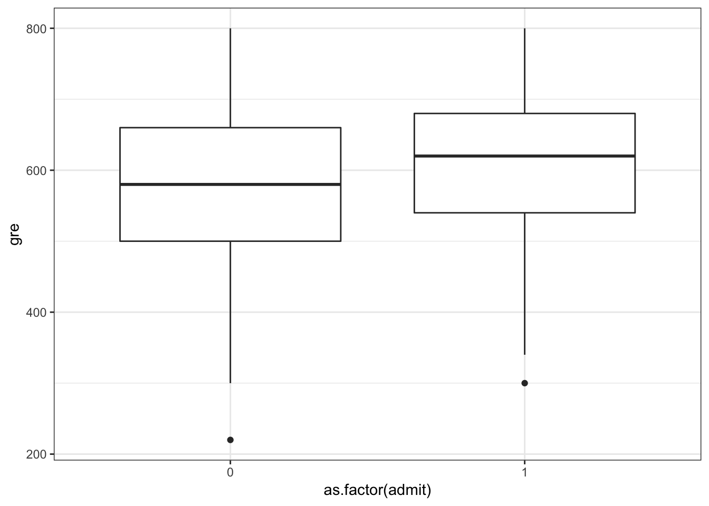


```r
> ggplot(data=mydata) +
+   geom_boxplot(aes(x=as.factor(admit), y=gpa))
```

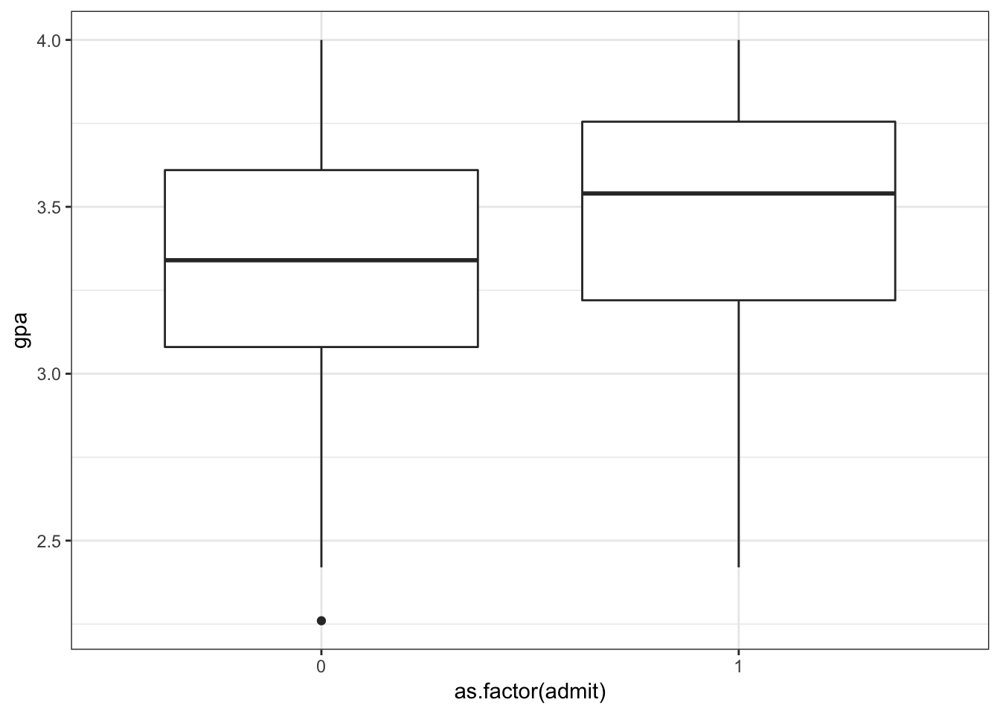

## Logistic Regression in R


```r
> mydata$rank <- factor(mydata$rank, levels=c(1, 2, 3, 4))
> myfit <- glm(admit ~ gre + gpa + rank, 
+              data = mydata, family = "binomial")
> myfit

Call:  glm(formula = admit ~ gre + gpa + rank, family = "binomial", 
    data = mydata)

Coefficients:
(Intercept)          gre          gpa        rank2        rank3  
  -3.989979     0.002264     0.804038    -0.675443    -1.340204  
      rank4  
  -1.551464  

Degrees of Freedom: 399 Total (i.e. Null);  394 Residual
Null Deviance:	    500 
Residual Deviance: 458.5 	AIC: 470.5
```

## Summary of Fit


```r
> summary(myfit)

Call:
glm(formula = admit ~ gre + gpa + rank, family = "binomial", 
    data = mydata)

Deviance Residuals: 
    Min       1Q   Median       3Q      Max  
-1.6268  -0.8662  -0.6388   1.1490   2.0790  

Coefficients:
             Estimate Std. Error z value Pr(>|z|)    
(Intercept) -3.989979   1.139951  -3.500 0.000465 ***
gre          0.002264   0.001094   2.070 0.038465 *  
gpa          0.804038   0.331819   2.423 0.015388 *  
rank2       -0.675443   0.316490  -2.134 0.032829 *  
rank3       -1.340204   0.345306  -3.881 0.000104 ***
rank4       -1.551464   0.417832  -3.713 0.000205 ***
---
Signif. codes:  0 '***' 0.001 '**' 0.01 '*' 0.05 '.' 0.1 ' ' 1

(Dispersion parameter for binomial family taken to be 1)

    Null deviance: 499.98  on 399  degrees of freedom
Residual deviance: 458.52  on 394  degrees of freedom
AIC: 470.52

Number of Fisher Scoring iterations: 4
```

## ANOVA of Fit


```r
> anova(myfit, test="Chisq")
Analysis of Deviance Table

Model: binomial, link: logit

Response: admit

Terms added sequentially (first to last)

     Df Deviance Resid. Df Resid. Dev  Pr(>Chi)    
NULL                   399     499.98              
gre   1  13.9204       398     486.06 0.0001907 ***
gpa   1   5.7122       397     480.34 0.0168478 *  
rank  3  21.8265       394     458.52 7.088e-05 ***
---
Signif. codes:  0 '***' 0.001 '**' 0.01 '*' 0.05 '.' 0.1 ' ' 1
> anova(myfit, test="LRT")
Analysis of Deviance Table

Model: binomial, link: logit

Response: admit

Terms added sequentially (first to last)

     Df Deviance Resid. Df Resid. Dev  Pr(>Chi)    
NULL                   399     499.98              
gre   1  13.9204       398     486.06 0.0001907 ***
gpa   1   5.7122       397     480.34 0.0168478 *  
rank  3  21.8265       394     458.52 7.088e-05 ***
---
Signif. codes:  0 '***' 0.001 '**' 0.01 '*' 0.05 '.' 0.1 ' ' 1
```

## Example: Contraceptive Use


```r
> cuse <- 
+   read.table("http://data.princeton.edu/wws509/datasets/cuse.dat", 
+              header=TRUE)
> dim(cuse)
[1] 16  5
> head(cuse)
    age education wantsMore notUsing using
1   <25       low       yes       53     6
2   <25       low        no       10     4
3   <25      high       yes      212    52
4   <25      high        no       50    10
5 25-29       low       yes       60    14
6 25-29       low        no       19    10
```

Data and analysis courtesy of <http://data.princeton.edu/R/glms.html>.

## A Different Format

Note that in this data set there are multiple observations per explanatory variable configuration.

The last two columns of the data frame count the successes and failures per configuration.


```r
> head(cuse)
    age education wantsMore notUsing using
1   <25       low       yes       53     6
2   <25       low        no       10     4
3   <25      high       yes      212    52
4   <25      high        no       50    10
5 25-29       low       yes       60    14
6 25-29       low        no       19    10
```

## Fitting the Model

When this is the case, we call the `glm()` function slighlty differently.


```r
> myfit <- glm(cbind(using, notUsing) ~ age + education + wantsMore, 
+              data=cuse, family = binomial)
> myfit

Call:  glm(formula = cbind(using, notUsing) ~ age + education + wantsMore, 
    family = binomial, data = cuse)

Coefficients:
 (Intercept)      age25-29      age30-39      age40-49  educationlow  
     -0.8082        0.3894        0.9086        1.1892       -0.3250  
wantsMoreyes  
     -0.8330  

Degrees of Freedom: 15 Total (i.e. Null);  10 Residual
Null Deviance:	    165.8 
Residual Deviance: 29.92 	AIC: 113.4
```

## Summary of Fit


```r
> summary(myfit)

Call:
glm(formula = cbind(using, notUsing) ~ age + education + wantsMore, 
    family = binomial, data = cuse)

Deviance Residuals: 
    Min       1Q   Median       3Q      Max  
-2.5148  -0.9376   0.2408   0.9822   1.7333  

Coefficients:
             Estimate Std. Error z value Pr(>|z|)    
(Intercept)   -0.8082     0.1590  -5.083 3.71e-07 ***
age25-29       0.3894     0.1759   2.214  0.02681 *  
age30-39       0.9086     0.1646   5.519 3.40e-08 ***
age40-49       1.1892     0.2144   5.546 2.92e-08 ***
educationlow  -0.3250     0.1240  -2.620  0.00879 ** 
wantsMoreyes  -0.8330     0.1175  -7.091 1.33e-12 ***
---
Signif. codes:  0 '***' 0.001 '**' 0.01 '*' 0.05 '.' 0.1 ' ' 1

(Dispersion parameter for binomial family taken to be 1)

    Null deviance: 165.772  on 15  degrees of freedom
Residual deviance:  29.917  on 10  degrees of freedom
AIC: 113.43

Number of Fisher Scoring iterations: 4
```

## ANOVA of Fit


```r
> anova(myfit)
Analysis of Deviance Table

Model: binomial, link: logit

Response: cbind(using, notUsing)

Terms added sequentially (first to last)

          Df Deviance Resid. Df Resid. Dev
NULL                         15    165.772
age        3   79.192        12     86.581
education  1    6.162        11     80.418
wantsMore  1   50.501        10     29.917
```

## More on this Data Set

See <http://data.princeton.edu/R/glms.html> for more on fitting logistic regression to this data set.

A number of interesting choices are made that reveal more about the data.

# Generalized Linear Models

## Definition

The **generalized linear model** (GLM) builds from OLS and GLS to allow for the case where $Y | \bX$ is distributed according to an exponential family distribution.  The estimated model is

$$
g\left(\E[Y | \bX]\right) = \bX \bb
$$

where $g(\cdot)$ is called the **link function**.  This model is typically fit by numerical methods to calculate the maximum likelihood estimate of $\bb$.

## Exponential Family Distributions

Recall that if $Y$ follows an EFD then it has pdf of the form

$$f(y ; \boldsymbol{\theta}) =
h(y) \exp \left\{ \sum_{k=1}^d \eta_k(\boldsymbol{\theta}) T_k(y) - A(\boldsymbol{\eta}) \right\}
$$

where $\boldsymbol{\theta}$ is a vector of parameters, $\{T_k(y)\}$ are sufficient statistics, $A(\boldsymbol{\eta})$ is the cumulant generating function.


The functions $\eta_k(\boldsymbol{\theta})$ for $k=1, \ldots, d$ map the usual parameters $\bt$ (often moments of the rv $Y$) to the *natural parameters* or *canonical parameters*.

$\{T_k(y)\}$ are sufficient statistics for $\{\eta_k\}$ due to the factorization theorem.

$A(\boldsymbol{\eta})$ is sometimes called the *log normalizer* because

$$A(\boldsymbol{\eta}) = \log \int h(y) \exp \left\{ \sum_{k=1}^d \eta_k(\boldsymbol{\theta}) T_k(y) \right\}.$$

## Natural Single Parameter EFD

A natural single parameter EFD simplifies to the scenario where $d=1$ and $T(y) = y$

$$f(y ; \eta) =
h(y) \exp \left\{ \eta(\theta) y - A(\eta(\theta)) \right\}
$$

where without loss of generality we can write $\E[Y] = \theta$.

## Dispersion EFDs

The family of distributions for which GLMs are most typically developed are dispersion EFDs.  An example of a dispersion EFD that extends the natural single parameter EFD is

$$f(y ; \eta) =
h(y, \phi) \exp \left\{ \frac{\eta(\theta) y - A(\eta(\theta))}{\phi} \right\}
$$

where $\phi$ is the dispersion parameter.

## Example: Normal

Let $Y \sim \mbox{Normal}(\mu, \sigma^2)$. Then:

$$
\theta = \mu, \eta(\mu) = \mu
$$

$$
\phi = \sigma^2
$$

$$
A(\mu) = \frac{\mu^2}{2}
$$

$$
h(y, \sigma^2) = \frac{1}{\sqrt{2\pi\sigma^2}} e^{-\frac{1}{2}\frac{y^2}{\sigma^2}}
$$

## EFD for GLMs

There has been a very broad development of GLMs and extensions.  A common setting for introducting GLMs is the dispersion EFD with a general link function $g(\cdot)$.

See the classic text *Generalized Linear Models*, by McCullagh and Nelder, for such a development.

## Components of a GLM

1. *Random*: The particular exponential family distribution.
$$
Y \sim f(y ; \eta, \phi)
$$

2. *Systematic*:  The determination of each $\eta_i$ from $\bX_i$ and $\bb$.
$$
\eta_i = \bX_i \bb
$$

3. *Parametric Link*: The connection between $E[Y_i|\bX_i]$ and $\bX_i \bb$.
$$
g(E[Y_i|\bX_i]) = \bX_i \bb
$$

## Link Functions

Even though the link function $g(\cdot)$ can be considered in a fairly general framework, the **canonical link function** $\eta(\cdot)$ is often utilized.  

The canonical link function is the function that maps the expected value into the natural paramater.

In this case, $Y | \bX$ is distributed according to an exponential family distribution with

$$
\eta \left(\E[Y | \bX]\right) = \bX \bb.
$$

## Calculating MLEs

Given the model $g\left(\E[Y | \bX]\right) = \bX \bb$, the EFD should be fully parameterized.  The Newton-Raphson method or Fisher's scoring method can be utilized to find the MLE of $\bb$.  


## Newton-Raphson 

1.  Initialize $\bb^{(0)}$. For $t = 1, 2, \ldots$

2.  Calculate the score $s(\bb^{(t)}) = \nabla \ell(\bb; \bX, \bY) \mid_{\bb = \bb^{(t)}}$ and observed Fisher information $$H(\bb^{(t)}) = - \nabla \nabla^T \ell(\bb; \bX, \bY) \mid_{\bb = \bb^{(t)}}$$.  Note that the observed Fisher information is also the negative Hessian matrix.

3.  Update $\bb^{(t+1)} = \bb^{(t)} + H(\bb^{(t)})^{-1} s(\bb^{(t)})$.

4.  Iterate until convergence, and set $\hat{\bb} = \bb^{(\infty)}$.


## Fisher's scoring

1.  Initialize $\bb^{(0)}$. For $t = 1, 2, \ldots$

2.  Calculate the score $s(\bb^{(t)}) = \nabla \ell(\bb; \bX, \bY) \mid_{\bb = \bb^{(t)}}$ and expected Fisher information $$I(\bb^{(t)}) = - \E\left[\nabla \nabla^T \ell(\bb; \bX, \bY) \mid_{\bb = \bb^{(t)}} \right].$$

3.  Update $\bb^{(t+1)} = \bb^{(t)} + I(\bb^{(t)})^{-1} s(\bb^{(t)})$.

4.  Iterate until convergence, and set $\hat{\bb} = \bb^{(\infty)}$.


When the canonical link function is used, the Newton-Raphson algorithm and Fisher's scoring algorithm are equivalent.

Exercise:  Prove this.

## Iteratively Reweighted Least Squares

For the canonical link, Fisher's scoring method can be written as an iteratively reweighted least squares algorithm, as shown earlier for logistic regression.  Note that the Fisher information is

$$
I(\bb^{(t)}) = \bX^T \bW \bX
$$

where $\bW$ is an $n \times n$ diagonal matrix with $(i, i)$ entry equal to $\V(Y_i | \bX; \bb^{(t)})$.


The score function is

$$
s(\bb^{(t)}) = \bX^T \left( \bY - \bX \bb^{(t)} \right)
$$

and the current coefficient value $\bb^{(t)}$ can be written as

$$
\bb^{(t)} = (\bX^T \bW \bX)^{-1} \bX^T \bW \bX \bb^{(t)}.
$$


Putting this together we get

$$
\bb^{(t)} + I(\bb^{(t)})^{-1} s(\bb^{(t)}) = (\bX^T \bW \bX)^{-1} \bX^T \bW \bz^{(t)}
$$

where

$$
\bz^{(t)} = \bX \bb^{(t)} + \bW^{-1} \left( \bY - \bX \bb^{(t)} \right).
$$

This is a generalization of the iteratively reweighted least squares algorithm we showed earlier for logistic regression.

## Estimating Dispersion

For the simple dispersion model above, it is typically straightforward to calculate the MLE $\hat{\phi}$ once $\hat{\bb}$ has been calculated.

## CLT Applied to the MLE

Given that $\hat{\bb}$ is a maximum likelihood estimate, we have the following CLT result on its distribution as $n \rightarrow \infty$:

$$
\sqrt{n} (\hat{\bb} - \bb) \stackrel{D}{\longrightarrow} \mbox{MVN}_{p}(\bO, \phi (\bX^T \bW \bX)^{-1})
$$

## Approximately Pivotal Statistics

The previous CLT gives us the following two approximations for pivtoal statistics.  The first statistic facilitates getting overall measures of uncertainty on the estimate $\hat{\bb}$.

$$
\hat{\phi}^{-1} (\hat{\bb} - \bb)^T (\bX^T \hat{\bW} \bX) (\hat{\bb} - \bb) \asim \chi^2_1
$$

This second pivotal statistic allows for performing a Wald test or forming a confidence interval on each coefficient, $\beta_j$, for $j=1, \ldots, p$.

$$
\frac{\hat{\beta}_j - \beta_j}{\sqrt{\hat{\phi} [(\bX^T \hat{\bW} \bX)^{-1}]_{jj}}} \asim \mbox{Normal}(0,1)
$$

## Deviance

Let $\hat{\boldsymbol{\eta}}$ be the estimated natural parameters from a GLM.  For example, $\hat{\boldsymbol{\eta}} = \bX \hat{\bb}$ when the canonical link function is used.

Let $\hat{\boldsymbol{\eta}}_n$ be the **saturated model** wwhere $Y_i$ is directly used to estimate $\eta_i$ without model constraints.  For example, in the Bernoulli logistic regression model $\hat{\boldsymbol{\eta}}_n = \bY$, the observed outcomes.

The **deviance** for the model is defined to be

$$
D\left(\hat{\boldsymbol{\eta}}\right) = 2 \ell(\hat{\boldsymbol{\eta}}_n; \bX, \bY) - 2 \ell(\hat{\boldsymbol{\eta}}; \bX, \bY)
$$

## Generalized LRT

Let $\bX_0$ be a subset of $p_0$ columns of $\bX$ and let $\bX_1$ be a subset of $p_1$ columns, where $1 \leq p_0 < p_1 \leq p$.  Also, assume that the columns of $\bX_0$ are a subset of $\bX_1$.

Without loss of generality, suppose that $\bb_0 = (\beta_1, \beta_2, \ldots, \beta_{p_0})^T$ and $\bb_1 = (\beta_1, \beta_2, \ldots, \beta_{p_1})^T$.

Suppose we wish to test $H_0: (\beta_{p_0+1}, \beta_{p_0 + 2}, \ldots, \beta_{p_1}) = \bO$ vs $H_1: (\beta_{p_0+1}, \beta_{p_0 + 2}, \ldots, \beta_{p_1}) \not= \bO$


We can form $\hat{\boldsymbol{\eta}}_0 = \bX \hat{\bb}_0$ from the GLM model $g\left(\E[Y | \bX_0]\right) = \bX_0 \bb_0$.  We can analogously form $\hat{\boldsymbol{\eta}}_1 = \bX \hat{\bb}_1$ from the GLM model $g\left(\E[Y | \bX_1]\right) = \bX_1 \bb_1$.

The $2\log$ generalized LRT can then be formed from the two deviance statistics

$$
2 \log \lambda(\bX, \bY) = 2 \log \frac{L(\hat{\boldsymbol{\eta}}_1; \bX, \bY)}{L(\hat{\boldsymbol{\eta}}_0; \bX, \bY)} = D\left(\hat{\boldsymbol{\eta}}_0\right) - D\left(\hat{\boldsymbol{\eta}}_1\right)
$$

where the null distribution is $\chi^2_{p_1-p_0}$.

## Example: Grad School Admissions

Let's revisit a logistic regression example now that we know how the various statistics are calculated.


```r
> mydata <- 
+   read.csv("http://www.ats.ucla.edu/stat/data/binary.csv")
> dim(mydata)
> head(mydata)
```

Fit the model with basic output.  Note the argument `family = "binomial"`.


```r
> mydata$rank <- factor(mydata$rank, levels=c(1, 2, 3, 4))
> myfit <- glm(admit ~ gre + gpa + rank, 
+              data = mydata, family = "binomial")
> myfit

Call:  glm(formula = admit ~ gre + gpa + rank, family = "binomial", 
    data = mydata)

Coefficients:
(Intercept)          gre          gpa        rank2        rank3  
  -3.989979     0.002264     0.804038    -0.675443    -1.340204  
      rank4  
  -1.551464  

Degrees of Freedom: 399 Total (i.e. Null);  394 Residual
Null Deviance:	    500 
Residual Deviance: 458.5 	AIC: 470.5
```


This shows the fitted coefficient values, which is on the link function scale -- logit aka log odds here.  Also, a Wald test is performed for each coefficient.


```r
> summary(myfit)

Call:
glm(formula = admit ~ gre + gpa + rank, family = "binomial", 
    data = mydata)

Deviance Residuals: 
    Min       1Q   Median       3Q      Max  
-1.6268  -0.8662  -0.6388   1.1490   2.0790  

Coefficients:
             Estimate Std. Error z value Pr(>|z|)    
(Intercept) -3.989979   1.139951  -3.500 0.000465 ***
gre          0.002264   0.001094   2.070 0.038465 *  
gpa          0.804038   0.331819   2.423 0.015388 *  
rank2       -0.675443   0.316490  -2.134 0.032829 *  
rank3       -1.340204   0.345306  -3.881 0.000104 ***
rank4       -1.551464   0.417832  -3.713 0.000205 ***
---
Signif. codes:  0 '***' 0.001 '**' 0.01 '*' 0.05 '.' 0.1 ' ' 1

(Dispersion parameter for binomial family taken to be 1)

    Null deviance: 499.98  on 399  degrees of freedom
Residual deviance: 458.52  on 394  degrees of freedom
AIC: 470.52

Number of Fisher Scoring iterations: 4
```


Here we perform a generalized LRT on each variable.  Note the `rank` variable is now tested as a single factor variable as opposed to each dummy variable.


```r
> anova(myfit, test="LRT")
Analysis of Deviance Table

Model: binomial, link: logit

Response: admit

Terms added sequentially (first to last)

     Df Deviance Resid. Df Resid. Dev  Pr(>Chi)    
NULL                   399     499.98              
gre   1  13.9204       398     486.06 0.0001907 ***
gpa   1   5.7122       397     480.34 0.0168478 *  
rank  3  21.8265       394     458.52 7.088e-05 ***
---
Signif. codes:  0 '***' 0.001 '**' 0.01 '*' 0.05 '.' 0.1 ' ' 1
```


```r
> mydata <- data.frame(mydata, probs = myfit$fitted.values)
> ggplot(mydata) + geom_point(aes(x=gpa, y=probs, color=rank)) +
+   geom_jitter(aes(x=gpa, y=admit), width=0, height=0.01, alpha=0.3)
```

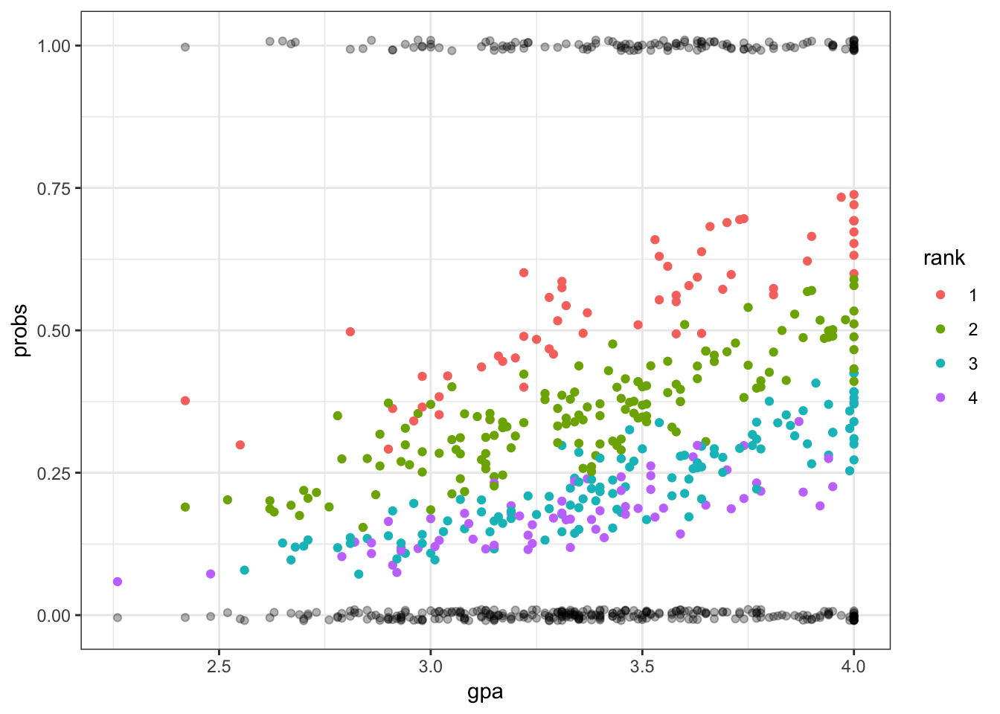


```r
> ggplot(mydata) + geom_point(aes(x=gre, y=probs, color=rank)) +
+   geom_jitter(aes(x=gre, y=admit), width=0, height=0.01, alpha=0.3)
```

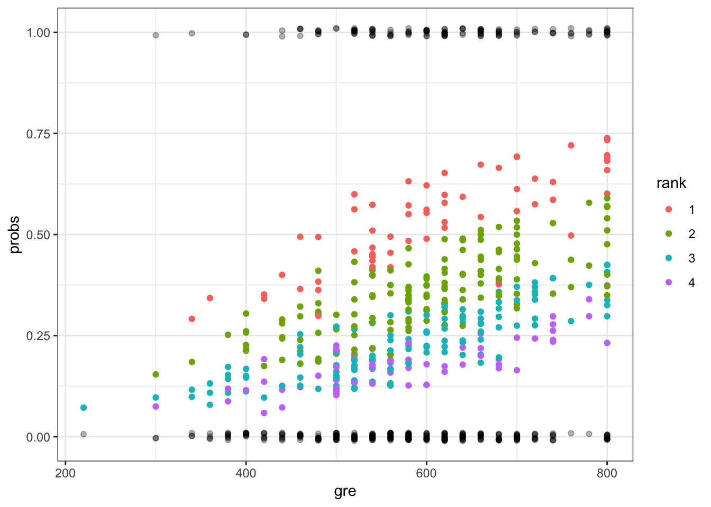


```r
> ggplot(mydata) + geom_boxplot(aes(x=rank, y=probs)) +
+   geom_jitter(aes(x=rank, y=probs), width=0.1, height=0.01, alpha=0.3)
```

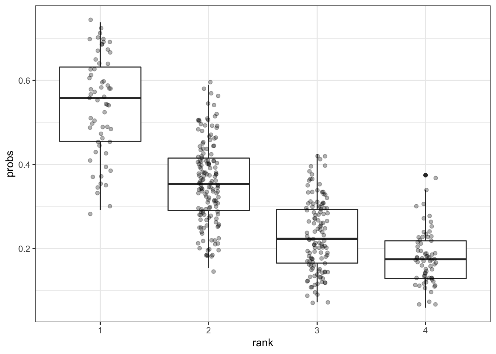

## `glm()` Function

The `glm()` function has many different options available to the user.

```
glm(formula, family = gaussian, data, weights, subset,
    na.action, start = NULL, etastart, mustart, offset,
    control = list(...), model = TRUE, method = "glm.fit",
    x = FALSE, y = TRUE, contrasts = NULL, ...)
```

To see the different link functions available, type:

```
help(family)
```

# Nonparametric Regression

## Simple Linear Regression

Recall the set up for simple linear regression.  For random variables $(X_1, Y_1), (X_2, Y_2), \ldots, (X_n, Y_n)$, **simple linear regression** estimates the model

$$
Y_i  = \beta_1 + \beta_2 X_i + E_i
$$

where $\E[E_i | X_i] = 0$, $\V(E_i | X_i) = \sigma^2$, and $\Cov(E_i, E_j | X_i, X_j) = 0$ for all $1 \leq i, j \leq n$ and $i \not= j$.

Note that in this model $\E[Y | X] = \beta_1 + \beta_2 X.$

## Simple Nonparametric Regression

In **simple nonparametric regression**, we define a similar model while eliminating the linear assumption:

$$
Y_i  = s(X_i) + E_i
$$

for some function $s(\cdot)$ with the same assumptions on the distribution of $\bE | \bX$.  In this model, we also have

$$
\E[Y | X] = s(X).
$$

## Smooth Functions

Suppose we consider fitting the model $Y_i  = s(X_i) + E_i$ with the restriction that $s \in C^2$, the class of functions with continuous second derivatives.  We can set up an objective function that regularizes how smooth vs wiggly $s$ is.  

Specifically, suppose for a given set of observed data $(x_1, y_1), (x_2, y_2), \ldots, (x_n, y_n)$ we wish to identify a function $s \in C^2$ that minimizes for some $\lambda$

$$
\sum_{i=1}^n (y_i - s(x_i))^2 + \lambda \int |s''(x)|^2 dx
$$

## Smoothness Parameter $\lambda$

When minimizing

$$
\sum_{i=1}^n (y_i - s(x_i))^2 + \lambda \int |s^{\prime\prime}(x)|^2 dx
$$

it follows that if $\lambda=0$ then any function $s \in C^2$ that interpolates the data is a solution.  

As $\lambda \rightarrow \infty$, then the minimizing function is the simple linear regression solution.

## The Solution

For an observed data set $(x_1, y_1), (x_2, y_2), \ldots, (x_n, y_n)$ where $n \geq 4$ and a fixed value $\lambda$, there is an exact solution to minimizing

$$
\sum_{i=1}^n (y_i - s(x_i))^2 + \lambda \int |s^{\prime\prime}(x)|^2 dx.
$$

The solution is called a **natural cubic spline**, which is constructed to have knots at $x_1, x_2, \ldots, x_n$.

## Natural Cubic Splines

Suppose without loss of generality that we have ordered $x_1 < x_2 < \cdots < x_n$.  We assume all $x_i$ are unique to simplify the explanation here, but ties can be deal with.

A **natural cubic spline** (NCS) is a function constructed from a set of piecewise cubic functions over the range $[x_1, x_n]$ joined at the knots so that the second derivative is continuous at the knots.  Outside of the range ($< x_1$ or $> x_n$), the spline is linear and it has continuous second derivatives at the endpoint knots.

## Basis Functions

Depending on the value $\lambda$, a different ncs will be constructed, but the entire family of ncs solutions over $0 < \lambda < \infty$ can be constructed from a common set of basis functions.

We construct $n$ basis functions $N_1(x), N_2(x), \ldots, N_n(x)$ with coefficients $\theta_1(\lambda), \theta_2(\lambda), \ldots, \theta_n(\lambda)$. The NCS takes the form

$$
s(x) = \sum_{i=1}^n \theta_i(\lambda) N_i(x).
$$


Define $N_1(x) = 1$ and $N_2(x) = x$.  For $i = 3, \ldots, n$, define $N_i(x) = d_{i-1}(x) - d_{i-2}(x)$ where

$$
d_{i}(x) = \frac{(x - x_i)^3 - (x - x_n)^3}{x_n - x_i}.
$$

Recall that we've labeled indices so that $x_1 < x_2 < \cdots < x_n$. 

## Calculating the Solution 

Let $\bt_\lambda = (\theta_1(\lambda), \theta_2(\lambda), \ldots, \theta_n(\lambda))^T$ and let $\bN$ be the $n \times n$ matrix with $(i, j)$ entry equal to $N_j(x_i)$.  Finally, let $\bOmega$ be the $n \times n$ matrix with $(i,j)$ entry equal to $\int N_i^{\prime\prime}(x) N_j^{\prime\prime}(x) dx$.

The solution to $\bt_\lambda$ are the values that minimize

$$
(\by - \bN \bt)^T (\by - \bN \bt) + \lambda \bt^T \bOmega \bt.
$$

which results in

$$
\hat{\bt}_\lambda = (\bN^T \bN + \lambda \bOmega)^{-1} \bN^T \by.
$$

## Linear Operator

Letting 

$$
\bS_\lambda = \bN (\bN^T \bN + \lambda \bOmega)^{-1} \bN^T
$$

it folows that the fitted values are 

$$
\hat{\by} = \bS_\lambda \by.
$$

Thus, the fitted values from a NCS are contructed by taking linear combination of the response variable values $y_1, y_2, \ldots, y_n$.

## Degrees of Freedom

Recall that in OLS, we formed projection matrix $\bP = \bX (\bX^T \bX)^{-1} \bX^T$ and noted that the number of columns $p$ of $\bX$ is also found in the trace of $\bP$ where $\operatorname{tr}(\bP) = p$.

The effective degrees of freedom for a model fit by a linear operator is calculated as the trace of the operator.  

Therefore, for a given $\lambda$, the effective degrees of freedom is 

$$
\operatorname{df}_\lambda = \operatorname{tr}(\bS_\lambda).
$$

## Bayesian Intepretation

Minimizing

$$
\sum_{i=1}^n (y_i - s(x_i))^2 + \lambda \int |s^{\prime\prime}(x)|^2 dx
$$

is equivalent to maximizing

$$
\exp\left\{ -\frac{\sum_{i=1}^n (y_i - s(x_i))^2}{2\sigma^2} \right\} \exp\left\{-\frac{\lambda}{2\sigma^2} \int |s^{\prime\prime}(x)|^2 dx\right\}.
$$

Therefore, the NCS solution can be interpreted as calculting the MAP where $Y | X$ is Normal and there's an Exponential prior on the smoothness of $s$.

## Bias and Variance Trade-off

Typically we will choose some $0 < \lambda < \infty$ in an effort to balance the bias and variance.  Let $\hat{Y} = \hat{s}(X; \lambda)$ where $\hat{s}(\cdot; \lambda)$ minimizes the above for some chosen $\lambda$ on an independent data set.  Then

$$
\begin{aligned}
\E\left[\left(Y - \hat{Y}\right)^2\right] & = {\rm E}\left[\left(s(x) + E - \hat{s}(x; \lambda)\right)^2 \right] \\
\ & = {\rm E}\left[\left( s(x) - \hat{s}(x; \lambda) \right)^2 \right] + {\rm Var}(E) \\
\ & = \left( s(x) - {\rm E}[\hat{s}(x; \lambda)]\right)^2 + {\rm Var}\left(\hat{s}(x; \lambda)\right) + {\rm Var}(E) \\ 
\ & = \mbox{bias}^2_{\lambda} + \mbox{variance}_{\lambda} + {\rm Var}(E)
\end{aligned}
$$

where all of the above calculations are conditioned on $X=x$.


In minimizing

$$
\sum_{i=1}^n (y_i - s(x_i))^2 + \lambda \int |s^{\prime\prime}(x)|^2 dx
$$ 

the relationship is such that:

$$
\uparrow \lambda \Longrightarrow \mbox{bias}^2 \uparrow, \mbox{variance} \downarrow
$$

$$
\downarrow \lambda \Longrightarrow \mbox{bias}^2 \downarrow, \mbox{variance} \uparrow
$$

## Choosing $\lambda$

There are several approaches that are commonly used to identify a value of $\lambda$, including:

- Scientific knowledge that guides the acceptable value of $\operatorname{df}_\lambda$
- Cross-validation or some other prediction quality measure
- Model selection measures, such as Akaike information criterion (AIC) or Mallows $C_p$

## Smoothers and Spline Models

We investigated one type of nonparametric regression model here, the NCS.  However, in general there are many such "smoother" methods available in the simple nonparametric regression scenario.

Splines are particularly popular since splines are constructed from putting together polynomials and are therefore usually tractable to compute and analyze.

## Smoothers in R

There are several functions and packages available in R for computing smoothers and tuning smoothness parameters.  Examples include:

- `splines` library
- `smooth.spline()`
- `loess()`
- `lowess()`

## Example

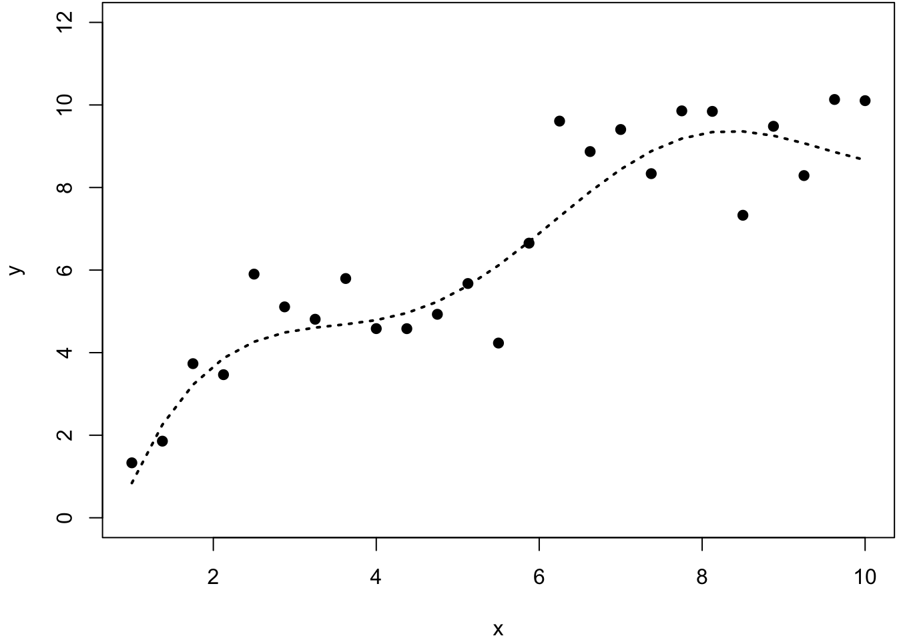


```r
> y2 <- smooth.spline(x=x, y=y, df=2)
> y5 <- smooth.spline(x=x, y=y, df=5)
> y25 <- smooth.spline(x=x, y=y, df=25)
> ycv <- smooth.spline(x=x, y=y)
> ycv
Call:
smooth.spline(x = x, y = y)

Smoothing Parameter  spar= 0.5162045  lambda= 0.0002730906 (11 iterations)
Equivalent Degrees of Freedom (Df): 7.293673
Penalized Criterion (RSS): 14.80602
GCV: 1.180651
```


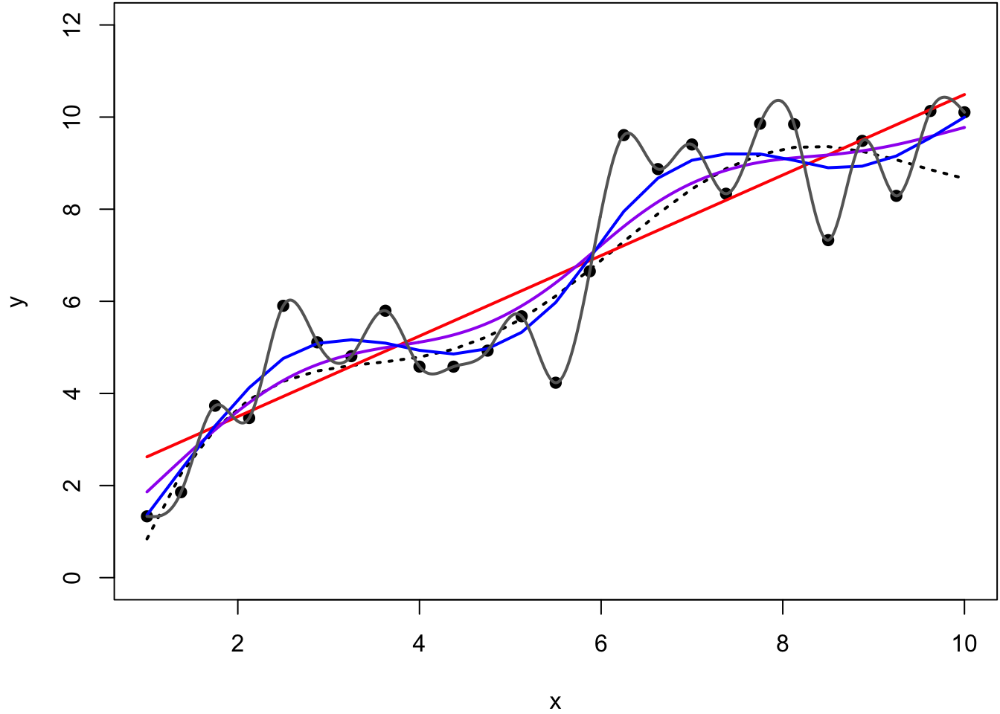

# Generalized Additive Models

## Ordinary Least Squares

Recall that OLS estimates the model

$$
\begin{aligned}
Y_i & = \beta_1 X_{i1} + \beta_2 X_{i2} + \ldots + \beta_p X_{ip} + E_i \\
 & = \bX_i \bb + E_i
\end{aligned}
$$

where $\E[\bE | \bX] = \bO$ and $\Cov(\bE | \bX) = \sigma^2 \bI$.

## Additive Models

The **additive model** (which could also be called "ordinary nonparametric additive regression") is of the form 

$$
\begin{aligned}
Y_i & = s_1(X_{i1}) + s_2(X_{i2}) + \ldots + s_p(X_{ip}) + E_i \\
 & = \sum_{j=1}^p s_j(X_{ij}) + E_i
\end{aligned}
$$


where the $s_j(\cdot)$ for $j = 1, \ldots, p$ are a set of nonparametric (or flexible) functions.  Again, we assume that $\E[\bE | \bX] = \bO$ and $\Cov(\bE | \bX) = \sigma^2 \bI$.

## Backfitting

The additive model can be fit through a technique called **backfitting**.

1. Intialize $s^{(0)}_j(x)$ for $j = 1, \ldots, p$.
2. For $t=1, 2, \ldots$, fit $s_j^{(t)}(x)$ on response variable $$y_i - \sum_{k \not= j} s_k^{(t-1)}(x_{ij}).$$
3. Repeat until convergence.

Note that some extra steps have to be taken to deal with the intercept.

## GAM Definition 

$Y | \bX$ is distributed according to an exponential family distribution.  The extension of additive models to this family of response variable is called **generalized additive models** (GAMs).  The model is of the form

$$
g\left(\E[Y_i | \bX_i]\right) = \sum_{j=1}^p s_j(X_{ij})
$$

where $g(\cdot)$ is the link function and the $s_j(\cdot)$ are flexible and/or nonparametric functions.

## Overview of Fitting GAMs

Fitting GAMs involves putting together the following three tools:

1.  We know how to fit a GLM via IRLS 
2.  We know how to fit a smoother of a single explanatory variable via a least squares solution, as seen for the NCS
3.  We know how to combine additive smoothers by backfitting

## GAMs in R

Three common ways to fit GAMs in R:

1.  Utilize `glm()` on explanatory variables constructed from `ns()` or `bs()`
2.  The `gam` library
3.  The `mgcv` library

## Example


```r
> set.seed(508)
> x1 <- seq(1, 10, length.out=50)
> n <- length(x1)
> x2 <- rnorm(n)
> f <- 4*log(x1) + sin(x1) - 7 + 0.5*x2
> p <- exp(f)/(1+exp(f))
> summary(p)
    Min.  1st Qu.   Median     Mean  3rd Qu.     Max. 
0.001842 0.074171 0.310674 0.436162 0.860387 0.944761 
> y <- rbinom(n, size=1, prob=p)
> mean(y)
[1] 0.42
> df <- data.frame(x1=x1, x2=x2, y=y)
```


Here, we use the `gam()` function from the `mgcv` library.  It automates choosing the smoothness of the splines.


```r
> library(mgcv)
> mygam <- gam(y ~ s(x1) + s(x2), family = binomial(), data=df)
> library(broom)
> tidy(mygam)
# A tibble: 2 x 5
  term    edf ref.df statistic p.value
  <chr> <dbl>  <dbl>     <dbl>   <dbl>
1 s(x1)  1.87   2.37     12.7  0.00531
2 s(x2)  1.00   1.00      1.16 0.281  
```


```r
> summary(mygam)

Family: binomial 
Link function: logit 

Formula:
y ~ s(x1) + s(x2)

Parametric coefficients:
            Estimate Std. Error z value Pr(>|z|)  
(Intercept)  -1.1380     0.6723  -1.693   0.0905 .
---
Signif. codes:  0 '***' 0.001 '**' 0.01 '*' 0.05 '.' 0.1 ' ' 1

Approximate significance of smooth terms:
       edf Ref.df Chi.sq p-value   
s(x1) 1.87  2.375 12.743 0.00531 **
s(x2) 1.00  1.000  1.163 0.28084   
---
Signif. codes:  0 '***' 0.001 '**' 0.01 '*' 0.05 '.' 0.1 ' ' 1

R-sq.(adj) =  0.488   Deviance explained =   47%
UBRE = -0.12392  Scale est. = 1         n = 50
```


True probabilities vs. estimated probabilities.


```r
> plot(p, mygam$fitted.values, pch=19); abline(0,1)
```

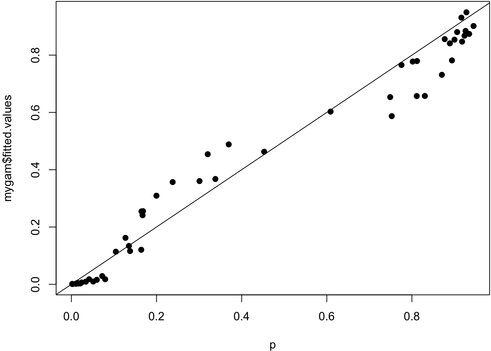


Smoother estimated for `x1`.


```r
> plot(mygam, select=1)
```

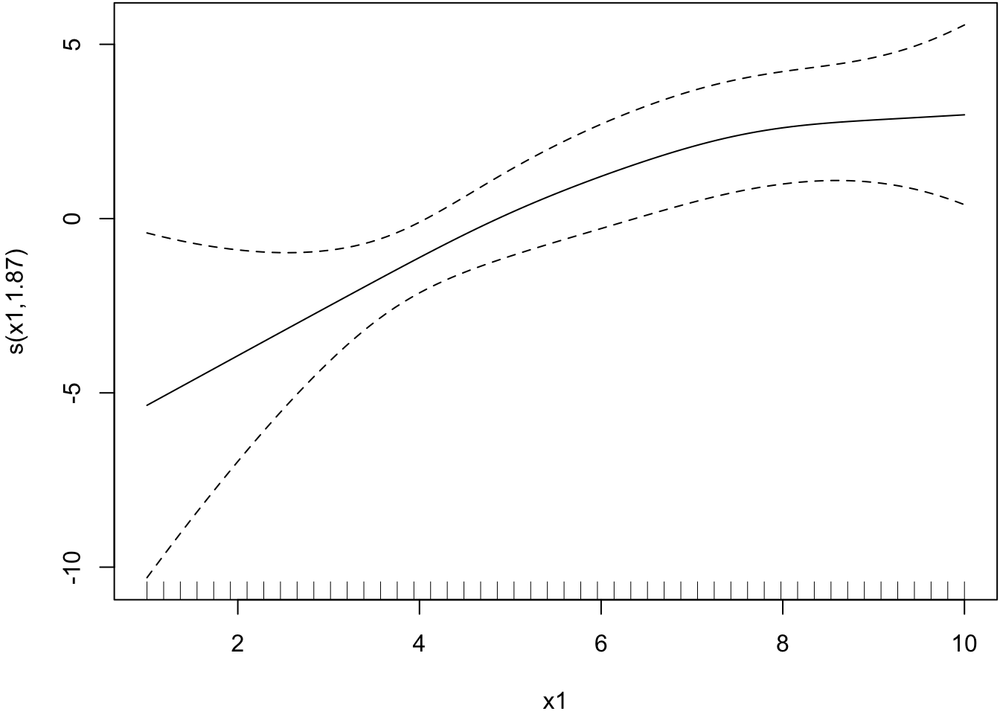


Smoother estimated for `x2`.


```r
> plot(mygam, select=2)
```

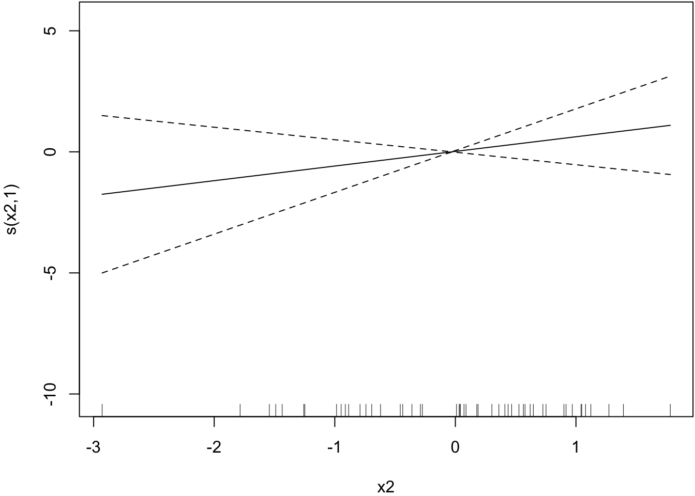


Here, we use the `glm()` function and include as an explanatory variable a NCS built from the `ns()` function from the `splines` library.  We include a `df` argument in the `ns()` call.


```r
> library(splines)
> myglm <- glm(y ~ ns(x1, df=2) + x2, family = binomial(), data=df)
> tidy(myglm)
# A tibble: 4 x 5
  term            estimate std.error statistic p.value
  <chr>              <dbl>     <dbl>     <dbl>   <dbl>
1 (Intercept)      -10.9       5.31      -2.06 0.0396 
2 ns(x1, df = 2)1   21.4      10.1        2.11 0.0348 
3 ns(x1, df = 2)2    6.33      2.11       3.00 0.00272
4 x2                 0.734     0.609      1.21 0.228  
```


The spline basis evaluated at `x1` values.


```r
> ns(x1, df=2)
               1           2
 [1,] 0.00000000  0.00000000
 [2,] 0.03114456 -0.02075171
 [3,] 0.06220870 -0.04138180
 [4,] 0.09311200 -0.06176867
 [5,] 0.12377405 -0.08179071
 [6,] 0.15411442 -0.10132630
 [7,] 0.18405270 -0.12025384
 [8,] 0.21350847 -0.13845171
 [9,] 0.24240131 -0.15579831
[10,] 0.27065081 -0.17217201
[11,] 0.29817654 -0.18745121
[12,] 0.32489808 -0.20151430
[13,] 0.35073503 -0.21423967
[14,] 0.37560695 -0.22550571
[15,] 0.39943343 -0.23519080
[16,] 0.42213406 -0.24317334
[17,] 0.44362840 -0.24933170
[18,] 0.46383606 -0.25354429
[19,] 0.48267660 -0.25568949
[20,] 0.50006961 -0.25564569
[21,] 0.51593467 -0.25329128
[22,] 0.53019136 -0.24850464
[23,] 0.54275927 -0.24116417
[24,] 0.55355797 -0.23114825
[25,] 0.56250705 -0.21833528
[26,] 0.56952943 -0.20260871
[27,] 0.57462513 -0.18396854
[28,] 0.57787120 -0.16253131
[29,] 0.57934806 -0.13841863
[30,] 0.57913614 -0.11175212
[31,] 0.57731586 -0.08265339
[32,] 0.57396762 -0.05124405
[33,] 0.56917185 -0.01764570
[34,] 0.56300897  0.01802003
[35,] 0.55555939  0.05563154
[36,] 0.54690354  0.09506722
[37,] 0.53712183  0.13620546
[38,] 0.52629468  0.17892464
[39,] 0.51450251  0.22310315
[40,] 0.50182573  0.26861939
[41,] 0.48834478  0.31535174
[42,] 0.47414005  0.36317859
[43,] 0.45929198  0.41197833
[44,] 0.44388099  0.46162934
[45,] 0.42798748  0.51201003
[46,] 0.41169188  0.56299877
[47,] 0.39507460  0.61447395
[48,] 0.37821607  0.66631397
[49,] 0.36119670  0.71839720
[50,] 0.34409692  0.77060206
attr(,"degree")
[1] 3
attr(,"knots")
50% 
5.5 
attr(,"Boundary.knots")
[1]  1 10
attr(,"intercept")
[1] FALSE
attr(,"class")
[1] "ns"     "basis"  "matrix"
```


Plot of basis function values vs `x1`.

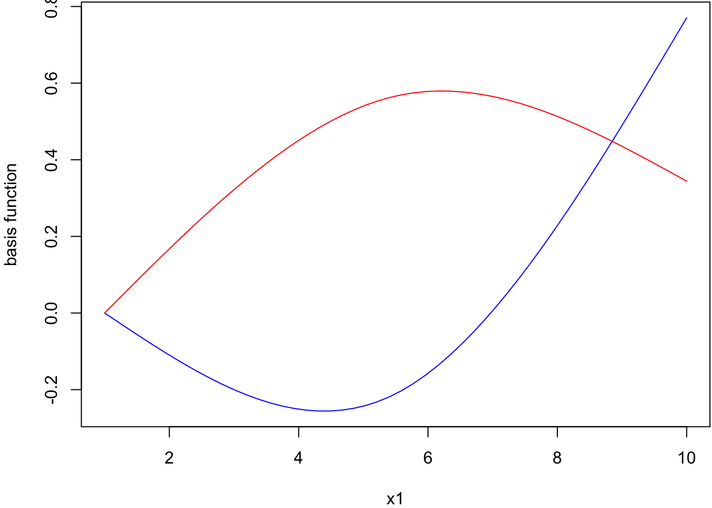


```r
> summary(myglm)

Call:
glm(formula = y ~ ns(x1, df = 2) + x2, family = binomial(), data = df)

Deviance Residuals: 
    Min       1Q   Median       3Q      Max  
-2.0214  -0.3730  -0.0162   0.5762   1.7616  

Coefficients:
                Estimate Std. Error z value Pr(>|z|)   
(Intercept)     -10.9229     5.3079  -2.058  0.03960 * 
ns(x1, df = 2)1  21.3848    10.1318   2.111  0.03480 * 
ns(x1, df = 2)2   6.3266     2.1103   2.998  0.00272 **
x2                0.7342     0.6089   1.206  0.22795   
---
Signif. codes:  0 '***' 0.001 '**' 0.01 '*' 0.05 '.' 0.1 ' ' 1

(Dispersion parameter for binomial family taken to be 1)

    Null deviance: 68.029  on 49  degrees of freedom
Residual deviance: 35.682  on 46  degrees of freedom
AIC: 43.682

Number of Fisher Scoring iterations: 7
```


```r
> anova(myglm, test="LRT")
Analysis of Deviance Table

Model: binomial, link: logit

Response: y

Terms added sequentially (first to last)

               Df Deviance Resid. Df Resid. Dev  Pr(>Chi)    
NULL                              49     68.029              
ns(x1, df = 2)  2   30.755        47     37.274 2.097e-07 ***
x2              1    1.592        46     35.682     0.207    
---
Signif. codes:  0 '***' 0.001 '**' 0.01 '*' 0.05 '.' 0.1 ' ' 1
```


True probabilities vs. estimated probabilities.


```r
> plot(p, myglm$fitted.values, pch=19); abline(0,1)
```

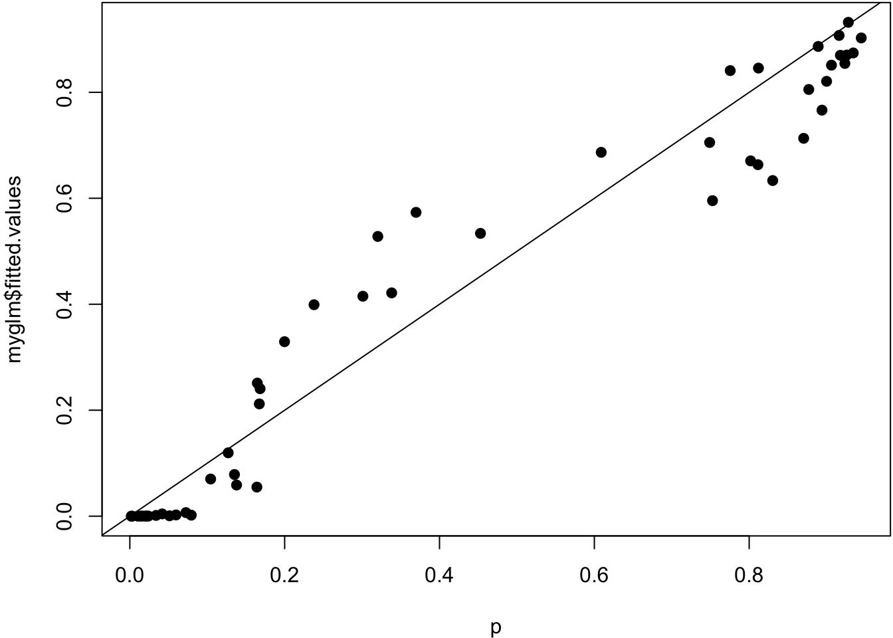


# Bootstrap for Statistical Models

## Homoskedastic Models

Let's first discuss how one can utilize the bootstrap on any of the three homoskedastic models:

- Simple linear regression
- Ordinary least squares
- Additive models

## Residuals

In each of these scenarios we sample data $(\bX_1, Y_1), (\bX_2, Y_2), \ldots, (\bX_n, Y_n)$.  Let suppose we calculate fitted values $\hat{Y}_i$ and they are unbiased:

$$
\E[\hat{Y}_i | \bX] = \E[Y_i | \bX].
$$

We can calculate residuals $\hat{E}_i = Y_i - \hat{Y}_i$ for $i=1, 2, \ldots, n$.

## Studentized Residuals

One complication is that the residuals have a covariance.  For example, in OLS we showed that 

$$
\Cov(\hat{\bE}) = \sigma^2 (\bI - \bP)
$$

where $\bP = \bX (\bX^T \bX)^{-1} \bX^T$.

To correct for this induced heteroskedasticity, we studentize the residuals by calculating

$$
R_i = \frac{\hat{E}_i}{\sqrt{1-P_{ii}}}
$$

which gives $\Cov(\bR) = \sigma^2 \bI$.

## Confidence Intervals

The following is a bootstrap procedure for calculating a confidence interval on some statistic $\hat{\theta}$ calculated from a homoskedastic model fit.  An example is $\hat{\beta}_j$ in an OLS.

1. Fit the model to obtain fitted values $\hat{Y}_i$, studentized residuals $R_i$, and the statistic of interest $\hat{\theta}$.  
For $b = 1, 2, \ldots, B$.
2. Sample $n$ observations with replacement from $\{R_i\}_{i=1}^n$ to obtain bootstrap residuals $R_1^{*}, R_2^{*}, \ldots, R_n^{*}$. 
3. Form new response variables $Y_i^{*} = \hat{Y}_i + R_i^{*}$.
4. Fit the model to obtain $\hat{Y}^{*}_i$ and all other fitted parameters.
5. Calculate statistic of interest $\hat{\theta}^{*(b)}$.


The bootstrap statistics $\hat{\theta}^{*(1)}, \hat{\theta}^{*(2)}, \ldots, \hat{\theta}^{*(B)}$ are then utilized through one of the techniques discussed earlier (percentile, pivotal, studentized pivotal) to calculate a bootstrap CI.

## Hypothesis Testing

Suppose we are testing the hypothesis $H_0: \E[Y | \bX] = f_0(\bX)$ vs $H_1: \E[Y | \bX] = f_1(\bX)$. Suppose it is possible to form unbiased estimates $f_0(\bX)$ and $f_1(\bX)$ given $\bX$, and $f_0$ is a restricted version of $f_1$.  

Suppose also we have a statistic $T(\hat{f}_0, \hat{f}_1)$ for performing this test so that the larger the statistic, the more evidence there is against the null hypothesis in favor of the alternative.

The big picture strategy is to bootstrap studentized residuals from the unconstrained (alternative hypothesis) fitted model and then add those to the constrained (null hypothesis) fitted model to generate bootstrap null data sets.


1. Fit the models to obtain fitted values $\hat{f}_0(\bX_i)$ and $\hat{f}_1(\bX_i)$, studentized residuals $R_i$ from the fit $\hat{f}_1(\bX_i)$, and the observed statistic $T(\hat{f}_0, \hat{f}_1)$.  
For $b = 1, 2, \ldots, B$.
2. Sample $n$ observations with replacement from $\{R_i\}_{i=1}^n$ to obtain bootstrap residuals $R_1^{*}, R_2^{*}, \ldots, R_n^{*}$. 
3. Form new response variables $Y_i^{*} = \hat{f}_0(\bX_i) + R_i^{*}$.
4. Fit the models on the response variables $Y_i^{*}$ to obtain $\hat{f}^{*}_0$ and $\hat{f}^{*}_1$.
5. Calculate statistic $T(\hat{f}^{*(b)}_0, \hat{f}^{*(b)}_1)$.


The p-value is then calculated as

$$
\frac{\sum_{b=1}^B 1\left(T(\hat{f}^{*(b)}_0, \hat{f}^{*(b)}_1) \geq T(\hat{f}_0, \hat{f}_1) \right) }{B}
$$


## Parametric Bootstrap

For more complex scenarios, such as GLMs, GAMs, and heteroskedastic models, it is typically more straightforward to utilize a parametric bootstrap.
