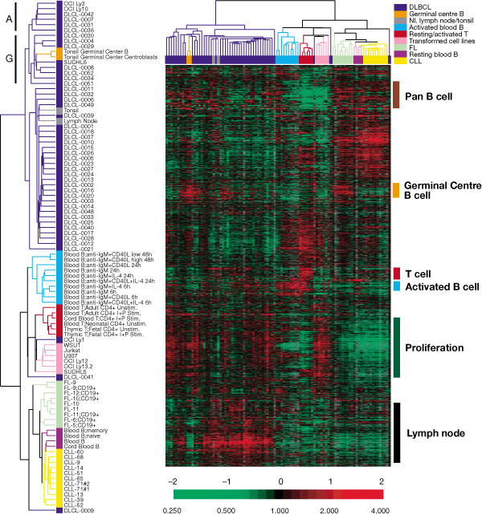

\providecommand{\E}{\operatorname{E}}
\providecommand{\V}{\operatorname{Var}}
\providecommand{\Cov}{\operatorname{Cov}}
\providecommand{\cov}{\operatorname{cov}}
\providecommand{\se}{\operatorname{se}}
\providecommand{\logit}{\operatorname{logit}}
\providecommand{\iid}{\; \stackrel{\text{iid}}{\sim}\;}
\providecommand{\asim}{\; \stackrel{.}{\sim}\;}
\providecommand{\xs}{x_1, x_2, \ldots, x_n}
\providecommand{\Xs}{X_1, X_2, \ldots, X_n}
\providecommand{\bB}{\boldsymbol{B}}
\providecommand{\bb}{\boldsymbol{\beta}}
\providecommand{\bx}{\boldsymbol{x}}
\providecommand{\bX}{\boldsymbol{X}}
\providecommand{\by}{\boldsymbol{y}}
\providecommand{\bY}{\boldsymbol{Y}}
\providecommand{\bz}{\boldsymbol{z}}
\providecommand{\bZ}{\boldsymbol{Z}}
\providecommand{\be}{\boldsymbol{e}}
\providecommand{\bE}{\boldsymbol{E}}
\providecommand{\bs}{\boldsymbol{s}}
\providecommand{\bS}{\boldsymbol{S}}
\providecommand{\bP}{\boldsymbol{P}}
\providecommand{\bI}{\boldsymbol{I}}
\providecommand{\bD}{\boldsymbol{D}}
\providecommand{\bd}{\boldsymbol{d}}
\providecommand{\bW}{\boldsymbol{W}}
\providecommand{\bw}{\boldsymbol{w}}
\providecommand{\bM}{\boldsymbol{M}}
\providecommand{\bPhi}{\boldsymbol{\Phi}}
\providecommand{\bphi}{\boldsymbol{\phi}}
\providecommand{\bN}{\boldsymbol{N}}
\providecommand{\bR}{\boldsymbol{R}}
\providecommand{\bu}{\boldsymbol{u}}
\providecommand{\bU}{\boldsymbol{U}}
\providecommand{\bv}{\boldsymbol{v}}
\providecommand{\bV}{\boldsymbol{V}}
\providecommand{\bO}{\boldsymbol{0}}
\providecommand{\bOmega}{\boldsymbol{\Omega}}
\providecommand{\bLambda}{\boldsymbol{\Lambda}}
\providecommand{\bSig}{\boldsymbol{\Sigma}}
\providecommand{\bSigma}{\boldsymbol{\Sigma}}
\providecommand{\bt}{\boldsymbol{\theta}}
\providecommand{\bT}{\boldsymbol{\Theta}}
\providecommand{\bpi}{\boldsymbol{\pi}}
\providecommand{\argmax}{\text{argmax}}
\providecommand{\KL}{\text{KL}}
\providecommand{\fdr}{{\rm FDR}}
\providecommand{\pfdr}{{\rm pFDR}}
\providecommand{\mfdr}{{\rm mFDR}}
\providecommand{\bh}{\hat}
\providecommand{\dd}{\lambda}
\providecommand{\q}{\operatorname{q}}

```{r, message=FALSE, echo=FALSE, cache=FALSE}
source("./customization/knitr_options.R")
```

```{r, message=FALSE, echo=FALSE, cache=FALSE}
library("datasets")
library("animation")
library("gganimate")
```

# (PART) Expoloratory Data Analysis {-}

# Exploratory Data Analysis

## What is EDA?

Exploratory data analysis (EDA) is the process of analzying data to uncover their key features.

John Tukey pioneered this framework, writing a seminal book on the topic (called *Exploratory Data Analysis*).

EDA involves calculating numerical summaries of data, visualizing data in a variety of ways, and considering interesting data points. 

Before any model fitting is done to data, some exploratory data analysis should always be performed. 

*Data science seems to focus much more on EDA than traditional statistics.*

## Descriptive Statistics Examples

- Facebook's [Visualizing Fake Friendships](https://www.facebook.com/note.php?note_id=469716398919)   (side note: [a discussion](http://flowingdata.com/2010/12/13/facebook-worldwide-friendships-mapped/))

- [Hans Rosling: Debunking third-world myths with the best stats you've ever seen](https://www.youtube.com/watch?v=RUwS1uAdUcI&t=3m22s&version=3)

- Flowing Data's [A Day in the Life of Americans](http://flowingdata.com/2015/12/15/a-day-in-the-life-of-americans/)

## Components of EDA

EDA involves calculating quantities and visualizing data for:

- Checking the *n*'s
- Checking for missing data
- Characterizing the distributional properties of the data
- Characterizing relationships among variables and observations
- Dimension reduction
- Model formulation
- Hypothesis generation

... and there are possible many more activities one can do.

## Data Sets

For the majority of this chapter, we will use some simple data sets to demonstrate the ideas.

### Data `mtcars`

Load the `mtcars` data set:

```{r}
library("tidyverse") # why load tidyverse?
data("mtcars", package="datasets")
mtcars <- as_tibble(mtcars)
head(mtcars)
```

### Data `mpg`

Load the `mpg` data set:

```{r, cache=FALSE, message=FALSE}
data("mpg", package="ggplot2")
head(mpg)
```

### Data `diamonds`

Load the `diamonds` data set:

```{r, cache=FALSE, message=FALSE}
data("diamonds", package="ggplot2")
head(diamonds)
```

### Data `gapminder`

Load the `gapminder` data set:

```{r, cache=FALSE, message=FALSE}
library("gapminder")
data("gapminder", package="gapminder")
gapminder <- as_tibble(gapminder)
head(gapminder)
```

# Numerical Summaries of Data

## Useful Summaries

- **Center**: mean, median, mode

- **Quantiles**: percentiles, five number summaries

- **Spread**: standard deviation, variance, interquartile range

- **Outliers**

- **Shape**: skewness, kurtosis

- **Concordance**: correlation, quantile-quantile plots

## Measures of Center

Suppose we have data points $x_1, x_2, \ldots, x_n$.  

**Mean**: $$\overline{x} = \frac{x_1 + x_2 + \cdots + x_n}{n}$$

**Median**: Order the points $x_{(1)} \leq x_{(2)} \leq \cdots \leq x_{(n)}$.  The median is the middle value:  
- $x_{((n+1)/2)}$ if $n$ is odd  
- $(x_{(n/2)} + x_{(n/2+1)})/2$ if $n$ is even

**Mode**: The most frequently repeated value among the data (if any).  If there are ties, then there is more than one mode.

## Mean, Median, and Mode in R

Let's calculate these quantities in R.

```{r}
mean(mtcars$mpg)
median(mtcars$mpg)

sample_mode <- function(x) {
  as.numeric(names(which(table(x) == max(table(x)))))
}

sample_mode(round(mtcars$mpg))
```

It appears there is no R base function for calculating the mode.

## Quantiles and Percentiles

The $p$th **percentile** of $x_1, x_2, \ldots, x_n$ is a number such that $p$% of the data are less than this number.

The 25th, 50th, and 75th percentiles are called 1st, 2nd, and 3rd "quartiles", respectively. These are sometimes denoted as Q1, Q2, and Q3. The median is the 50th percentile aka the 2nd quartile aka Q2.

In general, $q$-**quantiles** are cut points that divide the data into $q$ approximately equally sized groups.  The cut points are the percentiles $1/q, 2/q, \ldots, (q-1)/q.$

## Five Number Summary

The "five number summary" is the minimum, the three quartiles, and the maximum. This can be calculated via `fivenum()` and `summary()`. [They can produce different values.](https://chemicalstatistician.wordpress.com/2013/08/12/exploratory-data-analysis-the-5-number-summary-two-different-methods-in-r-2/) Finally, `quantile()` extracts any set of percentiles.

```{r}
fivenum(mtcars$mpg)
summary(mtcars$mpg)

quantile(mtcars$mpg, prob=seq(0, 1, 0.25))
```

## Measures of Spread

The variance, standard deviation (SD), and interquartile range (IQR) measure the "spread" of the data.

**Variance**:
$$s^2 = \frac{\sum_{i=1}^n \left(x_i - \overline{x}\right)^2}{n-1}$$

**Standard Deviation**: $s = \sqrt{s^2}$

**Iterquartile Range**: IQR $=$ Q3 $-$ Q1 

The SD and IQR have the same units as the observed data, but the variance is in squared units.


## Variance, SD, and IQR in R

Variance:
```{r}
var(mtcars$mpg)
```

Standard deviation:
```{r}
sd(mtcars$mpg)
```

Interquartile range:
```{r}
IQR(mtcars$mpg)
diff(fivenum(mtcars$mpg)[c(2,4)])
```

## Identifying Outliers

An **outlier** is an unusual data point.  Outliers can be perfectly valid but they can also be due to errors (as can non-outliers). 

One must define what is meant by an outlier. 

One definition is a data point that less than Q1 or greater than Q3 by 1.5 $\times$ IQR or more.

Another definition is a data point whose difference from the mean is greater than 3 $\times$ SD or more. For Normal distributed data (bell curve shaped), the probability of this is less than 0.27%.

## Application to `mtcars` Data

```{r}
sd_units <- abs(mtcars$wt - mean(mtcars$wt))/sd(mtcars$wt)
sum(sd_units > 3)
max(sd_units)

iqr_outlier_cuts <- fivenum(mtcars$wt)[c(2,4)] + 
      c(-1.5, 1.5)*diff(fivenum(mtcars$wt)[c(2,4)])
sum(mtcars$wt < iqr_outlier_cuts[1] | 
    mtcars$wt > iqr_outlier_cuts[2])
```

## Measuring Symmetry

The **skewness** statistic measures symmetry of the data.  It is calculated by:

$$
\gamma = \frac{\sum_{i=1}^n (x_i - \overline{x})^3/n}{s^3}
$$

A negative number is left-skewed, and a positive number is right-skewed.  

Note:  Use of $n$ vs. $n-1$ may vary -- check the code.

## `skewness()` Function

In R, there is a function call `skewness()` from the `moments` package for calculating this statistic on data.

```{r}
library(moments)
gapminder %>% filter(year==2007) %>% select(gdpPercap) %>% 
  skewness()
gapminder %>% filter(year==2007) %>% select(gdpPercap) %>% 
  log() %>% skewness()
rnorm(10000) %>% skewness()
```

## Measuring Tails

The tails of a distribution are often described as being heavy or light depending on how slowly they descend.

This can be measured through statistic called **kurtosis**:

$$
\kappa = \frac{\sum_{i=1}^n (x_i - \overline{x})^4/n}{s^4}
$$
As with skewness $\gamma$, use of $n$ vs $n-1$ may vary.

## Excess Kurtosis

For a standard Normal distribution (mean 0 and standard deviation 1), the kurtosis is on average 3.

Therefore, a measure called "excess kurtosis" is defined to be $\kappa - 3$.  A positive value implies heavier tails and a negative value implies lighter tails.

## `kurtosis()` Function

In R, there is a function call `kurtosis()` from the `moments` package for calculating this statistic on data.

```{r}
library(moments)
gapminder %>% filter(year==2007) %>% select(gdpPercap) %>% 
  kurtosis()
gapminder %>% filter(year==2007) %>% select(gdpPercap) %>% 
  log() %>% kurtosis()
rnorm(10000) %>% kurtosis()
```

## Visualizing Skewness and Kurtosis

```{r, echo=FALSE}
y <- gapminder %>% filter(year==2007) %>% select(gdpPercap) %>%
  unlist()
hist(y, freq=FALSE, main=" ", ylab=" ", xlab="gdpPercap", nclass=20, col="lightgray")
x <- seq(min(y), max(y), length.out=200)
lines(x, dnorm(x, mean=mean(y), sd=sd(y)), lw=3)
```

```{r, echo=FALSE}
y <- gapminder %>% filter(year==2007) %>% select(gdpPercap) %>%
  unlist()
y <- log(y)
hist(y, freq=FALSE, main=" ", ylab=" ", xlab="gdpPercap", nclass=20, col="lightgray")
x <- seq(min(y), max(y), length.out=200)
lines(x, dnorm(x, mean=mean(y), sd=sd(y)), lw=3)
```

## Covariance and Correlation

- It is often the case that two or more quantitative variables are measured on each unit of observation (such as an individual).  

- We are then often interested in characterizing how pairs of variables are associated or how they vary together.

- Two common measures for this are called "covariance" and "correlation", both of which are most well suited for measuring linear associations

### Covariance

Suppose we observe $n$ pairs of data $(x_1, y_1), (x_2, y_2), \ldots, (x_n, y_n)$. Their sample covariance is

$$
\cov_{xy} = \frac{\sum_{i=1}^n (x_i - \overline{x}) (y_i - \overline{y})}{(n-1)},
$$
which meausers how the two variables "covary" about their respective means.  Large positive numbers indicate concordance of deviations from the mean, and large negative numbers indicated discordance (so opposite sides of the mean).

### Pearson Correlation

Pearson correlation is sample covariance scaled by the variables' standard deviations, meaning correlation is a unitless measure of variation about the mean. It is defined by 

\begin{eqnarray}
r_{xy} & = & \frac{\sum_{i=1}^n (x_i - \overline{x}) (y_i - \overline{y})}{\sqrt{\sum_{i=1}^n (x_i - \overline{x})^2 \sum_{i=1}^n (y_i - \overline{y})^2}} \\
\ & = & \frac{\sum_{i=1}^n (x_i - \overline{x}) (y_i - \overline{y})}{(n-1) s_x s_y} \\
\ & = & \frac{ \operatorname{cov}_{xy}}{s_x s_y}
\end{eqnarray}

where $s_x$ and $s_y$ are the sample standard deviations of each measured variable. Note that $-1 \leq r_{xy} \leq 1$.

### Spearman Correlation

There are other ways to measure correlation that are less reliant on linear trends in covariation and are also more robust to outliers. Specifically, one can convert each measured variable to ranks by size (1 for the smallest, $n$ for the largest) and then use a formula for correlation designed for these ranks. One popular measure of rank-based correlation is the [Spearman correlation](https://en.wikipedia.org/wiki/Spearman%27s_rank_correlation_coefficient).


```{r, echo=FALSE}
set.seed(508)
```

```{r}
x <- rnorm(500)
y <- x + rnorm(500)
cor(x, y, method="pearson")
cor(x, y, method="spearman")
```

```{r, echo=FALSE}
plot(x, y, pch=20)
```


```{r, echo=FALSE}
set.seed(508)
```

```{r}
x <- rnorm(500)
y <- x + rnorm(500, sd=2)
cor(x, y, method="pearson")
cor(x, y, method="spearman")
```

```{r, echo=FALSE}
plot(x, y, pch=20)
```


```{r, echo=FALSE}
set.seed(508)
```

```{r}
x <- c(rnorm(499), 100)
y <- c(rnorm(499), 100)
cor(x, y, method="pearson")
cor(x, y, method="spearman")
```

```{r, echo=FALSE, fig.width=10, small.mar=FALSE}
par(mfrow=c(1,2))
plot(x, y, pch=20)
plot(x^(1/3), y^(1/3), pch=20)
```


# Data Visualization Basics

## Plots

- Single variables:
    - Barplot
    - Boxplot
    - Histogram
    - Density plot
- Two or more variables:
    - Side-by-Side Boxplots
    - Stacked Barplot
    - Scatterplot

## R Base Graphics

- We'll first plodding through "R base graphics", which means graphics functions that come with R.  
- By default they are very simple.  However, they can be customized *a lot*, but it takes *a lot* of work. 
- Also, the syntax varies significantly among plot types and some think the syntax is not user-friendly.
- We will consider a very highly used graphics package next week, called `ggplot2` that provides a "grammar of graphics". It hits a sweet spot of "flexibility vs. complexity" for many data scientists.

## Read the Documentation

For all of the plotting functions covered below, read the help files.

```{r, eval=FALSE}
?barplot
?boxplot
?hist
?density
?plot
?legend
```

## Barplot

```{r, eval=FALSE}
cyl_tbl <- table(mtcars$cyl)
barplot(cyl_tbl, xlab="Cylinders", ylab="Count")
```

```{r, echo=FALSE}
cyl_tbl <- table(mtcars$cyl)
barplot(cyl_tbl, xlab="Cylinders", ylab="Count", ylim=c(0,16))
```

## Boxplot

```{r}
boxplot(mtcars$mpg, ylab="MPG", col="lightgray")
```

## Constructing Boxplots

- The top of the box is Q3
- The line through the middle of the box is the median
- The bottom of the box is Q1
- The top whisker is the minimum of Q3 + 1.5 $\times$ IQR or the largest data point
- The bottom whisker is the maximum of Q1 - 1.5 $\times$ IQR or the smallest data point
- Outliers lie outside of (Q1 - 1.5 $\times$ IQR) or (Q3 + 1.5 $\times$ IQR), and they are shown as points
- Outliers are calculated using the `fivenum()` function


## Boxplot with Outliers

```{r}
boxplot(mtcars$wt, ylab="Weight (1000 lbs)", 
        col="lightgray")
```

## Histogram

```{r}
hist(mtcars$mpg, xlab="MPG", main="", col="lightgray")
```

## Histogram with More Breaks

```{r}
hist(mtcars$mpg, breaks=12, xlab="MPG", main="", col="lightgray")
```


## Density Plot

```{r}
plot(density(mtcars$mpg), xlab="MPG", main="")
polygon(density(mtcars$mpg), col="lightgray", border="black")
```

## Boxplot (Side-By-Side)

```{r}
boxplot(mpg ~ cyl, data=mtcars, xlab="Cylinders", 
        ylab="MPG", col="lightgray")
```

## Stacked Barplot

```{r}
counts <- table(mtcars$cyl, mtcars$gear)
counts
```

```{r, eval=FALSE}
barplot(counts, main="Number of Gears and Cylinders",
  xlab="Gears", col=c("blue","red", "lightgray"))
legend(x="topright", title="Cyl",
       legend = rownames(counts), 
       fill = c("blue","red", "lightgray"))
```


```{r, echo=FALSE, small.mar=FALSE}
par(mar = c(4, 4, 1, 1))
counts <- table(mtcars$cyl, mtcars$gear)
barplot(counts, main="Number of Gears and Cylinders",
  xlab="Gears", col=c("blue","red", "lightgray"), ylim=c(0,16))
legend(x="topright", title="Cyl",
       legend = rownames(counts), 
       fill = c("blue","red", "lightgray"))
```


## Scatterplot

```{r}
plot(mtcars$wt, mtcars$mpg, xlab="Weight (1000 lbs)", 
     ylab="MPG")
```

## Quantile-Quantile Plots

Quantile-quantile plots display the [quantiles](#/quantiles-and-percentiles) of: 

1. two samples of data
2. a sample of data vs a theoretical distribution

The first type allows one to assess how similar the distributions are of two samples of data.

The second allows one to assess how similar a sample of data is to a theoretical distribution (often Normal with mean 0 and standard deviation 1).


```{r}
qqnorm(mtcars$mpg, main=" ")
qqline(mtcars$mpg) # line through Q1 and Q3
```

  
```{r}
before1980 <- gapminder %>% filter(year < 1980) %>% 
  select(lifeExp) %>% unlist()
after1980 <- gapminder %>% filter(year > 1980) %>% 
  select(lifeExp) %>% unlist()
qqplot(before1980, after1980); abline(0,1)
```


```{r}
ggplot(mtcars) + stat_qq(aes(sample = mpg))
```


```{r}
ggplot(gapminder) + stat_qq(aes(sample=lifeExp))
```


```{r}
ggplot(gapminder) + 
  stat_qq(aes(sample=lifeExp, color=continent))
```


## A Grammar of Graphics

There are many advanced graphics packages and extensions of R. One popular example is `ggplot2`, which is a grammar based graphics framework. An introduction to `ggplot2` is provided in (*YARP, Yet Another R Primer*)[https://jdstorey.org/yarp/a-grammar-of-graphics.html].

# EDA of High-Dimensional Data

## Definition

**High-dimensional data** (HD data) typically refers to data sets where *many variables* are simultaneously measured on any number of observations.

The number of variables is often represented by $p$ and the number of observations by $n$.  

HD data are collected into a $p \times n$ or $n \times p$ matrix.  

Many methods exist for "large $p$, small $n$" data sets.

## Examples

- Clinical studies
- Genomics (e.g., gene expression)
- Neuroimaging (e.g., fMRI)
- Finance (e.g., time series)
- Environmental studies
- Internet data (e.g., Netflix movie ratings)

## Big Data vs HD Data

"Big data" are data sets that cannot fit into a standard computer's memory.

HD data were defined above.

They are not necessarily equivalent.

## Definition of HD Data

**High-dimesional data** is a data set where the number of variables measured is many.

**Large same size** data is a data set where few variables are measured, but many observations are measured.

**Big data** is a data set where there are so many data points that it cannot be managed straightforwardly in memory, but must rather be stored and accessed elsewhere.  Big data can be high-dimensional, large sample size, or both.

We will abbreviate high-dimensional with **HD**.

## Rationale

Exploratory data analysis (EDA) of high-dimensional data adds the additional challenge that many variables must be examined simultaneously.  Therefore, in addition to the EDA methods we discussed earlier, methods are often employed to organize, visualize, or numerically capture high-dimensional data into lower dimensions.

Examples of EDA approaches applied to HD data include:

- Traditional EDA methods covered earlier
- Cluster analysis
- Dimensionality reduction

# Cluster Analysis

## Definition

**Cluster analysis** is the process of grouping objects (variables or observations) into groups based on measures of similarity.  

Similar objects are placed in the same cluster, and dissimilar objects are placed in different clusters.

Cluster analysis methods are typically described by algorithms (rather than models or formulas).

## Types of Clustering

Clustering can be categorized in various ways:

- Hard vs. soft
- Top-down vs bottom-up
- Partitioning vs. hierarchical agglomerative

## Top-Down vs Bottom-Up

We will discuss two of the major clustering methods -- *hierarchical clustering* and *K-means clustering*.

Hierarchical clustering is an example of *bottom-up* clustering in that the process begings with each object being its own cluster and then objects are joined in a hierarchical manner into larger and larger clusters.

$K$-means clustering is an example of *top-down* clustering in that the number of clusters is chosen beforehand and then object are assigned to one of the $K$ clusters.

## Challenges {#clustering-challenges}

- Cluster analysis method
- Distance measure
- Number of clusters
- Convergence issues

## Illustrative Data Sets

### Simulated `data1`

```{r, echo=FALSE}
set.seed(201)
x <- c(rnorm(50, mean=2, sd=0.3), rnorm(50, mean=2, sd=0.3), rnorm(50, mean=4, sd=0.3))
y <- c(rnorm(50, mean=2, sd=0.3), rnorm(50, mean=4, sd=0.3), rnorm(50, mean=3, sd=0.3))
data1 <- data.frame(x=x, y=y, true_clusters=factor(c(rep(1,50), rep(2, 50), rep(3, 50))))
ggplot(data1) + geom_point(aes(x=x,y=y), size=2)
```

### "True" Clusters `data1`

```{r, echo=FALSE}
ggplot(data1) + geom_point(aes(x=x,y=y, col=true_clusters), size=2) +
  scale_color_manual(values=c("red", "blue", "gray47"))
```

### Simulated `data2`

```{r, echo=FALSE}
set.seed(201)
x <- c(rnorm(60, mean=2, sd=0.3), rnorm(80, mean=4, sd=0.3))
y <- c(rnorm(60, mean=2, sd=0.3), rnorm(80, mean=runif(80, min=1, max=3), sd=0.3))
data2 <- data.frame(x=x, y=y, true_clusters=factor(c(rep(1,60), rep(2, 80))))
ggplot(data2) + geom_point(aes(x=x,y=y), size=2)
```

### "True" Clusters `data2`

```{r, echo=FALSE}
ggplot(data2) + geom_point(aes(x=x,y=y, col=true_clusters), size=2) +
  scale_color_manual(values=c("red", "blue"))
```

## Distance Measures

### Objects

Most clustering methods require calculating a "distance" between two objects.

Let $\pmb{a} = (a_1, a_2, \ldots, a_n)$ be one object and $\pmb{b} = (b_1, b_2, \ldots, b_n)$ be another object.

We will assume both objects are composed of real numbers.

### Euclidean

Euclidean distance is the shortest spatial distance between two objects in Euclidean space.

Euclidean distance is calculated as:

$$d(\pmb{a}, \pmb{b}) = \sqrt{\sum_{i=1}^n \left(a_i - b_i \right)^2}$$

### Manhattan

Manhattan distance is sometimes called taxicab distance.  If you picture two locations in a city, it is the distance a taxicab must travel to get from one location to the other.

Manhattan distance is calculated as:

$$d(\pmb{a}, \pmb{b}) = \sum_{i=1}^n \left| a_i - b_i \right|$$

### Euclidean vs Manhattan

<center></center>

<font size=3em>
Green is Euclidean.  All others are Manhattan (and equal). Figure from [*Exploratory Data Analysis with R*](https://leanpub.com/exdata).
</font>

### `dist()`

A distance matrix -- which is the set of values resulting from a distance measure applied to all pairs of objects -- can be obtained through the function `dist()`.

Default arguments for `dist()`:
```{r}
str(dist)
```

The key argument for us is `method=` which can take values `method="euclidean"` and `method="manhattan"` among others.  See `?dist`.

### Distance Matrix `data1`

```{r}
sub_data1 <- data1[1:4, c(1,2)]
sub_data1
mydist <- dist(sub_data1)
print(mydist)
```

```{r}
(sub_data1[1,] - sub_data1[2,])^2 %>% sum() %>% sqrt()
```

## Hierarchical Clustering

### Strategy

Hierarchical clustering is a hierarchical agglomerative, bottom-up clustering method that strategically joins objects into larger and larger clusters, until all objects are contained in a single cluster.

Hierarchical clustering results are typically displayed as a [dendrogram](https://en.wikipedia.org/wiki/Dendrogram).

The number of clusters does not necessarily need to be known or chosen by the analyst.

### Example: Cancer Subtypes

<center></center>

<font size=3em>
Figure from [Alizadeh et al. (2000) *Nature*](http://www.nature.com/nature/journal/v403/n6769/abs/403503a0.html).
</font>

### Algorithm

The algorithm for hierarchical clustering works as follows.

1. Start with each object assigned as its own cluster.
2. Calculate a distance between all pairs of clusters.
3. Join the two clusters with the smallest distance.
4. Repeat steps 2--3 until there is only one cluster.

At the very first iteration of the algorithm, all we need is some distance function (e.g., Euclidean or Manhattan) to determine the two objects that are closest.  But once clusters with more than one object are present, how do we calculate the distance between two clusters?  This is where a key choice called the *linkage method or criterion* is needed.

### Linkage Criteria

Suppose there are two clusters $A$ and $B$ and we have a distance function $d(\pmb{a}, \pmb{b})$ for all objects $\pmb{a} \in A$ and $\pmb{b} \in B$.  Here are three ways (among many) to calculate a distance between clusters $A$ and $B$:

\begin{eqnarray}
\mbox{Complete: } & \max \{d(\pmb{a}, \pmb{b}): \pmb{a} \in A, \pmb{b} \in B\} \\
\mbox{Single: } & \min \{d(\pmb{a}, \pmb{b}): \pmb{a} \in A, \pmb{b} \in B\} \\
\mbox{Average: } & \frac{1}{|A| |B|} \sum_{\pmb{a} \in A} \sum_{\pmb{b} \in B} d(\pmb{a}, \pmb{b})
\end{eqnarray}

### `hclust()`

The `hclust()` function produces an R object that contains all of the information needed to create a complete hierarchical clustering.

Default arguments for `hclust()`:
```{r}
str(hclust)
```

The primary input for `hclust()` is the `d` argument, which is a distance matrix (usually obtained from `dist()`).  The `method` argument takes the linkage method, which includes `method="complete"`, `method="single"`, `method="average"`, etc.  See `?hclust`.

### Hierarchical Clustering of `data1`

```{r, echo=FALSE}
ggplot(data1) + geom_point(aes(x=x,y=y), size=2)
```

### Standard `hclust()` Usage

```{r}
mydist <- dist(data1, method = "euclidean")
myhclust <- hclust(mydist, method="complete")
plot(myhclust)
```

### `as.dendrogram()`

```{r}
plot(as.dendrogram(myhclust))
```

### Modify the Labels

```{r, message=FALSE, warning=FALSE}
library(dendextend)
dend1 <- as.dendrogram(myhclust)
labels(dend1) <- data1$true_clusters
labels_colors(dend1) <- 
  c("red", "blue", "gray47")[as.numeric(data1$true_clusters)]
plot(dend1, axes=FALSE, main=" ", xlab=" ")
```

### Color the Branches

```{r}
dend2 <- as.dendrogram(myhclust)
labels(dend2) <- rep(" ", nrow(data1))
dend2 <- color_branches(dend2, k = 3, col=c("red", "blue", "gray47"))
plot(dend2, axes=FALSE, main=" ", xlab=" ")
```

### Cluster Assignments ($K = 3$)

```{r}
est_clusters <- cutree(myhclust, k=3)
est_clusters
```

```{r, eval=FALSE}
est_clusters <- factor(est_clusters)
p <- data1 %>% 
  mutate(est_clusters=est_clusters) %>% 
  ggplot()
p + geom_point(aes(x=x, y=y, color=est_clusters))
```

### Cluster Assignments ($K = 3$)

```{r, echo=FALSE}
rm(est_clusters)
p <- data1 %>% 
  mutate(est_clusters=factor(cutree(myhclust, k=3))) %>% 
  ggplot()
p + geom_point(aes(x=x, y=y, color=est_clusters))
```


### Cluster Assignments ($K = 2$)

```{r}
(data1 %>% 
   mutate(est_clusters=factor(cutree(myhclust, k=2))) %>% 
   ggplot()) + geom_point(aes(x=x, y=y, color=est_clusters))
```

### Cluster Assignments ($K = 4$)

```{r}
(data1 %>% 
   mutate(est_clusters=factor(cutree(myhclust, k=4))) %>% 
   ggplot()) + geom_point(aes(x=x, y=y, color=est_clusters))
```

### Cluster Assignments ($K = 6$)

```{r}
(data1 %>% 
   mutate(est_clusters=factor(cutree(myhclust, k=6))) %>% 
   ggplot()) + geom_point(aes(x=x, y=y, color=est_clusters))
```

### Linkage: Complete (Default)

```{r}
data1 %>% dist() %>% hclust(method="complete") %>% 
  as.dendrogram() %>% plot(axes=FALSE)
```

### Linkage: Average

```{r}
data1 %>% dist() %>% hclust(method="average") %>% 
  as.dendrogram() %>% plot(axes=FALSE)
```

### Linkage: Single

```{r}
data1 %>% dist() %>% hclust(method="single") %>% 
  as.dendrogram() %>% plot(axes=FALSE)
```

### Linkage: Ward

```{r}
data1 %>% dist() %>% hclust(method="ward.D") %>% 
  as.dendrogram() %>% plot(axes=FALSE)
```

### Hierarchical Clustering of `data2`

```{r, echo=FALSE}
ggplot(data2) + geom_point(aes(x=x,y=y), size=2)
```

### `as.dendrogram()`

```{r}
mydist <- dist(data2, method = "euclidean")
myhclust <- hclust(mydist, method="complete")
plot(as.dendrogram(myhclust))
```

### Modify the Labels

```{r, message=FALSE, warning=FALSE}
library(dendextend)
dend1 <- as.dendrogram(myhclust)
labels(dend1) <- data2$true_clusters
labels_colors(dend1) <- 
  c("red", "blue")[as.numeric(data2$true_clusters)]
plot(dend1, axes=FALSE, main=" ", xlab=" ")
```

### Color the Branches

```{r}
dend2 <- as.dendrogram(myhclust)
labels(dend2) <- rep(" ", nrow(data2))
dend2 <- color_branches(dend2, k = 2, col=c("red", "blue"))
plot(dend2, axes=FALSE, main=" ", xlab=" ")
```

### Cluster Assignments ($K = 2$)

```{r}
(data2 %>% 
   mutate(est_clusters=factor(cutree(myhclust, k=2))) %>% 
   ggplot()) + geom_point(aes(x=x, y=y, color=est_clusters))
```

### Cluster Assignments ($K = 3$)

```{r}
(data2 %>% 
   mutate(est_clusters=factor(cutree(myhclust, k=3))) %>% 
   ggplot()) + geom_point(aes(x=x, y=y, color=est_clusters))
```

### Cluster Assignments ($K = 4$)

```{r}
(data2 %>% 
   mutate(est_clusters=factor(cutree(myhclust, k=4))) %>% 
   ggplot()) + geom_point(aes(x=x, y=y, color=est_clusters))
```

### Cluster Assignments ($K = 5$)

```{r}
(data2 %>% 
   mutate(est_clusters=factor(cutree(myhclust, k=6))) %>% 
   ggplot()) + geom_point(aes(x=x, y=y, color=est_clusters))
```


## K-Means Clustering

### Strategy

K-means clustering is a top-down, partitioning cluster analysis method that assigns each object to one of $K$ clusters based on the distance between each object and the cluster centers, called *centroids*.

This is an iterative algorithm with potential random initial values.

The value of $K$ is typically unknown and must be determined by the analyst.

### Centroid

A centroid is the coordinate-wise average of all objects in a cluster.

Let $A$ be a given cluster with objects $\pmb{a} \in A$. Its centroid is:

$$\overline{\pmb{a}} = \frac{1}{|A|} \sum_{\pmb{a} \in A} \pmb{a}$$ 

### Algorithm

The number of clusters $K$ must be chosen beforehand.

1. Initialize $K$ cluster centroids.
2. Assign each object to a cluster by choosing the cluster with the smalllest distance (e.g., Euclidean) between the object and the cluster centroid.
3. Calculate new centroids based on the cluster assignments from Step 2.
4. Repeat Steps 2--3 until convergence.

### Notes

The initialization of the centroids is typically random, so often the algorithm is run several times with new, random initial centroids.

Convergence is usually defined in terms of neglible changes in the centroids or no changes in the cluster assignments.  

### `kmeans()`

K-means clustering can be accomplished through the following function:
```{r}
str(kmeans)
```

- `x`: the data to clusters, objects along rows
- `centers`: either the number of clusters $K$ or a matrix giving initial centroids
- `iter.max`: the maximum number of iterations allowed
- `nstart`: how many random intial $K$ centroids, where the best one is returned

### `fitted()`

The cluster centroids or assigments can be extracted through the function `fitted()`, which is applied to the output of `kmeans()`.  

The input of `fitted()` is the object returned by `kmeans()`.  The key additional argument is called `method`.

When `method="centers"` it returns the centroids.  When `method="classes"` it returns the cluster assignments.

### K-Means Clustering of `data1`

```{r}
km1 <- kmeans(x=data1[,-3], centers=3, iter.max=100, nstart=5)
est_clusters <- fitted(km1, method="classes")
est_clusters
```

### Centroids of `data1`

```{r}
centroids1 <- fitted(km1, method="centers") %>% unique()
centroids1
```
```{r}
est_clusters <- fitted(km1, method="classes")
data1 %>% mutate(est_clusters = factor(est_clusters)) %>% 
  group_by(est_clusters) %>% summarize(mean(x), mean(y))
```

### Cluster Assignments ($K = 3$)

```{r}
est_clusters <- factor(est_clusters)
ggplot(data1) + geom_point(aes(x=x, y=y, color=est_clusters))
```

### Cluster Assignments ($K = 2$)

```{r, echo=FALSE}
rm(est_clusters)
est_clusters <- data1 %>% 
  kmeans(centers=2, iter.max=100, nstart=5) %>%
  fitted(method="classes") %>%
  factor()
ggplot(data1) + geom_point(aes(x=x, y=y, color=est_clusters))
```

### Cluster Assignments ($K = 6$)

```{r, echo=FALSE}
rm(est_clusters)
est_clusters <- data1 %>% 
  kmeans(centers=6, iter.max=100, nstart=5) %>%
  fitted(method="classes") %>%
  factor()
ggplot(data1) + geom_point(aes(x=x, y=y, color=est_clusters))
```

### K-Means Clustering of `data2`

```{r}
km2 <- kmeans(x=data2[,-3], centers=2, iter.max=100, nstart=5)
est_clusters <- fitted(km2, method="classes")
est_clusters
```

### Cluster Assignments ($K = 2$)

```{r}
est_clusters <- factor(est_clusters)
ggplot(data2) + geom_point(aes(x=x, y=y, color=est_clusters))
```

### Cluster Assignments ($K = 3$)

```{r, echo=FALSE}
rm(est_clusters)
est_clusters <- data2 %>% 
  kmeans(centers=3, iter.max=100, nstart=5) %>%
  fitted(method="classes") %>%
  factor()
ggplot(data2) + geom_point(aes(x=x, y=y, color=est_clusters))
```

### Cluster Assignments ($K = 5$)

```{r, echo=FALSE}
rm(est_clusters)
est_clusters <- data2 %>% 
  kmeans(centers=5, iter.max=100, nstart=5) %>%
  fitted(method="classes") %>%
  factor()
ggplot(data2) + geom_point(aes(x=x, y=y, color=est_clusters))
```


# Principal Component Analysis

## Dimensionality Reduction

The goal of **dimensionality reduction** is to extract low dimensional representations of high dimensional data that are useful for visualization, exploration, inference, or prediction.

The low dimensional representations should capture key sources of variation in the data.

Some methods for dimensionality reduction include:

- Principal component analysis
- Singular value decomposition 
- Latent variable modeling
- Vector quantization
- Self-organizing maps
- Multidimensional scaling

We will focus on what is likely the most commonly applied dimensionality reduction tool, principal components analysis.

## Goal of PCA

For a given set of variables, **principal component analysis** (PCA) finds (constrained) weighted sums of the variables to produce variables (called principal components) that capture consectuive maximum levels of variation in the data.

Specifically, the first principal component is the weighted sum of the variables that results in a component with the highest variation.  

This component is then "removed" from the data, and the second principal component is obtained on the resulting residuals.  

This process is repeated until there is no variation left in the data.

## Defining the First PC

Suppose we have $m$ variables, each with $n$ observations:


$$
\begin{aligned}
\bx_1 & = (x_{11}, x_{12}, \ldots, x_{1n}) \\
\bx_2 & = (x_{21}, x_{22}, \ldots, x_{2n}) \\
\  & \vdots \ \\
\bx_m & = (x_{m1}, x_{m2}, \ldots, x_{mn})
\end{aligned}
$$

We can organize these variables into an $m \times n$ matrix $\bX$ where row $i$ is $\bx_i$.

Consider all possible weighted sums of these variables

$$\tilde{\pmb{x}} = \sum_{i=1}^{m} u_i \pmb{x}_i$$

where we constrain $\sum_{i=1}^{m} u_i^2 = 1$. We wish to identify the vector $\pmb{u} = \{u_i\}_{i=1}^{m}$ under this constraint that maximizes the sample variance of $\tilde{\pmb{x}}$. However, note that if we first mean center each variable, replacing $x_{ij}$ with 
$$x_{ij}^* = x_{ij} -  \frac{1}{n} \sum_{k=1}^n x_{ik},$$ 
then the sample variance of $\tilde{\pmb{x}} = \sum_{i=1}^{m} u_i \pmb{x}_i$ is equal to that of $\tilde{\pmb{x}}^* = \sum_{i=1}^{m} u_i \pmb{x}^*_i$. 

PCA is a method concerned with decompositon variance and covariance, so we don't wish to involve the mean of each indivdual variable. Therefore, unless the true population mean of each variable is known (in which case it would be subtracted from its respective variable), we will formulate PCA in terms of mean centered variables, $\pmb{x}^*_i =  (x^*_{i1}, x^*_{i2}, \ldots, x^*_{in})$, which we can collect into $m \times n$ matrix $\bX^*$. We therefore consider all possible weighted sums of variables:
$$\tilde{\pmb{x}}^* = \sum_{i=1}^{m} u_i \pmb{x}^*_i.$$


The **first principal component** of $\bX^*$ (and $\bX$) is $\tilde{\pmb{x}}^*$ with maximum sample variance

$$
s^2_{\tilde{\bx}^*}  = \frac{\sum_{j=1}^n \tilde{x}^{*2}_j}{n-1} 
$$

The $\pmb{u} = \{u_i\}_{i=1}^{m}$ yielding this first principal component is called its **loadings**.

Note that 
$$
s^2_{\tilde{\bx}}  = \frac{\sum_{j=1}^n \left(\tilde{x}_j - \frac{1}{n} \sum_{k=1}^n \tilde{x}_k \right)^2}{n-1} = \frac{\sum_{j=1}^n \tilde{x}^{*2}_j}{n-1} = s^2_{\tilde{\bx}^*} \ ,
$$
so the loadings can be found from either $\bX$ or $\bX^*$. However, it the technically correct first PC is $\tilde{\bx}^*$ rather than $\tilde{\bx}$.

This first PC is then removed from the data, and the procedure is repeated until all possible sample PCs are constructed. This is accomplished by calculating the product of $\bu_{m \times 1}$ and $\tilde{\pmb{x}}^*_{1 \times n}$, and subtracting it from $\bX^*$: 
$$
\bX^* - \bu \tilde{\pmb{x}}^* \ .
$$

## Calculating All PCs

All of the PCs can be calculated simultaneously. First, we construct the $m \times m$ sample covariance matrix $\bS$ with $(i,j)$ entry
$$
s_{ij} = \frac{\sum_{k=1}^n (x_{ik} - \bar{x}_{i\cdot})(x_{jk} - \bar{x}_{j\cdot})}{n-1}.
$$
The sample covariance can also be calculated by
$$
\bS = \frac{1}{n-1} \bX^{*} \bX^{*T}.
$$

It can be shown that 
$$
s^2_{\tilde{\bx}^*} = \bu^T \bS \bu,
$$
so identifying $\bu$ that maximizes $s^2_{\tilde{\bx}}$ also maximizes $\bu^T \bS \bu$.

Using a Lagrange multiplier, we wish to maximize

$$
\bu^T \bS \bu + \lambda(\bu^T \bu - 1).
$$


Differentiating with respect to $\bu$ and setting this to $\bO$, we get $\bS \bu - \lambda \bu = 0$ or

$$
\bS \bu = \lambda \bu.
$$

For any such $\bu$ and $\lambda$ where this holds, note that

$$
s_{ij} = \frac{\sum_{k=1}^n (x_{ik} - \bar{x}_{i\cdot})(x_{jk} - \bar{x}_{j\cdot})}{n-1} = \bu^T \bS \bu = \lambda
$$

so the PC's variance is $\lambda$.


The eigendecompositon of a matrix identifies all such solutions to $\bS \bu = \lambda \bu.$  Specifically, it calculates the decompositon

$$
\bS = \bU \bLambda \bU^T
$$

where $\bU$ is an $m \times m$ orthogonal matrix and $\bLambda$ is a diagonal matrix with entries $\lambda_1 \geq \lambda_2 \geq \cdots \geq \lambda_m \geq 0$.  

The fact that $\bU$ is orthogonal means $\bU \bU^T = \bU^T \bU = \bI$.  


The following therefore hold:

- For each column $j$ of $\bU$, say $\bu_j$, it follows that $\bS \bu_j = \lambda_j \bu_j$
- $\| \bu_j \|^2_2 = 1$ and $\bu_j^T \bu_k = \bO$ for $\lambda_j \not= \lambda_k$
- $\V(\bu_j^T \bX) = \lambda_j$
- $\V(\bu_1^T \bX) \geq \V(\bu_2^T \bX) \geq \cdots \geq \V(\bu_m^T \bX)$
- $\bS = \sum_{j=1}^m \lambda_j \bu_j \bu_j^T$
- For $\lambda_j \not= \lambda_k$, 
$$\Cov(\bu_j^T \bX, \bu_k^T \bX) = \bu_j^T \bS \bu_k = \lambda_k \bu_j^T \bu_k =  \bO$$ 

To calculate the actual principal components, let $x^*_{ij} = x_{ij} - \bar{x}_{i\cdot}$ be the mean-centered variables. Let $\bX^*$ be the matrix composed of these mean-centered variables.  Also, let $\bu_j$ be column $j$ of $\bU$ from $\bS = \bU \bLambda \bU^T$.

**Sample principal component** $j$ is then 

$$
\tilde{\bx}_j = \bu_j^T \bX^* = \sum_{i=1}^m u_{ij} \bx^*_i 
$$

for $j = 1, 2, \ldots, \min(m, n-1)$. For $j > \min(m, n-1)$, we have $\lambda_j = 0$, so these principal components are not necessary to calculate. The **loadings** corresponding to PC $j$ are $\bu_j$.

Note that the convention is that mean of PC $j$ is zero, i.e., that
$$
\frac{1}{n} \sum_{k=1}^n \tilde{x}_{jk} = 0,
$$
but as mentioned above $\sum_{i=1}^m u_{ij} \bx^*_i$ and the uncentered $\sum_{i=1}^m u_{ij} \bx_i$ have the same sample variance.

It can be calculated that the variance of PC $j$ is
$$
s^2_{\tilde{\bx}_j} = \frac{\sum_{k=1}^n \tilde{x}_{jk}^2}{n-1} = \lambda_j.
$$
The proportion of variance explained by PC $j$ is
$$
\operatorname{PVE}_j = \frac{\lambda_j}{\sum_{k=1}^m \lambda_k}.
$$

## Singular Value Decomposition

One way in which PCA is performed is to carry out a **singular value decomposition** (SVD) of the data matrix $\bX$.  Let $q = \min(m, n)$. Recalling that $\bX^*$ is the row-wise mean centered $\bX$, we can take the SVD of $\bX^*/\sqrt{n-1}$ to obtain

$$
\frac{1}{\sqrt{n-1}} \bX^* = \bU \bD \bV^T
$$

where $\bU_{m \times q}$, $\bV_{n \times q}$, and diagonal $\bD_{q \times q}$.  Also, we have the orthogonality properties $\bV^T \bV = \bU^T \bU = \bI_{q}$.  Finally, $\bD$ is composed of diagonal elements $d_1 \geq d_2 \geq \cdots \geq d_q \geq 0$ where $d_q = 0$ if $q = n$.


Note that

$$
\bS = \frac{1}{n-1} \bX^{*} \bX^{*T} = \bU \bD \bV^T \left(\bU \bD \bV^T\right)^T = \bU \bD^2 \bU^T.
$$

Therefore:

- The variance of PC $j$ is $\lambda_j = d_j^2$
- The loadings of PC $j$ are contained in the columns of the left-hand matrix from the decomposition of $\bS$ or $\bX^*$
- PC $j$ is row $j$ of $\bD \bV^T$

## A Simple PCA Function

```{r}
pca <- function(x, space=c("rows", "columns"), 
                center=TRUE, scale=FALSE) {
  space <- match.arg(space)
  if(space=="columns") {x <- t(x)}
  x <- t(scale(t(x), center=center, scale=scale))
  x <- x/sqrt(nrow(x)-1)
  s <- svd(x)
  loading <- s$u
  colnames(loading) <- paste0("Loading", 1:ncol(loading))
  rownames(loading) <- rownames(x)
  pc <- diag(s$d) %*% t(s$v)
  rownames(pc) <- paste0("PC", 1:nrow(pc))
  colnames(pc) <- colnames(x)
  pve <- s$d^2 / sum(s$d^2)
  if(space=="columns") {pc <- t(pc); loading <- t(loading)}
  return(list(pc=pc, loading=loading, pve=pve))
}
```

The input is as follows:

- `x`: a matrix of numerical values
- `space`: either `"rows"` or `"columns"`, denoting which dimension contains the variables
- `center`: if `TRUE` then the variables are mean centered before calculating PCs
- `scale`: if `TRUE` then the variables are std dev scaled before calculating PCs


The output is a list with the following items:

- `pc`: a matrix of all possible PCs
- `loading`:  the weights or "loadings" that determined each PC
- `pve`: the proportion of variation explained by each PC

Note that the rows or columns of `pc` and `loading` have names to let you know on which dimension the values are organized.

## The Ubiquitous PCA Example

Here's an example very frequently encountered to explain PCA, but it's slightly complicated and conflates several ideas in PCA. I think it's not a great example to motivate PCA, but it's so common I want to carefully clarify what it's displaying.

```{r}
set.seed(508)
n <- 70
z <- sqrt(0.8) * rnorm(n)
x1 <- z + sqrt(0.2) * rnorm(n)
x2 <- z + sqrt(0.2) * rnorm(n)
X <- rbind(x1, x2)
p <- pca(x=X, space="rows")
``` 


PCS is often explained by showing the following plot and stating, "The first PC finds the direction of maximal variance in the data..."

```{r, echo=FALSE, fig.width=7}
a1 <- p$loading[1,1] * p$pc[1,] + mean(x1)
a2 <- p$loading[1,2] * p$pc[1,] + mean(x2)
df <- data.frame(x1=c(x1, a1), 
                 x2=c(x2, a2), 
                 legend=c(rep("data",n),rep("pc1_projection",n)))
ggplot(df) + geom_point(aes(x=x1,y=x2,color=legend)) + 
  scale_color_manual(values=c("blue", "red"))
```

The above figure was made with the following code:

```{r, eval=FALSE}
a1 <- p$loading[1,1] * p$pc[1,] + mean(x1)
a2 <- p$loading[1,2] * p$pc[1,] + mean(x2)
df <- data.frame(x1=c(x1, a1), 
                 x2=c(x2, a2), 
                 legend=c(rep("data",n),rep("pc1_projection",n)))
ggplot(df) + geom_point(aes(x=x1,y=x2,color=legend)) + 
  scale_color_manual(values=c("blue", "red"))
```

The red dots are therefore the projection of `x1` and `x2` onto the first PC, so they are neither the loadings nor the PC. This is rather complicated to understand before loadings and PCs are full understood.

Note that there are several ways to calculate these projections.

```
# all equivalent ways to get a1  
p$loading[1,1] * p$pc[1,]
outer(p$loading[,1], p$pc[1,])[1,] + mean(x1) 
lm(x1 ~ p$pc[1,])$fit # and

# all equivalent ways to get a2  
p$loading[2,2] * p$pc[2,]
outer(p$loading[,1], p$pc[1,])[2,] + mean(x2) 
lm(x2 ~ p$pc[1,])$fit
```

We haven't seen the `lm()` function yet, but once we do this example will be useful to revisit to understand what is meant  by "projection".


Here is PC1 vs PC2:

```{r}
data.frame(pc1=p$pc[1,], pc2=p$pc[2,]) %>% 
  ggplot() + geom_point(aes(x=pc1,y=pc2)) + 
  theme(aspect.ratio=1)
```


Here is PC1 vs `x1`:

```{r}
data.frame(pc1=p$pc[1,], x1=x1) %>% 
  ggplot() + geom_point(aes(x=pc1,y=x1)) + 
  theme(aspect.ratio=1)
```


Here is PC1 vs `x2`:

```{r}
data.frame(pc1=p$pc[1,], x2=x2) %>% 
  ggplot() + geom_point(aes(x=pc1,y=x2)) + 
  theme(aspect.ratio=1)
```


Here is PC1 vs `z`:

```{r}
data.frame(pc1=p$pc[1,], z=z) %>% 
  ggplot() + geom_point(aes(x=pc1,y=z)) + 
  theme(aspect.ratio=1)
```

## PC Biplots

Sometimes it is informative to plot a PC versus another PC.  This is called a **PC biplot**.

It is possible that interesting subgroups or clusters of *observations* will emerge.  

## PCA Examples

### Weather Data

These daily temperature data (in tenths of degrees C) come from meteorogical observations for weather stations in the US for the year 2012 provided by NOAA (National Oceanic and Atmospheric Administration).:

```{r}
load("./data/weather_data.RData")
dim(weather_data)

weather_data[1:5, 1:7]
```

This matrix contains temperature data on `r ncol(weather_data)` days and `r nrow(weather_data)` stations that were randomly selected.


First, we will convert temperatures to Fahrenheit:

```{r}
weather_data <- 0.18*weather_data + 32
weather_data[1:5, 1:6]

apply(weather_data, 1, median) %>% 
  quantile(probs=seq(0,1,0.1))
```

Let's perform PCA on these data.

```{r}
mypca <- pca(weather_data, space="rows")

names(mypca)
dim(mypca$pc)
dim(mypca$loading)
```

```{r}
mypca$pc[1:3, 1:3]
mypca$loading[1:3, 1:3]
```


PC1 vs Time:  

```{r}
day_of_the_year <- as.numeric(colnames(weather_data))
data.frame(day=day_of_the_year, PC1=mypca$pc[1,]) %>%
  ggplot() + geom_point(aes(x=day, y=PC1), size=2)
```


PC2 vs Time:  

```{r}
data.frame(day=day_of_the_year, PC2=mypca$pc[2,]) %>%
  ggplot() + geom_point(aes(x=day, y=PC2), size=2)
```


PC1 vs PC2 Biplot:  

This does not appear to be subgroups or clusters in the weather data set biplot of PC1 vs PC2.


```{r}
data.frame(PC1=mypca$pc[1,], PC2=mypca$pc[2,]) %>%
  ggplot() + geom_point(aes(x=PC1, y=PC2), size=2)
```


Proportion of Variance Explained:  

```{r}
data.frame(Component=1:length(mypca$pve), PVE=mypca$pve) %>%
  ggplot() + geom_point(aes(x=Component, y=PVE), size=2)
```


We can multiple the loadings matrix by the PCs matrix to reproduce the data:
```{r}
# mean centered weather data
weather_data_mc <- weather_data - rowMeans(weather_data)

# difference between the PC projections and the data
# the small sum is just machine imprecision
sum(abs(weather_data_mc/sqrt(nrow(weather_data_mc)-1) - 
          mypca$loading %*% mypca$pc))
```


The sum of squared weights -- i.e., loadings -- equals one for each component:

```{r}
sum(mypca$loading[,1]^2)

apply(mypca$loading, 2, function(x) {sum(x^2)})
```

PCs by contruction have sample correlation equal to zero:

```{r}
cor(mypca$pc[1,], mypca$pc[2,])
cor(mypca$pc[1,], mypca$pc[3,])
cor(mypca$pc[1,], mypca$pc[12,])
cor(mypca$pc[5,], mypca$pc[27,])
# etc...
```

I can transform the top PC back to the original units to display it at a scale that has a more direct interpretation.

```{r}
day_of_the_year <- as.numeric(colnames(weather_data))
y <- -mypca$pc[1,] + mean(weather_data)
data.frame(day=day_of_the_year, max_temp=y) %>%
  ggplot() + geom_point(aes(x=day, y=max_temp))
```

### Yeast Gene Expression

Yeast cells were synchronized so that they were on the same approximate cell cycle timing in [Spellman et al. (1998)](https://www.ncbi.nlm.nih.gov/pmc/articles/PMC25624/).  The goal was to understand how gene expression varies over the cell cycle from a genome-wide perspective.

```{r}
load("./data/spellman.RData")
time
dim(gene_expression)
gene_expression[1:6,1:5]
```

Proportion Variance Explained:  

```{r}
p <- pca(gene_expression, space="rows")
ggplot(data.frame(pc=1:13, pve=p$pve)) + 
  geom_point(aes(x=pc,y=pve), size=2)
```


PCs vs Time (with Smoothers):  

```{r, echo=FALSE}
plot(rep(time,2), c(p$pc[1,], p$pc[2,]), pch=" ",xlab="time",ylab="principal component")
points(time, p$pc[1,], pch=19, col="blue")
points(time, p$pc[2,], pch=19, col="red")
lines(smooth.spline(x=time,y=p$pc[1,],df=5), lwd=2, col="blue")
lines(smooth.spline(x=time,y=p$pc[2,],df=5), lwd=2, col="red")
legend(x="topright", legend=c("PC1", "PC2"), pch=c(19,19), col=c("blue", "red"))
```

### HapMap Genotypes

I curated a small data set that cleanly separates human subpopulations from the [HapMap](https://en.wikipedia.org/wiki/International_HapMap_Project) data.  These include unrelated individuals from Yoruba people from Ibadan, Nigeria (YRI), Utah residents of northern and western European ancestry (CEU), Japanese individuals from Tokyo, Japan (JPT), and Han Chinese individuals from Beijing, China (CHB). 

```{r}
hapmap <- read.table("./data/hapmap_sample.txt")
dim(hapmap)
hapmap[1:6,1:6]
```

Proportion Variance Explained:  

```{r}
p <- pca(hapmap, space="rows")
ggplot(data.frame(pc=(1:ncol(hapmap)), pve=p$pve)) + 
  geom_point(aes(x=pc,y=pve), size=2)
```

PC1 vs PC2 Biplot:  

```{r, echo=FALSE}
df <- as.data.frame(t(p$pc))
ggplot(df) + 
  geom_point(aes(x=PC1, y=PC2), size=2, alpha=0.7)
```


PC1 vs PC3 Biplot:  

```{r, echo=FALSE}
ggplot(df) + 
  geom_point(aes(x=PC1, y=PC3), size=2, alpha=0.7)
```


PC2 vs PC3 Biplot:  

```{r, echo=FALSE}
ggplot(df) + 
  geom_point(aes(x=PC2, y=PC3), size=2, alpha=0.7)
```

