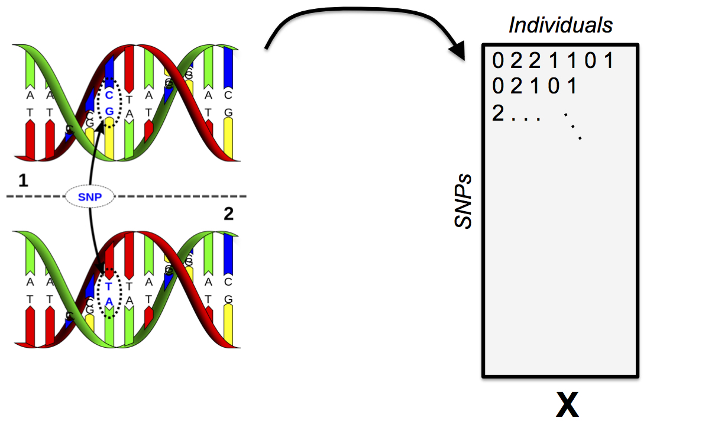
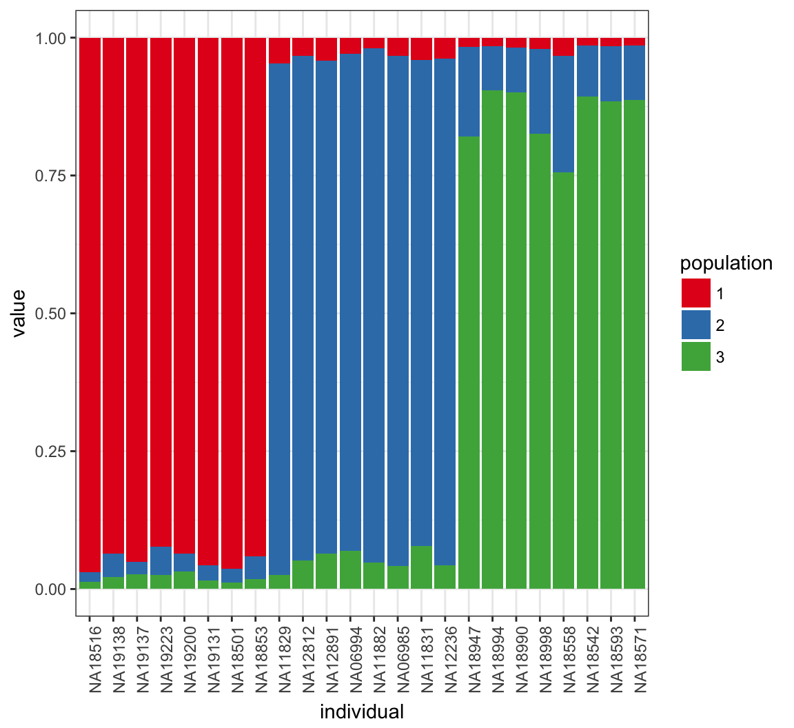
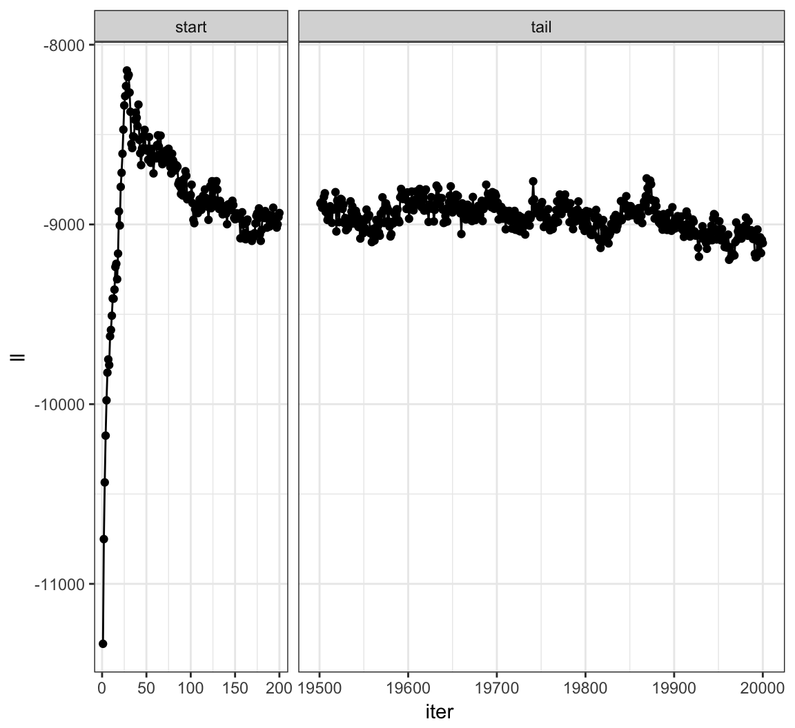

\providecommand{\E}{\operatorname{E}}
\providecommand{\V}{\operatorname{Var}}
\providecommand{\Cov}{\operatorname{Cov}}
\providecommand{\se}{\operatorname{se}}
\providecommand{\logit}{\operatorname{logit}}
\providecommand{\iid}{\; \stackrel{\text{iid}}{\sim}\;}
\providecommand{\asim}{\; \stackrel{.}{\sim}\;}
\providecommand{\xs}{x_1, x_2, \ldots, x_n}
\providecommand{\Xs}{X_1, X_2, \ldots, X_n}
\providecommand{\bB}{\boldsymbol{B}}
\providecommand{\bb}{\boldsymbol{\beta}}
\providecommand{\bx}{\boldsymbol{x}}
\providecommand{\bX}{\boldsymbol{X}}
\providecommand{\by}{\boldsymbol{y}}
\providecommand{\bY}{\boldsymbol{Y}}
\providecommand{\bz}{\boldsymbol{z}}
\providecommand{\bZ}{\boldsymbol{Z}}
\providecommand{\be}{\boldsymbol{e}}
\providecommand{\bE}{\boldsymbol{E}}
\providecommand{\bs}{\boldsymbol{s}}
\providecommand{\bS}{\boldsymbol{S}}
\providecommand{\bP}{\boldsymbol{P}}
\providecommand{\bI}{\boldsymbol{I}}
\providecommand{\bD}{\boldsymbol{D}}
\providecommand{\bd}{\boldsymbol{d}}
\providecommand{\bW}{\boldsymbol{W}}
\providecommand{\bw}{\boldsymbol{w}}
\providecommand{\bM}{\boldsymbol{M}}
\providecommand{\bPhi}{\boldsymbol{\Phi}}
\providecommand{\bphi}{\boldsymbol{\phi}}
\providecommand{\bN}{\boldsymbol{N}}
\providecommand{\bR}{\boldsymbol{R}}
\providecommand{\bu}{\boldsymbol{u}}
\providecommand{\bU}{\boldsymbol{U}}
\providecommand{\bv}{\boldsymbol{v}}
\providecommand{\bV}{\boldsymbol{V}}
\providecommand{\bO}{\boldsymbol{0}}
\providecommand{\bOmega}{\boldsymbol{\Omega}}
\providecommand{\bLambda}{\boldsymbol{\Lambda}}
\providecommand{\bSig}{\boldsymbol{\Sigma}}
\providecommand{\bSigma}{\boldsymbol{\Sigma}}
\providecommand{\bt}{\boldsymbol{\theta}}
\providecommand{\bT}{\boldsymbol{\Theta}}
\providecommand{\bpi}{\boldsymbol{\pi}}
\providecommand{\argmax}{\text{argmax}}
\providecommand{\KL}{\text{KL}}
\providecommand{\fdr}{{\rm FDR}}
\providecommand{\pfdr}{{\rm pFDR}}
\providecommand{\mfdr}{{\rm mFDR}}
\providecommand{\bh}{\hat}
\providecommand{\dd}{\lambda}
\providecommand{\q}{\operatorname{q}}

```{r, message=FALSE, echo=FALSE, cache=FALSE}
source("./customization/knitr_options.R")
```

# (PART) Numerical Methods for Likelihood Functions {-}


# Why Numerical Methods for Likelihood

## Challenges

Frequentist model:

$$X_1, X_2, \ldots, X_n \iid F_{\bt}$$

Bayesian model:

$$X_1, X_2, \ldots, X_n | \bt \iid F_{\bt} \mbox{ and } \bt \sim F_{\boldsymbol{\tau}}$$

Sometimes it's not possible to find formulas for $\hat{\bt}_{\text{MLE}}$, $\hat{\bt}_{\text{MAP}}$, $\E[\bt | \bx]$, or $f(\bt | \bx)$.  We have to use numerical methods instead.

## Approaches

We will discuss the following numerical approaches to likelihood based inference:

- Expectation-maximization (EM) algorithm
- Variational inference
- Markov chain Monte Carlo (MCMC)
    - Metropolis sampling
    - Metropolis-Hastings sampling
    - Gibbs sampling

# Latent Variable Models

## Definition

Latent variables (or hidden variables) are random variables that are present in the model, but unobserved.

We will denote latent variables by $Z$, and we will assume $$(X_1, Z_1), (X_2, Z_2), \ldots, (X_n, Z_n) \iid F_{\bt}.$$ A realized value of $Z$ is $z$, $\bZ = (Z_1, Z_2, \ldots, Z_n)^T$, etc.

The EM algorithm and variational inference involve latent variables. 

Bayesian models are a special case of latent variable models: the unobserved random parameters are latent variables.

## Empirical Bayes Revisited

In the earlier EB example, we supposed that $X_i | \mu_i \sim \mbox{Normal}(\mu_i, 1)$ for $i=1, 2, \ldots, n$ where these rv's are independent, and also that $\mu_i \iid \mbox{Normal}(a, b^2)$.

The unobserved parameters $\mu_1, \mu_2, \ldots, \mu_n$ are latent variables.  In this case, $\bt = (a, b^2)$.

## Normal Mixture Model

Suppose $\Xs \iid F_{\bt}$ where $\bt = (\pi_1, \ldots, \pi_K, \mu_1, \ldots, \mu_K, \sigma^2_1, \ldots, \sigma^2_K)$ with pdf

$$
f(\bx ; \bt) = \prod_{i=1}^n \sum_{k=1}^K \pi_k \frac{1}{\sqrt{2\pi\sigma^2_k}} \exp \left\{ -\frac{(x_i - \mu_k)^2}{2 \sigma^2_k} \right\}.
$$

The MLEs of the unknown paramaters cannot be found analytically.  This is a mixture common model to work with in applications, so we need to be able to estimate the parameters.


There is a latent variable model that produces the same maerginal distribution and likelihood function.  Let $\bZ_1, \bZ_2, \ldots, \bZ_n \iid \mbox{Multinomial}_K(1, \bpi)$ where $\bpi = (\pi_1, \ldots, \pi_K)$. Note that $Z_{ik} \in \{0, 1\}$ and $\sum_{k=1}^K Z_{ik} = 1$. Let $[X_i | Z_{ik} = 1] \sim \mbox{Normal}(\mu_k, \sigma^2_k)$, where $\{X_i | \bZ_i\}_{i=1}^{n}$ are jointly independent.

The joint pdf is

$$
f(\bx, \bz; \bt) = \prod_{i=1}^n \prod_{k=1}^K  \left[ \pi_k \frac{1}{\sqrt{2\pi\sigma^2_k}} \exp \left\{ -\frac{(x_i - \mu_k)^2}{2 \sigma^2_k} \right\} \right]^{z_{ik}}.
$$


Note that 

$$
f(\bx, \bz; \bt) = \prod_{i=1}^n f(x_i, \bz_i; \bt).
$$
It can be verified that $f(\bx ; \bt)$ is the marginal distribution of this latent variable model:

$$
f(x_i ; \bt) = \sum_{\bz_i} f(x_i, \bz_i; \bt) = \sum_{k=1}^K \pi_k \frac{1}{\sqrt{2\pi\sigma^2_k}} \exp \left\{ -\frac{(x_i - \mu_k)^2}{2 \sigma^2_k} \right\}.
$$

## Bernoulli Mixture Model

Suppose $\Xs \iid F_{\bt}$ where $\bt = (\pi_1, \ldots, \pi_K, p_1, \ldots, p_K)$ with pdf

$$
f(\bx ; \bt) = \prod_{i=1}^n \sum_{k=1}^K \pi_k p_k^{x_i} (1-p_k)^{1-x_i}.
$$

As in the Normal mixture model, the MLEs of the unknown paramaters cannot be found analytically.


As before, there is a latent variable model that produces the same maerginal distribution and likelihood function.  Let $\bZ_1, \bZ_2, \ldots, \bZ_n \iid \mbox{Multinomial}_K(1, \bpi)$ where $\bpi = (\pi_1, \ldots, \pi_K)$. Note that $Z_{ik} \in \{0, 1\}$ and $\sum_{k=1}^K Z_{ik} = 1$. Let $[X_i | Z_{ik} = 1] \sim \mbox{Bernoulli}(p_k)$, where $\{X_i | \bZ_i\}_{i=1}^{n}$ are jointly independent.

The joint pdf is

$$
f(\bx, \bz; \bt) = \prod_{i=1}^n \prod_{k=1}^K  \left[ p_k^{x_i} (1-p_k)^{1-x_i} \right]^{z_{ik}}.
$$

# EM Algorithm

## Rationale

For any likelihood function, $L(\bt ; \bx) = f(\bx; \bt)$, there is an abundance of optimization methods that can be used to find the MLE or MAP. However:

- Optimization methods can be messy to implement
- There may be probabilistic structure that we can use to simplify the optimization process and also provide theoretical guarantees on its convergence
- Optimization isn't necessarily the only goal, but one may also be interested in point estimates of the latent variable values


## Requirement

The expectation-maximization (EM) algorithm allows us to calculate MLEs and MAPs when certain geometric properties are satisfied in the probabilistic model.

In order for the EM algorithm to be a practical approach, then we should have a latent variable model $f(\bx, \bz; \bt)$ that is used to do inference on $f(\bx; \bt)$ or $f(\bt | \bx)$.  

Note: Sometimes $(\bx, \bz)$ is called the **complete data** and $\bx$ is called the **observed data** when we are using the EM as a method for dealing with missing data.

## The Algorithm

1. Choose initial value $\bt^{(0)}$

2. Calculate $f(\bz | \bx, \bt^{(t)})$

3. Calculate
$$Q(\bt, \bt^{(t)}) = \E_{\bZ|\bX=\bx}\left[\log f(\bx, \bZ; \bt); \bt^{(t)}\right]$$

4. Set 
$$\bt^{(t+1)} = \argmax_{\bt} Q(\bt, \bt^{(t)})$$

5. Iterate until convergence and set $\widehat{\bt} = \bt^{(\infty)}$

## $Q(\bt, \bt^{(t)})$

Continuous $\bZ$:

$$Q(\bt, \bt^{(t)}) = \int \log f(\bx, \bz; \bt) f(\bz | \bx ; \bt^{(t)}) d\bz$$

Discrete $\bZ$:

$$Q(\bt, \bt^{(t)}) = \sum_{\bz} \log f(\bx, \bz; \bt) f(\bz | \bx ; \bt^{(t)})$$

## EM for MAP

If we wish to calculate the MAP we replace $Q(\bt, \bt^{(t)})$ with

$$Q(\bt, \bt^{(t)}) = \E_{\bZ|\bX=\bx}\left[\log f(\bx, \bZ; \bt); \bt^{(t)}\right] + \log f(\bt)$$

where $f(\bt)$ is the prior distribution on $\bt$. 

# EM Examples

## Normal Mixture Model

Returning to the Normal mixture model [introduced earlier](#/normal-mixture-model), we first calculate

$$
\log f(\bx, \bz; \bt) = \sum_{i=1}^n \sum_{k=1}^K z_{ik} \log \pi_k + z_{ik} \log \phi(x_i; \mu_k, \sigma^2_k)
$$

where 

$$
\phi(x_i; \mu_k, \sigma^2_k) = \frac{1}{\sqrt{2\pi\sigma^2_k}} \exp \left\{ -\frac{(x_i - \mu_k)^2}{2 \sigma^2_k} \right\}.
$$


In caculating 

$$Q(\bt, \bt^{(t)}) = \E_{\bZ|\bX=\bx}\left[\log f(\bx, \bZ; \bt); \bt^{(t)}\right]$$

we only need to know $\E_{\bZ|\bX=\bx}[Z_{ik} | \bx; \bt]$, which turns out to be

$$
\E_{\bZ|\bX=\bx}[Z_{ik} | \bx; \bt] = \frac{\pi_k \phi(x_i; \mu_k, \sigma^2_k)}{\sum_{j=1}^K \pi_j \phi(x_i; \mu_j, \sigma^2_j)}.
$$


Note that we take 

$$Q(\bt, \bt^{(t)}) = \E_{\bZ|\bX=\bx}\left[\log f(\bx, \bZ; \bt); \bt^{(t)}\right]$$

so the parameter in $\log f(\bx, \bZ; \bt)$ is a free $\bt$, but the paramaters used to take the conditional expectation of $\bZ$ are fixed at $\bt^{(t)}$.  Let's define

$$
\hat{z}_{ik}^{(t)} = \E\left[z_{ik} | \bx; \bt^{(t)}\right] = \frac{\pi^{(t)}_k \phi(x_i; \mu^{(t)}_k, \sigma^{2, (t)}_k)}{\sum_{j=1}^K \pi^{(t)}_j \phi(x_i; \mu^{(t)}_j, \sigma^{2, (t)}_j)}.
$$

## E-Step

We calculate 

$$Q(\bt, \bt^{(t)}) = \E_{\bZ|\bX=\bx}\left[\log f(\bx, \bZ; \bt); \bt^{(t)}\right]$$
$$ = \sum_{i=1}^n \sum_{k=1}^K \hat{z}_{ik}^{(t)} \log \pi_k + \hat{z}_{ik}^{(t)} \log \phi(x_i; \mu_k, \sigma^2_k)$$

At this point the parameters making up $\hat{z}_{ik}^{(t)}$ are fixed at $\bt^{(t)}$.

## M-Step

We now caculate $\bt^{(t+1)} = \argmax_{\bt} Q(\bt, \bt^{(t)}$, which yields:

$$
\pi_k^{(t+1)} = \frac{\sum_{i=1}^n \hat{z}_{ik}^{(t)}}{n}
$$

$$
\mu_k^{(t+1)} = \frac{\sum_{i=1}^n \hat{z}_{ik}^{(t)} x_i}{\sum_{i=1}^n \hat{z}_{ik}^{(t)}}
$$

$$
\sigma_k^{2, (t+1)}  = \frac{\sum_{i=1}^n \hat{z}_{ik}^{(t)} \left(x_i - \mu_k^{(t+1)} \right)^2}{\sum_{i=1}^n \hat{z}_{ik}^{(t)}}
$$

Note:  You need to use a [Lagrange multiplier](http://math.stackexchange.com/questions/421105/maximum-likelihood-estimator-of-parameters-of-multinomial-distribution) to obtain $\{\pi_k^{(t+1)}\}_{k=1}^{K}$.


## Caveat

If we assign one and only one data point to mixture component $k$, meaning $\mu_k^{(t)} = x_i$ and $\hat{z}_{ik}^{(t)}=1$ for some $k$ and $i$, then as $\sigma^{2, (t)}_k \rightarrow 0$, the likelihood goes to $\infty$.  

Therefore, when implementing the EM algorithm for this particular Normal mixture model, we have to be careful to bound all $\sigma^{2, (t)}_k$ away from zero and avoid this scenario.

## Yeast Gene Expression

Measured ratios of the nuclear to cytoplasmic fluorescence for a protein-GFP construct that is hypothesized as being nuclear in mitotic cells and largely cytoplasmic in mating cells.

```{r, echo=FALSE}
df = read.table("./data/gfp.txt")
names(df) <- c("gfp", "truth")
df$truth <- as.character(df$truth)
df$truth[df$truth=="1"] <- "mating"
df$truth[df$truth=="2"] <- "mitotic"
df$truth <- as.factor(df$truth)
x <- df$gfp
tmu1 <- mean(x[1:60])
ts1 <- var(x[1:60])
tmu2 <- mean(x[61:120])
ts2 <- var(x[61:120])
ft <- rep(0, 120)
ft[1:60] <- dnorm(x[1:60], mean=tmu1, sd=sqrt(ts1))
ft[61:120] <- dnorm(x[61:120], mean=tmu2, sd=sqrt(ts2))

df <- data.frame(df, ft=ft)

ggplot(df) +
  geom_histogram(mapping = aes(x=gfp, y=..density.., fill=truth), 
                 binwidth=0.9, color="black", alpha=0.6, position="identity") +
  scale_fill_manual(values=c("red", "blue")) +
  geom_line(aes(x=gfp, y=ft, color=truth), size=1.5) + 
  scale_color_manual(values=c("grey", "grey")) 
```

## Initialize Values

```{r}
set.seed(508)
B <- 100
p <- rep(0,B)
mu1 <- rep(0,B)
mu2 <- rep(0,B)
s1 <- rep(0,B)
s2 <- rep(0,B)
p[1] <- runif(1, min=0.1, max=0.9)
mu.start <- sample(x, size=2, replace=FALSE)
mu1[1] <- min(mu.start)
mu2[1] <- max(mu.start)
s1[1] <- var(sort(x)[1:60])
s2[1] <- var(sort(x)[61:120])
z <- rep(0,120)
```

## Run EM Algorithm

```{r}
for(i in 2:B) {
  z <- (p[i-1]*dnorm(x, mean=mu2[i-1], sd=sqrt(s2[i-1])))/
    (p[i-1]*dnorm(x, mean=mu2[i-1], sd=sqrt(s2[i-1])) + 
       (1-p[i-1])*dnorm(x, mean=mu1[i-1], sd=sqrt(s1[i-1])))
  mu1[i] <- sum((1-z)*x)/sum(1-z)
  mu2[i] <- sum(z*x)/sum(z)
  s1[i] <- sum((1-z)*(x-mu1[i])^2)/sum(1-z)
  s2[i] <- sum(z*(x-mu2[i])^2)/sum(z)
  p[i] <- sum(z)/length(z)
}

tail(cbind(mu1, s1, mu2, s2, p), n=3)
```

## Fitted Mixture Distribution

```{r, echo=FALSE}
fe <- rep(0, 120)
fe <- (1-z)*dnorm(x, mean=mu1[B], sd=sqrt(s1[B])) + 
  z*dnorm(x, mean=mu2[B], sd=sqrt(s2[B]))
df <- data.frame(df, fe=fe)

ggplot(df) +
  geom_histogram(mapping = aes(x=gfp, y=..density.., fill=truth), 
                 binwidth=0.9, color="black", alpha=0.6, position="identity") +
  scale_fill_manual(values=c("red", "blue")) +
  geom_line(aes(x=gfp, y=ft, color=truth), size=1.5) + 
  scale_color_manual(values=c("grey", "grey")) +
  geom_line(aes(x=gfp, y=fe), size=1.5)
#  geom_line(aes(x=gfp, y=fe, color=truth), size=1.5) + 
#  scale_color_manual(values=c("black", "black")) +
#  geom_line(aes(x=gfp[1:60], y=ft[1:60]), size=1.5)
```

## Bernoulli Mixture Model

As an exercise, derive the EM algorithm of the Bernoilli mixture model [introduced earlier](#/bernoulli-mixture-model).

Hint: Replace $\phi(x_i; \mu_k, \sigma^2_k)$ with the appropriate Bernoilli pmf.

## Other Applications of EM

- Dealing with missing data
- Multiple imputation of missing data
- Truncated observations
- Bayesian hyperparameter estimation
- Hidden Markov models

# Theory of EM

## Decomposition

Let $q(\bz)$ be a probability distribution on the latent variables, $\bz$. Consider the following decomposition:

$$
\log f(\bx; \bt) = \mathcal{L}(q(\bz), \bt) + \KL(q(\bz) \|f(\bz | \bx ; \bt)) 
$$

where

$$
\mathcal{L}(q(\bz), \bt) = \int q(\bz) \log\left(\frac{f(\bx, \bz ; \bt)}{q(\bz)}\right) d\bz
$$

$$
\KL(q(\bz) \| f(\bz | \bx ; \bt)) = - \int q(\bz) \log\left(\frac{f(\bz | \bx ; \bt)}{q(\bz)}\right) d\bz
$$

## Kullback-Leibler Divergence

The KL divergence provides an asymmetric measure of the difference between two probability distributions.

The KL divergence is such that $\KL(q \| f) \geq 0$ where $\KL(q \| f) = 0$ if and only if $q=f$. This property is known as **Gibbs inequality**.

## Lower Bound

Note that $\mathcal{L}(q(\bz), \bt)$ provides a lower bound on the likelihood function:

$$
\log f(\bx; \bt) \geq \mathcal{L}(q(\bz), \bt)
$$

If we set $q(\bz) = f(\bz | \bx; \bt^{(t)})$, then for a fixed $\bt^{(t)}$ and as a function of $\bt$, 

$$
\begin{aligned}
\mathcal{L}(q(\bz), \bt) & \propto \int f(\bz | \bx; \bt^{(t)}) \log f(\bx, \bz ; \bt) d\bz \\
 & = Q(\bt, \bt^{(t)})
\end{aligned}
$$

## EM Increases Likelihood

Since $\bt^{(t+1)} = \argmax_{\bt} Q(\bt, \bt^{(t)})$, it follows that 

$$Q(\bt^{(t+1)}, \bt^{(t)}) \geq Q(\bt^{(t)}, \bt^{(t)}).$$  

Also, by the properties of KL divergence stated above, we have 

$$
\KL(f(\bz | \bx ; \bt^{(t+1)}) \| f(\bz | \bx ; \bt^{(t)})) \geq \KL(f(\bz | \bx ; \bt^{(t)}) \| f(\bz | \bx ; \bt^{(t)})).
$$

Putting these together we have

$$
\log f(\bx ; \bt^{(t+1)}) \geq \log f(\bx; \bt^{(t)}).
$$

# Variational Inference

## Rationale

Performing the EM algorithm required us to be able to compute $f(\bz | \bx; \bt)$ and also optimize $Q(\bt, \bt^{(t)})$.  Sometimes this is not possible.  Variational inference takes advantage of the decomposition

$$
\log f(\bx; \bt) = \mathcal{L}(q(\bz), \bt) + \KL(q(\bz) \|f(\bz | \bx ; \bt)) 
$$

and instead considers other forms of $q(\bz)$ to identify a more tractable optimization.

## Optimization Goal

Since 

$$
\log f(\bx; \bt) = \mathcal{L}(q(\bz), \bt) + \KL(q(\bz) \|f(\bz | \bx ; \bt)) 
$$

it follows that the closer $q(\bz)$ is to $f(\bz | \bx; \bt)$, the term $\mathcal{L}(q(\bz), \bt)$ grows larger while $\KL(q(\bz) \|f(\bz | \bx ; \bt))$ becomes smaller.  The goal is typically to identify a restricted form of $q(\bz)$ that maximizes $\mathcal{L}(q(\bz), \bt)$, which serves as an approximation to the posterior distribution $f(\bz | \bx; \bt)$. 

## Mean Field Approximation

A mean field approximation implies we restrict $q(\bz)$ to be 

$$
q(\bz) = \prod_{k=1}^K q_k(\bz_k)
$$

for some partition $\bz = (\bz_1, \bz_2, \ldots, \bz_K)$.  This partition is very context specific and is usually driven by the original model and what is tractable.

## Optimal $q_k(\bz_k)$

Under the above restriction, it can be shown that the $\{q_k(\bz_k)\}$ that maximize $\mathcal{L}(q(\bz), \bt)$ have the form:

$$
q_k(\bz_k) \propto \exp \left\{ \int \log f(\bx, \bz; \bt) \prod_{j \not= k} q_j(\bz_j)d\bz_j \right\}.
$$

These pdf's or pmf's can be calculated iteratively by cycling over $k=1, 2, \ldots, K$ after intializing them appropriately.  Note that convergence is guaranteed. 

## Remarks

- If $\bt$ is also random, then it can be included in $\bz$.

- The estimated $\hat{f}(\bz | \bx)$ is typically concentrated around the high density region of the true $f(\bz | \bx)$, so it is useful for calculations such as the MAP, but it is not guaranteed to be a good overall estimate of $f(\bz | \bx)$. 

- Variational inference is typically faster than MCMC (covered next).

- Given this is an optimization procedure, care can be taken to speed up convergence and avoid unintended local maxima. 

# Markov Chain Monte Carlo

## Motivation

When performing Bayesian inferece, it is often (but not always) possible to calculate 

$$f(\bt | \bx) \propto L(\bt; \bx) f(\bt)$$

but it is typically much more difficult to calculate

$$f(\bt | \bx) = \frac{L(\bt; \bx) f(\bt)}{f(\bx)}.$$

Markov chain Monte Carlo is a method for simulating data approximately from $f(\bt | \bx)$ with knowledge of only $L(\bt; \bx) f(\bt)$.

## Note

MCMC can be used to approximately simulate data from any distribution that is only proportionally characterized, but it is probably most well know for doing so in the context of Bayesian infererence.

We will explain MCMC in the context of Bayesian inference.

## Big Picture

We draw a Markov chain of $\bt$ values so that, in some asymptotic sense, these are equivalent to iid draws from $f(\bt | \bx)$.

The draws are done competitively so that the next draw of a realization of $\bt$ depends on the current value.  

The Markov chain is set up so that it only depends on $L(\bt; \bx) f(\bt)$.

*A lot* of practical decisions need to be made by the user, so utilize MCMC carefully.

## Metropolis-Hastings Algorithm

1. Initialize $\bt^{(0)}$

2. Generate $\bt^{*} \sim q(\bt | \bt^{(b)})$ for some pdf or pmf $q(\cdot | \cdot)$

3. With probablity 
$$A(\bt^{*}, \bt^{(b)}) = \min\left( 1, \frac{L(\bt^{*}; \bx) f(\bt^{*}) q(\bt^{(b)} | \bt^{*})}{L(\bt^{(b)}; \bx) f(\bt^{(b)}) q(\bt^{*} | \bt^{(b)})} \right)$$
set $\bt^{(b+1)} = \bt^{*}$.  Otherise, set $\bt^{(b+1)} = \bt^{(b)}$

4. Continue for $b = 1, 2, \ldots, B$ iterations and *carefully* select which $\bt^{(b)}$ are utilized to approximate iid observations from $f(\bt | \bx)$

## Metropolis Algorithm

The Metropolis algorithm restricts $q(\cdot, \cdot)$ to be symmetric so that $q(\bt^{(b)} | \bt^{*}) = q(\bt^{*} | \bt^{(b)})$ and 

$$
A(\bt^{*}, \bt^{(b)}) = \min\left( 1, \frac{L(\bt^{*}; \bx) f(\bt^{*})}{L(\bt^{(b)}; \bx) f(\bt^{(b)})} \right).
$$

## Utilizing MCMC Output

Two common uses of the output from MCMC are as follows:

1.  $\E[f(\bt) | \bx]$ is approximated by 
$$
\hat{\E}[f(\bt) | \bx] = \frac{1}{B} \sum_{b=1}^B f\left(\bt^{(b)}\right).
$$

2.  Some subsequence $\bt^{(b_1)}, \bt^{(b_2)}, \ldots, \bt^{(b_m)}$ from $\left\{\bt^{(b)}\right\}_{b=1}^{B}$ is utilized as an empirical approximation to iid draws from $f(\bt | \bx)$.


## Remarks

- The random draw $\bt^{*} \sim q(\bt | \bt^{(b)})$ perturbs the current value $\bt^{(b)}$ to the next value $\bt^{(b+1)}$.  It is often a Normal distribution for continuous $\bt$.
- Choosing the variance of $q(\bt | \bt^{(b)})$ is important as it requires enough variance for the theory to be applicable within a reasonable number of computations, but it cannot be so large that new values of $\bt^{(b+1)}$ are rarely generated.
- $A(\bt^{*}, \bt^{(b)})$ is called the acceptance probability.
- The algorithm must be run for a certain number of iterations ("burn in") before observed $\bt^{(b)}$ can be utilized.
- The generated $\bt^{(b)}$ are typically "thinned" (only sampled every so often) to reduce Markov dependence.


## Full Conditionals

Suppose that $\bt = (\theta_1, \theta_2, \ldots, \theta_K)$.  Define the subset vector as $\bt_{a:b} = (\theta_a, \theta_{a+1}, \ldots, \theta_{b-1}, \theta_b)$ for any $1 \leq a \leq b \leq K$.  

The full conditional of $\theta_k$ is

$$
\Pr(\theta_k | \bt_{1:k-1}, \bt_{k+1:K}, \bx)
$$

## Gibbs Sampling

Gibbs sampling a special type of Metropolis-Hasting MCMC.  The algorithm samples one coordinate of $\bt$ at a time.

1. Initialize $\bt^{(0)}$.
2. Sample:  
$\theta_1^{(b+1)} \sim \Pr(\theta_1 | \bt_{2:K}^{(b)}, \bx)$  
$\theta_2^{(b+1)} \sim \Pr(\theta_2 | \theta_{1}^{(b+1)}, \bt_{3:K}^{(b)}, \bx)$  
$\theta_3^{(b+1)} \sim \Pr(\theta_3 | \bt_{1:2}^{(b+1)}, \bt_{3:K}^{(b)}, \bx)$  
$\vdots$  
$\theta_K^{(b+1)} \sim \Pr(\theta_K | \bt_{1:K-1}^{(b+1)}, \bx)$  
3. Continue for $b = 1, 2, \ldots, B$ iterations.

## Gibbs and MH

As an exercise, show that Gibbs sampling is a special case of the Metropolis-Hastings algorithm where $A(\bt^{*}, \bt^{(b)}) = 1$.

## Latent Variables

Note that MCMC is often used to calculate a posterior distribution on latent variables.

This makes sense because unobserved random paramaters are a special type of latent variable.

## Theory

The goal of MCMC is to construct a Markov chain that converges to a stationary distribution that is equivalent to the target probability distribution.

Under reasonably general assumptions, one can show that the Metropolis-Hastings algorithm produces a Markov chain that is *homogeneous* and achieves *detailed balance*, which implies the Markov chain is *ergodic* so that $\bt^{(B)}$ converges in distribution to $f(\bt | \bx)$ as $B \rightarrow \infty$ and that 

$$
\hat{\E}[f(\bt) | \bx] = \frac{1}{B} \sum_{b=1}^B f\left(\bt^{(b)}\right) \stackrel{B \rightarrow \infty}{\longrightarrow} \E[f(\bt) | \bx].
$$

## Software

[Stan](http://mc-stan.org) is probably the currently most popular software for doing Bayesian computation, including MCMC and variational inference.

There are also popular R packages, such as [`MCMCpack`](https://cran.r-project.org/web/packages/MCMCpack/index.html).

# MCMC Example

## Single Nucleotide Polymorphisms



## PSD Admixture Model


PSD model proposed in [Pritchard, Stephens, Donnelly (2000) *Genetics*](http://www.genetics.org/content/155/2/945.long).

## Gibbs Sampling Approach

The Bayesian Gibbs sampling approach to inferring the PSD model touches on many important ideas, such as conjugate priors and mixture models.

We will focus on a version of this model for diploid SNPs. 

## The Data

$\boldsymbol{X}$, a $L \times N$ matrix consisting of the genotypes, coded as $0,1,2$.  Each row is a SNP, each column is an individual.

In order for this model to work, the data needs to be broken down into "phased" genotypes. For the 0 and 2 cases, it's obvious how to do this, and for the 1 case, it'll suffice for this model to randomly assign the alleles to chromosomes. We will explore phasing more on HW4.

Thus, we wind up with two {0, 1} *binary* matrices $\boldsymbol{X}_A$ and $\boldsymbol{X}_B$, both $L \times N$. We will refer to allele $A$ and allele $B$. Note $\bX = \bX_A + \bX_B$.

## Model Components

- $K$, the number of populations that we model the genotypes as admixtures of. This is chosen before inference.
- $\boldsymbol{Q}$, a $N \times K$ matrix, the admixture proportions, values are in the interval $[0, 1]$ and rows are constrained to sum to 1.
- $\boldsymbol{P}$, a $L \times K$ matrix, the allele frequencies for each population, values are in the interval $[0, 1]$.
- $\boldsymbol{Z}_A$ and $\boldsymbol{Z}_B$, two $L \times N$ matrices that tell us which population the respective allele is from. Elements consist of the integers between $1$ and $K$. This is a hidden variable.

## The Model

- Each allele (elements of $\boldsymbol{X}_A$ and $\boldsymbol{X}_B$) is a Bernoulli random variable, with success probability determined by which population that allele is assigned to (i.e., depends on $\boldsymbol{Z}_A$, $\boldsymbol{Z}_B$, and $\boldsymbol{P}$).
- We put a uniform Beta prior, i.e., $\operatorname{Beta}(1, 1)$, on each element of $\boldsymbol{P}$.
- We put a uniform Dirichlet prior, i.e., $\operatorname{Dirichlet(1,\ldots,1)}$, on each *row* of $\boldsymbol{Q}$.
- $\boldsymbol{Z}_A$ and $\boldsymbol{Z}_B$ are $K$-class Multinomial draws where the probability of drawing each class is determined by each row of $Q$. 

## Conditional Independence

The key observation is to understand which parts of the model are dependent on each other in the data generating process.

- The data $\boldsymbol{X}_A$ and $\boldsymbol{X}_B$ depends directly on $\boldsymbol{Z}_A$, $\boldsymbol{Z}_B$, and $\boldsymbol{P}$ (not $\boldsymbol{Q}$!).
- The latent variable $\boldsymbol{Z}_A$ and $\boldsymbol{Z}_B$ depend only on $\boldsymbol{Q}$ and they're conditionally independent given $\boldsymbol{Q}$.
- $\boldsymbol{Q}$ and $\boldsymbol{P}$ depend only on their priors.

$\Pr(\boldsymbol{X}_A, \boldsymbol{X}_B, \boldsymbol{Z}_A, \boldsymbol{Z}_B, \boldsymbol{P}, \boldsymbol{Q}) =$  
$\Pr(\boldsymbol{X}_A, \boldsymbol{X}_B | \boldsymbol{Z}_A, \boldsymbol{Z}_B, \boldsymbol{P}) \Pr(\boldsymbol{Z}_A | \boldsymbol{Q}) \Pr(\boldsymbol{Z}_B | \boldsymbol{Q}) \Pr(\boldsymbol{P}) \Pr(\boldsymbol{Q})$


## The Posterior

We desire to compute the posterior distribution $\Pr(\boldsymbol{P}, \boldsymbol{Q}, \boldsymbol{Z}_A, \boldsymbol{Z}_B | \boldsymbol{X}_A, \boldsymbol{X}_B)$. Gibbs sampling tells us if we can construct conditional distributions for each random variable in our model, then iteratively sampling and updating our model parameters will result in a stationary distribution that is the same as the posterior distribution.

Gibbs sampling is an extremely powerful approach for this model because we can utilize conjugate priors as well as the independence of various parameters in the model to compute these conditional distributions.

## Full Conditional for $\boldsymbol{Q}$

Note that $\boldsymbol{Z}_A$ and $\boldsymbol{Z}_B$ are the only parts of this model that directly depend on $\boldsymbol{Q}$.

\begin{align*}
&\Pr(Q_n | \boldsymbol{Q}_{-n}, \boldsymbol{Z}_A, \boldsymbol{Z}_B, \boldsymbol{P}, \boldsymbol{X}_A, \boldsymbol{X}_B)\\
=& \Pr(Q_n | \boldsymbol{Z}_A, \boldsymbol{Z}_B) \\
\propto& \Pr(Z_{An}, Z_{Bn} | Q_n) \Pr(Q_n)\\
=& \Pr(Z_{An} | Q_n) \Pr(Z_{Bn} | Q_n) \Pr(Q_n)\\
\propto& \left( \prod_{\ell=1}^L \prod_{k=1}^K Q_{nk}^{\mathbb{1}(Z_{An\ell}=k)+\mathbb{1}(Z_{Bn\ell}=k)} \right)
\end{align*}


$$=\prod_{k=1}^K Q_{nk}^{S_{nk}}$$

where $S_{nk}$ is simply the count of the number of alleles for individual $n$ that got assigned to population $k$.

Thus, $Q_n | \boldsymbol{Z}_A, \boldsymbol{Z}_B \sim \operatorname{Dirichlet}(S_{j1}+1, \ldots, S_{jk}+1)$,.

We could have guessed that this distribution is Dirichlet given that $\boldsymbol{Z}_A$ and $\boldsymbol{Z}_B$ are multinomial! Let's use conjugacy to help us in the future.

## Full Conditional for $\boldsymbol{P}$

\begin{align*}
&\Pr(P_\ell | \boldsymbol{P}_{-\ell}, \boldsymbol{Z}_A, \boldsymbol{Z}_B, \boldsymbol{Q}, \boldsymbol{X}_A, \boldsymbol{X}_B) \\
\propto& \Pr(\boldsymbol{X}_{A\ell}, \boldsymbol{X}_{B\ell} | P_\ell, \boldsymbol{Z}_{A\ell}, \boldsymbol{Z}_{B\ell}) \Pr(P_\ell) 
\end{align*}

We know $\Pr(\boldsymbol{X}_{A\ell}, \boldsymbol{X}_{B\ell} | P_\ell, \boldsymbol{Z}_{A\ell}, \boldsymbol{Z}_{B\ell})$ will be Bernoulli and $\Pr(P_\ell)$ will be beta, so the full conditional will be beta as well. In fact, the prior is uniform so it vanishes from the RHS. 


Thus, all we have to worry about is the Bernoulli portion $\Pr(\boldsymbol{X}_{A\ell}, \boldsymbol{X}_{B\ell} | P_\ell, \boldsymbol{Z}_{A\ell}, \boldsymbol{Z}_{B\ell})$. Here, we observe that if the $\boldsymbol{Z}_A$ and $\boldsymbol{Z}_B$ are "known", then we known which value of $P_\ell$ to plug into our Bernoulli for $\boldsymbol{X}_A$ and $\boldsymbol{X}_B$. Following the Week 6 lectures, we find that the full conditional for $\boldsymbol{P}$ is:

$$P_{\ell k} | \boldsymbol{Z}_A, \boldsymbol{Z}_B, \boldsymbol{X}_A, \boldsymbol{X}_B \sim \operatorname{Beta}(1+T_{\ell k 0}, 1+T_{\ell k 1})$$

where $T_{\ell k 0}$ is the total number of 0 alleles at SNP $\ell$ for population $k$, and $T_{\ell k 1}$ is the analogous quantity for the 1 allele.

## Full Conditional $\boldsymbol{Z}_A$ & $\boldsymbol{Z}_B$

We'll save some math by first noting that alleles $A$ and $B$ are independent of each other, so we can write this for only $\boldsymbol{Z}_A$ without losing any information. Also, all elements of $\boldsymbol{Z}_A$ are independent of each other. Further, note that each element of $\boldsymbol{Z}_A$ is a single multinomial draw, so we are working with a discrete random variable. 

\begin{align*}
&\Pr(Z_{A\ell n}=k | \boldsymbol{X}_A, \boldsymbol{Q}, \boldsymbol{P}) \\
=& \Pr (Z_{A\ell n}=k | X_{A \ell n}, Q_n, P_\ell) \\
\propto & \Pr(X_{A \ell n} | Z_{A\ell n}=k, Q_n, P_\ell) \Pr(Z_{A\ell n}=k | Q_n, P_\ell)
\end{align*}


We can look at the two factors. First:

$$\Pr(Z_{A\ell n}=k | Q_n, P_\ell) = \Pr(Z_{A\ell n}=k | Q_n) = Q_{nk}$$

Then:

$$\Pr(X_{A \ell n} | Z_{A\ell n}=k, Q_n, P_\ell) = P_{\ell k}$$

Thus, we arrive at the formula:

$$\Pr(Z_{A\ell n}=k | \boldsymbol{X}_A, \boldsymbol{Q}, \boldsymbol{P}) \propto P_{\ell k} Q_{n k}$$

## Gibbs Sampling Updates

It's neat that we wind up just iteratively counting the various discrete random variables along different dimensions.

\begin{align*}
Q_n | \boldsymbol{Z}_A, \boldsymbol{Z}_B &\sim \operatorname{Dirichlet}(S_{j1}+1, \ldots, S_{jk}+1)\\
P_{\ell k} | \boldsymbol{Z}_A, \boldsymbol{Z}_B, \boldsymbol{X}_A, \boldsymbol{X}_B &\sim \operatorname{Beta}(1+T_{\ell k 0}, 1+T_{\ell k 1}) \\
Z_{A\ell n} | \boldsymbol{X}_A, \boldsymbol{Q}, \boldsymbol{P} &\sim \operatorname{Multinomial}\left(\frac{P_\ell * Q_n}{P_\ell \cdot Q_n}\right)
\end{align*}

where $*$ means element-wise vector multiplication.

## Implementation

The Markov chain property means that we can't use vectorization forward in time, so R is not the best way to implement this algorithm.

That being said, we can vectorize the pieces that we can and demonstrate what happens.

## Matrix-wise `rdirichlet` Function

Drawing from a Dirichlet is easy and vectorizable because it consists of normalizing independent gamma draws. 

```{r}
rdirichlet <- function(alpha) {
  m <- nrow(alpha)
  n <- ncol(alpha)
  x <- matrix(rgamma(m * n, alpha), ncol = n)
  x/rowSums(x)
}
```

## Inspect Data

```{r, include=FALSE}
set.seed(1234)

X <- read.table("./data/hapmap_sample.txt", stringsAsFactors=FALSE, header=TRUE)
X <- as.matrix(X)

Xa <- X
Xb <- X

L <- nrow(X)
N <- ncol(X)

for(i in 1:L) {
  for(j in 1:N) {
    if(X[i,j] == 1) {
      if(runif(1)<0.5) {
          Xa[i,j] <- 0
      } else {
          Xb[i,j] <- 0
      }
    }
    if(X[i,j] == 2) {
      Xa[i,j] <- 1
      Xb[i,j] <- 1
    }
  }
}
```

```{r}
dim(Xa)
X[1:3,1:3]
Xa[1:3,1:3]
```

## Model Parameters

```{r}
L <- nrow(Xa)
N <- ncol(Xa)

K <- 3

Za <- matrix(sample(1:K, L*N, replace=TRUE), L, N)
Zb <- matrix(sample(1:K, L*N, replace=TRUE), L, N)
P <- matrix(0, L, K)
Q <- matrix(0, N, K)

```

## Update $\boldsymbol{P}$

```{r}
update_P <- function() {
  Na_0 <- Za * (Xa==0)
  Na_1 <- Za * (Xa==1)
  Nb_0 <- Zb * (Xb==0)
  Nb_1 <- Zb * (Xb==1)
  for(k in 1:K) {
    N0 <- rowSums(Na_0==k)+rowSums(Nb_0==k)
    N1 <- rowSums(Na_1==k)+rowSums(Nb_1==k)
    P[,k] <- rdirichlet(1+cbind(N1, N0))[,1]
  }
  P
}
```

## Update $\boldsymbol{Q}$

```{r}
update_Q <- function() {
  M_POP0 <- apply(Za, 2, function(x) {tabulate(x, nbins=K)} )
  M_POP1 <- apply(Zb, 2, function(x) {tabulate(x, nbins=K)} )
  
  rdirichlet(t(1+M_POP0+M_POP1))
}
```

## Update (Each) $\boldsymbol{Z}$

```{r}
update_Z <- function(X) {
  Z <- matrix(0, nrow(X), ncol(X))
  for(n in 1:N) {
    PZ0 <- t(t((1-P)) * Q[n,])
    PZ1 <- t(t(P) * Q[n,])
    PZ <- X[,n]*PZ1 + (1-X[,n])*PZ0
    Z[,n] <- apply(PZ, 1, function(p){sample(1:K, 1, prob=p)})
  }
  Z
}
```

## Model Log-likelihood Function

```{r}
model_ll <- function() {
  AFa <- t(sapply(1:L, function(i){P[i,][Za[i,]]}))
  AFb <- t(sapply(1:L, function(i){P[i,][Zb[i,]]}))
  # hint, hint, HW3
  sum(dbinom(Xa, 1, AFa, log=TRUE)) + 
    sum(dbinom(Xb, 1, AFb, log=TRUE))
}
```

## MCMC Configuration

```{r}
MAX_IT <- 20000
BURNIN <- 5000
THIN <- 20

QSUM <- matrix(0, N, K)

START <- 200
TAIL <- 500
LL_start <- rep(0, START)
LL_end <- rep(0, TAIL)
```

## Run Sampler

```{r sampler3, cache=TRUE, eval=FALSE}
set.seed(1234)

for(it in 1:MAX_IT) {
  P <- update_P()
  Q <- update_Q()
  Za <- update_Z(Xa)
  Zb <- update_Z(Xb)
  
  if(it > BURNIN && it %% THIN == 0) {QSUM <- QSUM+Q}
  if(it <= START) {LL_start[it] <- model_ll()}
  if(it > MAX_IT-TAIL) {LL_end[it-(MAX_IT-TAIL)] <- model_ll()}
}

Q_MEAN <- QSUM/((MAX_IT-BURNIN)/THIN)
```

## Posterior Mean of $\boldsymbol{Q}$

```{r, echo=FALSE, message=FALSE, eval=FALSE}
library(reshape2)
rownames(Q_MEAN) <- colnames(X)
DF <- melt(Q_MEAN, varnames=c("individual", "population"))
DF$population <- as.factor(DF$population)
ggplot(DF, aes(individual, value, fill=population)) + geom_bar(stat="identity") + scale_fill_brewer(palette="Set1") +
  theme(axis.text.x=element_text(angle=90))
```

```{r, echo=FALSE}

```

## Plot Log-likelihood Steps

Note both the needed burn-in and thinning.

```{r, echo=FALSE, eval=FALSE}
data.frame(ll=c(LL_start, LL_end), 
           iter=c(1:START, (MAX_IT-TAIL+1):MAX_IT),
           tail=c(rep("start", START), rep("tail", TAIL))) %>%
  ggplot(aes(iter, ll)) + geom_point() + 
  geom_line() + theme_bw() +
  facet_grid(~tail, scales="free_x", space="free_x")
```

```{r, echo=FALSE}

```

## What Happens for K=4?

```{r}
K <- 4
Za <- matrix(sample(1:K, L*N, replace=TRUE), L, N)
Zb <- matrix(sample(1:K, L*N, replace=TRUE), L, N)
P <- matrix(0, L, K)
Q <- matrix(0, N, K)
QSUM <- matrix(0, N, K)
```

## Run Sampler Again

```{r sampler4, cache=TRUE, eval=FALSE}
for(it in 1:MAX_IT) {
  P <- update_P()
  Q <- update_Q()
  Za <- update_Z(Xa)
  Zb <- update_Z(Xb)
  
  if(it > BURNIN && it %% THIN == 0) {
    QSUM <- QSUM+Q
  }
}

Q_MEAN <- QSUM/((MAX_IT-BURNIN)/THIN)
```

## Posterior Mean of $\boldsymbol{Q}$


```{r, echo=FALSE, eval=FALSE}
rownames(Q_MEAN) <- colnames(X)
DF <- melt(Q_MEAN, varnames=c("individual", "population"))
DF$population <- as.factor(DF$population)
ggplot(DF, aes(individual, value, fill=population)) +
  geom_bar(stat="identity") + scale_fill_brewer(palette="Set1") +
  theme(axis.text.x=element_text(angle=90))
```

```{r, echo=FALSE}
knitr::include_graphics("./images/postQ_keq4.png")
```

# Further Reading

#### Bishop (2016) {-}

One of the clearest treatments of the EM algorithm, variational inference, and MCMC can be found in Chapters 9-11 of [*Pattern Recognition and Machine Learning*](https://pulsearch.princeton.edu/catalog/4992869), by Christopher Bishop.  

This is a great book in general.

#### EM Algorithm {-}

Paper that popularized the method: [Dempster, Laird, Rubin (1977)](https://www.jstor.org/stable/2984875?seq=1#page_scan_tab_contents)

Paper that got the theory correct: [Wu (1983)](http://projecteuclid.org/euclid.aos/1176346060)

#### Variational Inference {-}

[Wainwright and Jordan (2008)](http://www.nowpublishers.com/article/Details/MAL-001)

[Ormerod and Wand (2010)](http://www.maths.usyd.edu.au/u/jormerod/JTOpapers/Ormerod10.pdf)

[Blei et al. (2016)](https://arxiv.org/abs/1601.00670)

#### MCMC {-}

[MCMC Without All the BS](https://jeremykun.com/2015/04/06/markov-chain-monte-carlo-without-all-the-bullshit/)

[*Bayesian Data Analysis*](https://pulsearch.princeton.edu/catalog/7647380) by Gelman et al.

[*Monte Carlo Strategies in Scientific Computing*](https://pulsearch.princeton.edu/catalog/8891468) by Jun Liu

